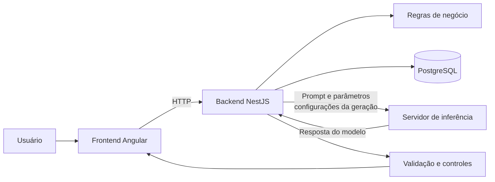
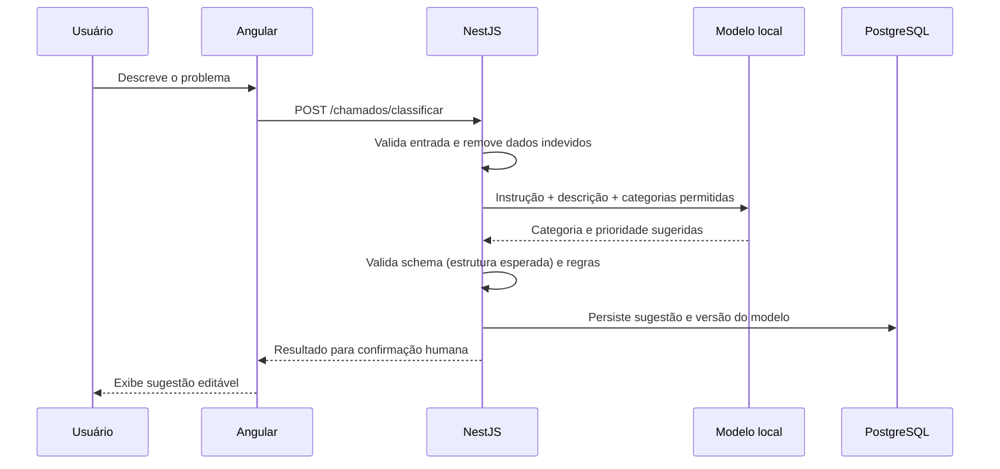
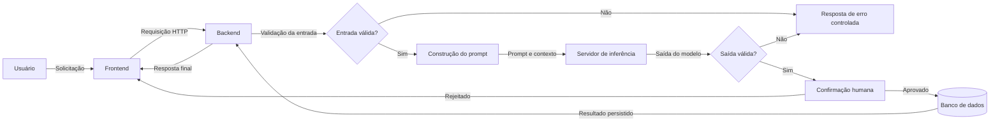

# Encontro 01 — A disciplina e a IA na arquitetura Web

## Tema

Apresentação da disciplina e compreensão da Inteligência Artificial como
componente de uma aplicação Web.

## Objetivos

- Compreender a organização, a metodologia e as avaliações da disciplina.
- Diferenciar o uso informal de IA da integração de IA em um sistema Web.
- Identificar responsabilidades do frontend, backend, servidor de inferência e banco de dados.
- Reconhecer decisões que devem permanecer determinísticas na aplicação.
- Analisar benefícios, limitações e riscos iniciais de funcionalidades generativas.

## Visão geral

Nesta disciplina, a IA (área da Computação dedicada a sistemas que realizam
tarefas como reconhecer padrões, classificar e gerar conteúdo) não será tratada
apenas como uma página de conversa. O foco será incorporar modelos de IA
(artefatos computacionais que aprenderam padrões a partir de dados) a aplicações
Web construídas com tecnologias já conhecidas pelos estudantes: Angular,
NestJS, TypeScript e PostgreSQL.

Isso muda a pergunta central. Em vez de perguntar somente “o que o modelo
responde?”, será necessário perguntar:

- qual problema do usuário está sendo resolvido;
- quais dados a aplicação envia ao modelo;
- quais respostas são aceitas;
- como erros e indisponibilidade serão tratados;
- quais ações podem ser realizadas;
- como qualidade, segurança e privacidade serão avaliadas.

## Organização da disciplina

A disciplina possui 60 horas-aula, distribuídas em 80 aulas de 45 minutos e 40
encontros de 90 minutos. O percurso parte dos fundamentos e chega à construção
e avaliação de uma aplicação completa.

### Estratégias de aprendizagem

- aulas expositivas dialogadas;
- demonstrações com modelos executados localmente;
- experimentos controlados;
- práticas incrementais;
- seminários e estudos de caso;
- projeto final acompanhado durante o semestre.

### Avaliação

- atividades práticas: 30%;
- seminário e estudo de caso: 20%;
- projeto final: 50%.

O projeto não será avaliado apenas por “produzir uma resposta”. Será necessário
demonstrar arquitetura, validação, testes, avaliação de qualidade, segurança,
observabilidade e compreensão das limitações.

## Questões iniciais

Antes de avançar nos conceitos, responda individualmente e sem pesquisa:

1. O que diferencia um chatbot de uma funcionalidade de IA integrada?
2. Uma resposta bem escrita é necessariamente correta?
3. Que dados jamais deveriam ser enviados a um serviço externo sem análise?
4. Que tarefas de um sistema não deveriam depender exclusivamente de um modelo?
5. O que uma equipe precisa testar em uma funcionalidade generativa?

## O que é IA generativa?

IA generativa é uma categoria de sistemas capazes de produzir novos conteúdos,
como texto, código, imagens, áudio ou estruturas de dados, a partir de padrões
aprendidos durante o treinamento.

Um modelo de linguagem (tipo de modelo de IA especializado em processar e
produzir linguagem) recebe uma sequência de entrada e calcula continuações
prováveis. Ele não consulta automaticamente uma fonte confiável, não conhece as
regras internas da aplicação e não garante que a resposta seja verdadeira.

### Capacidades comuns

- resumir e transformar textos;
- classificar solicitações;
- extrair informações;
- produzir respostas em linguagem natural;
- gerar estruturas JSON;
- escolher ferramentas descritas pela aplicação;
- apoiar busca e recuperação de informação.

### Limitações iniciais

- pode produzir informação falsa com aparência convincente;
- a mesma entrada pode gerar respostas diferentes;
- possui janela de contexto limitada;
- pode interpretar dados como instruções maliciosas;
- não conhece informações privadas sem recebê-las;
- não deve executar diretamente ações críticas.

## Usar IA e integrar IA são atividades diferentes

### Uso informal

Uma pessoa acessa uma interface de conversa, escreve uma solicitação e avalia a
resposta manualmente. A própria pessoa fornece contexto (informações disponíveis
ao modelo naquela chamada), decide o que aproveitar e assume a revisão.

### Integração em software

A aplicação constrói o prompt (entrada com instruções e dados enviada ao
modelo), chama o modelo, valida o retorno, aplica regras, registra métricas e
apresenta o resultado ao usuário. Isso exige contratos e tratamento explícito
de falhas.

| Uso informal | Integração em aplicação |
|---|---|
| prompt escrito no momento | prompt versionado e parametrizado |
| revisão manual imediata | validação programática e/ou humana |
| resposta livre | contrato de saída definido |
| erro percebido por uma pessoa | erro deve ser detectado pelo sistema |
| contexto fornecido manualmente | contexto selecionado pela aplicação |

## IA como componente da arquitetura

Uma aplicação com IA continua sendo uma aplicação de software. O frontend
(parte com a qual o usuário interage), o backend (parte que processa requisições
e regras), autenticação, persistência e auditoria continuam necessários.

### Responsabilidades do frontend

- coletar a solicitação;
- informar carregamento e permitir cancelamento;
- apresentar respostas e fontes;
- impedir exposição acidental de informações internas;
- comunicar limites e necessidade de revisão.

### Responsabilidades do backend

- autenticar e autorizar;
- construir prompts e selecionar contexto;
- chamar o servidor de inferência;
- aplicar timeout, validação e regras de negócio;
- controlar ferramentas e persistência;
- registrar métricas e falhas com segurança.

### Responsabilidades do servidor de inferência

O servidor de inferência (software que carrega e executa o modelo já treinado)
é responsável por:

- carregar o modelo;
- transformar a entrada em tokens (unidades de texto processadas pelo modelo);
- executar inferência (gerar uma saída com o modelo já treinado);
- devolver tokens ou uma resposta completa.

### Responsabilidades do banco

- persistir dados do domínio;
- armazenar configurações e versões quando necessário;
- guardar documentos, metadados e vetores;
- apoiar auditoria sem armazenar conteúdo sensível indevidamente.

## Fluxo de uma funcionalidade de classificação

Considere uma central de chamados que sugere categoria e prioridade.

O modelo sugere; a aplicação valida; a pessoa confirma. Essa separação reduz o
risco de uma decisão probabilística produzir um efeito irreversível.

## Regra determinística ou decisão do modelo?

Use código tradicional quando a regra é conhecida, verificável e precisa ser
sempre respeitada.

| Situação | Abordagem preferencial |
|---|---|
| verificar se uma data está no prazo | regra determinística |
| calcular total de uma compra | regra determinística |
| sugerir categoria de um texto livre | modelo + validação |
| buscar trechos semanticamente relacionados | embeddings (representações numéricas de significado) |
| excluir definitivamente um cadastro | autorização e regra determinística |
| redigir uma explicação a partir de fontes | RAG (recuperação de informação antes da geração) |

Uma arquitetura robusta combina software determinístico com componentes
probabilísticos (componentes cuja saída depende de probabilidades e pode
variar), sem transferir ao modelo responsabilidades que o sistema pode resolver
de maneira exata. Embeddings e RAG serão estudados em detalhes posteriormente.

## Erros conceituais comuns

### “O modelo é o sistema”

O modelo é apenas um componente. O sistema inclui interface, regras, dados,
controles, monitoramento e pessoas.

### “Executar localmente elimina todos os riscos”

Execução local melhora controle e privacidade, mas não elimina injection,
vazamento em logs, permissões excessivas, vieses ou respostas incorretas.

### “Se a resposta parece boa, a integração está pronta”

Uma demonstração isolada não representa produção. É necessário testar entradas
normais, limites, ataques, indisponibilidade e mudanças de modelo ou prompt.

## Atividade em grupos: mapa arquitetural

### Cenários

Em dupla, escolha um cenário:

1. assistente para documentos institucionais;
2. classificação de chamados de manutenção;
3. extração de dados de requerimentos;
4. apoio à criação de casos de teste;
5. busca semântica em um acervo acadêmico;
6. triagem de mensagens recebidas por uma ouvidoria;
7. geração de descrições e metadados para um catálogo digital;
8. assistente para consulta de normas e regulamentos;

### Tarefa

Produza um diagrama arquitetural que apresente os componentes da solução e o
caminho percorrido pelos dados. O diagrama deve permitir que outra pessoa
compreenda quem utiliza o sistema, onde a IA participa e quais controles
continuam sob responsabilidade da aplicação.

O diagrama pode ser elaborado com Mermaid, Draw.io, Excalidraw ou ferramenta
equivalente. A legibilidade e a coerência são mais importantes que o efeito
visual.

### Componentes obrigatórios

O diagrama deve identificar:

- **usuário ou ator:** quem inicia o fluxo e qual é sua necessidade;
- **frontend:** interface utilizada e informações coletadas;
- **backend:** API que coordena validação, regras e integrações;
- **servidor de inferência:** serviço que disponibiliza o modelo;
- **modelo:** componente que classifica, extrai, busca ou gera conteúdo;
- **fontes de dados:** banco, documentos, APIs ou arquivos utilizados;
- **persistência:** o que precisa ser armazenado e com qual finalidade;
- **validação:** verificação da entrada e da saída do modelo;
- **regra determinística:** decisão executada por código tradicional;
- **supervisão humana:** momento em que uma pessoa confirma, corrige ou rejeita;
- **observabilidade:** registro de falha, latência ou versão do modelo;
- **alternativa de falha:** comportamento quando o modelo estiver indisponível.

### Setas e informações trocadas

Não use setas sem identificação. Cada seta deve informar o dado ou a ação que
circula entre os componentes. Exemplos:

- `solicitação em texto`;
- `POST /classificacoes`;
- `prompt + categorias permitidas`;
- `JSON com categoria sugerida`;
- `resultado validado`;
- `confirmação do usuário`;
- `registro de erro sem dados sensíveis`.

Quando houver ida e volta, represente as duas direções. Uma requisição enviada
ao modelo deve ter uma resposta correspondente ou um caminho explícito de erro.

### Fluxo principal

Numere ou organize visualmente o fluxo de sucesso:

1. o usuário fornece uma entrada;
2. o frontend envia uma requisição ao backend;
3. o backend autentica e valida os dados;
4. a aplicação consulta dados adicionais, quando necessário;
5. o backend constrói o prompt;
6. o servidor executa o modelo;
7. o backend valida a saída;
8. uma regra de negócio ou confirmação humana decide o uso do resultado;
9. o sistema persiste somente o que for necessário;
10. a interface apresenta resultado, origem e limitações ao usuário.

### Fluxo alternativo de falha

Inclua pelo menos um caminho alternativo:

- timeout do servidor de inferência;
- saída fora do formato esperado;
- resposta sem informação suficiente;
- usuário sem permissão;
- documento ou serviço externo indisponível;
- conteúdo potencialmente sensível;
- ação rejeitada pela validação humana.

O caminho de falha deve terminar em uma resposta controlada. Não represente o
modelo acessando diretamente o banco ou executando uma ação irreversível sem
autorização e validação do backend.

### Fronteira entre IA, código e supervisão humana

Use cores, estilos ou rótulos para diferenciar:

- o que é decidido ou sugerido pelo modelo;
- o que é validado e decidido pelo código;
- o que depende de confirmação humana.

Inclua uma legenda. Essa separação deve mostrar que o modelo pode sugerir uma
categoria, produzir um resumo ou selecionar uma ferramenta, mas não deve ignorar
permissões ou executar diretamente uma operação crítica.

### Exemplo mínimo em Mermaid

O exemplo serve como referência estrutural e deve ser adaptado ao cenário:

### Descrição complementar

Abaixo do diagrama, escreva um texto curto contendo:

1. problema e público-alvo;
2. motivo para utilizar IA;
3. entrada recebida pelo modelo;
4. saída esperada;
5. regra que permanece determinística;
6. informação que não deve ser enviada ao modelo;
7. principal risco e forma inicial de mitigação;
8. comportamento do sistema sem o modelo.

### Preparação da apresentação

Os diagramas serão apresentados nos encontros 02 e 03. A apresentação deve
explicar o cenário e percorrer as setas na ordem do fluxo, sem apenas listar os
componentes. Cada dupla deve justificar:

- por que a IA agrega valor;
- por que certas decisões permanecem no backend;
- onde ocorre validação humana;
- como a aplicação reage a uma falha;
- qual risco foi considerado prioritário.

Durante as apresentações, compare soluções diferentes para identificar padrões
arquiteturais, decisões reutilizáveis e problemas ainda não resolvidos.

### Perguntas para discussão

- Por que a IA é necessária nesse cenário?
- O que aconteceria se o modelo estivesse indisponível?
- Qual erro seria mais prejudicial?
- Que informação não deveria aparecer no prompt?
- Como o usuário saberia que recebeu uma sugestão gerada por IA?

## Síntese do encontro

Integrar IA não é apenas enviar texto a um modelo. É projetar um fluxo completo
no qual dados, instruções, permissões, validações, falhas e responsabilidades
estejam explícitos. Nos encontros 02 e 03, os diagramas serão apresentados e
comparados. A partir do encontro 04, serão estudados os mecanismos que explicam
as capacidades e limitações dos modelos.
