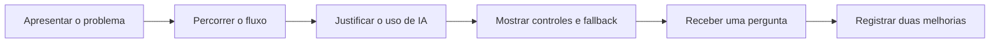

# Encontro 02 — Apresentação e discussão de todos os diagramas

## Tema

Apresentação, análise comparativa e revisão dos cenários e diagramas de
arquitetura elaborados no Encontro 01.

## Objetivos

- comunicar uma proposta arquitetural com clareza e dentro do tempo definido;
- justificar onde a IA agrega valor e onde regras determinísticas permanecem;
- identificar riscos, validações, fallback e responsabilidades no fluxo;
- comparar soluções e incorporar feedback ao diagrama.

## Organização dos 90 minutos

| Etapa | Tempo | Condução |
|---|---:|---|
| abertura e critérios | 5 min | professor retoma o objetivo e a rubrica |
| apresentações | 55 min | todas as duplas apresentam; até 4 min por dupla |
| perguntas e comparação | 15 min | perguntas curtas e registro de padrões |
| revisão do diagrama | 10 min | cada dupla anota duas melhorias prioritárias |
| síntese e transição | 5 min | conexão com tokens, contexto e limitações |

Se a quantidade de grupos exigir, o tempo individual deve ser calculado antes
da aula: `(55 minutos ÷ número de grupos)`, limitado a quatro minutos. Os
diagramas devem estar disponíveis no início do encontro para evitar tempo de
troca de arquivos.

## Roteiro obrigatório da apresentação

1. problema, usuário e entrada do sistema;
2. percurso da solicitação pelo diagrama;
3. função atribuída ao modelo;
4. validações antes e depois da inferência;
5. dado que não deve ser enviado ao modelo;
6. principal falha prevista e comportamento de fallback;
7. decisão que depende de confirmação humana.

## Rubrica de observação

| Critério | Evidência esperada |
|---|---|
| clareza | fluxo explicado na ordem das setas |
| adequação | IA associada a uma tarefa probabilística pertinente |
| controle | validação, regra determinística e fallback visíveis |
| responsabilidade | dados sensíveis e confirmação humana identificados |
| comunicação | respeito ao tempo e respostas objetivas |

## Produto do encontro

Cada dupla entrega o diagrama revisado ou uma nota de revisão contendo: duas
alterações, justificativa e risco que permaneceu em aberto. Essa versão passa a
ser a referência arquitetural inicial do projeto.

## Síntese do encontro

As apresentações são concluídas integralmente neste encontro. No Encontro 03,
a disciplina avança para o funcionamento conceitual de LLMs, tokens, contexto,
inferência e limitações.
