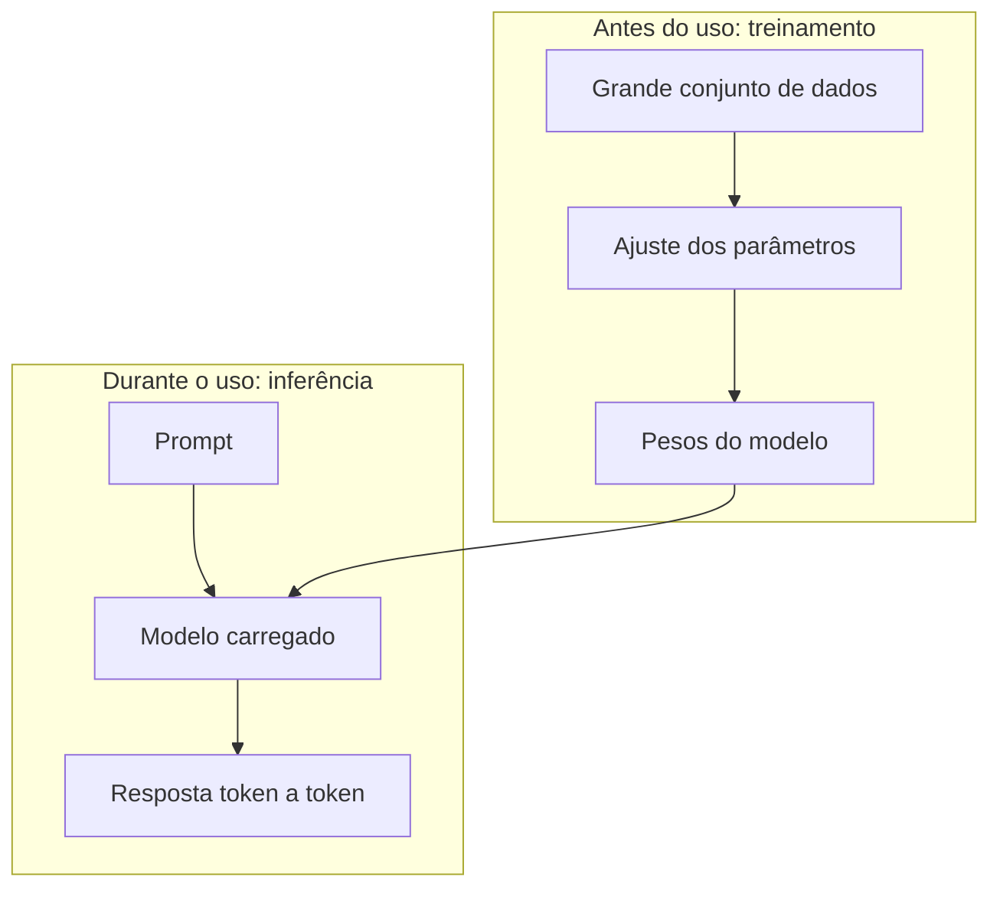
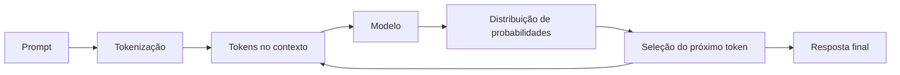
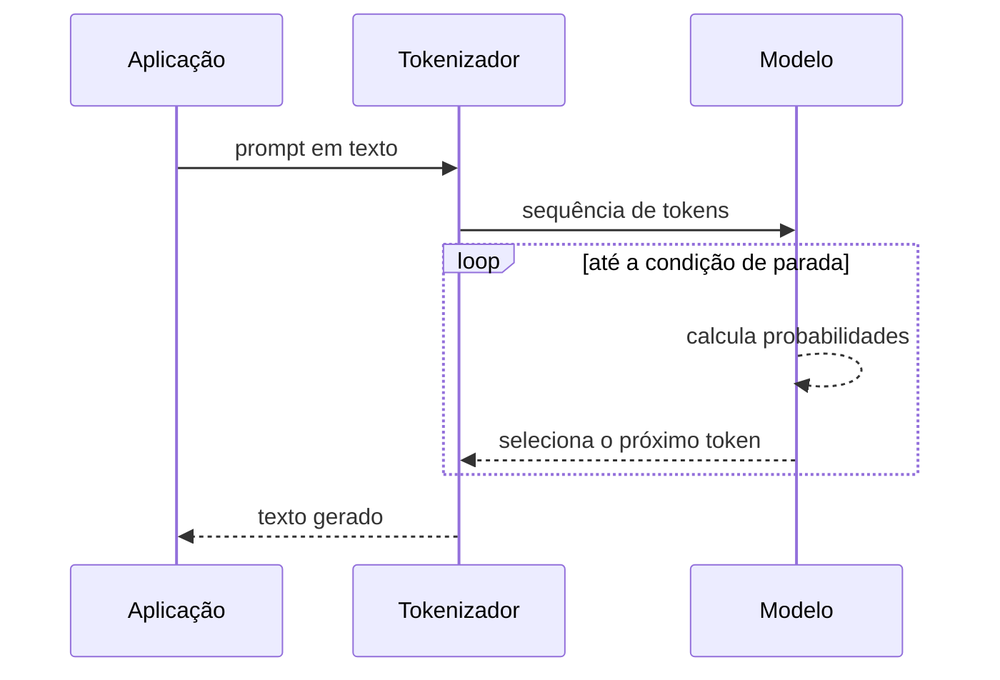
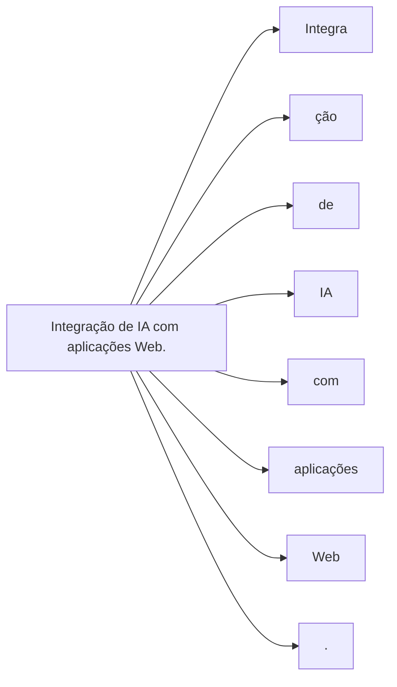
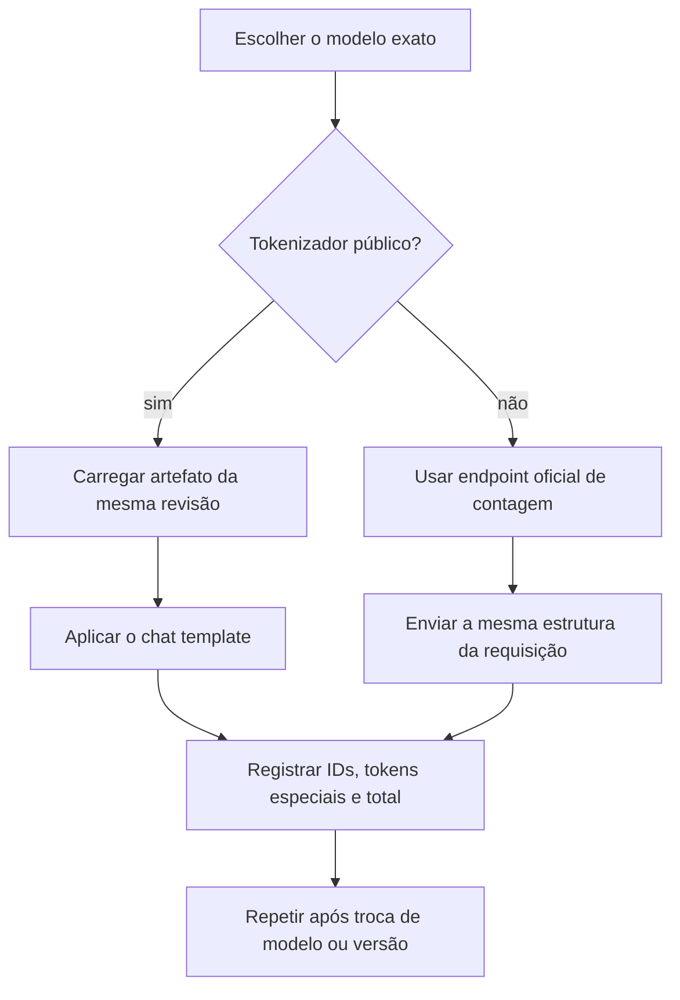

# Encontro 03 — LLMs, treinamento, inferência e tokenização

## Tema

Funcionamento conceitual dos modelos de linguagem, geração token a token e
comparação prática entre tokenizadores locais e APIs de contagem.

## Objetivos

- Explicar, em nível conceitual, treinamento e inferência de um LLM.
- Compreender tokenização e tokens especiais de um template de conversa.
- Comparar contagens produzidas por modelos e métodos diferentes.
- Consumir com segurança um endpoint oficial de contagem de tokens.
- Registrar uma atividade individual de modo reproduzível.

## Visão geral

Modelos de linguagem de grande escala, ou LLMs, processam sequências e estimam
qual token deve aparecer em seguida. Essa descrição é simplificada, mas fornece
um modelo mental útil: a resposta é construída passo a passo, condicionada aos
tokens que já estão no contexto.

O modelo não recupera uma frase pronta de um banco de respostas. Também não
possui, por padrão, acesso ao banco da aplicação, à Internet ou a documentos
institucionais. Qualquer acesso adicional precisa ser implementado pelo sistema.

Um **tokenizador** é o componente que converte texto em tokens compreendidos
pelo modelo e realiza a conversão inversa na saída. Cada família pode usar um
tokenizador diferente; por isso, a mesma frase pode ocupar quantidades distintas
de tokens em modelos diferentes.

## Treinamento e inferência



O usuário não retreina o modelo a cada pergunta: ele utiliza pesos previamente
ajustados para executar uma inferência.

### Treinamento

Durante o treinamento, o modelo ajusta muitos parâmetros internos para reduzir
o erro de suas previsões sobre grandes conjuntos de dados. É uma etapa cara,
executada antes de o modelo ser disponibilizado ao usuário.

Nesse contexto, **parâmetros do modelo** são valores numéricos aprendidos no
treinamento. Eles codificam padrões estatísticos e não devem ser confundidos com
os **parâmetros de geração**, como temperatura e limite de saída, definidos no
momento da inferência.

### Inferência

Inferência é a utilização do modelo já treinado para produzir uma saída. É o
processo que ocorre quando uma aplicação envia um prompt ao servidor local.



O ciclo se repete até uma condição de parada: limite de tokens, token especial,
cancelamento ou outra regra do servidor.



## O que é um token?

Token é uma unidade processada pelo modelo. Não corresponde necessariamente a
uma palavra inteira. Pode representar uma palavra, parte de uma palavra,
pontuação, espaço ou símbolo.

Uma frase como:

```text
Integração de IA com aplicações Web.
```

pode ser dividida em unidades menores. A divisão exata depende do tokenizador do
modelo. Portanto, não se deve assumir que “uma palavra é um token”.

### Visualização conceitual da tokenização



Essa segmentação é ilustrativa: o resultado real depende do tokenizador.

### Tokenizadores em ecossistemas populares

Não é correto associar permanentemente uma empresa a um único tokenizador. O
tokenizador acompanha o **modelo e sua versão**, e pode mudar entre gerações,
variantes de texto, código ou multimodais. A tabela abaixo apresenta o cenário na data atual(19/08/2026).

| Ecossistema ou família | Tokenizador ou forma de acesso | O que registrar no experimento |
|---|---|---|
| OpenAI — famílias GPT e modelos de raciocínio | A OpenAI disponibiliza a biblioteca `tiktoken`; a codificação exata deve ser resolvida para o identificador do modelo, por exemplo com `encoding_for_model()` | modelo, codificação retornada, tokens do texto e tokens adicionais da estrutura da requisição |
| Anthropic Claude | O tokenizador de produção não é distribuído como artefato local estável; a contagem oficial deve ser obtida pelo endpoint de contagem de tokens | identificador do modelo, conteúdo completo da mensagem e total retornado pela API |
| Google Gemini | A documentação não exige que o cliente reproduza localmente o tokenizador; a API oferece `countTokens` para executar a contagem compatível com o modelo | modelo, modalidades enviadas e total retornado por `countTokens` |
| Meta Llama | O artefato do tokenizer acompanha cada checkpoint. Versões clássicas usam BPE baseado em SentencePiece, com byte fallback; não se deve generalizar esse detalhe sem conferir a variante atual | repositório e revisão do checkpoint, classe carregada por `AutoTokenizer`, vocabulário e tokens especiais |
| Mistral e Mixtral | As versões V1–V3 tradicionais são baseadas em SentencePiece; variantes como Mistral Nemo e Pixtral usam **Tekken**, baseado em `tiktoken` | nome completo do modelo, versão do tokenizer, chat template e tokens de controle |
| Qwen | O Qwen original documenta um tokenizer executado com `tiktoken`; gerações posteriores devem ser verificadas no `tokenizer.json` e carregadas pelo `AutoTokenizer` do checkpoint | geração exata, revisão do repositório, tamanho do vocabulário e chat template |
| DeepSeek | Os modelos abertos fornecem os artefatos do tokenizer junto ao checkpoint e o código oficial usa `AutoTokenizer`; a API deve ser tratada conforme a versão publicada | identificador exato, revisão do checkpoint e contagem produzida pelo artefato ou pela API oficial |

#### Por que usar “ecossistema ou família” em vez de “IA”?

ChatGPT, Claude e Gemini são produtos que podem encaminhar solicitações para
modelos diferentes. Llama, Qwen e DeepSeek também designam famílias com várias
gerações. Consequentemente, dizer apenas “o tokenizador do ChatGPT” ou “o
tokenizador do Llama” omite a informação que torna a contagem reproduzível.



#### Fontes para conferência e atualização

- [OpenAI Tokenizer e biblioteca tiktoken](https://platform.openai.com/tokenizer/);
- [Anthropic — contagem de tokens em mensagens](https://docs.anthropic.com/en/api/messages-count-tokens);
- [Google Gemini — compreensão e contagem de tokens](https://ai.google.dev/gemini-api/docs/tokens);
- [Google Gemini — criação e segurança de chaves](https://ai.google.dev/gemini-api/docs/api-key);
- [Google Gemini — modelos e limites do nível gratuito](https://ai.google.dev/gemini-api/docs/pricing);
- [Hugging Face Transformers — tokenizer da família Llama](https://huggingface.co/docs/transformers/model_doc/llama);
- [Mistral — aprofundamento sobre tokenização](https://docs.mistral.ai/resources/cookbooks/concept-deep-dive-tokenization-readme);
- [Qwen — model card e descrição do tokenizer](https://huggingface.co/Qwen/Qwen-7B);
- [DeepSeek-V3 — implementação oficial de inferência](https://github.com/deepseek-ai/DeepSeek-V3/blob/main/inference/generate.py).

### Atividade prática

Esta atividade é **individual**. Cada estudante deve executar o Passo 1 com dois
modelos locais e o Passo 2 com a API do Gemini.

O objetivo é verificar, por meio de medições reproduzíveis, como uma mesma frase
pode ocupar quantidades diferentes de tokens conforme o modelo, o tokenizador e
a forma utilizada para montar a requisição. A atividade também permite
relacionar tokenização ao consumo da janela de contexto.

Ao concluir os dois passos, o estudante conseguirá observar a fragmentação do
texto nos modelos locais, identificar os tokens acrescentados pelo template de
conversa e comparar essa inspeção com a contagem oficial fornecida pelo Gemini.
Também perceberá que papéis, tokens especiais e instruções de sistema ocupam
espaço mesmo quando não aparecem como parte da mensagem escrita pelo usuário.

#### Tabela de preenchimento

Preencha uma linha para cada um dos dois modelos locais do Passo 1 e uma linha
para a API do Gemini utilizada no Passo 2.

| Modelo e versão | Ferramenta ou rota | Medição inicial | Medição completa | Diferença | Evidência técnica |
|---|---|---:|---:|---:|---|
| | | | | | local |
| | | | | | local |
| | | | | | API |

O significado de cada coluna é:

- **Modelo e versão:** identificador completo utilizado, e não apenas o nome da
  empresa ou da família; por exemplo, `Qwen/Qwen2.5-0.5B-Instruct`.
- **Ferramenta ou rota:** classe/biblioteca do tokenizador local ou endpoint
  oficial utilizado para obter a contagem.
- **Medição inicial:** no Passo 1, corresponde a `T_texto`, sem template e sem
  tokens especiais; no Passo 2, corresponde a `T_base`, retornado pela API para
  a mensagem simples.
- **Medição completa:** no Passo 1, corresponde a `T_mensagem`, depois da
  aplicação do chat template; no Passo 2, corresponde a `T_completa`, depois de
  acrescentar a instrução de sistema.
- **Diferença:** no Passo 1, `overhead = T_mensagem - T_texto`; no Passo 2,
  `delta_API = T_completa - T_base`. Os dois valores não medem exatamente a
  mesma coisa e não devem ser comparados como equivalentes.
- **Evidência técnica:** para execução local, registre a classe e a revisão do
  tokenizer; para API, registre a data, a rota e o nome exato do modelo. Nunca
  registre a chave de API.

Use exatamente a mesma entrada em três modelos disponíveis:

```text
Programação, aplicações Web e IA: custo, segurança e explicabilidade.
```

#### O que será medido

Defina:

- `T_texto`: quantidade de tokens da frase, sem template e sem tokens especiais;
- `T_mensagem`: quantidade de tokens depois de representar a frase como uma
  mensagem de usuário completa;
- `overhead = T_mensagem - T_texto`: tokens acrescentados pelo protocolo de
  conversa, como início e fim de sequência, papel e marcador de geração.

O overhead não é necessariamente constante. Ele pode mudar com o modelo, a
versão do chat template, o número de mensagens, ferramentas e outros campos da
requisição.

#### Passo 1 — execução local com modelos abertos

Não é necessário baixar os pesos nem executar a inferência. O estudante baixa
somente os arquivos pequenos do tokenizador associados ao checkpoint.

##### 1.1 Preparar a pasta e conferir o Python

Abra o terminal, crie uma pasta para a atividade e entre nela:

```bash
mkdir atividade-tokenizacao
cd atividade-tokenizacao
python3 --version
```

É necessário Python 3.10 ou superior. No Windows, o comando de versão pode ser
`py --version`.

##### 1.2 Criar e ativar o ambiente virtual

```bash
python3 -m venv .venv-tokenizacao
source .venv-tokenizacao/bin/activate
```

No PowerShell do Windows, a ativação correspondente é:

```powershell
.\.venv-tokenizacao\Scripts\Activate.ps1
```

##### 1.3 Instalar as dependências

```bash
python3 -m pip install --upgrade pip
python3 -m pip install transformers sentencepiece tiktoken
```

Os pesos dos modelos não serão baixados. `AutoTokenizer` obtém somente os
arquivos necessários para tokenização, mas o primeiro uso requer Internet.

##### 1.4 Criar o programa

Crie o arquivo `comparar_tokenizadores.py`, copie o código abaixo e salve-o:

```python
from transformers import AutoTokenizer

TEXTO = (
    "Programação, aplicações Web e IA: custo, segurança e explicabilidade."
)

MODELOS = [
    "Qwen/Qwen2.5-0.5B-Instruct",
    "mistralai/Mistral-7B-Instruct-v0.3",
    # Substitua ou acrescente outro checkpoint público compatível.
]

for modelo in MODELOS:
    tokenizer = AutoTokenizer.from_pretrained(modelo)

    ids_texto = tokenizer.encode(TEXTO, add_special_tokens=False)
    ids_mensagem = tokenizer.apply_chat_template(
        [{"role": "user", "content": TEXTO}],
        tokenize=True,
        add_generation_prompt=True,
    )

    tokens_visiveis = tokenizer.convert_ids_to_tokens(ids_texto)
    revisao = tokenizer.init_kwargs.get("_commit_hash", "não informada")

    print("\nModelo:", modelo)
    print("Revisão:", revisao)
    print("Classe:", tokenizer.__class__.__name__)
    print("IDs do texto:", ids_texto)
    print("Tokens visíveis:", tokens_visiveis)
    print("T_texto:", len(ids_texto))
    print("T_mensagem:", len(ids_mensagem))
    print("Overhead:", len(ids_mensagem) - len(ids_texto))
```

##### 1.5 Executar e guardar a evidência

```bash
python3 comparar_tokenizadores.py
```

Copie os resultados para a tabela da atividade.


#### Passo 2 — contagem pela API do Gemini

Neste passo, a API do Gemini retorna a contagem, mas normalmente não revela os
IDs ou fragmentos individuais. Utilize uma chave criada em sua própria conta e
mantenha o projeto no nível gratuito.

##### Chave pessoal e temporária

Uma chave de API não é a senha da conta, mas deve receber a mesma proteção. Ela
pode consumir a cota do projeto. O nível gratuito do Gemini permite realizar
esta atividade sem comprar créditos, desde que o modelo selecionado esteja
disponível gratuitamente e a cota da conta não tenha sido esgotada. Não ative
faturamento para executar a atividade.

Para esta atividade, “temporária” significa:

- criar no Gemini uma chave exclusiva para a aula e excluí-la ou revogá-la
  imediatamente após terminar, pois ela não recebe necessariamente uma
  expiração curta automática;
- não reutilizar uma chave de projeto pessoal importante;
- conferir cota e faturamento antes de executar a requisição. O estudante não
  deve ativar cobrança apenas para cumprir esta atividade.

##### Variáveis de ambiente e computadores do laboratório

Variáveis de ambiente evitam repetir a chave no comando e reduzem o risco de
salvá-la acidentalmente no código. Um `export` feito no terminal vale somente
para aquela sessão e, em condições normais, **não exige permissão de
administrador**:

```bash
export GEMINI_API_KEY="sua-chave"
```

Não altere `/etc/environment`, variáveis do sistema nem arquivos como `.bashrc`
em computadores compartilhados. No laboratório, podem existir políticas que
bloqueiam a gravação do perfil, a criação de ambiente virtual, a instalação de
pacotes ou até a execução de `curl`. Se o `export` funcionar, prefira-o; basta
fechar o terminal ao terminar. Se o terminal ou a rede estiverem bloqueados,
registre o impedimento e realize a análise com uma resposta JSON fornecida no
roteiro, sem tentar contornar a política do laboratório.

Se não for possível ou desejável criar a variável, a chave pode ser informada
diretamente no cabeçalho do comando, conforme os exemplos alternativos. Essa é
uma solução menos segura: a chave fica visível na tela e pode permanecer no
histórico do shell. Em computador compartilhado, execute apenas uma chave curta
e descartável, não faça captura de tela, não salve o comando e revogue a chave
ao final da aula.

##### 2.1 Criar uma chave gratuita do Gemini

**Método e rota:**

```text
POST https://generativelanguage.googleapis.com/v1beta/models/{modelo}:countTokens
```

1. Entre em [Google AI Studio](https://aistudio.google.com/) com sua conta
   Google pessoal e aceite os termos, se solicitado.
2. Abra **Dashboard → API Keys**. Para contas novas, o AI Studio pode criar um
   projeto e uma chave padrão. Caso já utilize Google Cloud, importe um projeto
   existente ou crie um projeto pessoal separado para a atividade.
3. Clique em **Create API key**, copie a nova chave e mantenha a página aberta
   para poder excluí-la ao final. As chaves novas criadas no AI Studio são do
   tipo de autorização adotado atualmente pelo Gemini.
4. Confirme na coluna de plano ou faturamento que o projeto está no nível
   **Free**. Não clique em **Set up billing** e não vincule uma conta de cobrança.
   Se o modelo do exemplo não estiver incluído no nível gratuito da conta,
   selecione na página de preços outro modelo gratuito compatível com
   `countTokens`.

##### 2.2 Configurar a chave e o modelo

5. No terminal, armazene a chave e o modelo em variáveis de ambiente. O modelo
   do exemplo deve ser confirmado na documentação antes da aula.

```bash
export GEMINI_API_KEY="cole-sua-chave-temporaria"
export GEMINI_MODEL="gemini-3.6-flash"
```

##### 2.3 Contar a mensagem simples

6. Faça a contagem da mensagem simples:

```bash
curl -sS -X POST \
  "https://generativelanguage.googleapis.com/v1beta/models/${GEMINI_MODEL}:countTokens" \
  -H "x-goog-api-key: ${GEMINI_API_KEY}" \
  -H "Content-Type: application/json" \
  -d '{
    "contents": [{
      "role": "user",
      "parts": [{
        "text": "Programação, aplicações Web e IA: custo, segurança e explicabilidade."
      }]
    }]
  }'
```

7. Localize `totalTokens` na resposta e registre-o como `T_base`.

##### 2.4 Contar a entrada completa

8. Repita a chamada acrescentando uma instrução de sistema, o que representa
   uma entrada mais completa:

```bash
curl -sS -X POST \
  "https://generativelanguage.googleapis.com/v1beta/models/${GEMINI_MODEL}:countTokens" \
  -H "x-goog-api-key: ${GEMINI_API_KEY}" \
  -H "Content-Type: application/json" \
  -d '{
    "generateContentRequest": {
      "model": "models/'"${GEMINI_MODEL}"'",
      "systemInstruction": {
        "parts": [{"text": "Responda em português e em uma frase."}]
      },
      "contents": [{
        "role": "user",
        "parts": [{
          "text": "Programação, aplicações Web e IA: custo, segurança e explicabilidade."
        }]
      }]
    }
  }'
```

9. Registre o novo `totalTokens` como `T_completa` e calcule
   `delta_API = T_completa - T_base`.
10. Exclua a chave na página **API Keys** do AI Studio e feche o terminal.

Se não usar variável de ambiente, substitua `COLE_SUA_CHAVE_TEMPORARIA` somente
durante a execução deste comando:

```bash
curl -sS -X POST \
  "https://generativelanguage.googleapis.com/v1beta/models/gemini-3.6-flash:countTokens" \
  -H "x-goog-api-key: COLE_SUA_CHAVE_TEMPORARIA" \
  -H "Content-Type: application/json" \
  -d '{
    "contents": [{
      "role": "user",
      "parts": [{"text": "Programação, aplicações Web e IA: custo, segurança e explicabilidade."}]
    }]
  }'
```

##### 2.5 Interpretar corretamente a medição da API

`delta_API` mede a diferença entre duas requisições processadas pelo mesmo
serviço. Ele inclui a instrução acrescentada e qualquer representação associada;
portanto, não é igual ao overhead isolado do chat template calculado no Passo 1.
No Gemini, não preencha `T_texto` com uma estimativa de outro tokenizador. Como
o endpoint não expõe essa medição isolada, escreva “não exposto”.

As chaves nunca devem ser inseridas na tabela, no código versionado, em capturas
de tela ou no relatório. A chave escrita diretamente no comando é apenas uma
contingência para a sessão de laboratório e deve ser revogada imediatamente.

#### Interpretação

Ao final, cada estudante deve responder individualmente:

1. Qual tokenizador fragmentou mais a frase em português?
2. Quais sinais representam espaços, acentos ou fragmentos de bytes?
3. Qual foi o overhead do template de conversa em cada modelo?
4. Por que o resultado não permite concluir qual modelo é “melhor”?
5. O que mudaria ao adicionar uma instrução de sistema e uma segunda mensagem?
6. Quais resultados vieram do tokenizer local e quais vieram da API oficial?
