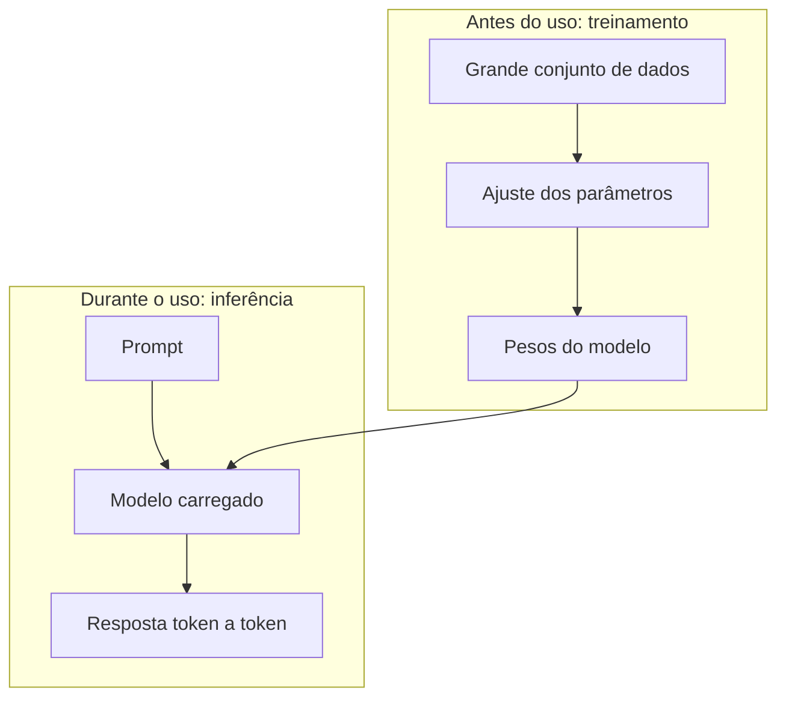
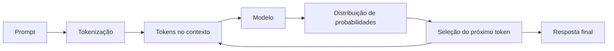
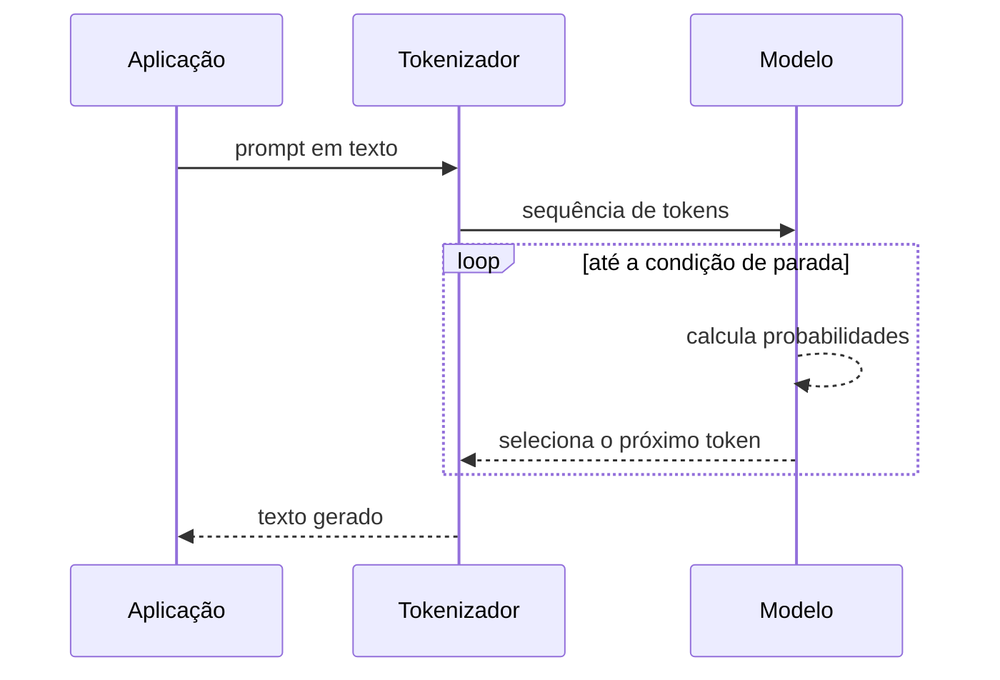
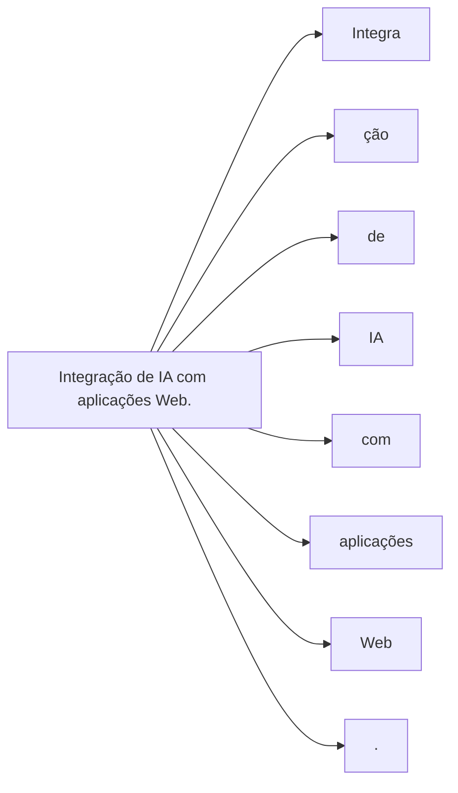
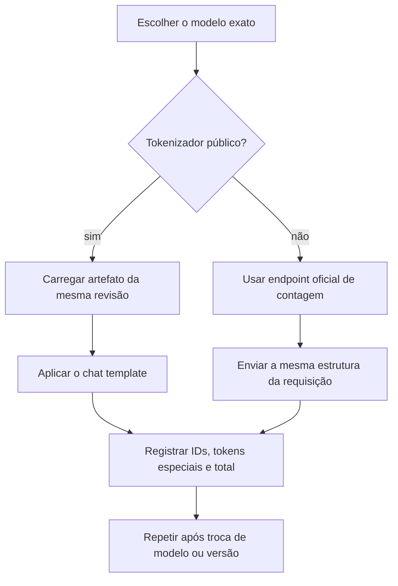
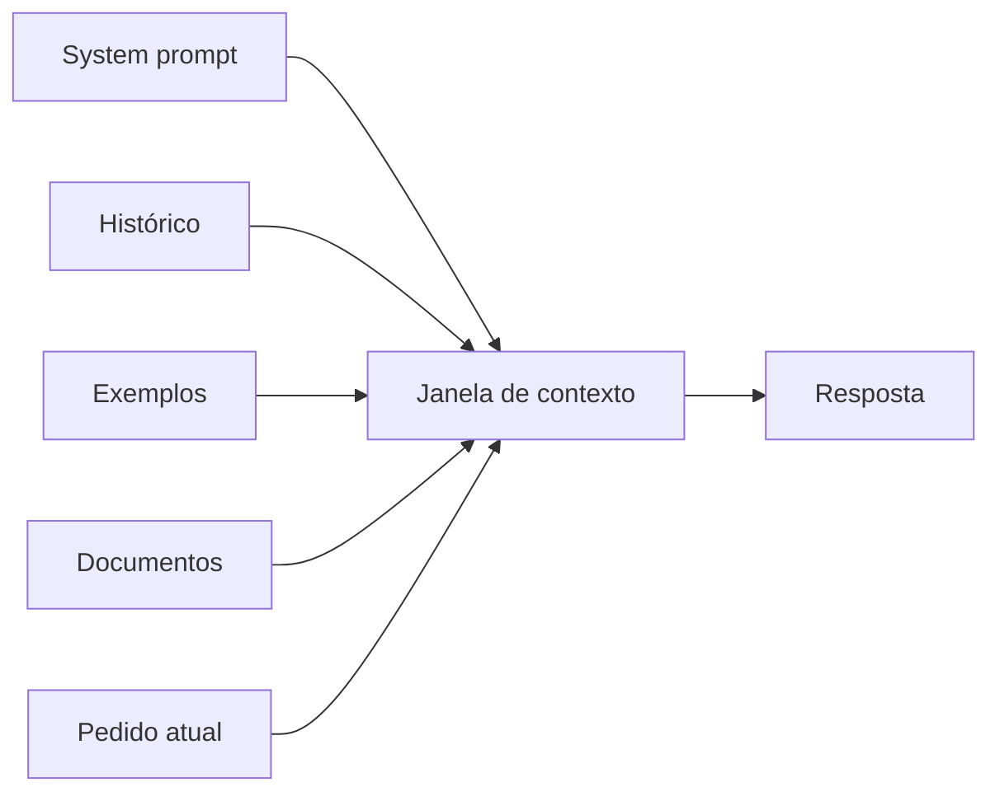
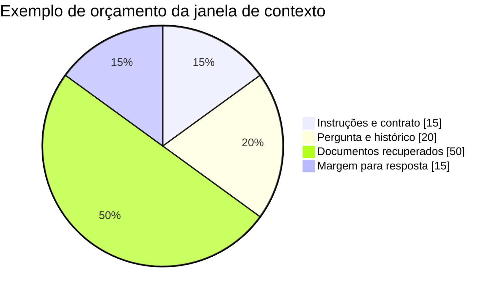
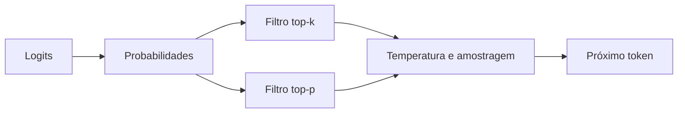
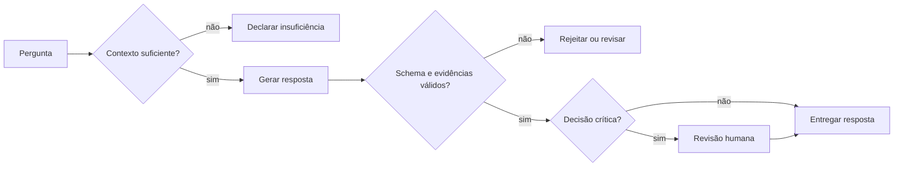

# Encontro 03 — LLMs, tokens, contexto, inferência e limitações

## Tema

Funcionamento conceitual dos modelos de linguagem e relação entre tokenização,
janela de contexto, inferência, parâmetros e qualidade das respostas.

## Objetivos

- Explicar, em nível conceitual, treinamento e inferência de um LLM.
- Compreender tokenização e janela de contexto.
- Relacionar parâmetros de geração à variabilidade das respostas.
- Identificar alucinações e outras limitações.
- Planejar um experimento simples e reproduzível com um modelo.

## Visão geral

Modelos de linguagem de grande escala, ou LLMs, processam sequências e estimam
qual token deve aparecer em seguida. Essa descrição é simplificada, mas fornece
um modelo mental útil: a resposta é construída passo a passo, condicionada aos
tokens que já estão no contexto.

O modelo não recupera uma frase pronta de um banco de respostas. Também não
possui, por padrão, acesso ao banco da aplicação, à Internet ou a documentos
institucionais. Qualquer acesso adicional precisa ser implementado pelo sistema.

Um **tokenizador** é o componente que converte texto em tokens compreendidos
pelo modelo e realiza a conversão inversa na saída. Cada família pode usar um
tokenizador diferente; por isso, a mesma frase pode ocupar quantidades distintas
de tokens em modelos diferentes.

## Treinamento e inferência



O usuário não retreina o modelo a cada pergunta: ele utiliza pesos previamente
ajustados para executar uma inferência.

### Treinamento

Durante o treinamento, o modelo ajusta muitos parâmetros internos para reduzir
o erro de suas previsões sobre grandes conjuntos de dados. É uma etapa cara,
executada antes de o modelo ser disponibilizado ao usuário.

Nesse contexto, **parâmetros do modelo** são valores numéricos aprendidos no
treinamento. Eles codificam padrões estatísticos e não devem ser confundidos com
os **parâmetros de geração**, como temperatura e limite de saída, definidos no
momento da inferência.

### Inferência

Inferência é a utilização do modelo já treinado para produzir uma saída. É o
processo que ocorre quando uma aplicação envia um prompt ao servidor local.



O ciclo se repete até uma condição de parada: limite de tokens, token especial,
cancelamento ou outra regra do servidor.



## O que é um token?

Token é uma unidade processada pelo modelo. Não corresponde necessariamente a
uma palavra inteira. Pode representar uma palavra, parte de uma palavra,
pontuação, espaço ou símbolo.

Uma frase como:

```text
Integração de IA com aplicações Web.
```

pode ser dividida em unidades menores. A divisão exata depende do tokenizador do
modelo. Portanto, não se deve assumir que “uma palavra é um token”.

### Visualização conceitual da tokenização



Essa segmentação é ilustrativa: o resultado real depende do tokenizador.

### Tokenizadores em ecossistemas populares

Não é correto associar permanentemente uma empresa a um único tokenizador. O
tokenizador acompanha o **modelo e sua versão**, e pode mudar entre gerações,
variantes de texto, código ou multimodais. A tabela abaixo é um mapa de estudo,
verificado em 18 de agosto de 2026, e não uma lista imutável.

| Ecossistema ou família | Tokenizador ou forma de acesso | O que registrar no experimento |
|---|---|---|
| OpenAI — famílias GPT e modelos de raciocínio | A OpenAI disponibiliza a biblioteca `tiktoken`; a codificação exata deve ser resolvida para o identificador do modelo, por exemplo com `encoding_for_model()` | modelo, codificação retornada, tokens do texto e tokens adicionais da estrutura da requisição |
| Anthropic Claude | O tokenizador de produção não é distribuído como artefato local estável; a contagem oficial deve ser obtida pelo endpoint de contagem de tokens | identificador do modelo, conteúdo completo da mensagem e total retornado pela API |
| Google Gemini | A documentação não exige que o cliente reproduza localmente o tokenizador; a API oferece `countTokens` para executar a contagem compatível com o modelo | modelo, modalidades enviadas e total retornado por `countTokens` |
| Meta Llama | O artefato do tokenizer acompanha cada checkpoint. Versões clássicas usam BPE baseado em SentencePiece, com byte fallback; não se deve generalizar esse detalhe sem conferir a variante atual | repositório e revisão do checkpoint, classe carregada por `AutoTokenizer`, vocabulário e tokens especiais |
| Mistral e Mixtral | As versões V1–V3 tradicionais são baseadas em SentencePiece; variantes como Mistral Nemo e Pixtral usam **Tekken**, baseado em `tiktoken` | nome completo do modelo, versão do tokenizer, chat template e tokens de controle |
| Qwen | O Qwen original documenta um tokenizer executado com `tiktoken`; gerações posteriores devem ser verificadas no `tokenizer.json` e carregadas pelo `AutoTokenizer` do checkpoint | geração exata, revisão do repositório, tamanho do vocabulário e chat template |
| DeepSeek | Os modelos abertos fornecem os artefatos do tokenizer junto ao checkpoint e o código oficial usa `AutoTokenizer`; a API deve ser tratada conforme a versão publicada | identificador exato, revisão do checkpoint e contagem produzida pelo artefato ou pela API oficial |

#### Por que usar “ecossistema ou família” em vez de “IA”?

ChatGPT, Claude e Gemini são produtos que podem encaminhar solicitações para
modelos diferentes. Llama, Qwen e DeepSeek também designam famílias com várias
gerações. Consequentemente, dizer apenas “o tokenizador do ChatGPT” ou “o
tokenizador do Llama” omite a informação que torna a contagem reproduzível.



#### Fontes para conferência e atualização

- [OpenAI Tokenizer e biblioteca tiktoken](https://platform.openai.com/tokenizer/);
- [Anthropic — contagem de tokens em mensagens](https://docs.anthropic.com/en/api/messages-count-tokens);
- [Google Gemini — compreensão e contagem de tokens](https://ai.google.dev/gemini-api/docs/tokens);
- [Hugging Face Transformers — tokenizer da família Llama](https://huggingface.co/docs/transformers/model_doc/llama);
- [Mistral — aprofundamento sobre tokenização](https://docs.mistral.ai/resources/cookbooks/concept-deep-dive-tokenization-readme);
- [Qwen — model card e descrição do tokenizer](https://huggingface.co/Qwen/Qwen-7B);
- [DeepSeek-V3 — implementação oficial de inferência](https://github.com/deepseek-ai/DeepSeek-V3/blob/main/inference/generate.py).

### Demonstração comparativa sugerida

Use exatamente a mesma entrada em três modelos disponíveis:

```text
Programação, aplicações Web e IA: custo, segurança e explicabilidade.
```

Para cada modelo, registre o identificador completo, a ferramenta de contagem,
os tokens visíveis quando disponíveis, o total do texto isolado e o total da
mensagem completa. A diferença entre esses dois totais revela o custo de tokens
especiais, papéis, templates de conversa e outros metadados.

| Modelo e versão | Tokenizador/endpoint | Texto isolado | Mensagem completa | Observações |
|---|---|---:|---:|---|
| | | | | |
| | | | | |
| | | | | |

Não compare custos usando apenas a quantidade de palavras. Também não utilize o
tokenizador de uma família para estimar outra quando a API disponibilizar a
contagem oficial.

### Por que tokens importam?

- definem o tamanho efetivo da entrada;
- ocupam espaço na janela de contexto;
- influenciam memória, latência e custo computacional;
- limitam o tamanho máximo da resposta;
- afetam estratégias de chunking e RAG.

### Atividade de estimativa

Compare três entradas: um parágrafo em português, um trecho de código e uma
tabela JSON. Antes de usar um tokenizador, estime qual entrada utilizará mais
tokens. Depois, confronte as estimativas com uma ferramenta compatível com o
modelo escolhido.

O objetivo não é decorar uma proporção, mas perceber que idioma, símbolos,
formatação e tokenizador alteram o resultado.

## Janela de contexto

A janela de contexto é a quantidade máxima de tokens que o modelo consegue
considerar em uma inferência. Ela pode incluir:

- instrução de sistema;
- mensagem atual do usuário;
- histórico da conversa;
- exemplos few-shot;
- documentos recuperados;
- descrições e resultados de ferramentas;
- tokens da resposta, conforme a API e o modelo.

A **instrução de sistema**, frequentemente chamada de `system prompt`, define o
papel e as regras gerais que devem orientar o modelo. **Exemplos few-shot** são
pares de entrada e saída incluídos no contexto para demonstrar o comportamento
esperado antes da solicitação real.



### Janela maior resolve tudo?

Não. Um contexto maior pode elevar consumo de memória e latência e inserir
conteúdo irrelevante ou conflitante. A aplicação deve selecionar o que realmente
ajuda a tarefa.

### Exemplo de orçamento

Suponha que uma aplicação estabeleça um orçamento conceitual de contexto:

| Parte | Reserva |
|---|---:|
| instruções e contrato | 15% |
| pergunta e histórico recente | 20% |
| documentos recuperados | 50% |
| margem para resposta | 15% |

Os percentuais não são universais. Eles tornam explícita a necessidade de
controlar o contexto em vez de enviar todo o conteúdo disponível.



## Como o próximo token é escolhido

O modelo produz probabilidades para possíveis continuações. A estratégia de
decodificação decide como selecionar o próximo token.

### Temperatura

Controla, de modo geral, a dispersão da distribuição:

- valores menores tendem a favorecer saídas mais previsíveis;
- valores maiores tendem a aumentar diversidade e risco de variação;
- temperatura baixa não garante verdade nem determinismo absoluto.

### Top-k e top-p

- `top-k` restringe a seleção a um número de candidatos mais prováveis;
- `top-p` restringe a um conjunto cuja probabilidade acumulada atinge um limite;
- a disponibilidade e a interpretação exata dependem do servidor e do modelo.



### Seed

Algumas ferramentas aceitam uma semente para facilitar reprodução. Mesmo assim,
mudanças de versão, hardware, biblioteca ou configuração podem alterar o
resultado.

## Determinismo e variabilidade

Software tradicional costuma produzir a mesma saída para a mesma entrada e o
mesmo estado. Sistemas generativos podem variar.

```ts
function calcularMedia(a: number, b: number): number {
  return (a + b) / 2;
}
```

Para a mesma entrada, a função possui resultado definido. Já o pedido “explique
este conceito de modo simples” admite muitas respostas aceitáveis.

Isso afeta testes: nem sempre se deve comparar a resposta inteira com uma string
fixa. Pode ser melhor validar schema, presença de fatos, fontes, critérios de uma
rubrica ou métricas de qualidade.

Um **schema** é uma descrição formal da estrutura esperada para os dados. Em uma
resposta JSON, pode definir campos obrigatórios, tipos e valores permitidos,
possibilitando que o backend rejeite uma saída incompatível.

## Alucinação

Alucinação é a produção de conteúdo incorreto, não sustentado ou inventado, que
pode ser apresentado com fluência e confiança aparentes.

### Por que acontece?

O objetivo básico do modelo é gerar uma continuação plausível, não consultar
automaticamente a verdade. Contexto insuficiente, pergunta ambígua e padrões
aprendidos podem resultar em uma resposta plausível, porém falsa.

### Estratégias de redução

- fornecer contexto relevante e delimitado;
- exigir indicação das fontes utilizadas;
- permitir que o modelo declare insuficiência de informação;
- usar saída estruturada e validação;
- consultar ferramentas ou base de conhecimento;
- verificar fatos críticos com fonte independente;
- manter revisão humana em decisões importantes.

Nenhuma estratégia elimina completamente o problema.



## Outras limitações

### Conhecimento desatualizado ou ausente

O modelo pode não conhecer eventos recentes, dados privados ou regras locais.

### Sensibilidade à formulação

Pequenas alterações na instrução ou ordem do contexto podem mudar a resposta.

### Viés

Dados e escolhas do desenvolvimento podem reproduzir ou ampliar vieses.

### Falta de causalidade e compreensão garantida

Uma explicação coerente não prova que o modelo raciocinou como uma pessoa ou
compreendeu o domínio da maneira esperada.

### Prompt injection

Conteúdo recebido como dado pode tentar alterar instruções ou induzir o sistema
a revelar informação e usar ferramentas indevidamente.

## Modelos multimodais

Modelos multimodais recebem ou produzem mais de um tipo de informação, como
texto, imagem e áudio. A integração exige considerar:

- formatos e tamanho dos arquivos;
- custo de processamento;
- acessibilidade;
- dados pessoais presentes em imagem ou voz;
- validação específica para cada modalidade.

## Experimento guiado: variabilidade e contexto

Utilize um modelo disponível no ambiente e registre nome, versão, parâmetros e
data.

### Parte A — repetição

Execute três vezes:

```text
Explique em até quatro frases por que uma aplicação deve validar a saída de um
modelo de linguagem.
```

Compare vocabulário, argumentos, tamanho e consistência.

### Parte B — mudança de parâmetro

Repita com duas configurações de temperatura. Não altere outros elementos.

### Parte C — contexto insuficiente

Pergunte sobre uma regra fictícia da “Política Acadêmica Zeta”. Observe se o
modelo pede informações ou inventa uma resposta. Depois forneça um pequeno
trecho delimitado e solicite resposta apenas com base nele.

### Tabela de registro

| Execução | Configuração | Evidência usada | Variação | Erro ou limitação |
|---|---|---|---|---|
| 1 | | | | |
| 2 | | | | |
| 3 | | | | |

### Discussão

- Qual aspecto variou mais?
- Temperatura menor tornou a resposta correta ou apenas mais estável?
- O modelo admitiu não conhecer a política fictícia?
- Que validação seria possível no backend?

## Questões para revisão

1. Qual a diferença entre treinamento e inferência?
2. Por que palavra e token não são sinônimos?
3. O que disputa espaço na janela de contexto?
4. Por que mais contexto pode piorar uma resposta?
5. Como a variabilidade modifica a estratégia de testes?
6. Cite três medidas para reduzir alucinações.

## Checklist de aprendizagem

- [ ] explicar a geração token a token;
- [ ] diferenciar treinamento e inferência;
- [ ] explicar tokenização e janela de contexto;
- [ ] relacionar parâmetros à variabilidade;
- [ ] identificar alucinação sem confundi-la com simples erro de formatação;
- [ ] registrar um experimento de modo reproduzível.

## Síntese do encontro

LLMs geram sequências probabilisticamente dentro de uma janela limitada. Essa
natureza explica capacidades, variabilidade e parte das limitações. Uma boa
integração não oculta essa característica: ela cria controles para utilizá-la
de forma adequada ao problema.

## Preparação para o próximo encontro

Selecionar dois model cards de modelos abertos e identificar, em cada um:
licença, finalidade, tamanho, idiomas, limitações declaradas e forma de uso.
