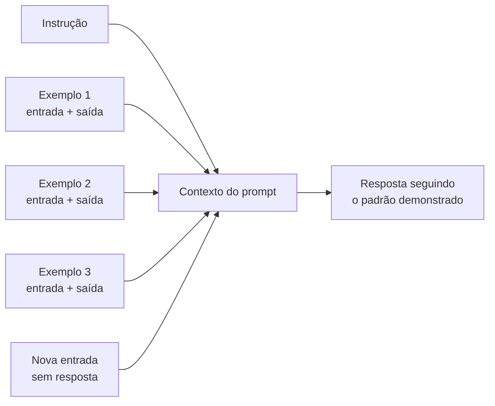
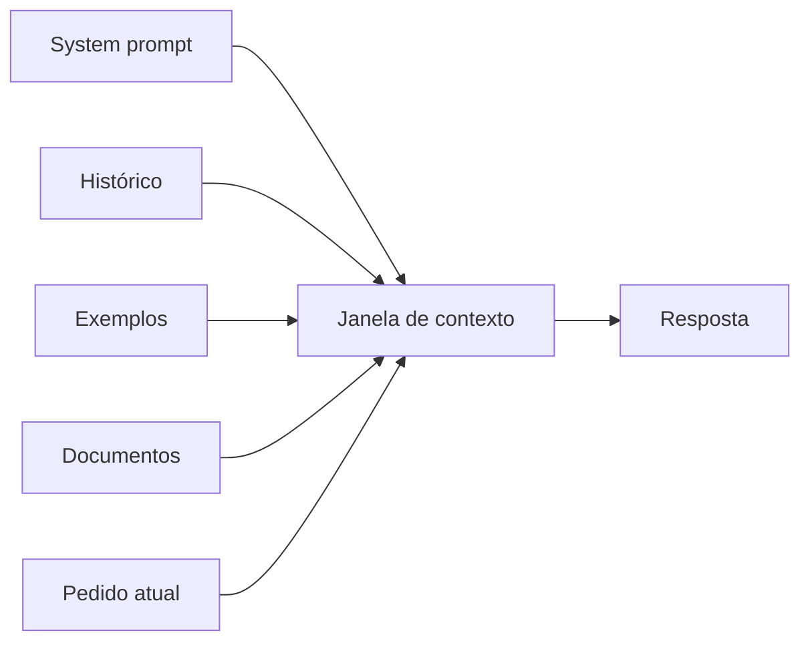
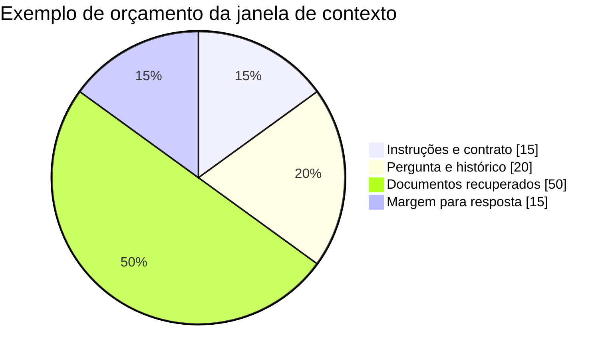
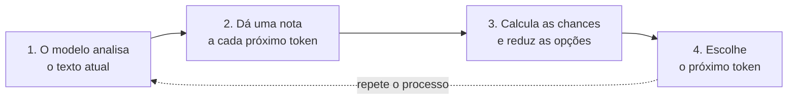
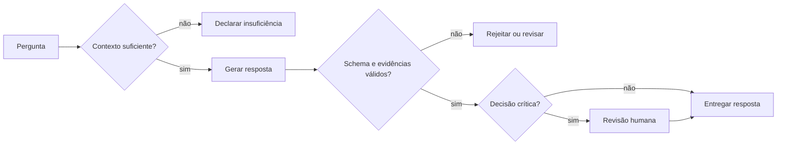

# Encontro 04 — Contexto, geração e limitações dos LLMs

## Tema

Janela de contexto, parâmetros de geração, variabilidade, alucinação e outras
limitações dos modelos de linguagem.

## Objetivos

- Explicar o que ocupa a janela de contexto e como administrar seu orçamento.
- Relacionar temperatura, top-k e top-p à variabilidade das respostas.
- Identificar alucinação, vieses e outras limitações relevantes.
- Observar, em uma prática individual, os efeitos da repetição, da formulação da
  instrução e do contexto fornecido.

## Visão geral

O resultado da tokenização estudada no Encontro 03 é apenas uma parte do
comportamento operacional. O contexto disponível, os parâmetros de geração e as
limitações do modelo também influenciam qualidade, latência e segurança.

Esses conceitos serão observados ao final do encontro em uma prática individual
realizada diretamente em um chatbot gratuito.

## Janela de contexto

A janela de contexto é a quantidade máxima de tokens que o modelo consegue
considerar em uma inferência. Ela pode incluir:

- instrução de sistema;
- mensagem atual do usuário;
- histórico da conversa;
- exemplos few-shot;
- documentos recuperados;
- descrições e resultados de ferramentas;
- tokens da resposta, conforme a API e o modelo.

A **instrução de sistema**, frequentemente chamada de `system prompt`, define o
papel e as regras gerais que devem orientar o modelo. **Exemplos few-shot** são
pares de entrada e saída incluídos no contexto para demonstrar o comportamento
esperado antes da solicitação real.

### O que são exemplos few-shot?

`Few-shot` significa literalmente **poucos exemplos**. Em vez de apenas explicar
uma tarefa, o prompt apresenta algumas demonstrações completas do que deve
entrar e do que se espera como saída. O modelo usa esses exemplos como padrão
temporário para responder à nova entrada; eles orientam a execução, mas não
alteram nem treinam permanentemente o modelo.

Compare três formas de solicitar a mesma tarefa:

| Estratégia | O que o prompt fornece |
|---|---|
| **Zero-shot** | Apenas a instrução, sem exemplo. |
| **One-shot** | A instrução e um único exemplo. |
| **Few-shot** | A instrução e alguns exemplos, normalmente escolhidos para representar situações diferentes. |

Por exemplo, uma aplicação precisa classificar mensagens de atendimento usando
somente as categorias `FINANCEIRO`, `SUPORTE` e `CANCELAMENTO`. Um prompt
few-shot poderia ser:

```text
Classifique a mensagem usando somente uma destas categorias:
FINANCEIRO, SUPORTE ou CANCELAMENTO.

Mensagem: "Minha cobrança veio duplicada."
Categoria: FINANCEIRO

Mensagem: "O aplicativo fecha quando tento entrar."
Categoria: SUPORTE

Mensagem: "Não quero mais utilizar o serviço."
Categoria: CANCELAMENTO

Mensagem: "Esqueci minha senha e não consigo acessar."
Categoria:
```

Os três primeiros pares são as demonstrações. A última mensagem é a entrada
real, para a qual se espera `SUPORTE`. Os exemplos mostram simultaneamente as
categorias permitidas, o formato da resposta e a relação entre cada tipo de
mensagem e sua classificação. Isso costuma ser mais concreto do que descrever
todas essas regras apenas em linguagem natural.



Exemplos few-shot são especialmente úteis para ensinar:

- o formato exato da saída, como uma categoria ou estrutura JSON;
- critérios de classificação difíceis de resumir em uma única regra;
- tom, vocabulário ou nível de detalhamento desejado;
- como tratar casos distintos ou situações de fronteira.

Os exemplos precisam ser corretos, variados e coerentes com a instrução. Um
exemplo errado ou ambíguo também pode ser imitado. Além disso, cada demonstração
consome tokens da janela de contexto: acrescentar muitos exemplos pode aumentar
custo e latência ou retirar espaço dos documentos e da resposta. Few-shot não
garante precisão factual nem substitui validação da saída.



### Janela maior resolve tudo?

Não. Um contexto maior pode elevar consumo de memória e latência e inserir
conteúdo irrelevante ou conflitante. A aplicação deve selecionar o que realmente
ajuda a tarefa.

### Exemplo de orçamento

Suponha que uma aplicação estabeleça um orçamento conceitual de contexto:

| Parte | Reserva |
|---|---:|
| instruções e contrato | 15% |
| pergunta e histórico recente | 20% |
| documentos recuperados | 50% |
| margem para resposta | 15% |

Os percentuais não são universais. Eles tornam explícita a necessidade de
controlar o contexto em vez de enviar todo o conteúdo disponível.



## Como o próximo token é escolhido

Antes de produzir cada token, o modelo atribui a cada token possível uma
pontuação numérica chamada **logit**. O logit não é uma probabilidade nem uma
porcentagem: é uma pontuação interna, que pode ser positiva ou negativa. Quanto
maior o logit de um token em relação aos demais, maior será sua chance de ser
escolhido.

Por exemplo, depois de `A capital do Brasil é`, o modelo poderia atribuir
pontuações hipotéticas como estas:

| Token candidato | Logit hipotético | Interpretação |
|---|---:|---|
| `Brasília` | 8,2 | continuação fortemente favorecida |
| `São` | 3,1 | continuação possível, mas menos favorecida |
| `ontem` | -1,4 | continuação pouco compatível |

Esses valores são apenas didáticos. Uma operação matemática, normalmente
associada à função *softmax*, transforma o conjunto de logits em probabilidades
cuja soma é 100%. Em seguida, a estratégia de decodificação filtra os candidatos
e seleciona o próximo token. O processo recomeça após cada token gerado.

### Temperatura

Controla, de modo geral, a dispersão da distribuição:

- valores menores tendem a favorecer saídas mais previsíveis;
- valores maiores tendem a aumentar diversidade e risco de variação;
- temperatura baixa não garante verdade nem determinismo absoluto.

### Top-k e top-p

- `top-k` restringe a seleção a um número de candidatos mais prováveis;
- `top-p` restringe a um conjunto cuja probabilidade acumulada atinge um limite;
- a disponibilidade e a interpretação exata dependem do servidor e do modelo.



Na etapa 2, as notas são os **logits**. Na etapa 3, temperatura, *softmax*,
top-k e top-p podem transformar essas notas em probabilidades e limitar as
opções. O diagrama apresenta apenas a ideia geral; a ordem e a combinação exatas
das operações podem variar conforme a implementação.

## Determinismo e variabilidade

Software tradicional costuma produzir a mesma saída para a mesma entrada e o
mesmo estado. Sistemas generativos podem variar.

```ts
function calcularMedia(a: number, b: number): number {
  return (a + b) / 2;
}
```

Para a mesma entrada, a função possui resultado definido. Já o pedido “explique
este conceito de modo simples” admite muitas respostas aceitáveis.

Isso afeta testes: nem sempre se deve comparar a resposta inteira com uma string
fixa. Pode ser melhor validar schema, presença de fatos, fontes, critérios de uma
rubrica ou métricas de qualidade.

Um **schema** é uma descrição formal da estrutura esperada para os dados. Em uma
resposta JSON, pode definir campos obrigatórios, tipos e valores permitidos,
possibilitando que o backend rejeite uma saída incompatível.

## Alucinação

Alucinação é a produção de conteúdo incorreto, não sustentado ou inventado, que
pode ser apresentado com fluência e confiança aparentes.

### Por que acontece?

O objetivo básico do modelo é gerar uma continuação plausível, não consultar
automaticamente a verdade. Contexto insuficiente, pergunta ambígua e padrões
aprendidos podem resultar em uma resposta plausível, porém falsa.

### Estratégias de redução

- fornecer contexto relevante e delimitado;
- exigir indicação das fontes utilizadas;
- permitir que o modelo declare insuficiência de informação;
- usar saída estruturada e validação;
- consultar ferramentas ou base de conhecimento;
- verificar fatos críticos com fonte independente;
- manter revisão humana em decisões importantes.

Nenhuma estratégia elimina completamente o problema.



## Outras limitações

### Conhecimento desatualizado ou ausente

O modelo pode não conhecer eventos recentes, dados privados ou regras locais.

### Sensibilidade à formulação

Pequenas alterações na instrução ou ordem do contexto podem mudar a resposta.

### Viés

Dados e escolhas do desenvolvimento podem reproduzir ou ampliar vieses.

### Falta de causalidade e compreensão garantida

Uma explicação coerente não prova que o modelo raciocinou como uma pessoa ou
compreendeu o domínio da maneira esperada.

### Prompt injection

Conteúdo recebido como dado pode tentar alterar instruções ou induzir o sistema
a revelar informação e usar ferramentas indevidamente.

## Modelos multimodais

Modelos multimodais recebem ou produzem mais de um tipo de informação, como
texto, imagem e áudio. A integração exige considerar:

- formatos e tamanho dos arquivos;
- custo de processamento;
- acessibilidade;
- dados pessoais presentes em imagem ou voz;
- validação específica para cada modalidade.

## Prática guiada: variabilidade, instrução e contexto

Esta prática será realizada diretamente no chatbot gratuito disponível em
[gemini.google.com](https://gemini.google.com/). Não é necessário instalar um
modelo, criar projeto no Google Cloud, gerar chave de API ou ativar faturamento.

Se a interface oferecer um modelo ou recurso marcado como **Pro**, **Advanced**,
**Upgrade** ou equivalente, não o selecione. Permaneça no modelo padrão gratuito.

### Objetivo da atividade

Observar que a saída de um LLM pode variar quando o mesmo pedido é repetido,
verificar a sensibilidade à formulação da instrução e comparar uma resposta sem
evidências com outra apoiada em contexto delimitado. Ao final, o estudante
deverá justificar por que aplicações precisam validar conteúdo e estrutura em
vez de comparar a resposta inteira com uma string fixa.

### Limites do uso de um chatbot

A interface gratuita pode não informar o identificador técnico ou a versão do
modelo e não permite controlar temperatura, top-p, top-k ou seed. Esses valores
não serão estimados nem inventados. A ausência de tais informações deve ser
registrada como uma limitação do experimento.

O experimento não pretende comparar modelos nem medir o efeito da temperatura.
Ele controla apenas elementos disponíveis a qualquer estudante: histórico,
texto da instrução e contexto fornecido.

### Antes de começar

1. Acesse [gemini.google.com](https://gemini.google.com/) em um navegador.
2. Entre com uma conta Google pessoal, se a interface solicitar. Algumas funções
   básicas podem estar disponíveis sem autenticação.
3. Não aceite oferta de teste pago nem selecione **Upgrade**.
4. Use o modelo padrão gratuito apresentado pela interface.
5. Desative busca, pesquisa aprofundada, Canvas e outras ferramentas, quando a
   interface permitir.
6. Inicie uma conversa nova e confirme que ela não possui mensagens anteriores.
7. Registre data, horário, nome comercial exibido e navegador. Se a versão não
   aparecer, escreva **modelo não informado pela interface**.

Não envie dados pessoais, documentos institucionais ou informações sigilosas.

### Tabela de registro

Preencha uma linha imediatamente após cada execução.

| Execução | Parte | Instrução | Contexto | Comportamento observado | Limitação |
|---:|:---:|---|---|---|---|
| 1 | A | idêntica | nenhum | | |
| 2 | A | idêntica | nenhum | | |
| 3 | A | idêntica | nenhum | | |
| 4 | B | aberta | nenhum | | |
| 5 | B | estruturada | nenhum | | |
| 6 | C | pergunta | nenhum | | |
| 7 | C | pergunta | Política Zeta | | |

Em **Comportamento observado**, registre tamanho, argumentos, organização,
atendimento às restrições, eventual recusa e informação aparentemente
inventada. Em **Limitação**, registre versão desconhecida, ferramenta que não
pôde ser desativada ou qualquer condição que prejudique a comparação.

### Parte A — repetição em conversas independentes

O objetivo é observar variabilidade sem permitir que uma resposta anterior
influencie a seguinte.

1. Inicie uma conversa nova.
2. Envie exatamente:

```text
Explique em até quatro frases por que uma aplicação deve validar a saída de um
modelo de linguagem.
```

3. Registre a execução 1.
4. Inicie outra conversa nova. Não use **regenerar resposta**, pois isso pode
   preservar estado ou metadados da conversa.
5. Envie o mesmo texto, sem alterar palavras, espaços ou pontuação.
6. Registre a execução 2.
7. Repita todo o procedimento em uma terceira conversa e registre a execução 3.

Compare:

- argumentos e exemplos escolhidos;
- quantidade de frases;
- atendimento ao limite solicitado;
- vocabulário e ordem das ideias;
- afirmações que exigiriam verificação.

Uma resposta diferente não é necessariamente pior, e três respostas parecidas
não demonstram que o conteúdo esteja correto.

### Parte B — mudança controlada da instrução

Esta parte substitui o teste de temperatura, que não pode ser controlado de
forma confiável no chatbot gratuito.

#### Execução com instrução aberta

1. Inicie uma conversa nova.
2. Envie:

```text
Explique por que uma aplicação deve validar a saída de um modelo de linguagem.
```

3. Registre a execução 4, observando formato, extensão e aspectos escolhidos
   livremente pelo modelo.

#### Execução com instrução estruturada

1. Inicie outra conversa nova.
2. Envie:

```text
Explique por que uma aplicação deve validar a saída de um modelo de linguagem.
Responda em exatamente três itens numerados. Cada item deve conter uma frase e
tratar, respectivamente, de estrutura, fatos e segurança.
```

3. Registre a execução 5.
4. Compare as execuções 4 e 5 sem avaliar apenas qual texto parece mais bonito.
5. Verifique se a segunda resposta respeitou número, ordem, tamanho e temas.

A mudança observada não deve ser atribuída à temperatura: a variável alterada
foi a formulação da instrução.

### Parte C — ausência e fornecimento de contexto

#### Execução sem contexto

1. Inicie uma conversa nova.
2. Envie:

```text
Segundo a Política Acadêmica Zeta, em quantos dias um estudante pode solicitar
a revisão de uma atividade e qual formulário deve utilizar?
```

3. Registre a execução 6 e classifique o comportamento:

   - declarou não possuir a política;
   - pediu que o documento fosse fornecido;
   - respondeu apenas de forma genérica;
   - inventou prazo, formulário ou fonte.

#### Execução com contexto delimitado

1. Inicie outra conversa nova.
2. Envie exatamente:

```text
Responda somente com base no trecho delimitado. Se a resposta não estiver no
trecho, diga "informação não disponível no trecho".

<politica_zeta>
Art. 12. O estudante poderá solicitar revisão de atividade em até cinco dias
úteis após a publicação do resultado. A solicitação deverá ser registrada pelo
Formulário Z-2 no sistema acadêmico.
</politica_zeta>

Pergunta: em quantos dias o estudante pode solicitar a revisão e qual formulário
deve utilizar?
```

3. Registre a execução 7.
4. Marque quais palavras da resposta estão diretamente apoiadas pelo trecho.
5. Verifique se o chatbot acrescentou regras que não foram fornecidas.

### Análise individual

Responda por escrito:

1. O que permaneceu igual e o que variou nas três repetições?
2. Alguma resposta desrespeitou o limite de quatro frases?
3. Qual foi o efeito de tornar a instrução mais estruturada?
4. A resposta estruturada cumpriu todos os critérios verificáveis?
5. Como o chatbot respondeu quando a Política Zeta não foi fornecida?
6. Quais afirmações da execução 7 estão diretamente sustentadas pelo trecho?
7. Que validação poderia ser implementada pelo backend em cada parte?
8. Quais limitações impedem reproduzir exatamente o experimento no futuro?
