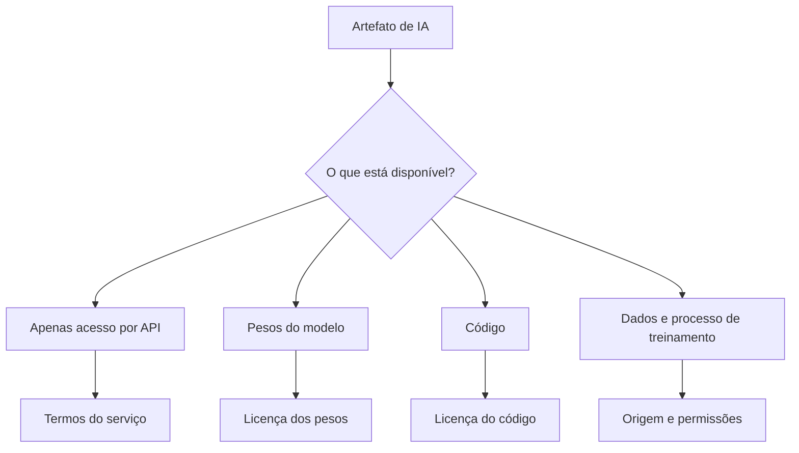
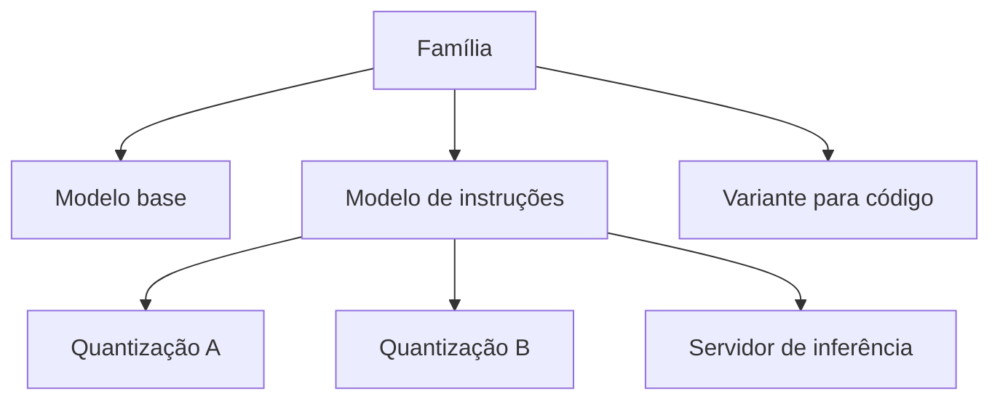
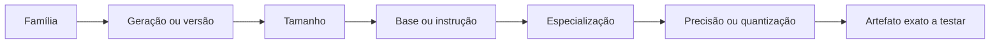
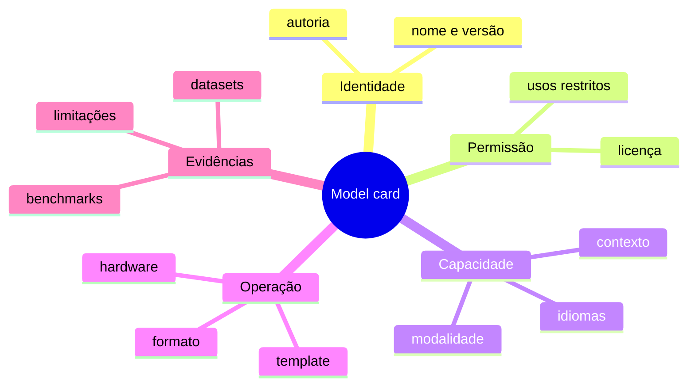
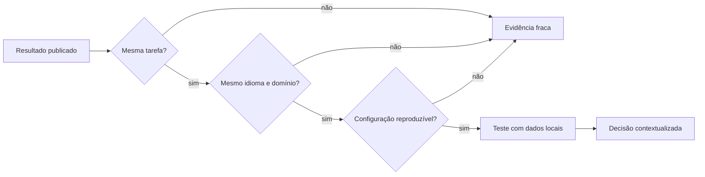
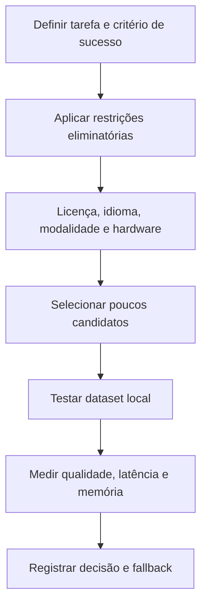
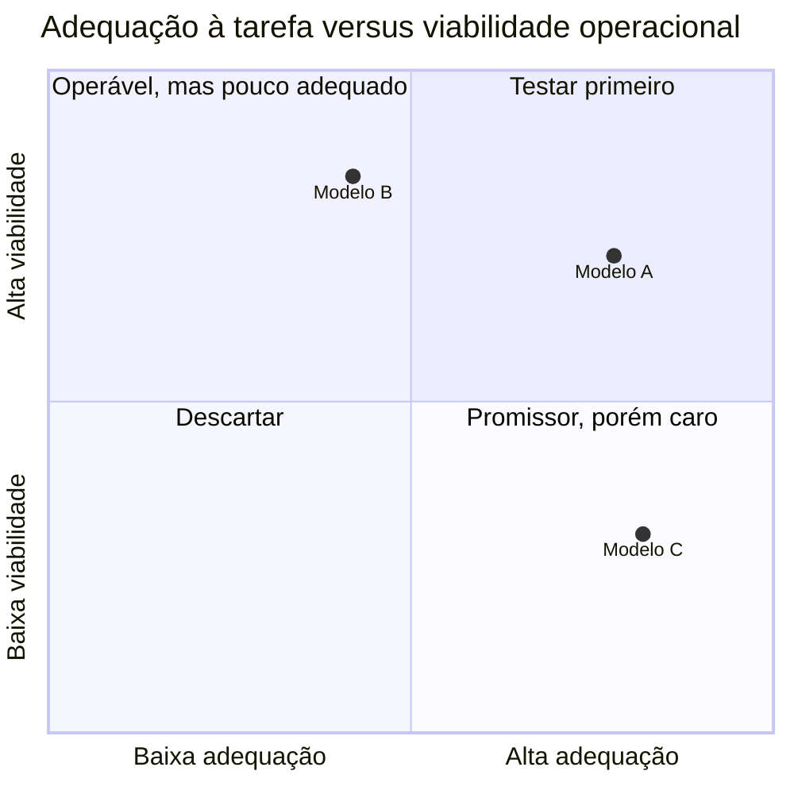

# Encontro 04 — Modelos abertos, famílias, licenças e model cards

## Tema

Ecossistema de modelos de linguagem abertos e leitura crítica da documentação
necessária para seleção e uso responsável.

## Objetivos

- Diferenciar pesos abertos, código aberto, API pública e modelo proprietário.
- Reconhecer famílias, variantes e modelos especializados.
- Ler model cards e identificar evidências relevantes.
- Analisar licenças, limitações e adequação ao idioma e à tarefa.
- Produzir uma comparação técnica sem depender de rankings isolados.

## Roteiro dos 90 minutos

| Etapa | Tempo | Estratégia |
|---|---:|---|
| retomada | 10 min | conexão entre pesos, inferência e requisitos |
| exposição visual | 20 min | graus de abertura, famílias e variantes |
| leitura guiada | 15 min | anatomia de um model card |
| análise crítica | 15 min | licenças, benchmarks e lacunas |
| oficina comparativa | 25 min | aplicação da ficha a dois candidatos |
| síntese | 5 min | decisão provisória baseada em evidências |

## Visão geral

Escolher um modelo porque ele é popular ou ocupa boa posição em um ranking não
é suficiente. A seleção precisa considerar tarefa, idioma, licença, memória,
latência, formato de distribuição, qualidade, riscos e manutenção.

Os catálogos mudam rapidamente. Por isso, o objetivo deste encontro não é
decorar uma lista de modelos. É aprender um método de leitura e decisão que
continue válido quando novas versões forem publicadas.

## Pergunta central

O que significa dizer que um modelo é “aberto” e quais evidências permitem
decidir se ele pode ser usado em uma aplicação real?

## Termos que não devem ser confundidos



A abertura não é binária: cada artefato possui disponibilidade, licença e
obrigações próprias.

### Modelo proprietário acessado por API

O usuário envia entradas a um serviço e recebe saídas, mas normalmente não
obtém os pesos nem executa o modelo em infraestrutura própria.

### Pesos abertos

Os arquivos com parâmetros treinados podem ser obtidos, sujeitos à licença. A
disponibilidade dos pesos não garante que dados, código de treinamento e todo o
processo sejam abertos.

Os **pesos** são os valores numéricos dos parâmetros aprendidos pelo modelo.
Quando um modelo é carregado para inferência, esses valores são colocados na
memória e usados nos cálculos que produzem a saída.

### Código aberto

O código é distribuído sob licença que permite uso, estudo, modificação e
redistribuição conforme suas condições. É necessário verificar separadamente a
licença do código, dos pesos e dos dados.

### Open source e open weights

Na prática, muitos modelos chamados informalmente de “open source” oferecem
pesos sob licenças próprias com restrições. A equipe deve registrar a licença
exata em vez de assumir liberdade irrestrita.

| Elemento | Pergunta de verificação |
|---|---|
| código | está disponível? sob qual licença? |
| pesos | podem ser baixados, modificados e redistribuídos? |
| dados | origem, permissão e composição são documentadas? |
| uso | há restrição comercial, de escala ou de finalidade? |
| derivados | podem ser distribuídos? quais avisos são obrigatórios? |

## Modelos fundacionais e especializados

### Modelo fundacional

É treinado de forma ampla e pode servir de base para diferentes tarefas. Pode
ser adaptado por prompting, fine-tuning ou outras técnicas.

**Fine-tuning** é um treinamento adicional realizado sobre um modelo já
treinado para adaptar seu comportamento a uma tarefa, domínio ou conjunto de
exemplos. Ele altera os parâmetros do modelo, diferentemente do prompting, que
apenas fornece instruções e contexto durante a inferência.

### Modelo de propósito geral

Busca atender tarefas variadas: conversa, resumo, extração, explicação e código.
Essa amplitude não garante que seja o melhor em um domínio específico.

### Modelo especializado

É otimizado ou ajustado para um domínio ou tarefa, como código, embeddings,
saúde ou um idioma. A especialização deve ser validada para o caso real.

### Modelo base e modelo instruction-tuned

- modelo base prevê continuações, sem necessariamente seguir pedidos de conversa;
- modelo ajustado a instruções foi adaptado para responder a comandos;
- uma aplicação de chat geralmente prefere uma variante preparada para instruções.

### Modelos multimodais

Processam mais de uma modalidade. É necessário confirmar exatamente quais
entradas e saídas a variante suporta; o nome de uma família não garante que
todas as versões sejam multimodais.

## Famílias e variantes

Uma família pode conter versões diferentes em:

- quantidade de parâmetros;
- arquitetura ou geração;
- tamanho da janela de contexto;
- variante base ou ajustada;
- idioma ou domínio;
- precisão numérica e quantização;
- suporte a ferramentas ou saída estruturada.

**Quantização** é a representação dos pesos com menor precisão numérica para
reduzir requisitos de memória e, em alguns ambientes, acelerar a execução. Ela
pode afetar a qualidade e será estudada de forma aplicada no Encontro 05.

O nome completo da variante precisa ser registrado. Comparar apenas o nome da
família pode levar a conclusões erradas.



### Mapa para nomear uma variante sem ambiguidade



## O que é um model card?

Model card é um documento que descreve características, usos, avaliação e
limitações de um modelo. A qualidade varia entre projetos, portanto a ausência
de uma informação também é um dado relevante.



### Informações essenciais

1. nome, versão e autoria;
2. licença dos pesos;
3. arquitetura e tamanho;
4. contexto suportado;
5. idiomas e domínios;
6. formato e requisitos de execução;
7. usos pretendidos e usos desaconselhados;
8. datasets ou processo de treinamento, quando informados;
9. avaliações e benchmarks;
10. riscos, vieses e limitações;
11. template de prompt esperado;
12. histórico de atualização.

## Como ler benchmarks criticamente

Um número isolado não responde se o modelo funcionará no projeto.



Pergunte:

- a tarefa medida é parecida com a aplicação?
- o idioma e o domínio são os mesmos?
- a configuração de inferência foi equivalente?
- houve contaminação entre treinamento e teste?
- o resultado foi reproduzido independentemente?
- a métrica mede correção, preferência ou apenas estilo?
- qual foi o custo de memória e latência?

### Benchmark não substitui avaliação local

O modelo escolhido deve ser testado com exemplos representativos do sistema.
Uma central de chamados em português possui vocabulário, categorias e erros
diferentes de um benchmark geral em inglês.

## Licenças: perguntas práticas

Antes de incorporar um modelo, registre:

- o uso educacional é permitido?
- o uso comercial é permitido?
- existe limite de usuários ou porte da organização?
- redistribuição dos pesos ou derivados é permitida?
- atribuição ou aviso é obrigatório?
- existem restrições de uso aceitável?
- a licença é compatível com o modo de distribuição do projeto?

Esta verificação não substitui análise jurídica. Ela evita que a equipe trate a
licença como detalhe posterior.

## Privacidade e execução local

Executar localmente pode evitar o envio do prompt a um provedor externo e
oferecer controle sobre versão e disponibilidade. Porém, ainda é preciso:

- proteger o endpoint do servidor de inferência;
- limitar logs e retenção;
- controlar quem acessa os dados;
- atualizar imagens e dependências;
- verificar a licença;
- avaliar respostas, vieses e ataques.

## Processo de seleção em camadas



### Matriz visual de decisão



As posições são ilustrativas. A turma deve substituí-las por evidências e
critérios explícitos, nunca por preferência pessoal.

### Restrições eliminatórias

Um modelo pode ser descartado antes de benchmarks se:

- a licença impedir o uso pretendido;
- não executar no hardware disponível;
- não suportar o idioma ou a modalidade necessária;
- não aceitar o contexto mínimo;
- exigir envio de dados incompatível com a política de privacidade.

## Oficina: leitura comparativa de model cards

Em grupos de 3 ou 4 integrantes, analise duas variantes de modelos disponíveis
em catálogo público ou no ambiente local.

### Ficha de análise

| Critério | Modelo A | Modelo B | Evidência/fonte |
|---|---|---|---|
| nome e versão | | | |
| variante base/instrução | | | |
| licença | | | |
| parâmetros/tamanho | | | |
| contexto | | | |
| idiomas | | | |
| requisitos | | | |
| usos recomendados | | | |
| limitações | | | |
| avaliação relevante | | | |
| informação ausente | | | |

### Cenário de decisão

Considere uma aplicação acadêmica em português, executada localmente, que
classifica solicitações em dez categorias e deve responder em JSON. Com base
apenas em evidências documentadas:

1. qual modelo seria testado primeiro?
2. qual requisito eliminou ou enfraqueceu o outro candidato?
3. que informação ainda precisa ser confirmada por experimento?
4. qual risco precisa ser registrado?

### Produto

Um registro de decisão curto:

```text
Contexto:
Critérios obrigatórios:
Candidatos:
Evidências:
Decisão provisória:
Riscos e lacunas:
Próximo experimento:
```

## Erros comuns

### Escolher somente pelo número de parâmetros

Mais parâmetros podem aumentar requisitos sem garantir melhor resultado na
tarefa específica.

### Confiar apenas no nome da família

Variantes possuem finalidade, licença, contexto e quantização diferentes.

### Ignorar o template de conversa

Um formato incompatível pode degradar respostas mesmo quando o modelo é bom.

### Tratar benchmark como verdade universal

Resultados dependem de dataset, métrica, configuração e domínio.

### Confundir disponibilidade com permissão

Ser possível baixar um arquivo não significa que qualquer uso ou redistribuição
esteja autorizado.

## Questões para revisão

1. Qual a diferença entre pesos abertos e código aberto?
2. Por que código, pesos e dados podem possuir licenças distintas?
3. O que diferencia um modelo base de um modelo ajustado a instruções?
4. Quais informações mínimas devem constar em uma comparação?
5. Por que avaliação local é necessária mesmo com bons benchmarks?
6. Quais riscos permanecem na execução local?

## Checklist de aprendizagem

- [ ] usar terminologia precisa ao falar de abertura;
- [ ] localizar licença e versão de uma variante;
- [ ] extrair informações essenciais de um model card;
- [ ] avaliar criticamente um benchmark;
- [ ] aplicar restrições antes de comparar qualidade;
- [ ] produzir uma decisão provisória baseada em evidências.

## Síntese do encontro

Selecionar um modelo é uma decisão de engenharia e governança. Model cards,
licenças e avaliações oferecem evidências, mas não dispensam experimentos com o
domínio real. No próximo encontro, essa análise será conectada aos requisitos de
hardware, quantização e desempenho.

## Preparação para o próximo encontro

Registrar CPU, memória RAM e GPU — quando disponível — de um equipamento que
poderia executar o ambiente da disciplina. Não publicar identificadores,
credenciais ou outras informações sensíveis.
