# Encontro 04 — Contexto, geração, limitações e seleção de modelos

## Tema

Janela de contexto, parâmetros de geração, variabilidade e limitações dos LLMs,
articulados à seleção responsável de modelos, licenças e model cards.

## Objetivos

- Explicar o que ocupa a janela de contexto e como administrar seu orçamento.
- Relacionar temperatura, top-k e top-p à variabilidade das respostas.
- Identificar alucinação, vieses e outras limitações relevantes.
- Diferenciar pesos abertos, código aberto, API pública e modelo proprietário.
- Reconhecer famílias, variantes e modelos especializados.
- Ler model cards e identificar evidências relevantes.
- Analisar licenças, limitações e adequação ao idioma e à tarefa.
- Produzir uma comparação técnica sem depender de rankings isolados.

## Visão geral

O resultado da tokenização estudada no Encontro 03 é apenas uma parte do
comportamento operacional. O contexto disponível, os parâmetros de geração e as
limitações do modelo também influenciam qualidade, latência e segurança.

Escolher um modelo porque ele é popular ou ocupa boa posição em um ranking não
é suficiente. A seleção precisa considerar tarefa, idioma, licença, memória,
latência, formato de distribuição, qualidade, riscos e manutenção.


## Contexto, geração e limitações

### Por que tokens importam?

- definem o tamanho efetivo da entrada;
- ocupam espaço na janela de contexto;
- influenciam memória, latência e custo computacional;
- limitam o tamanho máximo da resposta;
- afetam estratégias de chunking e RAG.

### Realizando uma estimativa

Compare três entradas: um parágrafo em português, um trecho de código e uma
tabela JSON. Antes de usar um tokenizador, estime qual entrada utilizará mais
tokens. Depois, confronte as estimativas com uma ferramenta compatível com o
modelo escolhido.

## Janela de contexto

A janela de contexto é a quantidade máxima de tokens que o modelo consegue
considerar em uma inferência. Ela pode incluir:

- instrução de sistema;
- mensagem atual do usuário;
- histórico da conversa;
- exemplos few-shot;
- documentos recuperados;
- descrições e resultados de ferramentas;
- tokens da resposta, conforme a API e o modelo.

A **instrução de sistema**, frequentemente chamada de `system prompt`, define o
papel e as regras gerais que devem orientar o modelo. **Exemplos few-shot** são
pares de entrada e saída incluídos no contexto para demonstrar o comportamento
esperado antes da solicitação real.

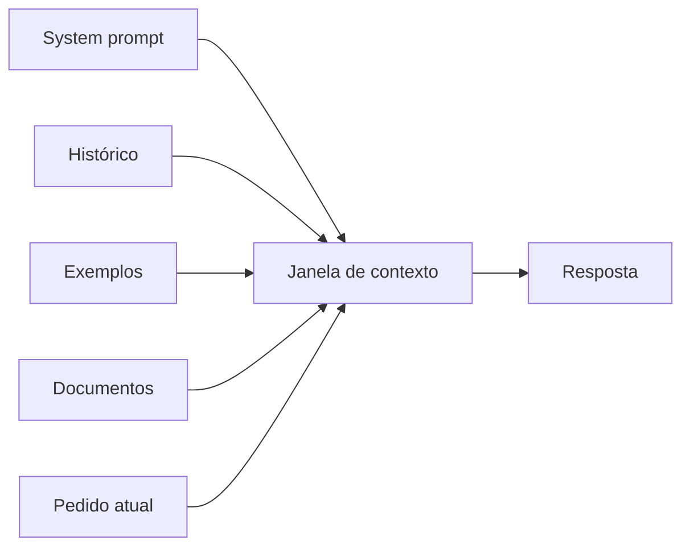

### Janela maior resolve tudo?

Não. Um contexto maior pode elevar consumo de memória e latência e inserir
conteúdo irrelevante ou conflitante. A aplicação deve selecionar o que realmente
ajuda a tarefa.

### Exemplo de orçamento

Suponha que uma aplicação estabeleça um orçamento conceitual de contexto:

| Parte | Reserva |
|---|---:|
| instruções e contrato | 15% |
| pergunta e histórico recente | 20% |
| documentos recuperados | 50% |
| margem para resposta | 15% |

Os percentuais não são universais. Eles tornam explícita a necessidade de
controlar o contexto em vez de enviar todo o conteúdo disponível.

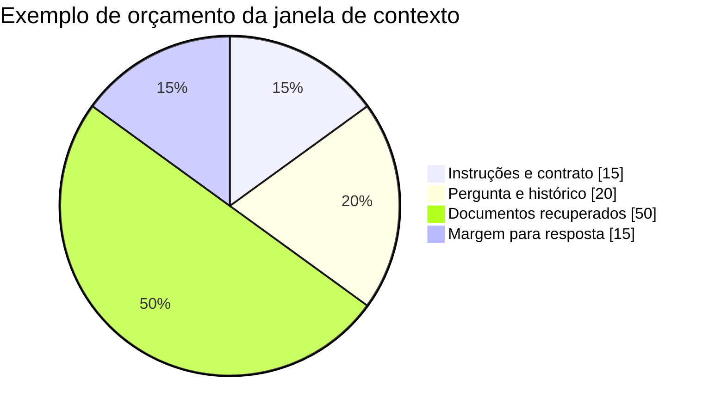

## Como o próximo token é escolhido

O modelo produz probabilidades para possíveis continuações. A estratégia de
decodificação decide como selecionar o próximo token.

### Temperatura

Controla, de modo geral, a dispersão da distribuição:

- valores menores tendem a favorecer saídas mais previsíveis;
- valores maiores tendem a aumentar diversidade e risco de variação;
- temperatura baixa não garante verdade nem determinismo absoluto.

### Top-k e top-p

- `top-k` restringe a seleção a um número de candidatos mais prováveis;
- `top-p` restringe a um conjunto cuja probabilidade acumulada atinge um limite;
- a disponibilidade e a interpretação exata dependem do servidor e do modelo.

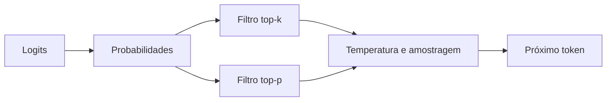

## Determinismo e variabilidade

Software tradicional costuma produzir a mesma saída para a mesma entrada e o
mesmo estado. Sistemas generativos podem variar.

```ts
function calcularMedia(a: number, b: number): number {
  return (a + b) / 2;
}
```

Para a mesma entrada, a função possui resultado definido. Já o pedido “explique
este conceito de modo simples” admite muitas respostas aceitáveis.

Isso afeta testes: nem sempre se deve comparar a resposta inteira com uma string
fixa. Pode ser melhor validar schema, presença de fatos, fontes, critérios de uma
rubrica ou métricas de qualidade.

Um **schema** é uma descrição formal da estrutura esperada para os dados. Em uma
resposta JSON, pode definir campos obrigatórios, tipos e valores permitidos,
possibilitando que o backend rejeite uma saída incompatível.

## Alucinação

Alucinação é a produção de conteúdo incorreto, não sustentado ou inventado, que
pode ser apresentado com fluência e confiança aparentes.

### Por que acontece?

O objetivo básico do modelo é gerar uma continuação plausível, não consultar
automaticamente a verdade. Contexto insuficiente, pergunta ambígua e padrões
aprendidos podem resultar em uma resposta plausível, porém falsa.

### Estratégias de redução

- fornecer contexto relevante e delimitado;
- exigir indicação das fontes utilizadas;
- permitir que o modelo declare insuficiência de informação;
- usar saída estruturada e validação;
- consultar ferramentas ou base de conhecimento;
- verificar fatos críticos com fonte independente;
- manter revisão humana em decisões importantes.

Nenhuma estratégia elimina completamente o problema.

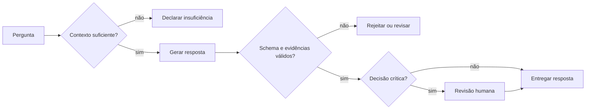

## Outras limitações

### Conhecimento desatualizado ou ausente

O modelo pode não conhecer eventos recentes, dados privados ou regras locais.

### Sensibilidade à formulação

Pequenas alterações na instrução ou ordem do contexto podem mudar a resposta.

### Viés

Dados e escolhas do desenvolvimento podem reproduzir ou ampliar vieses.

### Falta de causalidade e compreensão garantida

Uma explicação coerente não prova que o modelo raciocinou como uma pessoa ou
compreendeu o domínio da maneira esperada.

### Prompt injection

Conteúdo recebido como dado pode tentar alterar instruções ou induzir o sistema
a revelar informação e usar ferramentas indevidamente.

## Modelos multimodais

Modelos multimodais recebem ou produzem mais de um tipo de informação, como
texto, imagem e áudio. A integração exige considerar:

- formatos e tamanho dos arquivos;
- custo de processamento;
- acessibilidade;
- dados pessoais presentes em imagem ou voz;
- validação específica para cada modalidade.

## Experimento guiado: variabilidade e contexto

Este experimento pode ser realizado diretamente em um chatbot, sem instalar ou
configurar um modelo local. Será utilizado o **Google AI Studio**, que oferece
uma interface de chat no navegador e um painel com informações do modelo e
configurações da execução.

Um chatbot de uso geral também permite observar repetição e efeito do contexto,
mas normalmente não mostra a versão exata nem permite controlar parâmetros.
Por isso, o Google AI Studio é a opção recomendada para manter o experimento
reproduzível.

### Objetivo da atividade

Observar que a saída de um LLM pode variar mesmo quando o pedido é repetido,
separar estabilidade de correção e verificar como a presença de contexto altera
a resposta. Ao final, o estudante deverá conseguir justificar por que uma
aplicação não pode validar qualidade comparando apenas uma resposta com uma
string fixa.

### Antes de começar

1. Acesse [Google AI Studio](https://aistudio.google.com/) e entre com sua conta
   Google.
2. Abra o **Playground** e crie um novo **Chat prompt**.
3. No seletor de modelo, escolha `gemini-2.5-flash`.
4. Abra **Run settings** e desative ferramentas como busca, grounding e execução
   de código. Elas poderiam acrescentar fontes externas e alterar o experimento.
5. Não preencha **System instructions** neste momento.
6. Registre na tabela: modelo, data, horário e configurações exibidas.

O modelo `gemini-2.5-flash` é indicado porque permite realizar o experimento no
navegador e ainda oferece controles de geração. Modelos Gemini 3.6 e gerações
posteriores podem ignorar ou descontinuar `temperature`, `top-p` e `top-k`; se o
controle não estiver disponível para o modelo escolhido, não invente um valor e
registre a limitação.

### Tabela de registro

Preencha uma linha imediatamente após cada execução.

| Execução | Parte | Modelo | Configuração | Contexto fornecido | Resultado observado |
|---:|:---:|---|---|---|---|
| 1 | A | | padrão | nenhum | |
| 2 | A | | padrão | nenhum | |
| 3 | A | | padrão | nenhum | |
| 4 | B | | temperatura baixa | nenhum | |
| 5 | B | | temperatura padrão | nenhum | |
| 6 | C | | padrão | nenhum | |
| 7 | C | | padrão | Política Zeta | |

Na coluna **Resultado observado**, não copie obrigatoriamente toda a resposta.
Registre tamanho aproximado, argumentos principais, afirmações diferentes,
eventual recusa e qualquer informação aparentemente inventada.

### Parte A — repetição em conversas independentes

O objetivo desta parte é observar variabilidade sem permitir que uma resposta
anterior influencie a seguinte.

1. Crie um chat novo e confirme que não há histórico nem instrução de sistema.
2. Mantenha as configurações padrão do modelo.
3. Envie exatamente o texto abaixo:

```text
Explique em até quatro frases por que uma aplicação deve validar a saída de um
modelo de linguagem.
```

4. Registre a execução 1 na tabela.
5. Crie outro chat novo. Não use **regenerar resposta**, pois essa ação pode
   preservar estado ou metadados da conversa.
6. Envie o mesmo texto, sem alterar espaços, pontuação ou capitalização.
7. Registre a execução 2.
8. Repita o procedimento em um terceiro chat e registre a execução 3.

Compare as três respostas usando estes critérios:

- argumentos apresentados;
- palavras ou exemplos escolhidos;
- quantidade de frases;
- atendimento ao limite solicitado;
- presença de afirmações que exigiriam verificação.

Uma resposta diferente não é necessariamente pior. Da mesma forma, três
respostas parecidas não demonstram que o conteúdo esteja correto.

### Parte B — mudança controlada de temperatura

Esta parte deve ser realizada somente se **Run settings** apresentar o controle
de temperatura para `gemini-2.5-flash`.

1. Crie um chat novo.
2. Abra **Run settings** e anote o valor padrão exibido para temperatura.
3. Altere somente a temperatura para um valor baixo aceito pela interface, como
   `0.2`. Não modifique modelo, top-p, top-k, ferramentas ou instruções.
4. Envie o mesmo prompt da Parte A e registre a execução 4.
5. Crie outro chat novo.
6. Restaure a temperatura ao valor padrão anotado no passo 2.
7. Envie novamente o mesmo prompt e registre a execução 5.
8. Compare previsibilidade, vocabulário, estrutura e atendimento ao pedido.

O experimento não deve concluir que temperatura baixa produz verdade. Ela pode
reduzir a diversidade da seleção de tokens, mas uma resposta estável ainda pode
estar errada. A documentação atual recomenda manter os valores padrão em
modelos Gemini 3.x; por isso, esses modelos não devem ser usados para simular
esta comparação caso o parâmetro seja ignorado.

### Parte C — ausência e fornecimento de contexto

Nesta parte, o estudante compara uma pergunta sem evidência com outra apoiada em
um pequeno documento fictício.

#### Execução sem contexto

1. Crie um chat novo, sem instrução de sistema.
2. Restaure todas as configurações ao padrão.
3. Envie:

```text
Segundo a Política Acadêmica Zeta, em quantos dias um estudante pode solicitar
a revisão de uma atividade e qual formulário deve utilizar?
```

4. Registre a execução 6 e classifique o comportamento:

   - declarou não possuir a política;
   - pediu que o documento fosse fornecido;
   - respondeu de forma genérica;
   - inventou prazo, formulário ou fonte.

#### Execução com contexto delimitado

1. Crie outro chat novo.
2. Envie exatamente o conteúdo abaixo:

```text
Responda somente com base no trecho delimitado. Se a resposta não estiver no
trecho, diga "informação não disponível no trecho".

<politica_zeta>
Art. 12. O estudante poderá solicitar revisão de atividade em até cinco dias
úteis após a publicação do resultado. A solicitação deverá ser registrada pelo
Formulário Z-2 no sistema acadêmico.
</politica_zeta>

Pergunta: em quantos dias o estudante pode solicitar a revisão e qual formulário
deve utilizar?
```

3. Registre a execução 7.
4. Marque na resposta quais palavras estão diretamente apoiadas pelo trecho.
5. Verifique se o modelo acrescentou regras que não foram fornecidas.

### Análise individual

Responda por escrito:

1. O que permaneceu igual e o que variou nas três repetições?
2. Alguma resposta desrespeitou o limite de quatro frases?
3. Temperatura baixa tornou a resposta correta ou apenas menos variável?
4. Como o chatbot respondeu quando a Política Zeta não foi fornecida?
5. Quais afirmações da execução 7 podem ser ligadas diretamente ao trecho?
6. Que validação poderia ser implementada pelo backend em cada parte?
7. Qual informação precisa ser registrada para outra pessoa repetir o teste?

### Produto da atividade

Entregue a tabela preenchida, as respostas às sete questões e evidências das
configurações utilizadas. Capturas de tela são opcionais; quando usadas, devem
ocultar conta, chave, e-mail e outros dados pessoais.

### Se o Google AI Studio não estiver disponível

As Partes A e C podem ser executadas em outro chatbot acessível. Nesse caso:

- use sempre chats novos;
- desative busca na Web e ferramentas, quando possível;
- registre o nome comercial do chatbot e escreva “modelo não informado” quando
  a interface não apresentar o identificador;
- não realize a Parte B se a temperatura não estiver disponível;
- registre essa ausência como limitação, e não como erro do estudante.

Fontes de apoio: [guia oficial do Google AI Studio](https://ai.google.dev/gemini-api/docs/ai-studio-quickstart),
[documentação do Gemini 2.5 Flash](https://ai.google.dev/gemini-api/docs/models/gemini-2.5-flash)
e [parâmetros de geração](https://ai.google.dev/api/generate-content).


## Da compreensão do comportamento à seleção

Os conceitos anteriores oferecem critérios técnicos para comparar candidatos.
A segunda parte do encontro amplia a análise para disponibilidade dos artefatos,
licença, finalidade, evidências de avaliação e requisitos operacionais.

## Pergunta central

O que significa dizer que um modelo é “aberto” e quais evidências permitem
decidir se ele pode ser usado em uma aplicação real?

## Termos que não devem ser confundidos

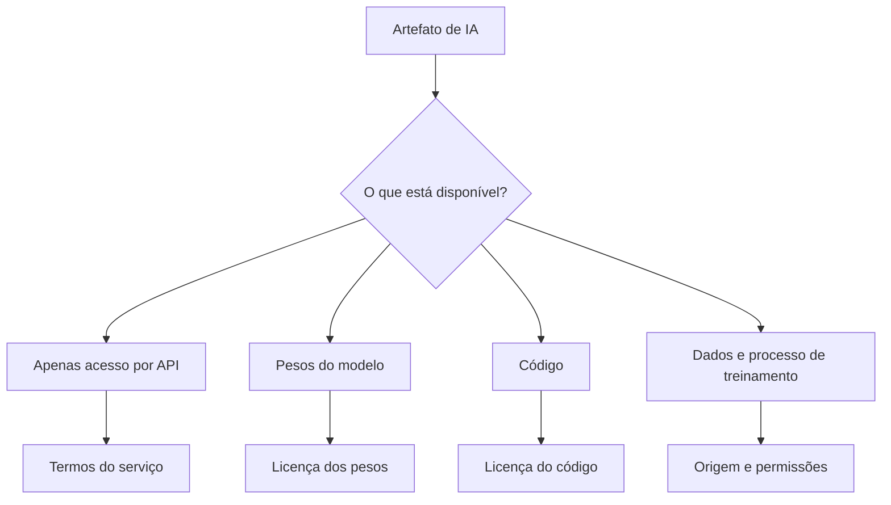

A abertura não é binária: cada artefato possui disponibilidade, licença e
obrigações próprias.

### Modelo proprietário acessado por API

O usuário envia entradas a um serviço e recebe saídas, mas normalmente não
obtém os pesos nem executa o modelo em infraestrutura própria.

### Pesos abertos

Os arquivos com parâmetros treinados podem ser obtidos, sujeitos à licença. A
disponibilidade dos pesos não garante que dados, código de treinamento e todo o
processo sejam abertos.

Os **pesos** são os valores numéricos dos parâmetros aprendidos pelo modelo.
Quando um modelo é carregado para inferência, esses valores são colocados na
memória e usados nos cálculos que produzem a saída.

### Código aberto

O código é distribuído sob licença que permite uso, estudo, modificação e
redistribuição conforme suas condições. É necessário verificar separadamente a
licença do código, dos pesos e dos dados.

### Open source e open weights

Na prática, muitos modelos chamados informalmente de “open source” oferecem
pesos sob licenças próprias com restrições. A equipe deve registrar a licença
exata em vez de assumir liberdade irrestrita.

| Elemento | Pergunta de verificação |
|---|---|
| código | está disponível? sob qual licença? |
| pesos | podem ser baixados, modificados e redistribuídos? |
| dados | origem, permissão e composição são documentadas? |
| uso | há restrição comercial, de escala ou de finalidade? |
| derivados | podem ser distribuídos? quais avisos são obrigatórios? |

## Modelos fundacionais e especializados

### Modelo fundacional

É treinado de forma ampla e pode servir de base para diferentes tarefas. Pode
ser adaptado por prompting, fine-tuning ou outras técnicas.

**Fine-tuning** é um treinamento adicional realizado sobre um modelo já
treinado para adaptar seu comportamento a uma tarefa, domínio ou conjunto de
exemplos. Ele altera os parâmetros do modelo, diferentemente do prompting, que
apenas fornece instruções e contexto durante a inferência.

### Modelo de propósito geral

Busca atender tarefas variadas: conversa, resumo, extração, explicação e código.
Essa amplitude não garante que seja o melhor em um domínio específico.

### Modelo especializado

É otimizado ou ajustado para um domínio ou tarefa, como código, embeddings,
saúde ou um idioma. A especialização deve ser validada para o caso real.

### Modelo base e modelo instruction-tuned

- modelo base prevê continuações, sem necessariamente seguir pedidos de conversa;
- modelo ajustado a instruções foi adaptado para responder a comandos;
- uma aplicação de chat geralmente prefere uma variante preparada para instruções.

### Variações multimodais nas famílias

Processam mais de uma modalidade. É necessário confirmar exatamente quais
entradas e saídas a variante suporta; o nome de uma família não garante que
todas as versões sejam multimodais.

## Famílias e variantes

Uma família pode conter versões diferentes em:

- quantidade de parâmetros;
- arquitetura ou geração;
- tamanho da janela de contexto;
- variante base ou ajustada;
- idioma ou domínio;
- precisão numérica e quantização;
- suporte a ferramentas ou saída estruturada.

**Quantização** é a representação dos pesos com menor precisão numérica para
reduzir requisitos de memória e, em alguns ambientes, acelerar a execução. Ela
pode afetar a qualidade e será estudada de forma aplicada no Encontro 05.

O nome completo da variante precisa ser registrado. Comparar apenas o nome da
família pode levar a conclusões erradas.

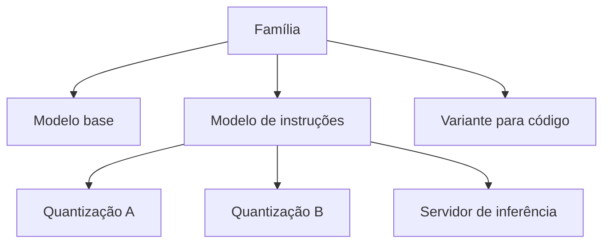

### Mapa para nomear uma variante sem ambiguidade

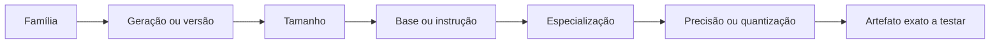

## O que é um model card?

Model card é um documento que descreve características, usos, avaliação e
limitações de um modelo. A qualidade varia entre projetos, portanto a ausência
de uma informação também é um dado relevante.

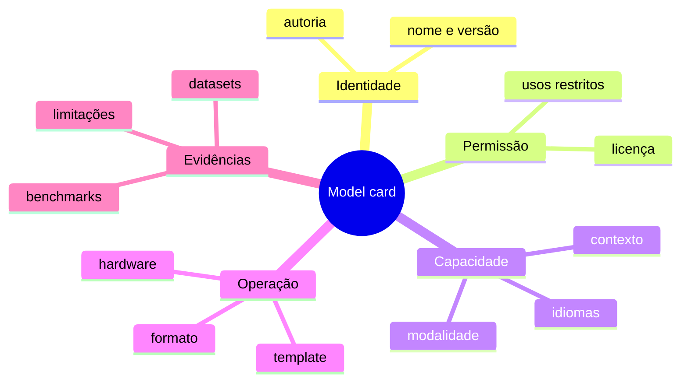

### Informações essenciais

1. nome, versão e autoria;
2. licença dos pesos;
3. arquitetura e tamanho;
4. contexto suportado;
5. idiomas e domínios;
6. formato e requisitos de execução;
7. usos pretendidos e usos desaconselhados;
8. datasets ou processo de treinamento, quando informados;
9. avaliações e benchmarks;
10. riscos, vieses e limitações;
11. template de prompt esperado;
12. histórico de atualização.

## Como ler benchmarks criticamente

Um número isolado não responde se o modelo funcionará no projeto.

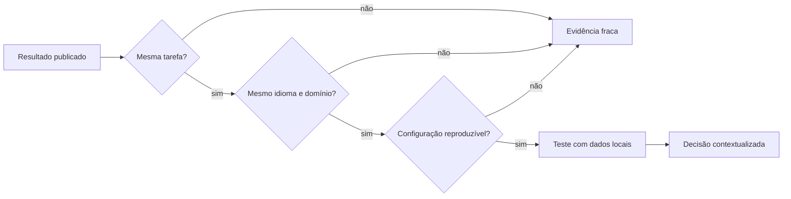

Pergunte:

- a tarefa medida é parecida com a aplicação?
- o idioma e o domínio são os mesmos?
- a configuração de inferência foi equivalente?
- houve contaminação entre treinamento e teste?
- o resultado foi reproduzido independentemente?
- a métrica mede correção, preferência ou apenas estilo?
- qual foi o custo de memória e latência?

### Benchmark não substitui avaliação local

O modelo escolhido deve ser testado com exemplos representativos do sistema.
Uma central de chamados em português possui vocabulário, categorias e erros
diferentes de um benchmark geral em inglês.

## Licenças: perguntas práticas

Antes de incorporar um modelo, registre:

- o uso educacional é permitido?
- o uso comercial é permitido?
- existe limite de usuários ou porte da organização?
- redistribuição dos pesos ou derivados é permitida?
- atribuição ou aviso é obrigatório?
- existem restrições de uso aceitável?
- a licença é compatível com o modo de distribuição do projeto?

Esta verificação não substitui análise jurídica. Ela evita que a equipe trate a
licença como detalhe posterior.

## Privacidade e execução local

Executar localmente pode evitar o envio do prompt a um provedor externo e
oferecer controle sobre versão e disponibilidade. Porém, ainda é preciso:

- proteger o endpoint do servidor de inferência;
- limitar logs e retenção;
- controlar quem acessa os dados;
- atualizar imagens e dependências;
- verificar a licença;
- avaliar respostas, vieses e ataques.

## Processo de seleção em camadas

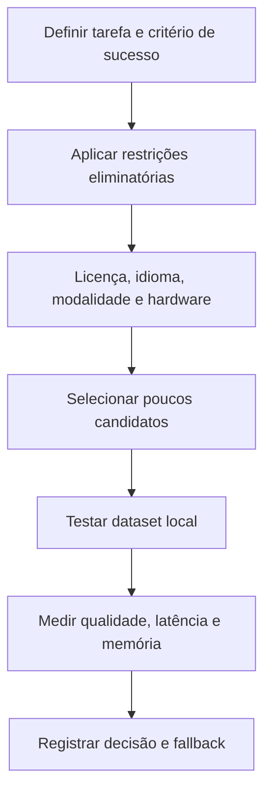

### Matriz visual de decisão

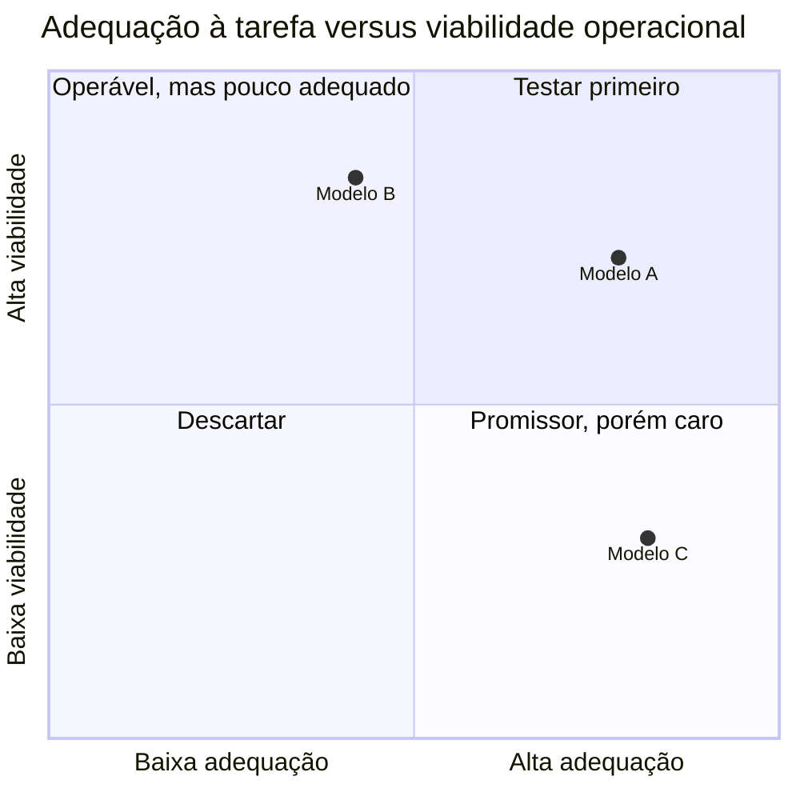

As posições são ilustrativas. A turma deve substituí-las por evidências e
critérios explícitos, nunca por preferência pessoal.

### Restrições eliminatórias

Um modelo pode ser descartado antes de benchmarks se:

- a licença impedir o uso pretendido;
- não executar no hardware disponível;
- não suportar o idioma ou a modalidade necessária;
- não aceitar o contexto mínimo;
- exigir envio de dados incompatível com a política de privacidade.

## Oficina: leitura comparativa de model cards

Em grupos de 3 ou 4 integrantes, analise duas variantes de modelos disponíveis
em catálogo público ou no ambiente local.

### Ficha de análise

| Critério | Modelo A | Modelo B | Evidência/fonte |
|---|---|---|---|
| nome e versão | | | |
| variante base/instrução | | | |
| licença | | | |
| parâmetros/tamanho | | | |
| contexto | | | |
| idiomas | | | |
| requisitos | | | |
| usos recomendados | | | |
| limitações | | | |
| avaliação relevante | | | |
| informação ausente | | | |

### Cenário de decisão

Considere uma aplicação acadêmica em português, executada localmente, que
classifica solicitações em dez categorias e deve responder em JSON. Com base
apenas em evidências documentadas:

1. qual modelo seria testado primeiro?
2. qual requisito eliminou ou enfraqueceu o outro candidato?
3. que informação ainda precisa ser confirmada por experimento?
4. qual risco precisa ser registrado?

### Produto

Um registro de decisão curto:

```text
Contexto:
Critérios obrigatórios:
Candidatos:
Evidências:
Decisão provisória:
Riscos e lacunas:
Próximo experimento:
```

## Erros comuns

### Escolher somente pelo número de parâmetros

Mais parâmetros podem aumentar requisitos sem garantir melhor resultado na
tarefa específica.

### Confiar apenas no nome da família

Variantes possuem finalidade, licença, contexto e quantização diferentes.

### Ignorar o template de conversa

Um formato incompatível pode degradar respostas mesmo quando o modelo é bom.

### Tratar benchmark como verdade universal

Resultados dependem de dataset, métrica, configuração e domínio.

### Confundir disponibilidade com permissão

Ser possível baixar um arquivo não significa que qualquer uso ou redistribuição
esteja autorizado.

## Questões para revisão

1. O que disputa espaço na janela de contexto?
2. Por que temperatura menor não garante uma resposta verdadeira?
3. Como alucinação e variabilidade afetam a validação da aplicação?
4. Qual a diferença entre pesos abertos e código aberto?
5. O que diferencia um modelo base de um modelo ajustado a instruções?
6. Por que a avaliação local continua necessária mesmo com bons benchmarks?
7. Quais evidências mínimas devem sustentar a seleção de um modelo?

## Checklist de aprendizagem

- [ ] explicar o orçamento de uma janela de contexto;
- [ ] relacionar parâmetros de geração à variabilidade;
- [ ] identificar alucinação e outras limitações;
- [ ] usar terminologia precisa ao falar de abertura;
- [ ] localizar licença e versão de uma variante;
- [ ] extrair informações essenciais de um model card;
- [ ] avaliar criticamente um benchmark;
- [ ] aplicar restrições antes de comparar qualidade;
- [ ] produzir uma decisão provisória baseada em evidências.

## Síntese do encontro

Compreender contexto, geração e limitações permite transformar características
do modelo em critérios de seleção. Model cards, licenças e avaliações oferecem
evidências, mas não dispensam experimentos com o domínio real. No próximo
encontro, essa análise será conectada aos requisitos de hardware, quantização e
desempenho.

## Preparação para o próximo encontro

Registrar CPU, memória RAM e GPU — quando disponível — de um equipamento que
poderia executar o ambiente da disciplina. Não publicar identificadores,
credenciais ou outras informações sensíveis.
