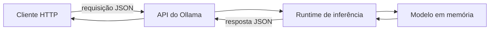
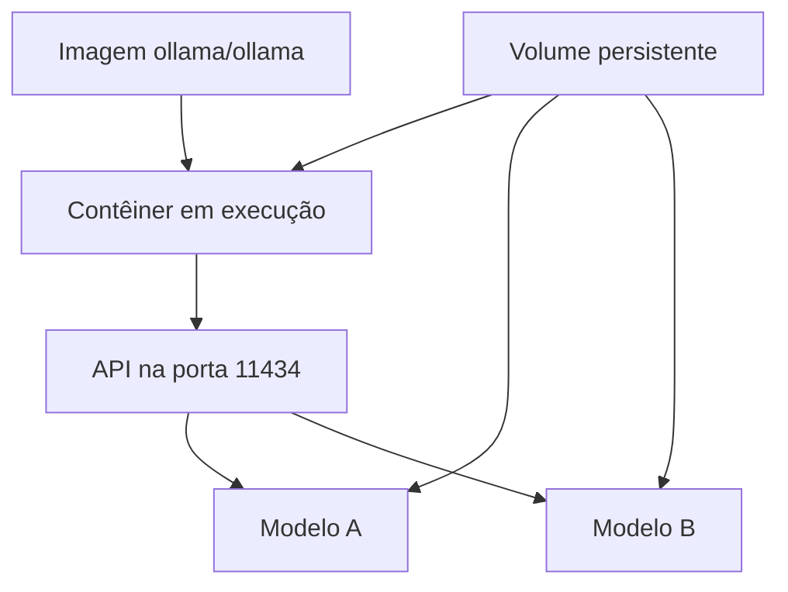
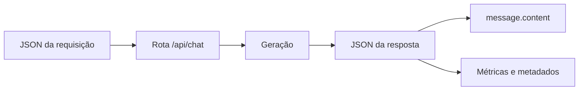
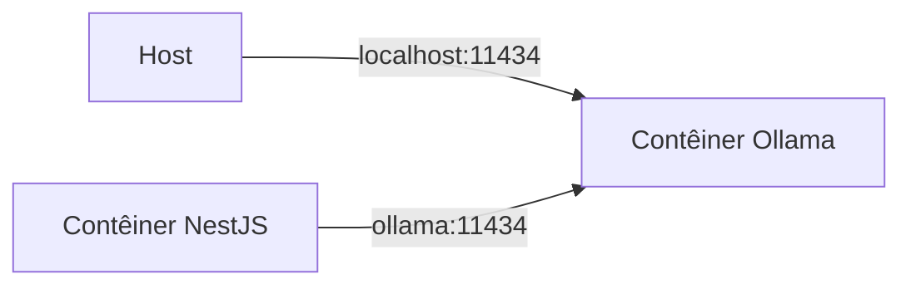

# Encontro 05 — Ollama, API local e Docker

## Tema

Execução local de modelos com Ollama, consumo da API HTTP, persistência dos
artefatos e organização do ambiente com Docker.

## Objetivos

- Explicar o papel de um servidor de inferência na arquitetura Web.
- Diferenciar modelo, servidor de inferência, API e aplicação cliente.
- Executar e inspecionar um modelo local com Ollama.
- Consumir as rotas essenciais da API usando o Thunder Client no VS Code.
- Compreender volumes, portas e comunicação entre host e contêiner.
- Registrar modelo, configuração e limitações para tornar o ambiente reproduzível.

## Visão geral

Nos encontros anteriores, o modelo foi estudado como um componente que recebe
contexto e produz tokens. Agora esse componente será disponibilizado como um
serviço de infraestrutura. A aplicação não carregará diretamente os pesos: ela
enviará uma requisição HTTP ao Ollama e receberá uma resposta.



Ollama não é o modelo. Ele administra modelos e oferece uma interface para
executá-los. Docker também não é uma máquina virtual completa: organiza
processos isolados que compartilham o kernel do host.

## Execução padronizada com Docker Compose

Neste encontro, o Ollama não será instalado diretamente no sistema operacional.
Servidor, CLI e modelos serão executados ou gerenciados dentro do contêiner. O
host precisará apenas de Docker, Docker Compose, VS Code e Thunder Client.

Crie um arquivo `compose.yaml`:

```yaml
services:
  ollama:
    image: ollama/ollama
    container_name: ollama
    ports:
      - "11434:11434"
    volumes:
      - ollama-data:/root/.ollama

volumes:
  ollama-data:
```

Inicie o serviço:

```bash
docker compose up -d
docker compose ps
docker compose logs ollama
```




### API

1. Instale no VS Code a extensão **Thunder Client**.
2. Abra o ícone do Thunder Client na barra lateral.
3. Selecione **New Request**.
4. Escolha o método `GET`.
5. Informe `http://localhost:11434/api/version`.
6. Selecione **Send** e registre status, tempo e corpo da resposta.

Uma resposta válida comprova que a API está acessível, mas não que determinado
modelo está instalado.

### Catálogo Local

No Thunder Client:

1. crie outra requisição `GET`;
2. informe `http://localhost:11434/api/tags`;
3. selecione **Send**;
4. localize o array `models` no JSON retornado;
5. registre o valor completo do campo `name` do modelo escolhido.

Registre o identificador exatamente como retornado, incluindo a tag.

## Obtenção e inspeção de um modelo

Todos os comandos do Ollama serão executados dentro do serviço do Compose:

```bash
docker compose exec ollama ollama pull llama3.2
docker compose exec ollama ollama list
```

## Preparação do Thunder Client

O Thunder Client é um cliente de API integrado ao VS Code. Ele permite escolher
método, URL, cabeçalhos e corpo sem depender da sintaxe do terminal.

Crie um ambiente chamado `ollama-local`:

| Variável | Valor |
|---|---|
| `ollamaBaseUrl` | `http://localhost:11434` |
| `ollamaModel` | identificador obtido em `/api/tags` |

Marque o ambiente como ativo. Nas requisições, use `{{ollamaBaseUrl}}` e
`{{ollamaModel}}`. Variáveis reduzem erros de cópia e facilitam a troca do
modelo, mas não devem armazenar segredos em ambientes compartilhados.

## Primeira inferência pela rota de chat

```http
POST http://localhost:11434/api/chat
Content-Type: application/json
```

Configure no Thunder Client:

1. selecione **New Request**;
2. escolha o método `POST`;
3. use a URL `{{ollamaBaseUrl}}/api/chat`;
4. abra **Headers** e confirme `Content-Type: application/json`;
5. abra **Body**, selecione **JSON** e insira:

```json
{
  "model": "{{ollamaModel}}",
  "messages": [
    {
      "role": "user",
      "content": "Explique em duas frases o papel de uma API REST."
    }
  ],
  "stream": false
}
```

6. selecione **Send**;
7. confirme o status HTTP;
8. localize `message.content`, `prompt_eval_count`, `eval_count` e
   `total_duration`;
9. salve a requisição como `Chat sem streaming`.

O valor `stream: false` solicita uma única resposta JSON, mais simples de
inspecionar no Thunder Client. O streaming será estudado posteriormente.

## Estrutura da requisição

| Campo | Papel |
|---|---|
| `model` | identifica o modelo que atenderá à requisição |
| `messages` | contém o histórico organizado por papéis |
| `role` | diferencia instrução, usuário e assistente |
| `content` | contém o texto da mensagem |
| `stream` | define se a resposta chega inteira ou em partes |

O histórico é enviado pelo cliente. O servidor não deve ser tratado como se
lembrasse automaticamente de todas as conversas anteriores.

## Estrutura da resposta

Uma resposta concluída pode conter:

- identificador do modelo e data de criação;
- mensagem do assistente;
- indicação de conclusão;
- duração total e tempo de carregamento;
- contagem de tokens de entrada e de saída.



## Host, `localhost` e rede do Docker

`localhost` aponta para o ambiente em que o processo está executando:

- no computador, aponta para o próprio computador;
- dentro de um contêiner, aponta para aquele contêiner;
- entre serviços do Compose, normalmente se usa o nome do serviço.



## Gerenciamento do ambiente com Compose

Depois que o `compose.yaml` estiver criado, utilize sempre o Compose para
gerenciar o Ollama:

```bash
docker compose up -d
docker compose ps
docker compose logs ollama
docker compose config
```

Para inspecionar versão e modelos sem instalar o executável no host:

```bash
docker compose exec ollama ollama --version
docker compose exec ollama ollama list
```

Para interromper e iniciar novamente sem remover o volume:

```bash
docker compose stop ollama
docker compose start ollama
```

Fixar uma tag de imagem pode melhorar a reprodução, mas a tag deve ser
escolhida e atualizada conscientemente após testes.

## Configuração e dados sensíveis

URLs, modelos e limites variam por ambiente. Senhas e chaves não devem ser
gravadas no repositório, em imagens ou em exemplos. Um `.env.example` pode
documentar somente configurações não secretas:

```dotenv
OLLAMA_BASE_URL=http://localhost:11434
OLLAMA_MODEL=llama3.2
```

O arquivo `.env` real deve ser ignorado pelo Git.

## Falhas comuns e diagnóstico

| Sintoma | Verificação inicial |
|---|---|
| conexão recusada | servidor iniciado e porta publicada |
| modelo não encontrado | `/api/tags` e grafia do identificador |
| primeira resposta lenta | carregamento inicial do modelo |
| contêiner reinicia | logs e memória disponível |
| funciona no host, mas não no contêiner | uso incorreto de `localhost` |
| modelos desaparecem | volume ausente ou caminho incorreto |
| disco cheio | volume e quantidade de modelos |

Não conclua que “a IA está com problema” antes de identificar a camada que
falhou.

## Fontes oficiais de apoio

- [Introdução à API do Ollama](https://docs.ollama.com/api/introduction)
- [Rota de chat do Ollama](https://docs.ollama.com/api/chat)
- [Ollama com Docker](https://docs.ollama.com/docker)
- [Serviços no Docker Compose](https://docs.docker.com/reference/compose-file/services/)
- [Documentação do Thunder Client](https://docs.thunderclient.com/)
- [Ambientes no Thunder Client](https://docs.thunderclient.com/features/environments)

## Atividade técnica — caracterização da API local de inferência

### Objetivo

Tratar o Ollama como um serviço de infraestrutura e produzir uma caracterização
técnica de seu contrato e comportamento. A atividade envolve parametrização
das requisições no Thunder Client, comparação de execução fria e aquecida,
cálculo de vazão, controle de contexto, streaming e testes negativos.

A atividade é individual e possui duração estimada de 35 a 45 minutos.

### Cenário

Você integra um servidor local de inferência a um backend. Antes de implementar
o cliente NestJS, precisa responder com evidências:

- qual modelo está realmente disponível?
- quais campos compõem o contrato de resposta?
- qual é o impacto do carregamento inicial?
- qual vazão aproximada foi observada?
- como o histórico modifica a requisição?
- como a API se comporta diante de entradas inválidas e indisponibilidade?

## Preparação

Inicie o ambiente e confirme que apenas o Ollama fornece a inferência:

```bash
docker compose up -d
docker compose ps
docker compose exec ollama ollama list
```

Se não houver modelo, obtenha o modelo indicado pelo professor:

```bash
docker compose exec ollama ollama pull llama3.2
```

No Thunder Client, crie uma coleção chamada `Ollama local` e um ambiente ativo
chamado `ollama-local`:

| Variável | Valor inicial |
|---|---|
| `baseUrl` | `http://localhost:11434` |
| `model` | identificador exato retornado por `/api/tags` |

Todas as requisições devem usar `{{baseUrl}}` e `{{model}}`. Não repita valores
fixos em várias requisições.

## Experimento 1 — descoberta e contrato

Crie e salve:

| Nome | Método | URL |
|---|:---:|---|
| `01 - Version` | `GET` | `{{baseUrl}}/api/version` |
| `02 - Tags` | `GET` | `{{baseUrl}}/api/tags` |
| `03 - Running models` | `GET` | `{{baseUrl}}/api/ps` |

Execute as três requisições. Em `Tags`, confirme que o modelo configurado no
ambiente corresponde exatamente a um item de `models[].name`.

Registre também quais campos aparecem em cada modelo. Diferencie:

- identidade do artefato;
- tamanho em bytes;
- formato e família, quando informados;
- precisão ou quantização, quando informada;
- estado carregado ou apenas armazenado.

Não presuma que um modelo listado em `/api/tags` já está carregado na memória.

## Experimento 2 — execução fria e aquecida

Crie `04 - Chat benchmark`:

```http
POST {{baseUrl}}/api/chat
Content-Type: application/json
```

```json
{
  "model": "{{model}}",
  "messages": [
    {
      "role": "user",
      "content": "Explique em exatamente quatro itens os riscos de acoplar uma aplicação ao contrato interno de um provedor de IA."
    }
  ],
  "stream": false,
  "keep_alive": "5m",
  "options": {
    "temperature": 0.2
  }
}
```

Antes da primeira execução, descarregue o modelo:

```bash
docker compose exec ollama ollama stop llama3.2
```

Substitua `llama3.2` pelo identificador usado no ambiente. Execute a requisição
uma vez, aguarde a conclusão e execute novamente sem alterar o corpo.

Preencha:

| Métrica | Execução fria | Execução aquecida |
|---|---:|---:|
| status HTTP | | |
| `load_duration` | | |
| `prompt_eval_count` | | |
| `prompt_eval_duration` | | |
| `eval_count` | | |
| `eval_duration` | | |
| `total_duration` | | |
| restrição de quatro itens atendida? | | |

As durações do Ollama são informadas em nanossegundos. Calcule a vazão de saída:

```text
tokens por segundo = eval_count ÷ (eval_duration ÷ 1.000.000.000)
```

Registre o cálculo para as duas execuções. Não use o tempo mostrado pelo Thunder
Client como substituto de `eval_duration`: o tempo do cliente também inclui
rede, serialização e outras etapas.

## Experimento 3 — contexto explícito

Duplique a requisição e salve como `05 - Chat com histórico`. Use:

```json
{
  "model": "{{model}}",
  "messages": [
    {
      "role": "system",
      "content": "Responda de forma técnica e concisa."
    },
    {
      "role": "user",
      "content": "Defina um código curto para o projeto de integração."
    },
    {
      "role": "assistant",
      "content": "O código será NEXUS-42."
    },
    {
      "role": "user",
      "content": "Qual foi o código definido? Responda somente com o código."
    }
  ],
  "stream": false
}
```

Execute e verifique se a resposta usa o dado presente no histórico. Depois,
remova o par intermediário que contém `NEXUS-42` e repita.

Responda:

1. o servidor manteve memória fora do array `messages`?
2. como `prompt_eval_count` mudou?
3. que componente de uma aplicação real deve armazenar e selecionar o histórico?

## Experimento 4 — resposta estruturada

Crie `06 - Saída JSON` com `format: "json"`:

```json
{
  "model": "{{model}}",
  "messages": [
    {
      "role": "user",
      "content": "Classifique o texto 'Não consigo entrar no sistema'. Retorne JSON com categoria e prioridade. Categorias permitidas: suporte, financeiro, acesso. Prioridades permitidas: baixa, media, alta."
    }
  ],
  "format": "json",
  "stream": false,
  "options": {
    "temperature": 0
  }
}
```

Localize `message.content`. Verifique:

- o conteúdo é uma string que contém JSON válido?
- há somente os campos solicitados?
- os valores pertencem aos conjuntos permitidos?
- o header HTTP indica JSON mesmo quando `message.content` contém outra string
  serializada?

O modo JSON não substitui validação de schema no backend.

## Experimento 5 — streaming

Duplique `04 - Chat benchmark`, altere para `"stream": true` e salve como
`07 - Chat streaming`.

Execute e observe como o Thunder Client apresenta os fragmentos recebidos. Na
resposta em streaming, analise:

- quantidade de objetos ou linhas recebidas;
- evolução de `message.content`;
- valor de `done` nos fragmentos intermediários e no último;
- fragmento em que as métricas finais aparecem;
- diferença em relação ao único objeto retornado com `stream: false`.

Se a versão instalada do Thunder Client não apresentar progressivamente os
fragmentos, registre essa limitação do cliente. Não conclua que o servidor deixou
de fazer streaming apenas com base na renderização da interface.

## Experimento 6 — testes negativos

Crie uma pasta `Falhas esperadas` e execute:

| Caso | Alteração | Resultado a registrar |
|---|---|---|
| método incorreto | `GET /api/chat` | status e corpo |
| modelo ausente | remover `model` | status e mensagem |
| modelo inexistente | usar identificador inválido | status e mensagem |
| JSON malformado | remover uma chave ou vírgula necessária | comportamento do cliente ou servidor |
| serviço indisponível | parar o contêiner antes da chamada | erro observado no Thunder Client |

Para o último caso:

```bash
docker compose stop ollama
```

Depois do teste:

```bash
docker compose start ollama
```

Não execute esse procedimento se o contêiner for compartilhado com outros
estudantes.

## Correlação com logs

Durante uma requisição válida e uma inválida, acompanhe:

```bash
docker compose logs --follow ollama
```

Interrompa apenas o acompanhamento dos logs com `Ctrl+C`; isso não deve encerrar
o contêiner. Relacione horário, rota e status do Thunder Client com as mensagens
do serviço. Não inclua prompts ou respostas sensíveis na evidência entregue.

## Relatório técnico

Entregue um documento curto com:

1. versão do Ollama e identificador completo do modelo;
2. exportação ou capturas das sete requisições;
3. tabela de execução fria e aquecida;
4. cálculo de tokens por segundo;
5. análise do contexto explícito;
6. avaliação da saída estruturada;
7. descrição do streaming observado;
8. matriz dos cinco testes negativos;
9. duas decisões que o futuro cliente NestJS deverá implementar.

## Critérios de avaliação

| Critério | Evidência esperada |
|---|---|
| reprodutibilidade | ambiente e modelo identificados sem valores contraditórios |
| análise de desempenho | unidades convertidas e vazão calculada corretamente |
| compreensão de contexto | histórico tratado como dado explícito da requisição |
| análise de contrato | separação entre resposta HTTP e `message.content` |
| diagnóstico | falhas relacionadas a status, corpo e logs |
| segurança | ausência de segredos e conteúdo sensível nas evidências |
