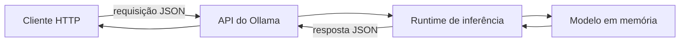
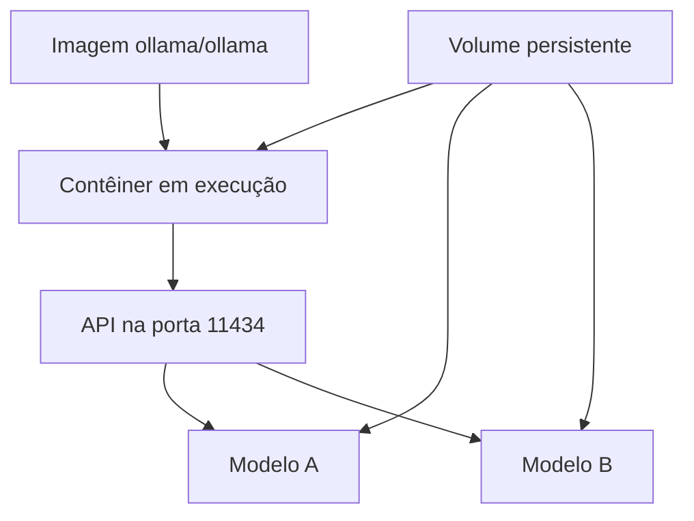
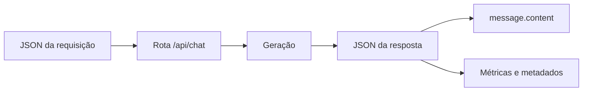
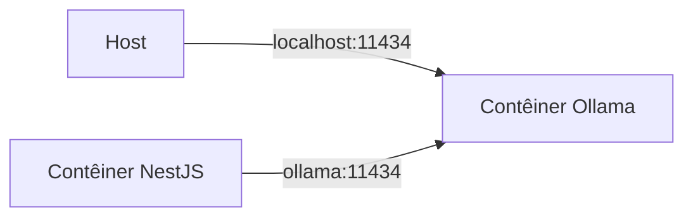

# Encontro 05 — Ollama, API local e Docker

## Tema

Execução local de modelos com Ollama, consumo da API HTTP, persistência dos
artefatos e organização do ambiente com Docker.

## Objetivos

- Explicar o papel de um servidor de inferência na arquitetura Web.
- Diferenciar modelo, servidor de inferência, API e aplicação cliente.
- Executar e inspecionar um modelo local com Ollama.
- Consumir as rotas essenciais da API usando o Thunder Client no VS Code.
- Compreender volumes, portas e comunicação entre host e contêiner.
- Registrar modelo, configuração e limitações para tornar o ambiente reproduzível.

## Visão geral

Nos encontros anteriores, o modelo foi estudado como um componente que recebe
contexto e produz tokens. Agora esse componente será disponibilizado como um
serviço de infraestrutura. A aplicação não carregará diretamente os pesos: ela
enviará uma requisição HTTP ao Ollama e receberá uma resposta.



Ollama não é o modelo. Ele administra modelos e oferece uma interface para
executá-los. Docker também não é uma máquina virtual completa: organiza
processos isolados que compartilham o kernel do host.

## Execução padronizada com Docker Compose

Neste encontro, o Ollama não será instalado diretamente no sistema operacional.
Servidor, CLI e modelos serão executados ou gerenciados dentro do contêiner. O
host precisará apenas de Docker, Docker Compose, VS Code e Thunder Client.

Crie um arquivo `compose.yaml`:

```yaml
services:
  ollama:
    image: ollama/ollama
    container_name: ollama
    ports:
      - "11434:11434"
    volumes:
      - ollama-data:/root/.ollama

volumes:
  ollama-data:
```

Inicie o serviço:

```bash
docker compose up -d
docker compose ps
docker compose logs ollama
```




### API

1. Instale no VS Code a extensão **Thunder Client**.
2. Abra o ícone do Thunder Client na barra lateral.
3. Selecione **New Request**.
4. Escolha o método `GET`.
5. Informe `http://localhost:11434/api/version`.
6. Selecione **Send** e registre status, tempo e corpo da resposta.

Uma resposta válida comprova que a API está acessível, mas não que determinado
modelo está instalado.

### Catálogo Local

No Thunder Client:

1. crie outra requisição `GET`;
2. informe `http://localhost:11434/api/tags`;
3. selecione **Send**;
4. localize o array `models` no JSON retornado;
5. registre o valor completo do campo `name` do modelo escolhido.

Registre o identificador exatamente como retornado, incluindo a tag.

## Obtenção e inspeção de um modelo

Todos os comandos do Ollama serão executados dentro do serviço do Compose:

```bash
docker compose exec ollama ollama pull llama3.2
docker compose exec ollama ollama list
```

## Preparação do Thunder Client

O Thunder Client é um cliente de API integrado ao VS Code. Ele permite escolher
método, URL, cabeçalhos e corpo sem depender da sintaxe do terminal.

Crie um ambiente chamado `ollama-local`:

| Variável | Valor |
|---|---|
| `ollamaBaseUrl` | `http://localhost:11434` |
| `ollamaModel` | identificador obtido em `/api/tags` |

Marque o ambiente como ativo. Nas requisições, use `{{ollamaBaseUrl}}` e
`{{ollamaModel}}`. Variáveis reduzem erros de cópia e facilitam a troca do
modelo, mas não devem armazenar segredos em ambientes compartilhados.

## Primeira inferência pela rota de chat

```http
POST http://localhost:11434/api/chat
Content-Type: application/json
```

Configure no Thunder Client:

1. selecione **New Request**;
2. escolha o método `POST`;
3. use a URL `{{ollamaBaseUrl}}/api/chat`;
4. abra **Headers** e confirme `Content-Type: application/json`;
5. abra **Body**, selecione **JSON** e insira:

```json
{
  "model": "{{ollamaModel}}",
  "messages": [
    {
      "role": "user",
      "content": "Explique em duas frases o papel de uma API REST."
    }
  ],
  "stream": false
}
```

6. selecione **Send**;
7. confirme o status HTTP;
8. localize `message.content`, `prompt_eval_count`, `eval_count` e
   `total_duration`;
9. salve a requisição como `Chat sem streaming`.

O valor `stream: false` solicita uma única resposta JSON, mais simples de
inspecionar no Thunder Client. O streaming será estudado posteriormente.

## Estrutura da requisição

| Campo | Papel |
|---|---|
| `model` | identifica o modelo que atenderá à requisição |
| `messages` | contém o histórico organizado por papéis |
| `role` | diferencia instrução, usuário e assistente |
| `content` | contém o texto da mensagem |
| `stream` | define se a resposta chega inteira ou em partes |

O histórico é enviado pelo cliente. O servidor não deve ser tratado como se
lembrasse automaticamente de todas as conversas anteriores.

## Estrutura da resposta

Uma resposta concluída pode conter:

- identificador do modelo e data de criação;
- mensagem do assistente;
- indicação de conclusão;
- duração total e tempo de carregamento;
- contagem de tokens de entrada e de saída.



## Host, `localhost` e rede do Docker

`localhost` aponta para o ambiente em que o processo está executando:

- no computador, aponta para o próprio computador;
- dentro de um contêiner, aponta para aquele contêiner;
- entre serviços do Compose, normalmente se usa o nome do serviço.



## Gerenciamento do ambiente com Compose

Depois que o `compose.yaml` estiver criado, utilize sempre o Compose para
gerenciar o Ollama:

```bash
docker compose up -d
docker compose ps
docker compose logs ollama
docker compose config
```

Para inspecionar versão e modelos sem instalar o executável no host:

```bash
docker compose exec ollama ollama --version
docker compose exec ollama ollama list
```

Para interromper e iniciar novamente sem remover o volume:

```bash
docker compose stop ollama
docker compose start ollama
```

Fixar uma tag de imagem pode melhorar a reprodução, mas a tag deve ser
escolhida e atualizada conscientemente após testes.

## Configuração e dados sensíveis

URLs, modelos e limites variam por ambiente. Senhas e chaves não devem ser
gravadas no repositório, em imagens ou em exemplos. Um `.env.example` pode
documentar somente configurações não secretas:

```dotenv
OLLAMA_BASE_URL=http://localhost:11434
OLLAMA_MODEL=llama3.2
```

O arquivo `.env` real deve ser ignorado pelo Git.

## Falhas comuns e diagnóstico

| Sintoma | Verificação inicial |
|---|---|
| conexão recusada | servidor iniciado e porta publicada |
| modelo não encontrado | `/api/tags` e grafia do identificador |
| primeira resposta lenta | carregamento inicial do modelo |
| contêiner reinicia | logs e memória disponível |
| funciona no host, mas não no contêiner | uso incorreto de `localhost` |
| modelos desaparecem | volume ausente ou caminho incorreto |
| disco cheio | volume e quantidade de modelos |

Não conclua que “a IA está com problema” antes de identificar a camada que
falhou.

## Fontes oficiais de apoio

- [Introdução à API do Ollama](https://docs.ollama.com/api/introduction)
- [Rota de chat do Ollama](https://docs.ollama.com/api/chat)
- [Ollama com Docker](https://docs.ollama.com/docker)
- [Serviços no Docker Compose](https://docs.docker.com/reference/compose-file/services/)
- [Documentação do Thunder Client](https://docs.thunderclient.com/)
- [Ambientes no Thunder Client](https://docs.thunderclient.com/features/environments)

## Atividade prática curta — consultas ao Ollama com Thunder Client

### Objetivo

Confirmar que o Ollama executado pelo Docker está acessível, identificar um
modelo disponível e realizar duas consultas pela API usando o Thunder Client.
A atividade é individual e deve levar aproximadamente 15 minutos.

### Passo 1 — confirmar o contêiner

No terminal, execute:

```bash
docker compose up -d
docker compose ps
```

Confirme que o serviço `ollama` está em execução. Todos os comandos do Ollama
devem continuar sendo executados dentro do contêiner.

### Passo 2 — consultar os modelos

No Thunder Client, crie uma requisição com:

| Campo | Valor |
|---|---|
| método | `GET` |
| URL | `http://localhost:11434/api/tags` |

Selecione **Send** e localize o campo `name` dentro do array `models`.

Se a resposta for `{"models":[]}`, baixe o modelo indicado para a aula:

```bash
docker compose exec ollama ollama pull llama3.2
```

Depois do download, repita a requisição `GET /api/tags`. Copie exatamente o
identificador retornado e atribua-o à variável `ollamaModel` do ambiente
`ollama-local` no Thunder Client.

### Passo 3 — realizar a primeira consulta

Crie uma requisição no Thunder Client:

| Campo | Valor |
|---|---|
| método | `POST` |
| URL | `http://localhost:11434/api/chat` |
| header | `Content-Type: application/json` |
| body | tipo `JSON` |

Use o identificador obtido no passo anterior:

```json
{
  "model": "{{ollamaModel}}",
  "messages": [
    {
      "role": "user",
      "content": "Explique em até três frases o que é um servidor de inferência."
    }
  ],
  "stream": false
}
```

Selecione **Send** e localize a resposta em `message.content`.

### Passo 4 — realizar a segunda consulta

Na mesma requisição, altere somente o conteúdo da mensagem:

```json
{
  "model": "{{ollamaModel}}",
  "messages": [
    {
      "role": "user",
      "content": "Liste três responsabilidades de um backend que utiliza IA."
    }
  ],
  "stream": false
}
```

Execute novamente e verifique se a resposta apresenta exatamente três itens.

### Registro da atividade

| Item | Primeira consulta | Segunda consulta |
|---|---|---|
| status HTTP | | |
| modelo retornado | | |
| conteúdo atendeu ao pedido? | | |
| `prompt_eval_count` | | |
| `eval_count` | | |
| `total_duration` | | |

### Entrega

Entregue a tabela preenchida e uma captura do Thunder Client mostrando uma das
respostas. A captura não deve exibir dados pessoais, caminhos privados ou outras
informações sensíveis.
