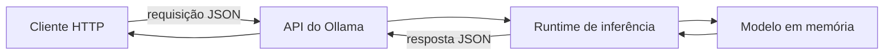
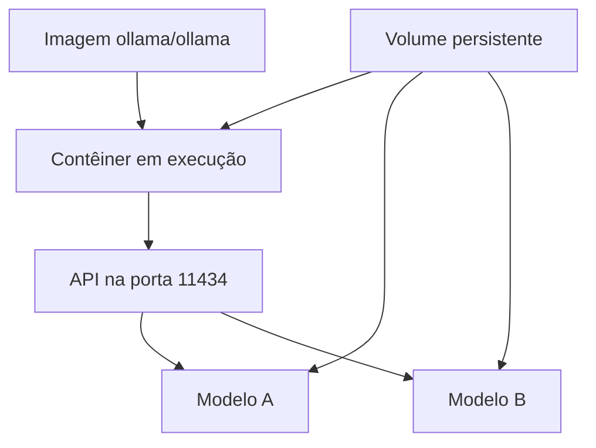
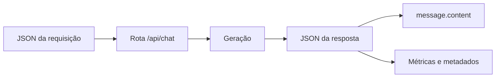
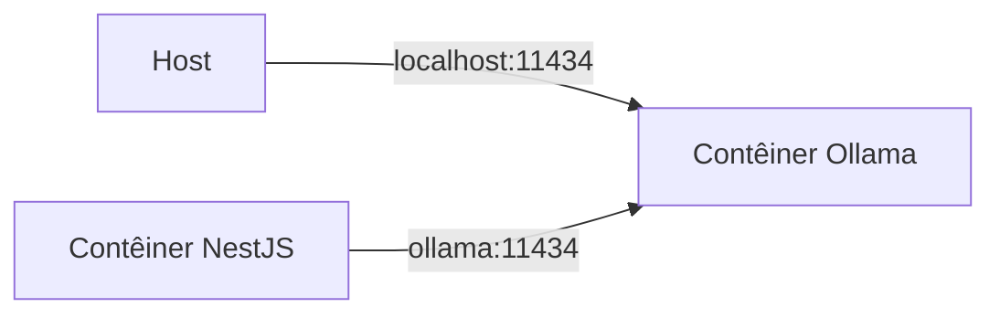
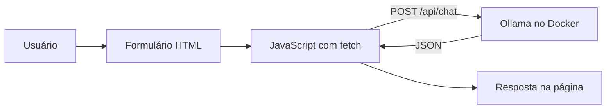
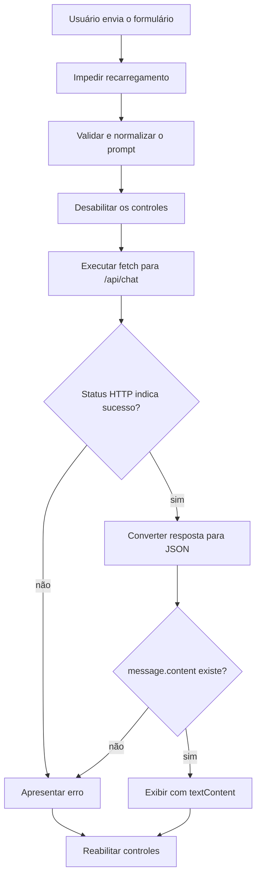

# Encontro 05 — Ollama, API local e Docker

## Tema

Execução local de modelos com Ollama, consumo da API HTTP, persistência dos
artefatos e organização do ambiente com Docker.

## Objetivos

- Explicar o papel de um servidor de inferência na arquitetura Web.
- Diferenciar modelo, servidor de inferência, API e aplicação cliente.
- Executar e inspecionar um modelo local com Ollama.
- Consumir as rotas essenciais da API usando o Thunder Client no VS Code.
- Compreender volumes, portas e comunicação entre host e contêiner.
- Registrar modelo, configuração e limitações para tornar o ambiente reproduzível.

## Visão geral

Nos encontros anteriores, o modelo foi estudado como um componente que recebe
contexto e produz tokens. Agora esse componente será disponibilizado como um
serviço de infraestrutura. A aplicação não carregará diretamente os pesos: ela
enviará uma requisição HTTP ao Ollama e receberá uma resposta.



Ollama não é o modelo. Ele administra modelos e oferece uma interface para
executá-los. Docker também não é uma máquina virtual completa: organiza
processos isolados que compartilham o kernel do host.

## Execução padronizada com Docker Compose

Neste encontro, o Ollama não será instalado diretamente no sistema operacional.
Servidor, CLI e modelos serão executados ou gerenciados dentro do contêiner. O
host precisará apenas de Docker, Docker Compose, VS Code e Thunder Client.

Crie um arquivo `compose.yaml`:

```yaml
services:
  ollama:
    image: ollama/ollama
    container_name: ollama
    ports:
      - "11434:11434"
    volumes:
      - ollama-data:/root/.ollama

volumes:
  ollama-data:
```

Inicie o serviço:

```bash
docker compose up -d
docker compose ps
docker compose logs ollama
```




### API

1. Instale no VS Code a extensão **Thunder Client**.
2. Abra o ícone do Thunder Client na barra lateral.
3. Selecione **New Request**.
4. Escolha o método `GET`.
5. Informe `http://localhost:11434/api/version`.
6. Selecione **Send** e registre status, tempo e corpo da resposta.

Uma resposta válida comprova que a API está acessível, mas não que determinado
modelo está instalado.

### Catálogo Local

No Thunder Client:

1. crie outra requisição `GET`;
2. informe `http://localhost:11434/api/tags`;
3. selecione **Send**;
4. localize o array `models` no JSON retornado;
5. registre o valor completo do campo `name` do modelo escolhido.

Registre o identificador exatamente como retornado, incluindo a tag.

## Obtenção e inspeção de um modelo

Todos os comandos do Ollama serão executados dentro do serviço do Compose:

```bash
docker compose exec ollama ollama pull llama3.2
docker compose exec ollama ollama list
```

## Preparação do Thunder Client

O Thunder Client é um cliente de API integrado ao VS Code. Ele permite escolher
método, URL, cabeçalhos e corpo sem depender da sintaxe do terminal.

Crie um ambiente chamado `ollama-local`:

| Variável | Valor |
|---|---|
| `ollamaBaseUrl` | `http://localhost:11434` |
| `ollamaModel` | identificador obtido em `/api/tags` |

Marque o ambiente como ativo. Nas requisições, use `{{ollamaBaseUrl}}` e
`{{ollamaModel}}`. Variáveis reduzem erros de cópia e facilitam a troca do
modelo, mas não devem armazenar segredos em ambientes compartilhados.

## Primeira inferência pela rota de chat

```http
POST http://localhost:11434/api/chat
Content-Type: application/json
```

Configure no Thunder Client:

1. selecione **New Request**;
2. escolha o método `POST`;
3. use a URL `{{ollamaBaseUrl}}/api/chat`;
4. abra **Headers** e confirme `Content-Type: application/json`;
5. abra **Body**, selecione **JSON** e insira:

```json
{
  "model": "{{ollamaModel}}",
  "messages": [
    {
      "role": "user",
      "content": "Explique em duas frases o papel de uma API REST."
    }
  ],
  "stream": false
}
```

6. selecione **Send**;
7. confirme o status HTTP;
8. localize `message.content`, `prompt_eval_count`, `eval_count` e
   `total_duration`;
9. salve a requisição como `Chat sem streaming`.

O valor `stream: false` solicita uma única resposta JSON, mais simples de
inspecionar no Thunder Client. O streaming será estudado posteriormente.

## Estrutura da requisição

| Campo | Papel |
|---|---|
| `model` | identifica o modelo que atenderá à requisição |
| `messages` | contém o histórico organizado por papéis |
| `role` | diferencia instrução, usuário e assistente |
| `content` | contém o texto da mensagem |
| `stream` | define se a resposta chega inteira ou em partes |

O histórico é enviado pelo cliente. O servidor não deve ser tratado como se
lembrasse automaticamente de todas as conversas anteriores.

## Estrutura da resposta

Uma resposta concluída pode conter:

- identificador do modelo e data de criação;
- mensagem do assistente;
- indicação de conclusão;
- duração total e tempo de carregamento;
- contagem de tokens de entrada e de saída.



## Host, `localhost` e rede do Docker

`localhost` aponta para o ambiente em que o processo está executando:

- no computador, aponta para o próprio computador;
- dentro de um contêiner, aponta para aquele contêiner;
- entre serviços do Compose, normalmente se usa o nome do serviço.



## Gerenciamento do ambiente com Compose

Depois que o `compose.yaml` estiver criado, utilize sempre o Compose para
gerenciar o Ollama:

```bash
docker compose up -d
docker compose ps
docker compose logs ollama
docker compose config
```

Para inspecionar versão e modelos sem instalar o executável no host:

```bash
docker compose exec ollama ollama --version
docker compose exec ollama ollama list
```

Para interromper e iniciar novamente sem remover o volume:

```bash
docker compose stop ollama
docker compose start ollama
```

Fixar uma tag de imagem pode melhorar a reprodução, mas a tag deve ser
escolhida e atualizada conscientemente após testes.

## Configuração e dados sensíveis

URLs, modelos e limites variam por ambiente. Senhas e chaves não devem ser
gravadas no repositório, em imagens ou em exemplos. Um `.env.example` pode
documentar somente configurações não secretas:

```dotenv
OLLAMA_BASE_URL=http://localhost:11434
OLLAMA_MODEL=llama3.2
```

O arquivo `.env` real deve ser ignorado pelo Git.

## Falhas comuns e diagnóstico

| Sintoma | Verificação inicial |
|---|---|
| conexão recusada | servidor iniciado e porta publicada |
| modelo não encontrado | `/api/tags` e grafia do identificador |
| primeira resposta lenta | carregamento inicial do modelo |
| contêiner reinicia | logs e memória disponível |
| funciona no host, mas não no contêiner | uso incorreto de `localhost` |
| modelos desaparecem | volume ausente ou caminho incorreto |
| disco cheio | volume e quantidade de modelos |

Não conclua que “a IA está com problema” antes de identificar a camada que
falhou.

## Fontes oficiais de apoio

- [Introdução à API do Ollama](https://docs.ollama.com/api/introduction)
- [Rota de chat do Ollama](https://docs.ollama.com/api/chat)
- [Ollama com Docker](https://docs.ollama.com/docker)
- [Serviços no Docker Compose](https://docs.docker.com/reference/compose-file/services/)
- [Documentação do Thunder Client](https://docs.thunderclient.com/)
- [Ambientes no Thunder Client](https://docs.thunderclient.com/features/environments)

## Atividade prática — página Web consumindo o Ollama

### Objetivo

Construir uma pequena página com HTML, CSS e JavaScript puro. O usuário digitará
um prompt, o JavaScript enviará uma requisição para o Ollama executado no Docker
e a resposta do modelo será apresentada na própria página.



A atividade é individual e possui duração estimada de 30 a 40 minutos.

> **Importante:** a chamada direta do navegador ao Ollama é usada aqui para
> compreender o fluxo HTTP. Em uma aplicação real, o frontend deve chamar um
> backend responsável por autenticação, autorização, validação, limites e
> proteção do servidor de inferência.

### Resultado esperado

A página deverá possuir:

- um campo para digitar o prompt;
- um botão para enviar;
- indicação de carregamento;
- área para apresentar a resposta;
- mensagem compreensível quando ocorrer um erro;
- bloqueio de envios duplicados durante a geração.

## Passo 1 — preparar a pasta

Crie uma pasta chamada `ollama-web` e, dentro dela, estes arquivos:

```text
ollama-web/
├── index.html
├── styles.css
└── app.js
```

Abra essa pasta no VS Code.

## Passo 2 — permitir a origem da página

Uma página servida em uma porta e o Ollama publicado em outra possuem origens
diferentes. O navegador aplica a política de mesma origem e pode bloquear a
requisição se o servidor não autorizar a origem da página.

No serviço `ollama` do `compose.yaml`, adicione uma autorização restrita às
origens que serão usadas pelo servidor local:

```yaml
services:
  ollama:
    image: ollama/ollama
    container_name: ollama
    ports:
      - "11434:11434"
    environment:
      OLLAMA_ORIGINS: "http://127.0.0.1:5500,http://localhost:5500"
    volumes:
      - ollama-data:/root/.ollama

volumes:
  ollama-data:
```

Recrie o contêiner para aplicar a variável:

```bash
docker compose up -d --force-recreate
docker compose ps
```

Não use `OLLAMA_ORIGINS=*`. Autorizar qualquer origem amplia
desnecessariamente a superfície de acesso ao servidor.

## Passo 3 — confirmar o modelo

Liste os modelos dentro do contêiner:

```bash
docker compose exec ollama ollama list
```

Se a lista estiver vazia, obtenha o modelo indicado pelo professor:

```bash
docker compose exec ollama ollama pull llama3.2
```

Copie o identificador exato apresentado pelo comando `list`. Ele será usado no
JavaScript.

## Passo 4 — criar o HTML

Em `index.html`, adicione:

```html
<!doctype html>
<html lang="pt-BR">
  <head>
    <meta charset="UTF-8" />
    <meta name="viewport" content="width=device-width, initial-scale=1.0" />
    <title>Cliente Web do Ollama</title>
    <link rel="stylesheet" href="styles.css" />
  </head>
  <body>
    <main class="container">
      <h1>Cliente Web do Ollama</h1>
      <p>Digite uma pergunta para o modelo executado localmente.</p>

      <form id="prompt-form">
        <label for="prompt">Prompt</label>
        <textarea
          id="prompt"
          name="prompt"
          rows="6"
          maxlength="2000"
          placeholder="Ex.: explique o que é uma API REST."
          required
        ></textarea>

        <div class="actions">
          <span id="counter">0/2000</span>
          <button id="submit-button" type="submit">Enviar</button>
        </div>
      </form>

      <p id="status" role="status" aria-live="polite"></p>

      <section aria-labelledby="response-title">
        <h2 id="response-title">Resposta</h2>
        <pre id="response">A resposta será exibida aqui.</pre>
      </section>
    </main>

    <script src="app.js"></script>
  </body>
</html>
```

Elementos importantes:

- o `form` permite enviar pelo botão ou pela tecla apropriada;
- `required` impede o envio vazio no navegador;
- `maxlength` cria um limite inicial de entrada;
- `aria-live` anuncia mudanças de status a tecnologias assistivas;
- `pre` preserva quebras de linha da resposta.

## Passo 5 — adicionar o estilo

Em `styles.css`, adicione:

```css
:root {
  color-scheme: light dark;
  font-family: system-ui, sans-serif;
}

body {
  margin: 0;
  min-height: 100vh;
  background: #111827;
  color: #f9fafb;
}

.container {
  width: min(760px, calc(100% - 2rem));
  margin: 0 auto;
  padding: 3rem 0;
}

form,
section {
  margin-top: 1.5rem;
  padding: 1.25rem;
  border: 1px solid #374151;
  border-radius: 0.75rem;
  background: #1f2937;
}

label {
  display: block;
  margin-bottom: 0.5rem;
  font-weight: 700;
}

textarea {
  box-sizing: border-box;
  width: 100%;
  padding: 0.75rem;
  resize: vertical;
  font: inherit;
}

.actions {
  display: flex;
  justify-content: space-between;
  align-items: center;
  margin-top: 0.75rem;
}

button {
  padding: 0.65rem 1.25rem;
  border: 0;
  border-radius: 0.5rem;
  background: #2563eb;
  color: white;
  font-weight: 700;
  cursor: pointer;
}

button:disabled {
  cursor: wait;
  opacity: 0.6;
}

#status[data-type="error"] {
  color: #fca5a5;
}

#status[data-type="success"] {
  color: #86efac;
}

#response {
  min-height: 8rem;
  white-space: pre-wrap;
  overflow-wrap: anywhere;
}
```

## Passo 6 — implementar a chamada em JavaScript

Em `app.js`, adicione:

```js
const OLLAMA_URL = 'http://localhost:11434/api/chat';
const OLLAMA_MODEL = 'llama3.2:latest';

const form = document.querySelector('#prompt-form');
const promptInput = document.querySelector('#prompt');
const submitButton = document.querySelector('#submit-button');
const statusElement = document.querySelector('#status');
const responseElement = document.querySelector('#response');
const counterElement = document.querySelector('#counter');

promptInput.addEventListener('input', () => {
  counterElement.textContent = `${promptInput.value.length}/2000`;
});

form.addEventListener('submit', async (event) => {
  event.preventDefault();

  const prompt = promptInput.value.trim();
  if (!prompt) {
    showStatus('Digite um prompt antes de enviar.', 'error');
    return;
  }

  setLoading(true);
  showStatus('Gerando resposta...', 'loading');
  responseElement.textContent = '';

  try {
    const response = await fetch(OLLAMA_URL, {
      method: 'POST',
      headers: {
        'Content-Type': 'application/json',
      },
      body: JSON.stringify({
        model: OLLAMA_MODEL,
        messages: [
          {
            role: 'user',
            content: prompt,
          },
        ],
        stream: false,
      }),
    });

    if (!response.ok) {
      const details = await response.text();
      throw new Error(`HTTP ${response.status}: ${details}`);
    }

    const data = await response.json();
    const content = data.message?.content?.trim();

    if (!content) {
      throw new Error('O Ollama respondeu sem conteúdo utilizável.');
    }

    responseElement.textContent = content;
    showStatus(`Resposta gerada pelo modelo ${data.model}.`, 'success');
  } catch (error) {
    console.error(error);
    responseElement.textContent = 'Não foi possível gerar a resposta.';
    showStatus(error.message, 'error');
  } finally {
    setLoading(false);
  }
});

function setLoading(isLoading) {
  submitButton.disabled = isLoading;
  promptInput.disabled = isLoading;
  submitButton.textContent = isLoading ? 'Enviando...' : 'Enviar';
}

function showStatus(message, type) {
  statusElement.textContent = message;
  statusElement.dataset.type = type;
}
```

Substitua `llama3.2:latest` pelo identificador exato obtido no Passo 3.

### O que o JavaScript realiza?



O conteúdo é exibido com `textContent`, não com `innerHTML`. Dessa maneira, uma
resposta que contenha marcação HTML será tratada como texto, reduzindo o risco
de injeção de conteúdo na página.

## Passo 7 — servir a página

Não abra o arquivo apenas com `file://`. Utilize um servidor HTTP local para que
a página tenha uma origem previsível.

Com a extensão Live Server do VS Code:

1. abra `index.html`;
2. selecione **Open with Live Server**;
3. confirme que a URL usa `localhost:5500` ou `127.0.0.1:5500`.

Se o Live Server escolher outra porta, atualize `OLLAMA_ORIGINS` no
`compose.yaml` e recrie o contêiner antes de continuar.

## Passo 8 — testar o fluxo

Execute estes casos:

| Caso | Procedimento | Resultado esperado |
|---|---|---|
| prompt válido | enviar uma pergunta curta | resposta exibida na página |
| envio vazio | tentar enviar somente espaços | mensagem de validação |
| clique duplicado | clicar novamente durante a geração | botão permanece desabilitado |
| modelo inválido | alterar temporariamente `OLLAMA_MODEL` | erro HTTP apresentado |
| serviço indisponível | parar o contêiner e enviar | erro de conexão apresentado |

Para simular indisponibilidade somente em um ambiente individual:

```bash
docker compose stop ollama
docker compose start ollama
```

Não interrompa um contêiner compartilhado com outros estudantes.

## Passo 9 — inspecionar no navegador

Abra as ferramentas de desenvolvimento e, na guia **Network**, localize a
requisição para `/api/chat`. Registre:

- método e URL;
- status HTTP;
- request payload;
- response payload;
- tempo total observado pelo navegador;
- header `Content-Type`.

Compare esses dados com a requisição criada anteriormente no Thunder Client.

## Entrega

Entregue:

1. `index.html`, `styles.css` e `app.js`;
2. captura da página exibindo uma resposta;
3. captura da requisição na guia **Network**;
4. tabela com os cinco testes executados;
5. resposta curta: por que essa chamada direta não deve ser a arquitetura final
   de uma aplicação em produção?

## Critérios de conclusão

- [ ] Ollama permanece executado exclusivamente no Docker;
- [ ] página é servida por HTTP em uma origem autorizada;
- [ ] prompt é lido e normalizado pelo JavaScript;
- [ ] `fetch` envia JSON para `/api/chat`;
- [ ] status HTTP e conteúdo da resposta são validados;
- [ ] resposta é exibida com `textContent`;
- [ ] controles representam carregamento e impedem envio duplicado;
- [ ] falhas são apresentadas sem interromper o JavaScript;
- [ ] estudante reconhece a necessidade de um backend em produção.
