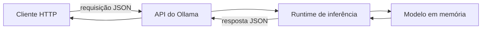
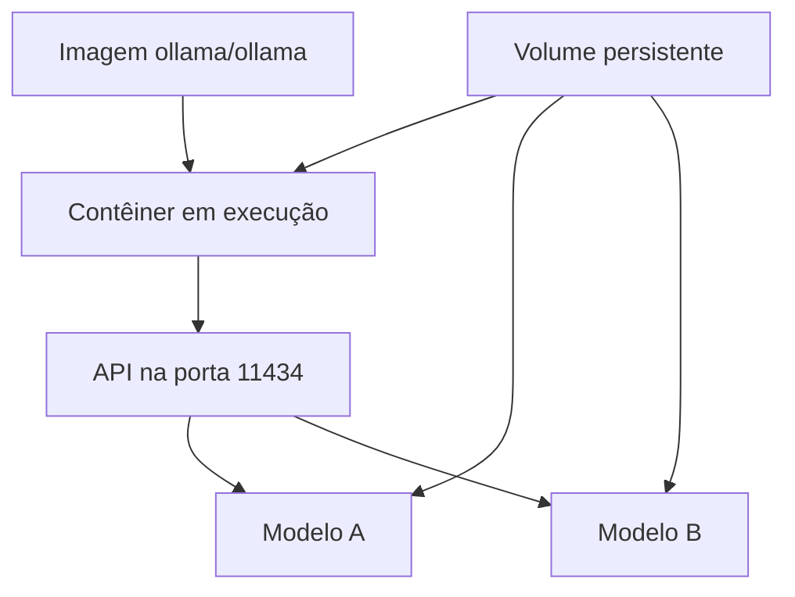
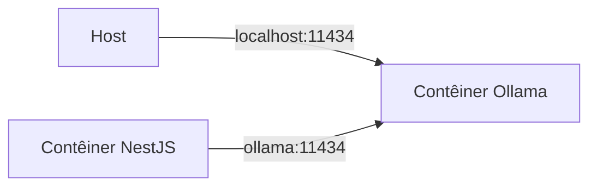

# Encontro 05 — Ollama, API local e Docker

## Tema

Execução local de modelos com Ollama, consumo da API HTTP, persistência dos
artefatos e organização do ambiente com Docker.

## Objetivos

- Explicar o papel de um servidor de inferência na arquitetura Web.
- Diferenciar modelo, servidor de inferência, API e aplicação cliente.
- Executar e inspecionar um modelo local com Ollama.
- Consumir as rotas essenciais da API usando `curl`.
- Compreender volumes, portas e comunicação entre host e contêiner.
- Registrar modelo, configuração e limitações para tornar o ambiente reproduzível.

## Visão geral

Nos encontros anteriores, o modelo foi estudado como um componente que recebe
contexto e produz tokens. Agora esse componente será disponibilizado como um
serviço de infraestrutura. A aplicação não carregará diretamente os pesos: ela
enviará uma requisição HTTP ao Ollama e receberá uma resposta.



Essa separação permite que `curl`, NestJS e outras aplicações consumam o mesmo
servidor, desde que respeitem seu contrato HTTP.

## Vocabulário do ambiente

| Termo | Significado neste encontro |
|---|---|
| modelo | artefato que contém parâmetros e metadados necessários à inferência |
| Ollama | servidor e ferramenta que gerenciam modelos e expõem uma API local |
| runtime | software que executa os cálculos no hardware disponível |
| imagem | pacote usado pelo Docker para criar contêineres |
| contêiner | processo isolado criado a partir de uma imagem |
| volume | armazenamento persistente independente do contêiner |
| porta publicada | ligação entre uma porta do host e uma do contêiner |

Ollama não é o modelo. Ele administra modelos e oferece uma interface para
executá-los. Docker também não é uma máquina virtual completa: organiza
processos isolados que compartilham o kernel do host.

## Antes de instalar ou baixar

Modelos podem ocupar vários gigabytes. Antes da aula prática:

1. confirme o espaço livre em disco;
2. registre a quantidade de RAM disponível;
3. verifique se Docker ou Ollama já estão instalados;
4. não baixe vários modelos sem necessidade;
5. use apenas o modelo indicado para o laboratório;
6. não exponha a porta do Ollama à rede pública.

O nome e o tamanho do modelo serão definidos conforme a infraestrutura. Os
exemplos usam `llama3.2`, presente na documentação oficial, mas o professor pode
indicar outro modelo menor ou já armazenado nas máquinas.

## Duas formas de execução

### Instalação direta

Ollama pode ser instalado diretamente no sistema operacional. Após ser
iniciado, sua API local é servida, por padrão, em:

```text
http://localhost:11434/api
```

### Execução com Docker

Para um ambiente somente com CPU, a documentação oficial apresenta:

```bash
docker run -d \
  --name ollama \
  -p 11434:11434 \
  -v ollama:/root/.ollama \
  ollama/ollama
```

| Trecho | Função |
|---|---|
| `-d` | executa em segundo plano |
| `--name ollama` | atribui um nome ao contêiner |
| `-p 11434:11434` | publica a porta da API no host |
| `-v ollama:/root/.ollama` | mantém modelos em um volume persistente |

Não acrescente acesso à GPU por tentativa. NVIDIA, AMD e outros ambientes
possuem requisitos distintos que devem ser previamente validados.

## Contêiner não é modelo

Criar o contêiner inicia o servidor, mas não garante que o modelo solicitado já
esteja disponível.



O volume evita novo download quando o contêiner é recriado. Remover o
contêiner e remover o volume são operações diferentes.

## Verificação em camadas

Evite testar tudo simultaneamente. Verifique uma camada por vez.

### Camada 1 — Docker

```bash
docker version
docker ps
```

Se o cliente existe, mas não consegue falar com o daemon, o problema ainda não
é do Ollama. No laboratório, o acesso ao Docker pode depender de permissões
institucionais; não use `sudo` sem orientação do professor.

### Camada 2 — contêiner

```bash
docker ps --filter name=ollama
docker logs ollama
```

### Camada 3 — API

```bash
curl http://localhost:11434/api/version
```

Uma resposta válida comprova que a API está acessível, mas não que determinado
modelo está instalado.

### Camada 4 — catálogo local

```bash
curl http://localhost:11434/api/tags
```

Registre o identificador exatamente como retornado, incluindo a tag.

## Obtenção e inspeção de um modelo

Na instalação direta:

```bash
ollama pull llama3.2
ollama list
```

No contêiner:

```bash
docker exec -it ollama ollama pull llama3.2
docker exec -it ollama ollama list
```

O download deve ser realizado uma vez. Se o laboratório não permitir downloads,
a atividade deve usar o modelo previamente armazenado no volume.

## Primeira inferência pela linha de comando

```bash
docker exec -it ollama ollama run llama3.2
```

Essa interface é útil para uma verificação rápida, mas uma aplicação Web
utilizará a API HTTP.

## A rota de chat

```http
POST http://localhost:11434/api/chat
Content-Type: application/json
```

Exemplo sem streaming:

```bash
curl http://localhost:11434/api/chat \
  -H 'Content-Type: application/json' \
  -d '{
    "model": "llama3.2",
    "messages": [
      {
        "role": "user",
        "content": "Explique em duas frases o papel de uma API REST."
      }
    ],
    "stream": false
  }'
```

Substitua `llama3.2` pelo identificador registrado em `/api/tags`. O valor
`stream: false` solicita uma única resposta JSON. O streaming será estudado
posteriormente.

## Estrutura da requisição

| Campo | Papel |
|---|---|
| `model` | identifica o modelo que atenderá à requisição |
| `messages` | contém o histórico organizado por papéis |
| `role` | diferencia instrução, usuário e assistente |
| `content` | contém o texto da mensagem |
| `stream` | define se a resposta chega inteira ou em partes |

O histórico é enviado pelo cliente. O servidor não deve ser tratado como se
lembrasse automaticamente de todas as conversas anteriores.

## Estrutura da resposta

Uma resposta concluída pode conter:

- identificador do modelo e data de criação;
- mensagem do assistente;
- indicação de conclusão;
- duração total e tempo de carregamento;
- contagem de tokens de entrada e de saída.

```mermaid
flowchart LR
    Q[JSON da requisição] --> A[/api/chat]
    A --> G[Geração]
    G --> J[JSON da resposta]
    J --> T[message.content]
    J --> M[Métricas e metadados]
```

## Host, `localhost` e rede do Docker

`localhost` aponta para o ambiente em que o processo está executando:

- no computador, aponta para o próprio computador;
- dentro de um contêiner, aponta para aquele contêiner;
- entre serviços do Compose, normalmente se usa o nome do serviço.



## Organização inicial com Compose

```yaml
services:
  ollama:
    image: ollama/ollama
    ports:
      - "11434:11434"
    volumes:
      - ollama-data:/root/.ollama

volumes:
  ollama-data:
```

```bash
docker compose up -d
docker compose ps
docker compose logs ollama
docker compose config
```

Fixar uma tag de imagem pode melhorar a reprodução, mas a tag deve ser
escolhida e atualizada conscientemente após testes.

## Configuração e dados sensíveis

URLs, modelos e limites variam por ambiente. Senhas e chaves não devem ser
gravadas no repositório, em imagens ou em exemplos. Um `.env.example` pode
documentar somente configurações não secretas:

```dotenv
OLLAMA_BASE_URL=http://localhost:11434
OLLAMA_MODEL=llama3.2
```

O arquivo `.env` real deve ser ignorado pelo Git.

## Falhas comuns e diagnóstico

| Sintoma | Verificação inicial |
|---|---|
| conexão recusada | servidor iniciado e porta publicada |
| modelo não encontrado | `/api/tags` e grafia do identificador |
| primeira resposta lenta | carregamento inicial do modelo |
| contêiner reinicia | logs e memória disponível |
| funciona no host, mas não no contêiner | uso incorreto de `localhost` |
| modelos desaparecem | volume ausente ou caminho incorreto |
| disco cheio | volume e quantidade de modelos |

Não conclua que “a IA está com problema” antes de identificar a camada que
falhou.

## Demonstração guiada

1. confirmar Docker e contêiner;
2. consultar versão e catálogo do Ollama;
3. confirmar o modelo escolhido;
4. executar uma mensagem pela CLI;
5. repetir pela rota `/api/chat`;
6. localizar texto, contagens e durações;
7. comparar URL no host e nome do serviço no Compose;
8. reiniciar o contêiner e confirmar a persistência.

## Registro individual

| Item | Valor observado |
|---|---|
| sistema operacional | |
| forma de execução | instalação direta ou Docker |
| versão do Docker | |
| versão do Ollama | |
| modelo e tag | |
| URL usada no host | |
| rota testada | |
| tokens de entrada e saída | |
| duração total | |
| limitação observada | |

## Questões para revisão

1. Por que Ollama e modelo não são sinônimos?
2. Qual é a função do volume?
3. Por que `localhost` pode apontar para destinos diferentes?
4. O que `/api/tags` permite verificar?
5. Por que a primeira inferência pode demorar mais?
6. Qual é a diferença entre testar a CLI e testar a API?
7. Que informações tornam o experimento reproduzível?

## Checklist de aprendizagem

- [ ] explicar o papel do servidor de inferência;
- [ ] identificar imagem, contêiner, volume e porta;
- [ ] verificar o serviço antes da geração;
- [ ] consumir `/api/chat` sem streaming;
- [ ] localizar resposta e métricas no JSON;
- [ ] diferenciar endereço do host e entre contêineres;
- [ ] registrar configuração sem expor segredos.

## Síntese do encontro

Executar um modelo local envolve manter um servidor acessível, conhecer seu
contrato HTTP, preservar artefatos, configurar a rede e observar recursos e
falhas. No próximo encontro, a chamada manual será encapsulada pelo NestJS.

## Fontes oficiais de apoio

- [Introdução à API do Ollama](https://docs.ollama.com/api/introduction)
- [Rota de chat do Ollama](https://docs.ollama.com/api/chat)
- [Ollama com Docker](https://docs.ollama.com/docker)
- [Serviços no Docker Compose](https://docs.docker.com/reference/compose-file/services/)
