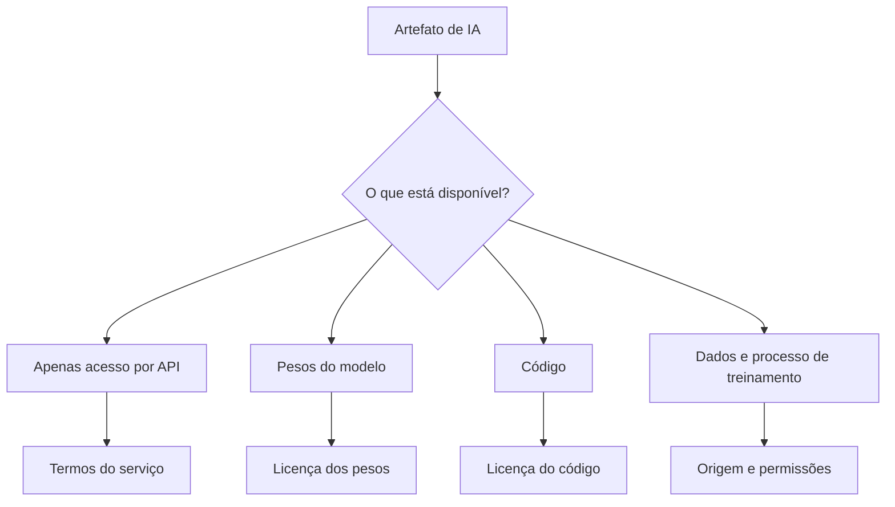
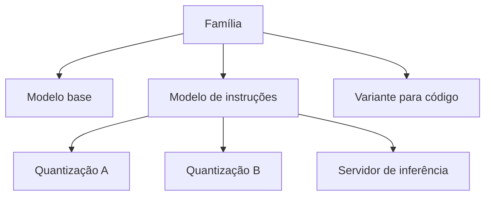
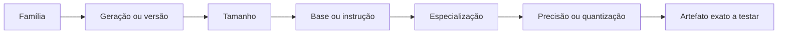
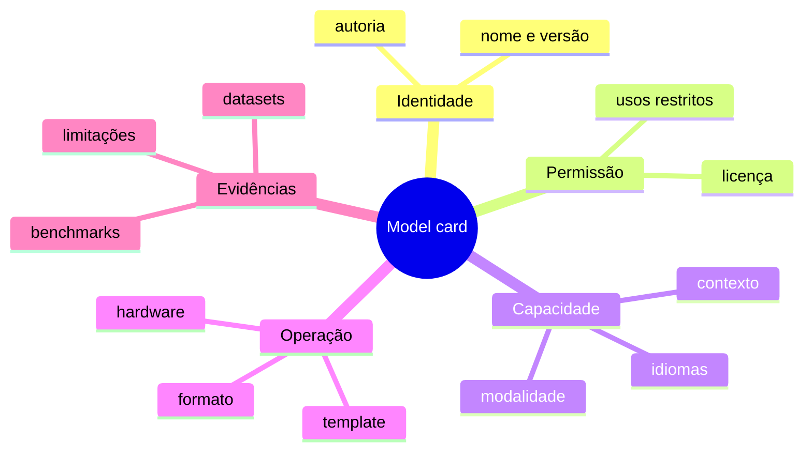
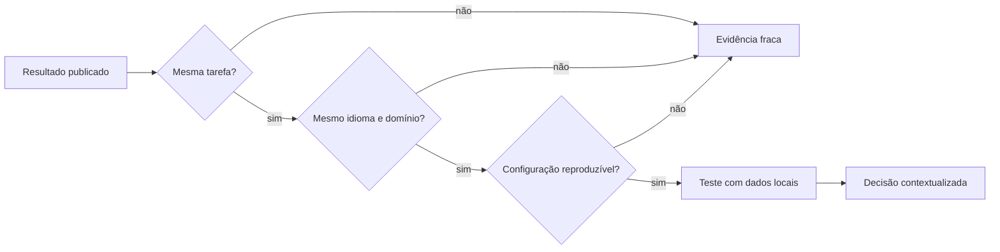
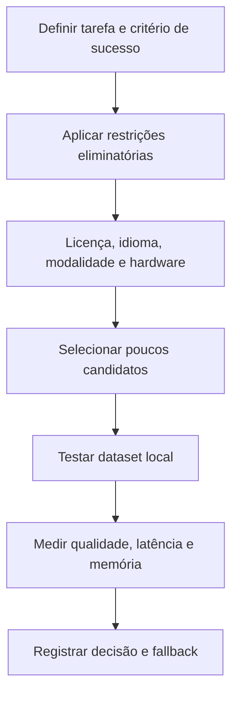
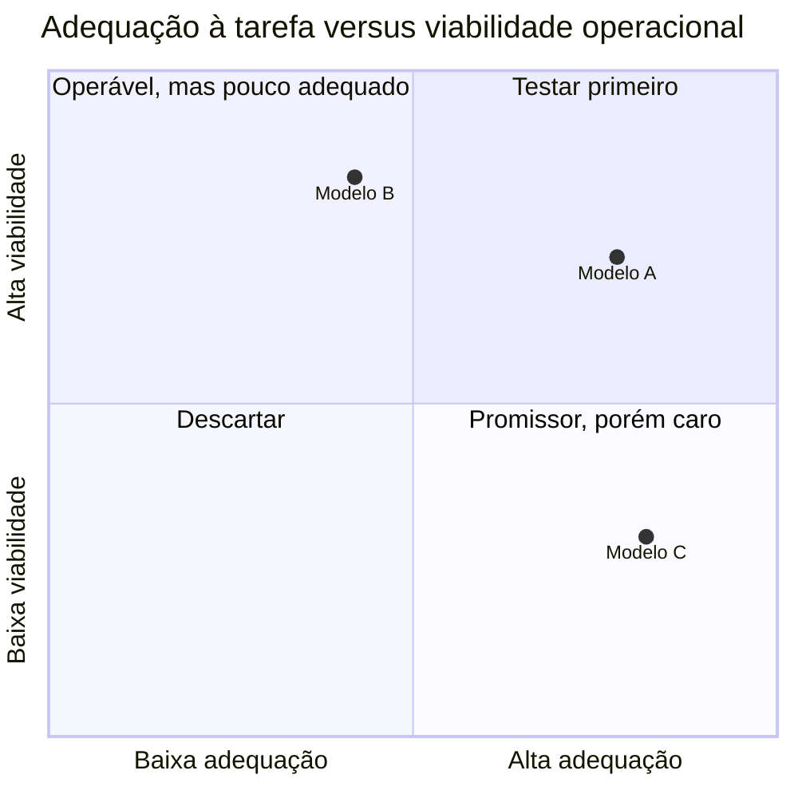
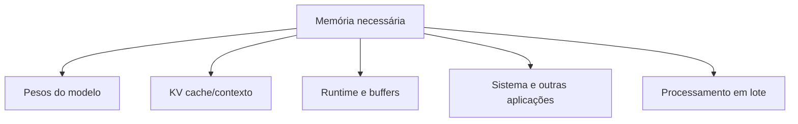
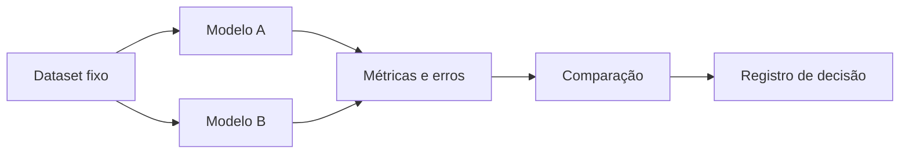

# Encontro 05 — Seleção, requisitos e quantização de modelos

## Tema

Abertura e licenciamento de modelos, famílias e variantes, model cards,
benchmarks, requisitos computacionais, quantização e seleção conforme tarefa,
infraestrutura e critérios de qualidade.

## Objetivos

- Diferenciar pesos abertos, código aberto, API pública e modelo proprietário.
- Reconhecer famílias, variantes e modelos especializados.
- Ler model cards e avaliar benchmarks criticamente.
- Analisar licenças, limitações e adequação ao idioma e à tarefa.
- Relacionar tamanho do modelo ao consumo de memória e desempenho.
- Compreender precisão numérica e quantização em nível aplicado.
- Diferenciar memória dos pesos, contexto e estruturas de execução.
- Estimar requisitos sem prometer precisão indevida.
- Elaborar uma comparação técnica baseada em evidências e requisitos.

## Visão geral

Depois de estudar o comportamento e as limitações dos LLMs no Encontro 04, é
necessário transformar essas observações em critérios de seleção. Primeiro são
examinados finalidade, variante, licença, model card e evidências de avaliação;
depois, verifica-se se os candidatos cabem no ambiente e atendem ao tempo de
resposta esperado.

Não existe “melhor modelo” fora de um cenário. Um modelo maior pode apresentar
melhor resultado em determinada tarefa, mas ser inadequado se demora demais,
não cabe na memória ou viola a licença do projeto.

## Pergunta central

O que significa dizer que um modelo é “aberto” e quais evidências permitem
decidir se ele pode ser usado em uma aplicação real?

## Termos que não devem ser confundidos



A abertura não é binária: cada artefato possui disponibilidade, licença e
obrigações próprias.

### Modelo proprietário acessado por API

O usuário envia entradas a um serviço e recebe saídas, mas normalmente não
obtém os pesos nem executa o modelo em infraestrutura própria.

### Pesos abertos

Os arquivos com parâmetros treinados podem ser obtidos, sujeitos à licença. A
disponibilidade dos pesos não garante que dados, código de treinamento e todo o
processo sejam abertos.

Os **pesos** são os valores numéricos dos parâmetros aprendidos pelo modelo.
Quando um modelo é carregado para inferência, esses valores são colocados na
memória e usados nos cálculos que produzem a saída.

### Código aberto

O código é distribuído sob licença que permite uso, estudo, modificação e
redistribuição conforme suas condições. É necessário verificar separadamente a
licença do código, dos pesos e dos dados.

### Open source e open weights

Na prática, muitos modelos chamados informalmente de “open source” oferecem
pesos sob licenças próprias com restrições. A equipe deve registrar a licença
exata em vez de assumir liberdade irrestrita.

| Elemento | Pergunta de verificação |
|---|---|
| código | está disponível? sob qual licença? |
| pesos | podem ser baixados, modificados e redistribuídos? |
| dados | origem, permissão e composição são documentadas? |
| uso | há restrição comercial, de escala ou de finalidade? |
| derivados | podem ser distribuídos? quais avisos são obrigatórios? |

## Modelos fundacionais e especializados

### Modelo fundacional

É treinado de forma ampla e pode servir de base para diferentes tarefas. Pode
ser adaptado por prompting, fine-tuning ou outras técnicas.

**Fine-tuning** é um treinamento adicional realizado sobre um modelo já
treinado para adaptar seu comportamento a uma tarefa, domínio ou conjunto de
exemplos. Ele altera os parâmetros do modelo, diferentemente do prompting, que
apenas fornece instruções e contexto durante a inferência.

### Modelo de propósito geral

Busca atender tarefas variadas: conversa, resumo, extração, explicação e código.
Essa amplitude não garante que seja o melhor em um domínio específico.

### Modelo especializado

É otimizado ou ajustado para um domínio ou tarefa, como código, embeddings,
saúde ou um idioma. A especialização deve ser validada para o caso real.

### Modelo base e modelo instruction-tuned

- modelo base prevê continuações, sem necessariamente seguir pedidos de conversa;
- modelo ajustado a instruções foi adaptado para responder a comandos;
- uma aplicação de chat geralmente prefere uma variante preparada para instruções.

### Variações multimodais nas famílias

Processam mais de uma modalidade. É necessário confirmar exatamente quais
entradas e saídas a variante suporta; o nome de uma família não garante que
todas as versões sejam multimodais.

## Famílias e variantes

Uma família pode conter versões diferentes em:

- quantidade de parâmetros;
- arquitetura ou geração;
- tamanho da janela de contexto;
- variante base ou ajustada;
- idioma ou domínio;
- precisão numérica e quantização;
- suporte a ferramentas ou saída estruturada.

**Quantização** é a representação dos pesos com menor precisão numérica para
reduzir requisitos de memória e, em alguns ambientes, acelerar a execução. Ela
pode afetar a qualidade e será estudada de forma aplicada mais adiante neste
encontro.

O nome completo da variante precisa ser registrado. Comparar apenas o nome da
família pode levar a conclusões erradas.



### Mapa para nomear uma variante sem ambiguidade



## O que é um model card?

Model card é um documento que descreve características, usos, avaliação e
limitações de um modelo. A qualidade varia entre projetos, portanto a ausência
de uma informação também é um dado relevante.



### Informações essenciais

1. nome, versão e autoria;
2. licença dos pesos;
3. arquitetura e tamanho;
4. contexto suportado;
5. idiomas e domínios;
6. formato e requisitos de execução;
7. usos pretendidos e usos desaconselhados;
8. datasets ou processo de treinamento, quando informados;
9. avaliações e benchmarks;
10. riscos, vieses e limitações;
11. template de prompt esperado;
12. histórico de atualização.

## Como ler benchmarks criticamente

Um número isolado não responde se o modelo funcionará no projeto.



Pergunte:

- a tarefa medida é parecida com a aplicação?
- o idioma e o domínio são os mesmos?
- a configuração de inferência foi equivalente?
- houve contaminação entre treinamento e teste?
- o resultado foi reproduzido independentemente?
- a métrica mede correção, preferência ou apenas estilo?
- qual foi o custo de memória e latência?

### Benchmark não substitui avaliação local

O modelo escolhido deve ser testado com exemplos representativos do sistema.
Uma central de chamados em português possui vocabulário, categorias e erros
diferentes de um benchmark geral em inglês.

## Licenças: perguntas práticas

Antes de incorporar um modelo, registre:

- o uso educacional é permitido?
- o uso comercial é permitido?
- existe limite de usuários ou porte da organização?
- redistribuição dos pesos ou derivados é permitida?
- atribuição ou aviso é obrigatório?
- existem restrições de uso aceitável?
- a licença é compatível com o modo de distribuição do projeto?

Esta verificação não substitui análise jurídica. Ela evita que a equipe trate a
licença como detalhe posterior.

## Privacidade e execução local

Executar localmente pode evitar o envio do prompt a um provedor externo e
oferecer controle sobre versão e disponibilidade. Porém, ainda é preciso:

- proteger o endpoint do servidor de inferência;
- limitar logs e retenção;
- controlar quem acessa os dados;
- atualizar imagens e dependências;
- verificar a licença;
- avaliar respostas, vieses e ataques.

## Processo de seleção em camadas



### Matriz visual de decisão



As posições são ilustrativas. A turma deve substituí-las por evidências e
critérios explícitos, nunca por preferência pessoal.

### Restrições eliminatórias

Um modelo pode ser descartado antes de benchmarks se:

- a licença impedir o uso pretendido;
- não executar no hardware disponível;
- não suportar o idioma ou a modalidade necessária;
- não aceitar o contexto mínimo;
- exigir envio de dados incompatível com a política de privacidade.

## Oficina: leitura comparativa de model cards

Em grupos de 3 ou 4 integrantes, analise duas variantes de modelos disponíveis
em catálogo público ou no ambiente local.

### Ficha de análise

| Critério | Modelo A | Modelo B | Evidência/fonte |
|---|---|---|---|
| nome e versão | | | |
| variante base/instrução | | | |
| licença | | | |
| parâmetros/tamanho | | | |
| contexto | | | |
| idiomas | | | |
| requisitos | | | |
| usos recomendados | | | |
| limitações | | | |
| avaliação relevante | | | |
| informação ausente | | | |

### Cenário de decisão

Considere uma aplicação acadêmica em português, executada localmente, que
classifica solicitações em dez categorias e deve responder em JSON. Com base
apenas em evidências documentadas:

1. qual modelo seria testado primeiro?
2. qual requisito eliminou ou enfraqueceu o outro candidato?
3. que informação ainda precisa ser confirmada por experimento?
4. qual risco precisa ser registrado?

### Produto

Um registro de decisão curto:

```text
Contexto:
Critérios obrigatórios:
Candidatos:
Evidências:
Decisão provisória:
Riscos e lacunas:
Próximo experimento:
```

## Erros comuns na análise documental

### Escolher somente pelo número de parâmetros

Mais parâmetros podem aumentar requisitos sem garantir melhor resultado na
tarefa específica.

### Confiar apenas no nome da família

Variantes possuem finalidade, licença, contexto e quantização diferentes.

### Ignorar o template de conversa

Um formato incompatível pode degradar respostas mesmo quando o modelo é bom.

### Tratar benchmark como verdade universal

Resultados dependem de dataset, métrica, configuração e domínio.

### Confundir disponibilidade com permissão

Ser possível baixar um arquivo não significa que qualquer uso ou redistribuição
esteja autorizado.


## Vocabulário essencial

### Parâmetro

Valor numérico aprendido durante o treinamento. A quantidade de parâmetros
ajuda a estimar porte, mas não determina sozinha qualidade ou memória total.

### Peso

É o valor armazenado em cada parâmetro aprendido. No uso cotidiano, expressões
como “pesos do modelo” referem-se ao conjunto desses valores distribuído em
arquivos e carregado pelo servidor de inferência.

### Precisão numérica

Forma usada para representar valores, como 32 ou 16 bits. Menos bits costumam
reduzir memória, mas podem alterar precisão, compatibilidade e desempenho.

### Quantização

Técnica que representa pesos — e, conforme o método, outras partes — com menor
precisão. Ela permite executar modelos em hardware mais limitado, com possíveis
perdas de qualidade e diferentes ganhos de velocidade.

### CPU, GPU e aceleradores

- CPU é geral e amplamente disponível, porém pode gerar mais lentamente;
- GPU executa muitas operações em paralelo, mas possui memória própria limitada;
- aceleradores e APIs variam conforme sistema, biblioteca e fabricante;
- suporte teórico não garante que uma configuração específica seja eficiente.

### Runtime de inferência

É o software responsável por executar os cálculos do modelo no hardware
disponível. Ele gerencia carregamento, memória, formatos, otimizações e geração.
O mesmo modelo pode apresentar consumo e velocidade diferentes em runtimes
distintos.

## Estimativa inicial da memória dos pesos

Uma aproximação didática para pesos sem considerar sobrecargas é:

```text
memória dos pesos ≈ quantidade de parâmetros × bits por parâmetro ÷ 8
```

Exemplo hipotético para 8 bilhões de parâmetros:

| Representação idealizada | Cálculo | Pesos aproximados |
|---|---:|---:|
| 32 bits | 8 bi × 32 ÷ 8 | 32 GB |
| 16 bits | 8 bi × 16 ÷ 8 | 16 GB |
| 8 bits | 8 bi × 8 ÷ 8 | 8 GB |
| 4 bits | 8 bi × 4 ÷ 8 | 4 GB |

Esses valores não representam a memória total. Formato do arquivo, metadados,
buffers, runtime, contexto e implementação adicionam consumo. Algumas técnicas
também não armazenam todos os elementos exatamente com a mesma quantidade de
bits.

## De onde vem o consumo total?



### Pesos

Normalmente constituem grande parte do consumo fixo após carregar o modelo.

### Contexto e KV cache

Durante a inferência, o servidor mantém informações relacionadas aos tokens já
processados. Contextos maiores podem elevar consideravelmente o consumo.

### Runtime e buffers

Bibliotecas, kernels, conversões e buffers de trabalho também precisam de
memória.

### Concorrência

Atender várias solicitações simultaneamente pode exigir mais memória e reduzir
a vazão percebida. Um teste com um único usuário não representa uma turma ou um
sistema publicado.

## Quantização na prática

Quantizações são identificadas por formatos e convenções próprios das
ferramentas. Não se deve concluir qualidade apenas pelo número presente no nome.

### Benefícios possíveis

- menor uso de memória;
- execução em equipamentos mais acessíveis;
- carregamento e distribuição mais simples;
- em certos ambientes, maior velocidade.

### Custos possíveis

- perda de qualidade, especialmente em tarefas sensíveis;
- instabilidade em formatos estruturados ou raciocínios longos;
- incompatibilidade com determinada biblioteca ou hardware;
- velocidade inferior ao esperado por falta de otimização;
- diferença de resultado entre métodos com “mesma quantidade de bits”.

### Regra de engenharia

A quantização não deve ser escolhida somente porque cabe. Ela precisa ser
avaliada com o mesmo conjunto de testes usado para selecionar o modelo.

## Métricas de execução

### Tempo até o primeiro token

Intervalo entre a requisição e o início visível da resposta. Afeta a sensação de
responsividade.

### Tokens por segundo

Taxa aproximada de geração após o início. Deve ser interpretada junto ao tamanho
da resposta e à configuração.

### Latência total

Tempo desde a requisição até a conclusão, incluindo fila, processamento da
entrada e geração.

### Vazão

Quantidade de trabalho atendida em um período. Um sistema pode ter boa velocidade
individual e baixa vazão sob concorrência.

### Memória máxima

Maior consumo observado durante carga e inferência. Deve deixar margem para o
sistema operacional e outros serviços.

## Fatores que afetam desempenho

- quantidade de parâmetros;
- quantização e formato;
- tamanho do prompt e da resposta;
- janela configurada;
- CPU, GPU, memória e largura de banda;
- runtime e versão;
- número de usuários simultâneos;
- uso de streaming;
- aquecimento e cache;
- tarefas concorrentes no equipamento.

## Matriz de seleção

Comece pelos requisitos do sistema, não pelos modelos.

### Exemplo de requisitos

```text
Tarefa: classificar chamados em dez categorias.
Idioma: português.
Saída: JSON conforme schema.
Infraestrutura: execução local em equipamento compartilhado.
Latência desejada: adequada a interação humana.
Privacidade: texto não pode sair da rede institucional.
Licença: compatível com distribuição acadêmica do protótipo.
```

### Critérios eliminatórios e classificatórios

| Critério | Tipo | Como verificar |
|---|---|---|
| licença compatível | eliminatório | licença oficial |
| execução local | eliminatório | formato/runtime |
| memória disponível | eliminatório | carga e medição |
| JSON válido | classificatório | dataset de testes |
| acerto de categoria | classificatório | métrica definida |
| latência | classificatório | medição repetida |
| uso de memória | classificatório | monitoramento |

### Decisão ponderada

Pesos podem ajudar, desde que não ocultem critérios eliminatórios.

| Critério | Peso | Candidato A | Candidato B |
|---|---:|---:|---:|
| qualidade na tarefa | 40% | | |
| latência | 20% | | |
| memória | 15% | | |
| estabilidade do JSON | 15% | | |
| documentação/manutenção | 10% | | |

Uma nota agregada não transforma uma avaliação limitada em verdade. Registre
dataset, versão, parâmetros e incertezas.

## Desenho de um experimento justo

Para comparar candidatos:

1. fixe o conjunto de entradas;
2. use o mesmo objetivo e contrato de saída;
3. registre template e parâmetros;
4. realize aquecimento antes das medições;
5. repita execuções;
6. registre erros e respostas inválidas;
7. meça qualidade e desempenho;
8. altere uma variável por vez quando possível;
9. preserve resultados brutos para auditoria;
10. documente limitações do ambiente.



## Oficina: plano de seleção para três cenários

Em grupo, escolha um dos cenários a seguir.

### Cenário A — classificação local

Textos curtos em português, dez categorias e resposta JSON. Prioridades:
privacidade, estabilidade do formato e baixa latência.

### Cenário B — assistente documental

Respostas a partir de regulamentos extensos. Prioridades: contexto, fidelidade
às fontes e memória suficiente para recuperação e geração.

### Cenário C — apoio à programação

Explicação e revisão de código TypeScript. Prioridades: qualidade técnica,
tamanho do contexto e tempo de resposta aceitável.

### Entrega do grupo

Preencher:

1. tarefa e usuário;
2. critérios eliminatórios;
3. três métricas de qualidade;
4. três métricas operacionais;
5. dois candidatos ou perfis de candidato;
6. quantizações a testar;
7. riscos de uma escolha inadequada;
8. procedimento de comparação;
9. condição para escolher um modelo menor;
10. evidência ainda ausente.

## Exemplo de registro de execução

```text
Data:
Equipamento:
Sistema operacional:
Runtime e versão:
Modelo e variante:
Arquivo/quantização:
Contexto configurado:
Parâmetros de geração:
Dataset:
Tempo até primeiro token:
Latência total:
Memória máxima:
Qualidade/erros:
Observações:
```

Não registrar identificadores sensíveis, credenciais ou conteúdo privado.

## Erros comuns na avaliação operacional

### Usar apenas a memória dos pesos

O processo precisa de memória adicional para contexto, runtime e sistema.

### Comparar modelos com prompts diferentes sem registrar

Não será possível saber se a diferença veio do modelo ou da configuração.

### Medir apenas velocidade

Um modelo rápido que produz JSON inválido ou classificações ruins não atende à
tarefa.

### Escolher a maior janela disponível

Contexto configurado acima da necessidade pode aumentar consumo sem benefício.

### Generalizar a partir de uma execução

Latência e respostas variam. Repita, resuma a distribuição e registre falhas.

## Questões para revisão

1. Qual é a diferença entre pesos abertos e código aberto?
2. O que diferencia um modelo base de um modelo ajustado a instruções?
3. Por que bons resultados em benchmarks não dispensam a avaliação local?
4. Quais evidências mínimas devem sustentar a seleção de um modelo?
5. Por que a fórmula dos pesos é apenas uma aproximação?
6. Que componentes consomem memória além dos pesos?
7. Quais são os benefícios e custos da quantização?
8. Qual a diferença entre latência e vazão?
9. Por que critérios eliminatórios vêm antes da pontuação ponderada?
10. Como tornar uma comparação reproduzível?

## Checklist de aprendizagem

- [ ] usar terminologia precisa ao falar de abertura;
- [ ] localizar a licença e a versão exata de uma variante;
- [ ] extrair informações essenciais de um model card;
- [ ] avaliar criticamente um benchmark;
- [ ] aplicar restrições antes de comparar qualidade;
- [ ] estimar a ordem de grandeza da memória dos pesos;
- [ ] explicar por que contexto e concorrência aumentam consumo;
- [ ] descrever quantização sem tratá-la como compressão sem perdas;
- [ ] definir métricas de qualidade e desempenho;
- [ ] planejar comparação justa entre candidatos;
- [ ] justificar quando um modelo menor é a melhor escolha.

## Síntese do encontro

Selecionar um modelo exige combinar evidências documentais e experimentais.
Finalidade, variante, licença, privacidade e resultados locais precisam ser
avaliados junto com memória, latência, vazão e manutenção. A decisão não deve se
basear apenas em popularidade, tamanho ou posição em rankings.

## Preparação para o próximo encontro

No próximo encontro será configurado o ambiente local de inferência. Antes da
aula, verificar espaço em disco, versão do Docker quando utilizado e acesso ao
terminal. O modelo exato será definido conforme a infraestrutura disponível.
