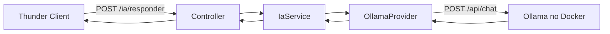
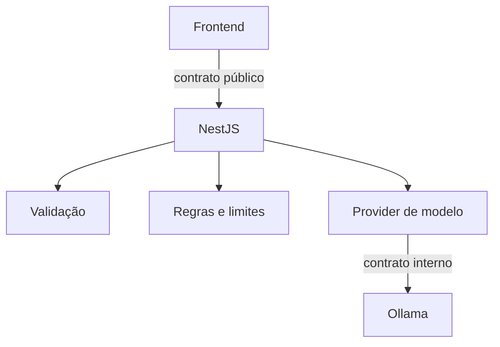
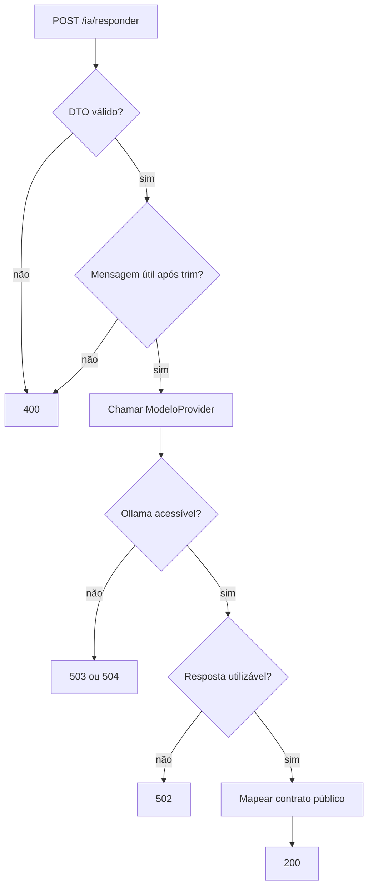

# Encontro 06 — NestJS consumindo inferência local

## Tema

Implementação passo a passo de uma API NestJS que valida uma mensagem, consulta
o Ollama executado no Docker e devolve ao cliente um contrato simplificado.

## Objetivos

- Explicar por que o frontend deve acessar o modelo por meio do backend.
- Separar controller, serviço de aplicação e cliente do Ollama.
- Configurar URL, modelo e timeout fora do código-fonte.
- Validar o corpo da requisição antes de chamar a inferência.
- Traduzir o contrato do Ollama para o contrato público da aplicação.
- Diferenciar entrada inválida, timeout e indisponibilidade.
- Testar o endpoint pelo Thunder Client.

## Resultado esperado

Ao final, a aplicação terá este fluxo:



O endpoint público receberá:

```json
{
  "mensagem": "Explique o que é injeção de dependência."
}
```

E devolverá um contrato controlado pelo backend:

```json
{
  "resposta": "...",
  "modelo": "llama3.2:latest",
  "uso": {
    "tokensEntrada": 18,
    "tokensSaida": 64
  }
}
```

## Por que colocar o NestJS entre o frontend e o Ollama?

No Encontro 05, o navegador chamou o Ollama diretamente para tornar o fluxo
HTTP visível. Essa arquitetura é adequada apenas para a demonstração. O backend
precisa assumir responsabilidades que não devem ser controladas pelo usuário:

- autenticação e autorização;
- escolha do modelo permitido;
- construção das instruções internas;
- validação da entrada e da saída;
- timeout e limites de uso;
- logs, métricas e auditoria;
- ocultação do endereço da infraestrutura;
- troca futura do provedor sem alterar o frontend.



## Organização da implementação

Serão criados estes arquivos:

```text
src/
├── app.module.ts
├── main.ts
└── ia/
    ├── dto/
    │   └── responder.dto.ts
    ├── providers/
    │   ├── modelo.provider.ts
    │   └── ollama.provider.ts
    ├── ia.controller.ts
    ├── ia.service.ts
    └── ia.module.ts
```

Cada arquivo terá uma responsabilidade. Evite colocar a chamada HTTP, a
validação e o mapeamento da resposta diretamente no controller.

## Passo 1 — confirmar os pré-requisitos

Antes de alterar o NestJS, confirme o Ollama:

```bash
docker compose ps
docker compose exec ollama ollama list
```

No Thunder Client, execute `GET http://localhost:11434/api/tags`. Copie o nome
completo do modelo, incluindo sua tag. Se o Ollama não responder diretamente,
resolva essa camada antes de depurar o backend.

### Por que começar pelo Ollama?

O NestJS depende desse serviço. Testar a dependência isoladamente reduz o espaço
de busca: se ela já falha, ainda não existe evidência de erro no código NestJS.

## Passo 2 — instalar as dependências

Na pasta do backend:

```bash
npm install @nestjs/axios axios
npm install @nestjs/config
npm install class-validator class-transformer
```

### Por que cada dependência existe?

| Dependência | Motivo |
|---|---|
| `@nestjs/axios` | integra o cliente HTTP Axios ao sistema de módulos e injeção do NestJS |
| `axios` | executa efetivamente a chamada HTTP |
| `@nestjs/config` | centraliza configurações obtidas do ambiente |
| `class-validator` | declara regras de validação no DTO |
| `class-transformer` | auxilia a transformação usada pelo `ValidationPipe` |

Não instale uma biblioteca de Ollama neste momento. Consumir a API HTTP
explicitamente ajuda a compreender o contrato e reduz dependências específicas.

## Passo 3 — criar a configuração do ambiente

Crie `.env.example`:

```dotenv
OLLAMA_BASE_URL=http://localhost:11434
OLLAMA_MODEL=llama3.2:latest
OLLAMA_TIMEOUT_MS=30000
```

Crie também o `.env` local com o modelo realmente instalado. O arquivo `.env`
não deve ser enviado ao Git.

### Por que não escrever esses valores no provider?

- a URL muda entre execução local e Docker;
- o modelo pode variar conforme o hardware;
- o timeout pode ser diferente em desenvolvimento e produção;
- alterar configuração não deve exigir recompilar o código.

Se o NestJS executar no host e o Ollama no Docker com a porta publicada, use
`http://localhost:11434`. Se ambos estiverem no mesmo Compose, o backend deverá
usar o nome do serviço, normalmente `http://ollama:11434`.

## Passo 4 — carregar a configuração no `AppModule`

Atualize `src/app.module.ts`:

```ts
import { Module } from '@nestjs/common';
import { ConfigModule } from '@nestjs/config';
import { IaModule } from './ia/ia.module';

@Module({
  imports: [
    ConfigModule.forRoot({
      isGlobal: true,
    }),
    IaModule,
  ],
})
export class AppModule {}
```

### Explicação do código

- `ConfigModule.forRoot()` carrega as variáveis do processo e, por padrão, o
  arquivo `.env` do diretório da aplicação;
- `isGlobal: true` permite injetar `ConfigService` em outros módulos sem repetir
  a importação;
- `IaModule` agrupa os componentes relacionados à funcionalidade de IA;
- `imports` declara módulos dos quais o `AppModule` depende.

Uma evolução para produção deve validar as variáveis durante a inicialização.
Falhar cedo é melhor do que descobrir uma configuração ausente durante a
requisição de um usuário.

## Passo 5 — habilitar a validação global

Atualize `src/main.ts`:

```ts
import { ValidationPipe } from '@nestjs/common';
import { NestFactory } from '@nestjs/core';
import { AppModule } from './app.module';

async function bootstrap() {
  const app = await NestFactory.create(AppModule);

  app.useGlobalPipes(
    new ValidationPipe({
      whitelist: true,
      forbidNonWhitelisted: true,
      transform: true,
    }),
  );

  await app.listen(process.env.PORT ?? 3000);
}

void bootstrap();
```

### Explicação do código

- `NestFactory.create(AppModule)` inicializa a árvore de módulos;
- `useGlobalPipes` faz todos os controllers passarem pelo mesmo processo de
  validação;
- `whitelist` mantém somente propriedades declaradas no DTO;
- `forbidNonWhitelisted` rejeita propriedades extras em vez de ignorá-las;
- `transform` permite transformar o objeto recebido para a classe do DTO;
- `app.listen` inicia o servidor na porta configurada ou na porta `3000`;
- `void bootstrap()` sinaliza que a Promise de inicialização foi disparada
  intencionalmente.

## Passo 6 — criar o DTO de entrada

Crie `src/ia/dto/responder.dto.ts`:

```ts
import { IsString, MaxLength, MinLength } from 'class-validator';

export class ResponderDto {
  @IsString()
  @MinLength(1)
  @MaxLength(2000)
  mensagem!: string;
}
```

### Explicação do código

- o DTO define o contrato aceito pelo endpoint;
- `@IsString()` rejeita números, objetos e arrays;
- `@MinLength(1)` impede uma string vazia;
- `@MaxLength(2000)` limita abuso e consumo acidental;
- `!` informa ao TypeScript que o NestJS preencherá a propriedade após construir
  e validar o DTO.

O limite considera caracteres, não tokens. Espaços serão removidos pelo service;
por isso, uma string contendo apenas espaços precisa de uma verificação adicional
na regra de aplicação.

## Passo 7 — definir a abstração do modelo

Crie `src/ia/providers/modelo.provider.ts`:

```ts
export interface GerarRespostaInput {
  mensagem: string;
}

export interface GerarRespostaOutput {
  resposta: string;
  modelo: string;
  tokensEntrada?: number;
  tokensSaida?: number;
}

export interface ModeloProvider {
  gerar(input: GerarRespostaInput): Promise<GerarRespostaOutput>;
}

export const MODELO_PROVIDER = Symbol('MODELO_PROVIDER');
```

### Por que criar essa abstração?

`IaService` precisa de uma capacidade — gerar uma resposta — e não dos detalhes
do Ollama. A interface:

- define entrada e saída internas com nomes da aplicação;
- impede que `prompt_eval_count` se espalhe pelo sistema;
- permite substituir Ollama por outro adaptador;
- possibilita um provider simulado nos testes.

`MODELO_PROVIDER` é um token de injeção. Interfaces TypeScript não existem em
tempo de execução; portanto, o container de dependências do NestJS precisa de um
valor concreto para identificar qual implementação deverá fornecer.

## Passo 8 — representar a resposta do Ollama

No início de `src/ia/providers/ollama.provider.ts`, será usada esta interface:

```ts
interface OllamaChatResponse {
  model: string;
  message?: {
    role: string;
    content: string;
  };
  done: boolean;
  prompt_eval_count?: number;
  eval_count?: number;
}
```

### Por que existe outro contrato?

Esse tipo representa o formato externo. Ele utiliza os nomes devolvidos pelo
Ollama. O provider converterá esse formato para `GerarRespostaOutput`.

Uma interface TypeScript auxilia o compilador, mas não valida dados em tempo de
execução. Por isso, o código ainda verificará se `message.content` existe.

## Passo 9 — implementar o `OllamaProvider`

Crie `src/ia/providers/ollama.provider.ts`:

```ts
import { HttpService } from '@nestjs/axios';
import {
  BadGatewayException,
  GatewayTimeoutException,
  Injectable,
  ServiceUnavailableException,
} from '@nestjs/common';
import { ConfigService } from '@nestjs/config';
import axios from 'axios';
import {
  GerarRespostaInput,
  GerarRespostaOutput,
  ModeloProvider,
} from './modelo.provider';

interface OllamaChatResponse {
  model: string;
  message?: {
    role: string;
    content: string;
  };
  done: boolean;
  prompt_eval_count?: number;
  eval_count?: number;
}

@Injectable()
export class OllamaProvider implements ModeloProvider {
  constructor(
    private readonly http: HttpService,
    private readonly config: ConfigService,
  ) {}

  async gerar(input: GerarRespostaInput): Promise<GerarRespostaOutput> {
    const baseUrl = this.config.getOrThrow<string>('OLLAMA_BASE_URL');
    const model = this.config.getOrThrow<string>('OLLAMA_MODEL');
    const timeout = Number(
      this.config.get<string>('OLLAMA_TIMEOUT_MS') ?? '30000',
    );

    try {
      const response = await this.http.axiosRef.post<OllamaChatResponse>(
        `${baseUrl}/api/chat`,
        {
          model,
          messages: [
            {
              role: 'user',
              content: input.mensagem,
            },
          ],
          stream: false,
        },
        { timeout },
      );

      const content = response.data.message?.content?.trim();

      if (!content) {
        throw new BadGatewayException('Resposta inválida do modelo');
      }

      return {
        resposta: content,
        modelo: response.data.model,
        tokensEntrada: response.data.prompt_eval_count,
        tokensSaida: response.data.eval_count,
      };
    } catch (error: unknown) {
      if (error instanceof BadGatewayException) {
        throw error;
      }

      if (axios.isAxiosError(error)) {
        if (error.code === 'ECONNABORTED' || error.code === 'ETIMEDOUT') {
          throw new GatewayTimeoutException(
            'Tempo limite da inferência excedido',
          );
        }

        if (error.code === 'ECONNREFUSED') {
          throw new ServiceUnavailableException(
            'Servidor de IA indisponível',
          );
        }
      }

      throw new BadGatewayException('Falha ao consultar o modelo');
    }
  }
}
```

### Explicação por partes

#### `@Injectable()` e construtor

`@Injectable()` permite que o NestJS construa a classe e injete `HttpService` e
`ConfigService`. O provider não cria manualmente clientes ou lê arquivos.

#### Configuração

`getOrThrow` interrompe a operação quando URL ou modelo não existem. O operador
`??` fornece 30 segundos somente quando o timeout não foi configurado. `Number`
converte a variável de ambiente, originalmente textual.

#### Chamada HTTP

`axiosRef.post` é usado porque permite trabalhar diretamente com `async/await`.
O generic `OllamaChatResponse` descreve o corpo esperado da resposta. O objeto
enviado reproduz o contrato testado no Encontro 05 e desativa streaming para
obter um único JSON.

#### Verificação da resposta

`?.` impede erro ao acessar uma propriedade ausente. `trim()` remove espaços
externos. Uma resposta HTTP bem-sucedida sem conteúdo utilizável é tratada como
falha do gateway, pois o backend não recebeu o contrato necessário.

#### Mapeamento

O retorno troca nomes externos por nomes internos:

| Ollama | Aplicação |
|---|---|
| `message.content` | `resposta` |
| `model` | `modelo` |
| `prompt_eval_count` | `tokensEntrada` |
| `eval_count` | `tokensSaida` |

#### Tratamento de erros

- `BadGatewayException` já criada pelo código deve ser preservada;
- `axios.isAxiosError` verifica se o erro veio do cliente HTTP;
- timeout se torna HTTP 504;
- conexão recusada se torna HTTP 503;
- outras falhas do provedor se tornam HTTP 502;
- detalhes internos não são devolvidos ao cliente.

O exemplo não registra prompts ou respostas em logs, pois podem conter dados
pessoais ou sigilosos.

## Passo 10 — implementar o service

Crie `src/ia/ia.service.ts`:

```ts
import { BadRequestException, Inject, Injectable } from '@nestjs/common';
import {
  GerarRespostaOutput,
  MODELO_PROVIDER,
  ModeloProvider,
} from './providers/modelo.provider';

@Injectable()
export class IaService {
  constructor(
    @Inject(MODELO_PROVIDER)
    private readonly modelo: ModeloProvider,
  ) {}

  responder(mensagem: string): Promise<GerarRespostaOutput> {
    const mensagemNormalizada = mensagem.trim();

    if (!mensagemNormalizada) {
      throw new BadRequestException('A mensagem não pode conter apenas espaços');
    }

    return this.modelo.gerar({ mensagem: mensagemNormalizada });
  }
}
```

### Explicação do código

- `@Inject(MODELO_PROVIDER)` associa a abstração a uma implementação registrada
  no módulo;
- o service não importa `OllamaProvider`, reduzindo o acoplamento;
- `trim()` normaliza a mensagem em um único ponto;
- a verificação adicional cobre a string formada somente por espaços;
- o service coordena a regra e delega a inferência ao provider.

## Passo 11 — implementar o controller

Crie `src/ia/ia.controller.ts`:

```ts
import { Body, Controller, Post } from '@nestjs/common';
import { ResponderDto } from './dto/responder.dto';
import { IaService } from './ia.service';

@Controller('ia')
export class IaController {
  constructor(private readonly iaService: IaService) {}

  @Post('responder')
  async responder(@Body() dto: ResponderDto) {
    const resultado = await this.iaService.responder(dto.mensagem);

    return {
      resposta: resultado.resposta,
      modelo: resultado.modelo,
      uso: {
        tokensEntrada: resultado.tokensEntrada,
        tokensSaida: resultado.tokensSaida,
      },
    };
  }
}
```

### Explicação do código

- `@Controller('ia')` cria o prefixo `/ia`;
- `@Post('responder')` completa a rota `/ia/responder`;
- `@Body()` solicita que o NestJS converta o JSON para o DTO;
- o controller delega a regra ao service;
- o objeto retornado define o contrato público;
- campos internos do Axios e do Ollama não chegam ao cliente.

Controllers devem permanecer pequenos: protocolo HTTP entra, a aplicação é
chamada e o contrato público sai.

## Passo 12 — registrar os componentes no módulo

Crie `src/ia/ia.module.ts`:

```ts
import { HttpModule } from '@nestjs/axios';
import { Module } from '@nestjs/common';
import { IaController } from './ia.controller';
import { IaService } from './ia.service';
import {
  MODELO_PROVIDER,
} from './providers/modelo.provider';
import { OllamaProvider } from './providers/ollama.provider';

@Module({
  imports: [HttpModule],
  controllers: [IaController],
  providers: [
    IaService,
    {
      provide: MODELO_PROVIDER,
      useClass: OllamaProvider,
    },
  ],
})
export class IaModule {}
```

### Explicação do código

- `HttpModule` disponibiliza `HttpService` para injeção;
- `controllers` registra quem recebe as requisições;
- `providers` registra o service e o adaptador;
- `provide` declara o token solicitado pelo `IaService`;
- `useClass` informa que `OllamaProvider` implementará esse token.

Essa associação pode ser trocada em testes ou em outra infraestrutura sem
alterar controller e service.

## Passo 13 — iniciar a aplicação

Com o Ollama em execução no Docker:

```bash
npm run start:dev
```

O terminal deve indicar que a rota foi mapeada. Se a aplicação falhar durante a
inicialização, verifique dependências, imports e variáveis antes de testar a API.

## Passo 14 — testar pelo Thunder Client

Crie uma coleção `API NestJS` e uma requisição:

| Campo | Valor |
|---|---|
| nome | `Responder com IA` |
| método | `POST` |
| URL | `http://localhost:3000/ia/responder` |
| header | `Content-Type: application/json` |
| body | `JSON` |

```json
{
  "mensagem": "Explique em duas frases o que é um DTO."
}
```

Selecione **Send** e confirme:

1. status HTTP `200`;
2. presença de `resposta` e `modelo`;
3. presença de `uso.tokensEntrada` e `uso.tokensSaida`;
4. ausência de `prompt_eval_count`, `eval_count` e outros campos internos.

### Por que testar primeiro o contrato de sucesso?

Ele confirma a integração completa. Depois disso, os testes negativos isolam
as regras de validação e o tratamento de infraestrutura.

## Passo 15 — executar testes negativos

Duplique a requisição no Thunder Client e execute:

| Caso | Corpo ou condição | Resultado esperado |
|---|---|---|
| mensagem ausente | `{}` | `400 Bad Request` |
| tipo incorreto | `{"mensagem": 123}` | `400 Bad Request` |
| campo adicional | `{"mensagem":"Olá","modelo":"outro"}` | `400 Bad Request` |
| somente espaços | `{"mensagem":"   "}` | `400 Bad Request` |
| modelo inexistente | alterar temporariamente `OLLAMA_MODEL` | `502 Bad Gateway` |
| Ollama indisponível | interromper o contêiner | `503 Service Unavailable` |
| timeout | usar temporariamente um limite muito baixo | `504 Gateway Timeout`, se reproduzido |

Para testar indisponibilidade em ambiente individual:

```bash
docker compose stop ollama
docker compose start ollama
```

Não interrompa um serviço compartilhado. Se o timeout não ocorrer, registre que
a condição não foi reproduzida em vez de inventar um resultado.

## Fluxo consolidado de sucesso e falha



## Passo 16 — testar o service sem modelo real

Um teste unitário deve substituir o provider por uma implementação controlada:

```ts
import { Test } from '@nestjs/testing';
import { IaService } from './ia.service';
import {
  MODELO_PROVIDER,
  ModeloProvider,
} from './providers/modelo.provider';

describe('IaService', () => {
  let service: IaService;
  let provider: jest.Mocked<ModeloProvider>;

  beforeEach(async () => {
    provider = {
      gerar: jest.fn(),
    };

    const moduleRef = await Test.createTestingModule({
      providers: [
        IaService,
        {
          provide: MODELO_PROVIDER,
          useValue: provider,
        },
      ],
    }).compile();

    service = moduleRef.get(IaService);
  });

  it('normaliza a mensagem e devolve o resultado do provider', async () => {
    provider.gerar.mockResolvedValue({
      resposta: 'Resposta simulada',
      modelo: 'modelo-de-teste',
      tokensEntrada: 10,
      tokensSaida: 4,
    });

    await expect(service.responder('  Olá  ')).resolves.toEqual({
      resposta: 'Resposta simulada',
      modelo: 'modelo-de-teste',
      tokensEntrada: 10,
      tokensSaida: 4,
    });

    expect(provider.gerar).toHaveBeenCalledWith({ mensagem: 'Olá' });
  });
});
```

### Por que usar `useValue` no teste?

O teste precisa controlar o comportamento do provider. `useValue` associa o
mesmo token de produção a um objeto simulado. Assim:

- não é necessário iniciar Docker ou carregar um modelo;
- a resposta é rápida e previsível;
- o teste verifica somente a regra do service;
- erros de infraestrutura ficam para testes de integração separados.

## O que registrar em logs

Quando necessário, registre:

- identificador de correlação;
- rota e status HTTP;
- modelo configurado;
- duração e timeout;
- contagens de tokens;
- categoria técnica da falha.

Evite registrar automaticamente prompt completo, resposta completa,
credenciais, documentos do usuário ou stack trace entregue ao frontend.

## Erros conceituais comuns

### Chamar o Ollama no controller

Isso mistura HTTP público, regra da aplicação e contrato externo.

### Permitir que o cliente escolha o modelo

O usuário poderia selecionar um modelo não autorizado ou incompatível com o
hardware disponível.

### Retornar a resposta completa do Axios

Isso expõe detalhes internos e acopla o frontend ao Ollama.

### Confundir interface com validação

Interfaces TypeScript desaparecem em tempo de execução. Dados externos ainda
precisam ser verificados.

### Não definir timeout

Uma geração pode manter conexão e recursos ocupados por tempo excessivo.

## Entrega individual

Entregue:

1. `.env.example` sem segredos;
2. arquivos do módulo `ia`;
3. captura da requisição válida no Thunder Client;
4. tabela dos testes negativos preenchida;
5. teste unitário do `IaService`;
6. identificação do modelo utilizado;
7. explicação curta da responsabilidade de DTO, controller, service e provider.

## Checklist de aprendizagem

- [ ] justificar a presença do backend entre frontend e Ollama;
- [ ] configurar URL, modelo e timeout externamente;
- [ ] validar o DTO e rejeitar propriedades extras;
- [ ] explicar o token `MODELO_PROVIDER`;
- [ ] encapsular `/api/chat` no `OllamaProvider`;
- [ ] mapear o contrato externo para o contrato interno;
- [ ] manter o controller independente do Ollama;
- [ ] distinguir erros 400, 502, 503 e 504;
- [ ] testar o service sem executar inferência real.

## Síntese do encontro

A implementação passo a passo evidencia que integrar IA não significa espalhar
chamadas HTTP. DTO, controller, service, provider e configuração possuem papéis
distintos. Essa separação torna a aplicação validável, testável e preparada para
trocar a infraestrutura sem modificar seu contrato público.

## Fontes oficiais de apoio

- [Módulo HTTP do NestJS](https://docs.nestjs.com/techniques/http-module)
- [Configuração no NestJS](https://docs.nestjs.com/techniques/configuration)
- [Validação no NestJS](https://docs.nestjs.com/techniques/validation)
- [Testes no NestJS](https://docs.nestjs.com/fundamentals/testing)
- [Rota de chat do Ollama](https://docs.ollama.com/api/chat)
