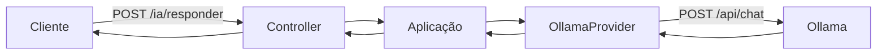
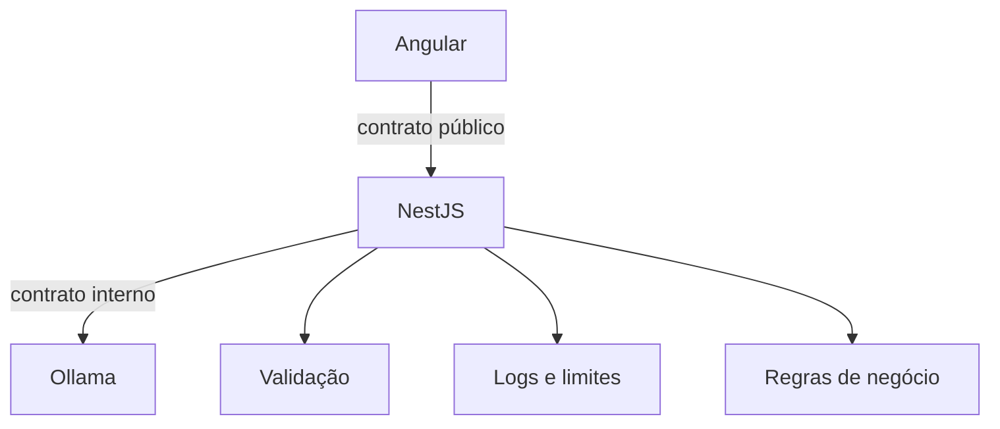
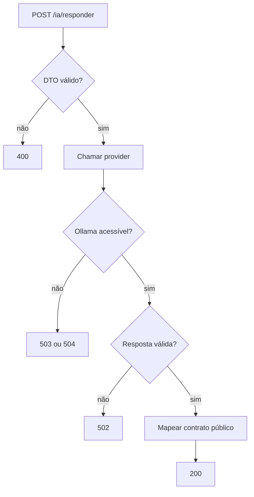

# Encontro 06 — NestJS consumindo inferência local

## Tema

Integração entre uma API NestJS e o Ollama por meio de configuração externa,
provider dedicado, DTO validado e tratamento explícito de falhas.

## Objetivos

- Explicar por que o frontend não deve acessar diretamente o modelo.
- Separar controller, regra de aplicação e cliente do servidor de inferência.
- Configurar URL, modelo e timeout fora do código-fonte.
- Implementar uma rota NestJS que consome `/api/chat`.
- Validar entrada, mapear resposta e traduzir erros de infraestrutura.
- Testar o backend sem depender continuamente de uma geração real.

## Visão geral

No Encontro 05, `curl` acumulou várias responsabilidades: montou a requisição,
chamou o Ollama e exibiu a resposta. Em uma aplicação, essas responsabilidades
precisam ser distribuídas.



O provider conhece o contrato do Ollama. O controller conhece o contrato
público da aplicação. Essa fronteira evita que campos internos do provedor
vazem para o frontend.

## Por que não chamar o Ollama pelo Angular?

Uma chamada direta pelo navegador:

- expõe endereço, modelo e detalhes de infraestrutura;
- dificulta autenticação, autorização e limites por usuário;
- permite que o cliente altere instruções e parâmetros;
- aumenta o risco de abuso do servidor;
- mistura contrato da interface com contrato do provedor;
- dificulta logs, auditoria, fallback e validação centralizada.



## Responsabilidades

| Componente | Responsabilidade |
|---|---|
| DTO | definir e validar a entrada pública |
| controller | receber HTTP e devolver o contrato público |
| service | coordenar a operação da aplicação |
| provider | adaptar o contrato interno para o Ollama |
| ConfigService | fornecer URL, modelo e timeout |
| filtro ou mapeamento de erro | impedir vazamento de detalhes internos |

## Contrato público inicial

### Requisição

```http
POST /ia/responder
Content-Type: application/json
```

```json
{
  "mensagem": "Explique o que é injeção de dependência."
}
```

### Resposta

```json
{
  "resposta": "...",
  "modelo": "identificador-configurado",
  "uso": {
    "tokensEntrada": 18,
    "tokensSaida": 64
  }
}
```

O cliente não precisa receber todos os campos retornados pelo Ollama. Durações
internas podem ser registradas pelo backend sem integrar o contrato público.

## Estrutura sugerida

```text
src/
└── ia/
    ├── dto/
    │   └── responder.dto.ts
    ├── providers/
    │   ├── modelo.provider.ts
    │   └── ollama.provider.ts
    ├── ia.controller.ts
    ├── ia.service.ts
    └── ia.module.ts
```

O nome `modelo.provider.ts` será usado para uma interface interna. Assim, a
regra de aplicação depende de uma abstração, não diretamente do Ollama.

## Dependências

```bash
npm install @nestjs/axios axios
npm install @nestjs/config
npm install class-validator class-transformer
```

O módulo HTTP oficial do NestJS encapsula Axios e fornece `HttpService`. Outras
bibliotecas seriam possíveis, mas a turma utilizará uma opção comum para manter
o exemplo uniforme.

## Configuração externa

### `.env.example`

```dotenv
OLLAMA_BASE_URL=http://localhost:11434
OLLAMA_MODEL=llama3.2
OLLAMA_TIMEOUT_MS=30000
```

Quando NestJS e Ollama estiverem no mesmo Compose, a URL normalmente será
`http://ollama:11434`. O valor pertence ao ambiente, não ao provider.

### Carregamento da configuração

```ts
import { Module } from '@nestjs/common';
import { ConfigModule } from '@nestjs/config';

@Module({
  imports: [
    ConfigModule.forRoot({
      isGlobal: true,
    }),
  ],
})
export class AppModule {}
```

Em produção, a presença e o formato das variáveis também devem ser validados na
inicialização. Falhar cedo é melhor do que descobrir a ausência do modelo na
primeira requisição de um usuário.

## Validação global

```ts
import { ValidationPipe } from '@nestjs/common';

app.useGlobalPipes(
  new ValidationPipe({
    whitelist: true,
    forbidNonWhitelisted: true,
    transform: true,
  }),
);
```

- `whitelist` remove campos sem decoradores;
- `forbidNonWhitelisted` rejeita campos inesperados;
- `transform` permite transformar valores conforme o DTO.

## DTO de entrada

```ts
import { IsString, MaxLength, MinLength } from 'class-validator';

export class ResponderDto {
  @IsString()
  @MinLength(1)
  @MaxLength(2000)
  mensagem!: string;
}
```

O limite de 2.000 caracteres é didático e deve ser ajustado ao caso de uso. Ele
não equivale a 2.000 tokens.

## Contratos internos

```ts
export interface GerarRespostaInput {
  mensagem: string;
}

export interface GerarRespostaOutput {
  resposta: string;
  modelo: string;
  tokensEntrada?: number;
  tokensSaida?: number;
}

export interface ModeloProvider {
  gerar(input: GerarRespostaInput): Promise<GerarRespostaOutput>;
}
```

A interface contém apenas o necessário para a aplicação. Nomes como
`prompt_eval_count` permanecem confinados ao adaptador do Ollama.

## Contrato do Ollama no provider

```ts
interface OllamaChatResponse {
  model: string;
  message: {
    role: string;
    content: string;
  };
  done: boolean;
  prompt_eval_count?: number;
  eval_count?: number;
}
```

Uma interface TypeScript ajuda o compilador, mas não valida dados recebidos em
tempo de execução. Em sistemas reais, a resposta externa também precisa de
validação.

## Implementação do `OllamaProvider`

```ts
import {
  BadGatewayException,
  GatewayTimeoutException,
  Injectable,
  ServiceUnavailableException,
} from '@nestjs/common';
import { HttpService } from '@nestjs/axios';
import { ConfigService } from '@nestjs/config';
import { AxiosError } from 'axios';

@Injectable()
export class OllamaProvider implements ModeloProvider {
  constructor(
    private readonly http: HttpService,
    private readonly config: ConfigService,
  ) {}

  async gerar(input: GerarRespostaInput): Promise<GerarRespostaOutput> {
    const baseUrl = this.config.getOrThrow<string>('OLLAMA_BASE_URL');
    const model = this.config.getOrThrow<string>('OLLAMA_MODEL');
    const timeout = Number(
      this.config.get<string>('OLLAMA_TIMEOUT_MS') ?? '30000',
    );

    try {
      const response = await this.http.axiosRef.post<OllamaChatResponse>(
        `${baseUrl}/api/chat`,
        {
          model,
          messages: [{ role: 'user', content: input.mensagem }],
          stream: false,
        },
        { timeout },
      );

      const content = response.data.message?.content?.trim();
      if (!content) {
        throw new BadGatewayException('Resposta inválida do modelo');
      }

      return {
        resposta: content,
        modelo: response.data.model,
        tokensEntrada: response.data.prompt_eval_count,
        tokensSaida: response.data.eval_count,
      };
    } catch (error: unknown) {
      if (error instanceof BadGatewayException) throw error;

      const axiosError = error as AxiosError;
      if (axiosError.code === 'ECONNABORTED') {
        throw new GatewayTimeoutException('Tempo limite da inferência excedido');
      }
      if (axiosError.code === 'ECONNREFUSED') {
        throw new ServiceUnavailableException('Servidor de IA indisponível');
      }
      throw new BadGatewayException('Falha ao consultar o modelo');
    }
  }
}
```

O exemplo não deve registrar o prompt nem a resposta em logs por padrão. Esses
campos podem conter dados pessoais ou sigilosos.

## Service da aplicação

```ts
import { Inject, Injectable } from '@nestjs/common';

export const MODELO_PROVIDER = Symbol('MODELO_PROVIDER');

@Injectable()
export class IaService {
  constructor(
    @Inject(MODELO_PROVIDER)
    private readonly modelo: ModeloProvider,
  ) {}

  responder(mensagem: string): Promise<GerarRespostaOutput> {
    return this.modelo.gerar({ mensagem: mensagem.trim() });
  }
}
```

## Controller

```ts
import { Body, Controller, Post } from '@nestjs/common';

@Controller('ia')
export class IaController {
  constructor(private readonly iaService: IaService) {}

  @Post('responder')
  async responder(@Body() dto: ResponderDto) {
    const resultado = await this.iaService.responder(dto.mensagem);

    return {
      resposta: resultado.resposta,
      modelo: resultado.modelo,
      uso: {
        tokensEntrada: resultado.tokensEntrada,
        tokensSaida: resultado.tokensSaida,
      },
    };
  }
}
```

## Módulo

```ts
import { HttpModule } from '@nestjs/axios';
import { Module } from '@nestjs/common';

@Module({
  imports: [HttpModule],
  controllers: [IaController],
  providers: [
    IaService,
    {
      provide: MODELO_PROVIDER,
      useClass: OllamaProvider,
    },
  ],
})
export class IaModule {}
```

Trocar `useClass` por outro adaptador permite testar outro servidor sem mudar o
controller nem a regra da aplicação.

## Teste manual do backend

```bash
curl http://localhost:3000/ia/responder \
  -H 'Content-Type: application/json' \
  -d '{
    "mensagem": "Explique em duas frases o que é um DTO."
  }'
```

Teste também:

1. corpo sem `mensagem`;
2. texto vazio;
3. campo adicional inesperado;
4. texto acima do limite;
5. Ollama interrompido;
6. nome de modelo inexistente;
7. timeout inferior ao tempo necessário.

## Fluxo de sucesso e falha



## Teste sem modelo real

Um teste do service pode substituir o provider por um objeto controlado:

```ts
const provider: ModeloProvider = {
  gerar: jest.fn().mockResolvedValue({
    resposta: 'Resposta simulada',
    modelo: 'modelo-de-teste',
    tokensEntrada: 10,
    tokensSaida: 4,
  }),
};
```

Esse teste verifica a lógica da aplicação. Um teste separado deve verificar a
integração real com o Ollama. Misturar os dois torna a suíte lenta e instável.

## O que registrar em logs

Registre, quando apropriado:

- identificador de correlação;
- rota e status;
- modelo e versão configurados;
- duração e timeout;
- contagens de tokens;
- categoria técnica da falha.

Evite registrar automaticamente:

- prompt completo;
- resposta completa;
- credenciais;
- documentos do usuário;
- stack trace entregue ao frontend.

## Erros conceituais comuns

### Retornar a resposta inteira do Ollama

Isso acopla o frontend a um fornecedor e expõe campos internos.

### Deixar o modelo no DTO do cliente

O cliente poderia selecionar um artefato caro, incompatível ou não autorizado.

### Capturar toda exceção como erro 500

Entrada inválida, timeout e indisponibilidade possuem significados distintos.

### Confundir tipagem com validação

Interfaces TypeScript desaparecem em tempo de execução e não tornam dados
externos confiáveis.

### Não definir timeout

Uma geração pode manter conexões e recursos ocupados indefinidamente.

## Demonstração guiada

1. testar o Ollama diretamente;
2. iniciar o NestJS com configuração válida;
3. chamar `/ia/responder`;
4. comparar contrato público e resposta original;
5. interromper o Ollama e observar o erro;
6. reduzir o timeout e repetir;
7. substituir o provider por um mock em teste;
8. confirmar que o controller permanece inalterado.

## Questões para revisão

1. Por que o controller não deve conhecer `prompt_eval_count`?
2. O que se ganha com `ModeloProvider`?
3. Por que a URL deve vir da configuração?
4. Qual a diferença entre 400, 502, 503 e 504 neste fluxo?
5. Por que uma interface TypeScript não valida a resposta externa?
6. Quais dados podem ser registrados sem expor conteúdo sensível?
7. Que parte deve ser testada com mock e qual exige integração real?

## Checklist de aprendizagem

- [ ] justificar a presença do backend entre frontend e modelo;
- [ ] validar o DTO de entrada;
- [ ] configurar URL, modelo e timeout externamente;
- [ ] encapsular o Ollama em um provider;
- [ ] mapear a resposta para um contrato público;
- [ ] distinguir falhas de entrada, gateway, serviço e timeout;
- [ ] testar a regra sem exigir inferência real.

## Síntese do encontro

Integrar um modelo não significa espalhar chamadas HTTP pela aplicação. Uma
fronteira explícita permite validar, observar, testar e substituir o provedor.
No próximo encontro, essa integração será consolidada em uma atividade prática.

## Fontes oficiais de apoio

- [Módulo HTTP do NestJS](https://docs.nestjs.com/techniques/http-module)
- [Configuração no NestJS](https://docs.nestjs.com/techniques/configuration)
- [Validação no NestJS](https://docs.nestjs.com/techniques/validation)
- [Rota de chat do Ollama](https://docs.ollama.com/api/chat)
