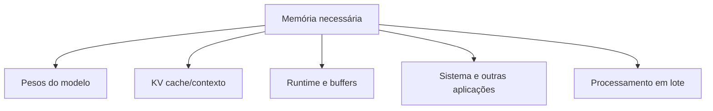
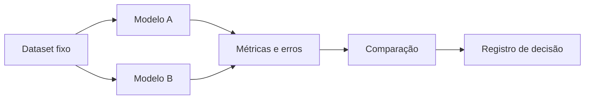

# Encontro 06 — Requisitos, quantização e seleção de modelos

## Tema

Requisitos computacionais, representação numérica, quantização e processo de
seleção de modelos conforme tarefa, infraestrutura e critérios de qualidade.

## Objetivos

- Relacionar tamanho do modelo ao consumo de memória e desempenho.
- Compreender precisão numérica e quantização em nível aplicado.
- Diferenciar memória dos pesos, contexto e estruturas de execução.
- Estimar requisitos sem prometer precisão indevida.
- Elaborar um plano de comparação entre modelos candidatos.

## Visão geral

Depois de identificar candidatos por finalidade e licença, é necessário saber
se eles cabem no ambiente e atendem ao tempo de resposta esperado. Uma escolha
viável equilibra qualidade, memória, latência, vazão, contexto e manutenção.

Não existe “melhor modelo” fora de um cenário. Um modelo maior pode apresentar
melhor resultado em determinada tarefa, mas ser inadequado se demora demais,
não cabe na memória ou viola a licença do projeto.

## Vocabulário essencial

### Parâmetro

Valor numérico aprendido durante o treinamento. A quantidade de parâmetros
ajuda a estimar porte, mas não determina sozinha qualidade ou memória total.

### Peso

É o valor armazenado em cada parâmetro aprendido. No uso cotidiano, expressões
como “pesos do modelo” referem-se ao conjunto desses valores distribuído em
arquivos e carregado pelo servidor de inferência.

### Precisão numérica

Forma usada para representar valores, como 32 ou 16 bits. Menos bits costumam
reduzir memória, mas podem alterar precisão, compatibilidade e desempenho.

### Quantização

Técnica que representa pesos — e, conforme o método, outras partes — com menor
precisão. Ela permite executar modelos em hardware mais limitado, com possíveis
perdas de qualidade e diferentes ganhos de velocidade.

### CPU, GPU e aceleradores

- CPU é geral e amplamente disponível, porém pode gerar mais lentamente;
- GPU executa muitas operações em paralelo, mas possui memória própria limitada;
- aceleradores e APIs variam conforme sistema, biblioteca e fabricante;
- suporte teórico não garante que uma configuração específica seja eficiente.

### Runtime de inferência

É o software responsável por executar os cálculos do modelo no hardware
disponível. Ele gerencia carregamento, memória, formatos, otimizações e geração.
O mesmo modelo pode apresentar consumo e velocidade diferentes em runtimes
distintos.

## Estimativa inicial da memória dos pesos

Uma aproximação didática para pesos sem considerar sobrecargas é:

```text
memória dos pesos ≈ quantidade de parâmetros × bits por parâmetro ÷ 8
```

Exemplo hipotético para 8 bilhões de parâmetros:

| Representação idealizada | Cálculo | Pesos aproximados |
|---|---:|---:|
| 32 bits | 8 bi × 32 ÷ 8 | 32 GB |
| 16 bits | 8 bi × 16 ÷ 8 | 16 GB |
| 8 bits | 8 bi × 8 ÷ 8 | 8 GB |
| 4 bits | 8 bi × 4 ÷ 8 | 4 GB |

Esses valores não representam a memória total. Formato do arquivo, metadados,
buffers, runtime, contexto e implementação adicionam consumo. Algumas técnicas
também não armazenam todos os elementos exatamente com a mesma quantidade de
bits.

## De onde vem o consumo total?



### Pesos

Normalmente constituem grande parte do consumo fixo após carregar o modelo.

### Contexto e KV cache

Durante a inferência, o servidor mantém informações relacionadas aos tokens já
processados. Contextos maiores podem elevar consideravelmente o consumo.

### Runtime e buffers

Bibliotecas, kernels, conversões e buffers de trabalho também precisam de
memória.

### Concorrência

Atender várias solicitações simultaneamente pode exigir mais memória e reduzir
a vazão percebida. Um teste com um único usuário não representa uma turma ou um
sistema publicado.

## Quantização na prática

Quantizações são identificadas por formatos e convenções próprios das
ferramentas. Não se deve concluir qualidade apenas pelo número presente no nome.

### Benefícios possíveis

- menor uso de memória;
- execução em equipamentos mais acessíveis;
- carregamento e distribuição mais simples;
- em certos ambientes, maior velocidade.

### Custos possíveis

- perda de qualidade, especialmente em tarefas sensíveis;
- instabilidade em formatos estruturados ou raciocínios longos;
- incompatibilidade com determinada biblioteca ou hardware;
- velocidade inferior ao esperado por falta de otimização;
- diferença de resultado entre métodos com “mesma quantidade de bits”.

### Regra de engenharia

A quantização não deve ser escolhida somente porque cabe. Ela precisa ser
avaliada com o mesmo conjunto de testes usado para selecionar o modelo.

## Métricas de execução

### Tempo até o primeiro token

Intervalo entre a requisição e o início visível da resposta. Afeta a sensação de
responsividade.

### Tokens por segundo

Taxa aproximada de geração após o início. Deve ser interpretada junto ao tamanho
da resposta e à configuração.

### Latência total

Tempo desde a requisição até a conclusão, incluindo fila, processamento da
entrada e geração.

### Vazão

Quantidade de trabalho atendida em um período. Um sistema pode ter boa velocidade
individual e baixa vazão sob concorrência.

### Memória máxima

Maior consumo observado durante carga e inferência. Deve deixar margem para o
sistema operacional e outros serviços.

## Fatores que afetam desempenho

- quantidade de parâmetros;
- quantização e formato;
- tamanho do prompt e da resposta;
- janela configurada;
- CPU, GPU, memória e largura de banda;
- runtime e versão;
- número de usuários simultâneos;
- uso de streaming;
- aquecimento e cache;
- tarefas concorrentes no equipamento.

## Matriz de seleção

Comece pelos requisitos do sistema, não pelos modelos.

### Exemplo de requisitos

```text
Tarefa: classificar chamados em dez categorias.
Idioma: português.
Saída: JSON conforme schema.
Infraestrutura: execução local em equipamento compartilhado.
Latência desejada: adequada a interação humana.
Privacidade: texto não pode sair da rede institucional.
Licença: compatível com distribuição acadêmica do protótipo.
```

### Critérios eliminatórios e classificatórios

| Critério | Tipo | Como verificar |
|---|---|---|
| licença compatível | eliminatório | licença oficial |
| execução local | eliminatório | formato/runtime |
| memória disponível | eliminatório | carga e medição |
| JSON válido | classificatório | dataset de testes |
| acerto de categoria | classificatório | métrica definida |
| latência | classificatório | medição repetida |
| uso de memória | classificatório | monitoramento |

### Decisão ponderada

Pesos podem ajudar, desde que não ocultem critérios eliminatórios.

| Critério | Peso | Candidato A | Candidato B |
|---|---:|---:|---:|
| qualidade na tarefa | 40% | | |
| latência | 20% | | |
| memória | 15% | | |
| estabilidade do JSON | 15% | | |
| documentação/manutenção | 10% | | |

Uma nota agregada não transforma uma avaliação limitada em verdade. Registre
dataset, versão, parâmetros e incertezas.

## Desenho de um experimento justo

Para comparar candidatos:

1. fixe o conjunto de entradas;
2. use o mesmo objetivo e contrato de saída;
3. registre template e parâmetros;
4. realize aquecimento antes das medições;
5. repita execuções;
6. registre erros e respostas inválidas;
7. meça qualidade e desempenho;
8. altere uma variável por vez quando possível;
9. preserve resultados brutos para auditoria;
10. documente limitações do ambiente.



## Oficina: plano de seleção para três cenários

Em grupo, escolha um dos cenários a seguir.

### Cenário A — classificação local

Textos curtos em português, dez categorias e resposta JSON. Prioridades:
privacidade, estabilidade do formato e baixa latência.

### Cenário B — assistente documental

Respostas a partir de regulamentos extensos. Prioridades: contexto, fidelidade
às fontes e memória suficiente para recuperação e geração.

### Cenário C — apoio à programação

Explicação e revisão de código TypeScript. Prioridades: qualidade técnica,
tamanho do contexto e tempo de resposta aceitável.

### Entrega do grupo

Preencher:

1. tarefa e usuário;
2. critérios eliminatórios;
3. três métricas de qualidade;
4. três métricas operacionais;
5. dois candidatos ou perfis de candidato;
6. quantizações a testar;
7. riscos de uma escolha inadequada;
8. procedimento de comparação;
9. condição para escolher um modelo menor;
10. evidência ainda ausente.

## Exemplo de registro de execução

```text
Data:
Equipamento:
Sistema operacional:
Runtime e versão:
Modelo e variante:
Arquivo/quantização:
Contexto configurado:
Parâmetros de geração:
Dataset:
Tempo até primeiro token:
Latência total:
Memória máxima:
Qualidade/erros:
Observações:
```

Não registrar identificadores sensíveis, credenciais ou conteúdo privado.

## Erros comuns

### Usar apenas a memória dos pesos

O processo precisa de memória adicional para contexto, runtime e sistema.

### Comparar modelos com prompts diferentes sem registrar

Não será possível saber se a diferença veio do modelo ou da configuração.

### Medir apenas velocidade

Um modelo rápido que produz JSON inválido ou classificações ruins não atende à
tarefa.

### Escolher a maior janela disponível

Contexto configurado acima da necessidade pode aumentar consumo sem benefício.

### Generalizar a partir de uma execução

Latência e respostas variam. Repita, resuma a distribuição e registre falhas.

## Questões para revisão

1. Por que a fórmula dos pesos é apenas uma aproximação?
2. Que componentes consomem memória além dos pesos?
3. Quais são os benefícios e custos da quantização?
4. Qual a diferença entre latência e vazão?
5. Por que critérios eliminatórios vêm antes da pontuação ponderada?
6. Como tornar uma comparação reproduzível?

## Checklist de aprendizagem

- [ ] estimar a ordem de grandeza da memória dos pesos;
- [ ] explicar por que contexto e concorrência aumentam consumo;
- [ ] descrever quantização sem tratá-la como compressão sem perdas;
- [ ] definir métricas de qualidade e desempenho;
- [ ] planejar comparação justa entre candidatos;
- [ ] justificar quando um modelo menor é a melhor escolha.

## Síntese do encontro

Viabilidade é parte da qualidade. O modelo escolhido precisa atender à tarefa
dentro das restrições reais de licença, privacidade, memória, latência e
manutenção. A decisão deve resultar de requisitos e experimentos registrados,
não apenas de popularidade ou tamanho.

## Preparação para o próximo encontro

No próximo encontro será configurado o ambiente local de inferência. Antes da
aula, verificar espaço em disco, versão do Docker quando utilizado e acesso ao
terminal. O modelo exato será definido conforme a infraestrutura disponível.
