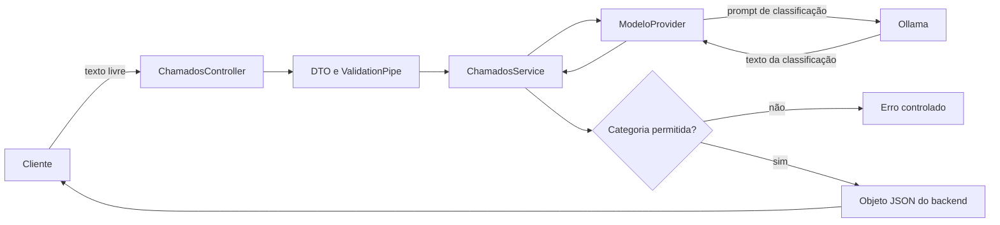

# Encontro 07 — Atividade prática: classificação de chamados com IA

## Modalidade

- atividade prática individual;
- realizada com consulta ao material da disciplina, documentação oficial e
  anotações pessoais;
- entrega por repositório do GitHub vinculado à atividade do GitHub Classroom;
- duração prevista: 90 minutos.

A consulta é permitida, mas o código, os commits e a explicação das decisões
devem ser individuais. Não é permitido copiar a implementação de outro
estudante ou compartilhar uma solução pronta durante a atividade.

## Objetivo

Evoluir o projeto implementado no Encontro 06, adicionando um endpoint que
receba o texto livre de um chamado, solicite ao Ollama a classificação desse
texto e devolva ao cliente um objeto JSON produzido e validado pelo backend.

## Cenário

Uma central de atendimento recebe chamados escritos livremente. Antes de
encaminhar cada chamado, o sistema precisa classificá-lo em uma das categorias:

| Categoria | Quando utilizar |
|---|---|
| `ACESSO` | senha, autenticação, bloqueio ou dificuldade para entrar no sistema |
| `FINANCEIRO` | cobrança, pagamento, boleto, mensalidade ou reembolso |
| `MATRICULA` | matrícula, cancelamento de disciplina, turma ou período letivo |
| `DOCUMENTOS` | declaração, histórico, certificado ou comprovante |
| `OUTROS` | chamados que não se encaixam nas categorias anteriores |

A lista é fechada. O modelo não pode criar novas categorias.

## Fluxo obrigatório



O backend não deve devolver diretamente `message.content`. A saída do modelo é
um dado externo e não confiável; precisa ser normalizada e comparada com a lista
de categorias permitidas.

## Contrato da API

### Endpoint

```http
POST /chamados/classificar
Content-Type: application/json
```

### Corpo da requisição

```json
{
  "texto": "Não consigo acessar o portal porque minha senha foi bloqueada."
}
```

O campo `texto` deve:

- ser uma string;
- possuir conteúdo depois da remoção de espaços externos;
- ter no mínimo 10 e no máximo 2.000 caracteres;
- ser o único campo aceito no corpo.

### Resposta de sucesso

```json
{
  "texto": "Não consigo acessar o portal porque minha senha foi bloqueada.",
  "categoria": "ACESSO",
  "modelo": "llama3.2:latest"
}
```

O status deve ser `200 OK`. A propriedade `categoria` precisa conter
exatamente um dos cinco valores permitidos.

### Resposta quando a categoria for inválida

Se o Ollama retornar uma categoria fora da lista, texto vazio ou uma resposta
que não possa ser normalizada com segurança, o backend deverá responder com um
erro controlado, por exemplo:

```json
{
  "statusCode": 502,
  "message": "O modelo retornou uma categoria inválida"
}
```

Não transforme automaticamente uma categoria desconhecida em `OUTROS`. Isso
esconderia uma violação do contrato do modelo.

## Estrutura mínima esperada

O estudante deverá alterar o exercício anterior e acrescentar componentes para
o caso de uso de chamados. Uma organização possível é:

```text
src/
├── ia/
│   └── componentes implementados no Encontro 06
└── chamados/
    ├── dto/
    │   └── classificar-chamado.dto.ts
    ├── chamado-categoria.ts
    ├── chamados.controller.ts
    ├── chamados.service.ts
    └── chamados.module.ts
```

A estrutura pode variar, desde que controller, regra de classificação e acesso
ao modelo não sejam concentrados no mesmo arquivo.

## Requisitos funcionais

1. Receber um chamado por `POST /chamados/classificar`.
2. Validar o corpo usando DTO e `ValidationPipe`.
3. Remover espaços externos antes de processar o texto.
4. Construir no backend a instrução enviada ao Ollama.
5. Informar ao modelo todas as categorias permitidas.
6. Solicitar que o modelo retorne somente uma categoria.
7. Usar o `ModeloProvider` criado no Encontro 06.
8. Normalizar a resposta do modelo.
9. Validar a resposta contra a lista fechada de categorias.
10. Criar no backend o objeto JSON de resposta.
11. Devolver status e mensagem coerentes em caso de falha.

## Requisitos técnicos

- NestJS como backend;
- Ollama executado pelo Docker conforme o Encontro 05;
- modelo, URL e timeout obtidos por configuração;
- nenhum nome de modelo recebido pelo cliente;
- nenhuma chamada ao Ollama diretamente no controller;
- `stream: false` na chamada interna;
- nenhuma dependência nova sem justificativa no README;
- `.env` ignorado pelo Git;
- `.env.example` sem credenciais ou informações pessoais;
- código formatado e sem erros de compilação.
