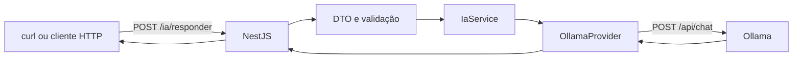
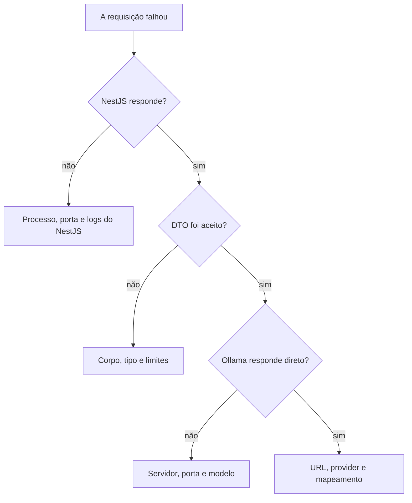

# Encontro 07 — Prática: inferência local integrada ao NestJS

## Tema

Construção e verificação individual de um fluxo completo entre cliente HTTP,
backend NestJS, provider e modelo local executado pelo Ollama.

## Objetivos

- Consolidar a execução local estudada no Encontro 05.
- Aplicar a separação de responsabilidades do Encontro 06.
- Diagnosticar falhas por camada, sem atribuir todo erro ao modelo.
- Produzir evidências reproduzíveis de sucesso e indisponibilidade.
- Explicar as decisões do código implementado.

## Objetivo da atividade

Cada estudante implementará um endpoint NestJS que recebe uma mensagem, chama
o Ollama por meio de um provider e devolve um contrato simplificado. Ao concluir,
será possível observar a diferença entre o contrato público da aplicação e o
contrato interno do servidor de inferência, além de verificar como entrada
inválida, modelo ausente e serviço indisponível percorrem caminhos diferentes.

## Produto esperado



## Tabela de registro

Preencha durante a execução, não somente ao final.

| Teste | Entrada ou condição | HTTP esperado | HTTP obtido | Persistiu resposta? | Evidência/observação |
|---:|---|:---:|:---:|:---:|---|
| 1 | mensagem válida | 200 | | não se aplica | |
| 2 | mensagem ausente | 400 | | não se aplica | |
| 3 | campo inesperado | 400 | | não se aplica | |
| 4 | texto acima do limite | 400 | | não se aplica | |
| 5 | modelo inexistente | 502 | | não se aplica | |
| 6 | Ollama interrompido | 503 | | não se aplica | |
| 7 | timeout forçado | 504 | | não se aplica | |

Neste encontro não haverá persistência em banco. A coluna deixa explícito que
uma atividade não deve alegar ter testado algo que ainda não foi implementado.

### O que significa cada coluna?

- **Teste:** identificador usado para relacionar requisição, resposta e análise.
- **Entrada ou condição:** variável modificada na execução.
- **HTTP esperado:** comportamento previsto antes do teste.
- **HTTP obtido:** status realmente devolvido pelo NestJS.
- **Persistiu resposta?:** registra que persistência está fora do escopo atual.
- **Evidência/observação:** trecho relevante da resposta, log técnico sem dados
  sensíveis ou explicação de uma divergência.

## Organização dos 90 minutos

| Etapa | Tempo |
|---|---:|
| verificação do ambiente | 10 min |
| estrutura, DTO e configuração | 15 min |
| provider, service e controller | 30 min |
| execução dos sete testes | 20 min |
| correções, análise e entrega | 15 min |

## Antes de começar

1. Trabalhe individualmente.
2. Confirme que possui uma cópia do projeto NestJS da disciplina.
3. Não publique `.env`, prompts de usuários ou credenciais.
4. Use o modelo previamente indicado pelo professor.
5. Não baixe outro modelo apenas porque o exemplo usa nome diferente.
6. Registre versões e identificador completo do modelo.
7. Crie um commit inicial antes de modificar o projeto.

## Passo 1 — verificar o Ollama

### Execução direta

```bash
curl http://localhost:11434/api/version
curl http://localhost:11434/api/tags
```

### Execução pelo Docker Compose

```bash
docker compose ps
docker compose logs ollama
curl http://localhost:11434/api/tags
```

Escolha no resultado de `/api/tags` o identificador que será colocado em
`OLLAMA_MODEL`. Se a lista estiver vazia, peça orientação antes de iniciar um
download grande.

### Problemas de permissão no laboratório

Se `docker ps` responder com erro de permissão, não altere grupos do sistema,
socket do Docker ou configuração institucional. Registre o erro e solicite ao
responsável pelo laboratório. Se o Ollama já estiver disponibilizado por outro
processo, a atividade pode continuar pela API sem acesso administrativo ao
Docker.

## Passo 2 — testar o modelo diretamente

Antes de introduzir o NestJS, confirme o serviço:

```bash
curl http://localhost:11434/api/chat \
  -H 'Content-Type: application/json' \
  -d '{
    "model": "llama3.2",
    "messages": [
      {
        "role": "user",
        "content": "Responda somente com a palavra FUNCIONANDO."
      }
    ],
    "stream": false
  }'
```

Substitua o modelo. Localize `message.content`, `prompt_eval_count` e
`eval_count`. Se essa chamada falhar, resolva o Ollama antes de depurar o NestJS.

## Passo 3 — preparar a configuração

Crie ou atualize `.env.example`:

```dotenv
OLLAMA_BASE_URL=http://localhost:11434
OLLAMA_MODEL=nome-do-modelo
OLLAMA_TIMEOUT_MS=30000
```

Crie o `.env` local com os valores reais e confirme que está ignorado pelo Git.

### Sem permissão para criar `.env`

Em um laboratório restrito, variáveis podem ser fornecidas somente ao processo:

```bash
OLLAMA_BASE_URL=http://localhost:11434 \
OLLAMA_MODEL=llama3.2 \
OLLAMA_TIMEOUT_MS=30000 \
npm run start:dev
```

Esse formato vale para shells compatíveis com Bash e não grava os valores no
computador. No PowerShell, a sintaxe é diferente; use o procedimento indicado
para o sistema do laboratório.

## Passo 4 — instalar e importar dependências

```bash
npm install @nestjs/axios axios
npm install @nestjs/config
npm install class-validator class-transformer
```

Se o laboratório bloquear downloads, não altere registries nem use fontes não
autorizadas. Confirme se as dependências já existem no projeto ou utilize o
cache institucional indicado pelo professor.

## Passo 5 — criar o módulo de IA

Crie:

```text
src/ia/dto/responder.dto.ts
src/ia/providers/modelo.provider.ts
src/ia/providers/ollama.provider.ts
src/ia/ia.service.ts
src/ia/ia.controller.ts
src/ia/ia.module.ts
```

Use como referência o Encontro 06, mas digite e compreenda cada componente. Não
coloque URL ou nome do modelo diretamente no controller.

## Passo 6 — implementar o DTO

O DTO deve aceitar apenas:

```json
{
  "mensagem": "texto entre 1 e 2000 caracteres"
}
```

Ative `ValidationPipe` com rejeição de propriedades inesperadas. Antes de
continuar, teste mensagens ausente, vazia e acompanhada de um campo adicional.

## Passo 7 — implementar o provider

O provider deve:

1. ler URL, modelo e timeout da configuração;
2. chamar `POST {OLLAMA_BASE_URL}/api/chat`;
3. enviar `stream: false`;
4. validar a presença de `message.content`;
5. converter campos do Ollama para o contrato interno;
6. diferenciar timeout, conexão recusada e resposta inválida;
7. não registrar o conteúdo integral da conversa.

Contrato interno esperado:

```ts
export interface GerarRespostaOutput {
  resposta: string;
  modelo: string;
  tokensEntrada?: number;
  tokensSaida?: number;
}
```

## Passo 8 — implementar service e controller

O `IaService` depende de `ModeloProvider`. O controller deve expor:

```http
POST http://localhost:3000/ia/responder
```

Resposta pública:

```json
{
  "resposta": "...",
  "modelo": "...",
  "uso": {
    "tokensEntrada": 0,
    "tokensSaida": 0
  }
}
```

Não devolva ao cliente a resposta completa do Axios nem todos os metadados do
Ollama.

## Passo 9 — executar o teste de sucesso

```bash
curl http://localhost:3000/ia/responder \
  -H 'Content-Type: application/json' \
  -d '{
    "mensagem": "Explique em até três frases a função de um backend."
  }'
```

Registre o status, modelo e contagens. Avalie separadamente:

- o contrato HTTP está correto?
- a resposta respeita o limite pedido?
- o conteúdo parece correto?
- que afirmação ainda exigiria verificação?

Sucesso técnico não garante correção do conteúdo gerado.

## Passo 10 — executar testes de validação

### Mensagem ausente

```bash
curl -i http://localhost:3000/ia/responder \
  -H 'Content-Type: application/json' \
  -d '{}'
```

### Campo inesperado

```bash
curl -i http://localhost:3000/ia/responder \
  -H 'Content-Type: application/json' \
  -d '{"mensagem":"Olá","modelo":"outro-modelo"}'
```

O segundo teste demonstra que o cliente não pode escolher livremente o modelo.

## Passo 11 — executar testes de infraestrutura

### Modelo inexistente

Altere temporariamente `OLLAMA_MODEL` para um identificador que não existe,
reinicie o NestJS e registre o comportamento. Depois restaure o valor.

### Ollama indisponível

Interrompa somente se você controla o processo:

```bash
docker compose stop ollama
```

Execute a requisição, registre o resultado e restaure:

```bash
docker compose start ollama
```

Não interrompa um servidor compartilhado pelo laboratório.

### Timeout

Defina temporariamente um limite muito pequeno e execute uma geração. Se o
resultado não produzir timeout, registre que a condição não foi reproduzida em
vez de inventar um status.

## Passo 12 — teste automatizado com provider simulado

Crie pelo menos um teste do `IaService` com um provider simulado. Verifique se o
service devolve a estrutura esperada sem chamar um modelo real.

```ts
const provider = {
  gerar: jest.fn().mockResolvedValue({
    resposta: 'Resposta controlada',
    modelo: 'teste',
    tokensEntrada: 5,
    tokensSaida: 2,
  }),
};
```

Explique por que esse teste não substitui o teste de integração.

## Diagnóstico orientado por camadas



## Entrega individual

Entregue:

1. link ou identificação do commit;
2. `.env.example` sem segredos;
3. código do DTO, provider, service, controller e módulo;
4. teste automatizado com provider simulado;
5. tabela preenchida;
6. registro das versões e do modelo;
7. resposta às questões de análise.

## Questões de análise

1. Por que o Angular não deve chamar o Ollama diretamente?
2. Que campos do Ollama foram omitidos do contrato público e por quê?
3. Em qual camada cada um dos sete testes falhou?
4. O que mudaria se NestJS também estivesse em um contêiner?
5. Por que `localhost` deixaria de ser a URL correta nesse caso?
6. Como o mock torna o teste mais rápido e previsível?
7. Qual falha foi mais difícil de diagnosticar e qual evidência resolveu o problema?

## Critérios de conclusão

- [ ] endpoint de sucesso funciona;
- [ ] DTO rejeita entradas inválidas;
- [ ] configuração não está fixa no controller;
- [ ] provider encapsula o contrato do Ollama;
- [ ] timeout e indisponibilidade são tratados;
- [ ] resposta pública contém somente campos necessários;
- [ ] teste automatizado não chama o modelo real;
- [ ] tabela e análise refletem resultados realmente observados.

## Se o equipamento não executar o modelo

O estudante ainda poderá:

1. implementar todos os contratos e componentes;
2. executar testes com provider simulado;
3. validar DTO e controller;
4. analisar uma resposta fornecida pelo professor sem alegar execução local;
5. registrar a limitação de hardware na tabela.

Essa alternativa avalia a arquitetura sem esconder a limitação do ambiente.

## Síntese do encontro

A prática demonstra que uma integração confiável depende de fronteiras claras.
O modelo é apenas uma parte: configuração, validação, rede, timeout, contrato
público, testes e diagnóstico também determinam o comportamento da aplicação.
