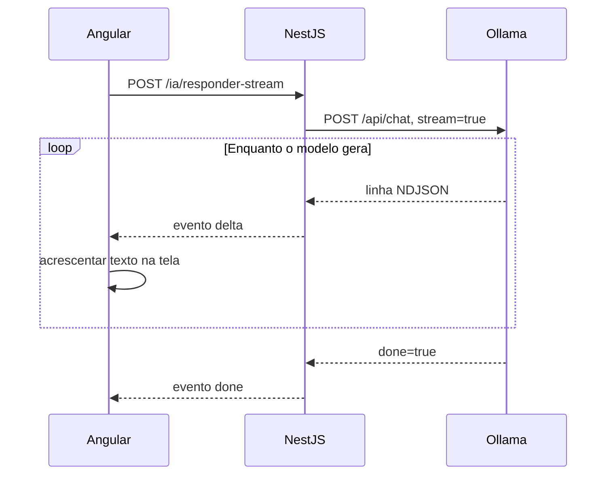
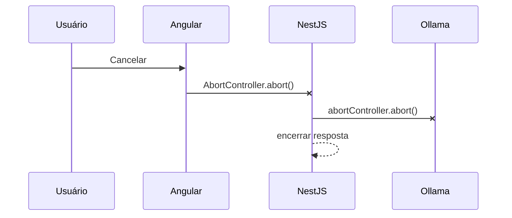

# Encontro 08 — Streaming para Angular e cancelamento

## Tema

Transmissão incremental da resposta do Ollama pelo NestJS, consumo do fluxo no
Angular e cancelamento cooperativo da geração.

## Objetivos

- Criar e executar a primeira aplicação Angular da disciplina.
- Reconhecer a estrutura mínima de uma aplicação Angular standalone.
- Diferenciar resposta completa de resposta em streaming.
- Interpretar o NDJSON produzido pelo Ollama.
- Ampliar `ModeloProvider` sem acoplar a aplicação ao fornecedor.
- Transmitir incrementos pelo NestJS sem armazenar toda a resposta.
- Atualizar progressivamente a interface Angular.
- Propagar o cancelamento do navegador até o Ollama.
- Testar conclusão, erro e cancelamento.

## Visão geral

Nos encontros anteriores, `stream: false` fez o cliente esperar a geração
terminar para receber um único JSON. Com streaming, partes da resposta chegam
assim que são produzidas.



O objetivo não é fazer a geração terminar mais rápido. O ganho principal é
reduzir o tempo até o usuário visualizar o primeiro trecho e permitir
cancelamento antes da conclusão.

## Resposta completa versus streaming

| Aspecto | Resposta completa | Streaming |
|---|---|---|
| primeiro conteúdo | após toda a geração | durante a geração |
| formato | um JSON | sequência de objetos delimitados |
| parser | `response.json()` | leitura incremental e buffer |
| erro após início | status HTTP ainda pode mudar | exige evento no próprio fluxo |
| cancelamento | encerra a espera do cliente | deve interromper toda a cadeia |
| complexidade | menor | maior |

## O que é NDJSON?

NDJSON é um fluxo no qual cada linha contém um objeto JSON independente:

```text
{"message":{"content":"Uma"},"done":false}
{"message":{"content":" resposta"},"done":false}
{"message":{"content":" incremental."},"done":false}
{"message":{"content":""},"done":true,"eval_count":4}
```

Não é um array JSON. Chamar `JSON.parse()` antes de separar as linhas produzirá
erro. Além disso, um fragmento recebido da rede pode terminar no meio de uma
linha; por isso, o parser precisa manter um buffer.

## Contrato público do streaming

O backend não repassará diretamente o NDJSON do Ollama. Ele publicará eventos
com contrato próprio:

```text
{"type":"delta","content":"Uma"}
{"type":"delta","content":" resposta"}
{"type":"done"}
```

Em caso de falha depois do primeiro incremento:

```text
{"type":"error","message":"A geração foi interrompida"}
```

Essa adaptação impede o Angular de depender de campos específicos do Ollama.

## Arquivos que serão alterados

```text
backend/src/ia/
├── providers/modelo.provider.ts
├── providers/ollama.provider.ts
├── ia.service.ts
└── ia.controller.ts

frontend/src/app/ia/
├── ia-stream.service.ts
└── chat-stream.component.ts
```

Até aqui, a turma possui o backend NestJS iniciado no Encontro 06, mas ainda não
possui um projeto Angular. Portanto, a primeira parte deste encontro cria o
frontend do zero. Os comandos Angular devem ser executados em outro terminal,
sem encerrar o NestJS nem o contêiner do Ollama. Assim como o Ollama, o Angular
será criado e executado com Docker; o computador não precisa ter Node.js, npm ou
Angular CLI instalados.

## Passo 1 — verificar o ambiente de desenvolvimento

No terminal integrado do VS Code, execute:

```bash
docker --version
docker compose version
docker compose ps
```

Confirme que Docker e Docker Compose estão disponíveis e que o contêiner do
Ollama continua ativo. O Node.js será fornecido pela imagem do contêiner. Essa
padronização reduz diferenças entre computadores do laboratório e evita
instalações globais que exigem permissão administrativa.

## Passo 2 — criar o projeto Angular dentro de um contêiner

Abra o terminal na pasta que deverá conter o frontend e execute:

```bash
docker run --rm \
  --user "$(id -u):$(id -g)" \
  --env HOME=/tmp \
  --volume "$PWD:/workspace" \
  --workdir /workspace \
  node:22-alpine \
  npx @angular/cli@latest new frontend \
    --standalone \
    --routing=false \
    --style=css \
    --skip-git \
    --skip-install
```

Quando o CLI perguntar sobre recursos adicionais, mantenha as opções padrão. O
contêiner é removido depois do comando, mas os arquivos permanecem no diretório
montado. `--skip-install` evita criar `node_modules` no host; as dependências
serão instaladas durante a construção da imagem.

As opções usadas possuem os seguintes objetivos:

- `frontend` define o nome da pasta e da aplicação;
- `--standalone` usa componentes standalone, sem criar `AppModule`;
- `--routing=false` evita adicionar roteamento antes de ele ser necessário;
- `--style=css` mantém os estilos em CSS simples;
- `--skip-git` evita criar um segundo repositório dentro do projeto da atividade.
- `--skip-install` adia a instalação para o Dockerfile.

`--user` faz com que os arquivos pertençam ao usuário atual em Linux e macOS.
No PowerShell, `$(id -u)` e `$PWD` precisam ser adaptados ao ambiente. Em um
laboratório padronizado, o professor pode fornecer o projeto-base já gerado.

> Se a rede do laboratório bloquear o download, o professor deve disponibilizar
> previamente um projeto gerado ou o cache de dependências. Copiar somente a
> pasta `node_modules` entre sistemas operacionais não é uma solução confiável.

## Passo 3 — preparar e executar o Angular com Docker Compose

Crie `frontend/Dockerfile`:

```dockerfile
FROM node:22-alpine

WORKDIR /app

COPY package*.json ./
RUN npm ci

COPY . .

EXPOSE 4200

CMD ["npm", "start", "--", "--host", "0.0.0.0", "--poll", "1000"]
```

Crie `frontend/.dockerignore`:

```text
node_modules
.angular
dist
```

No `compose.yaml` já utilizado pelo Ollama, preserve os serviços existentes e
acrescente:

```yaml
services:
  frontend:
    build:
      context: ./frontend
    user: "${LOCAL_UID:-1000}:${LOCAL_GID:-1000}"
    environment:
      HOME: /tmp
    ports:
      - "4200:4200"
    volumes:
      - ./frontend:/app
      - frontend_node_modules:/app/node_modules

volumes:
  frontend_node_modules:
```

O volume nomeado impede que o bind mount esconda as dependências instaladas na
imagem. `--host 0.0.0.0` permite acessar o servidor pela porta publicada, e
`--poll 1000` torna a detecção de alterações mais confiável em volumes montados.
O usuário numérico evita que arquivos gerados pelo contêiner fiquem pertencendo
ao administrador. Se `id -u` ou `id -g` retornar um valor diferente de `1000`,
crie um arquivo `.env` ao lado do `compose.yaml` e informe os valores reais:

```dotenv
LOCAL_UID=1001
LOCAL_GID=1001
```

Substitua `1001` pelos números exibidos no computador. Em Docker Desktop para
Windows ou macOS, normalmente os valores padrão podem ser mantidos.

Construa e inicie somente o novo serviço:

```bash
docker compose up --build -d frontend
docker compose logs -f frontend
```

Quando o log indicar que a compilação terminou, acesse
`http://localhost:4200`. Para sair da visualização dos logs sem interromper o
contêiner, pressione `Ctrl+C`.

Localize os arquivos principais:

```text
frontend/
├── angular.json
├── package.json
└── src/
    ├── main.ts
    └── app/
        ├── app.ts
        ├── app.html
        └── app.css
```

Em versões anteriores do CLI, os três últimos arquivos podem se chamar
`app.component.ts`, `app.component.html` e `app.component.css`. A função é a
mesma: `main.ts` inicializa a aplicação, o arquivo TypeScript define o componente
raiz, o HTML define sua interface e o CSS define sua apresentação.

Antes de avançar, altere uma frase do HTML inicial e confirme que o navegador é
atualizado. Isso separa eventuais problemas de instalação dos problemas do
streaming que serão estudados a seguir.

## Passo 4 — confirmar o streaming do Ollama

No Thunder Client, duplique a requisição `POST /api/chat` do Encontro 05 e
altere apenas:

```json
{
  "model": "llama3.2:latest",
  "messages": [
    {
      "role": "user",
      "content": "Explique em cinco itens o que é streaming HTTP."
    }
  ],
  "stream": true
}
```

Use o identificador realmente instalado. Observe se a ferramenta exibe várias
linhas e localize `done: true` no último objeto. Se a interface apresentar tudo
somente no final, confirme o comportamento nos logs e registre a limitação do
cliente antes de concluir que o Ollama não transmitiu incrementalmente.

## Passo 5 — ampliar o contrato interno

Em `modelo.provider.ts`, acrescente:

```ts
export interface GerarStreamInput {
  mensagem: string;
  signal?: AbortSignal;
}

export interface ModeloProvider {
  gerar(input: GerarRespostaInput): Promise<GerarRespostaOutput>;
  gerarStream(input: GerarStreamInput): AsyncIterable<string>;
}
```

### Por que `AsyncIterable<string>`?

- representa valores que chegam ao longo do tempo;
- permite usar `for await...of`;
- não exige acumular toda a resposta;
- mantém o service independente de Axios e do formato do Ollama;
- cada item representa apenas texto aprovado pelo adaptador.

`AbortSignal` transporta a solicitação de cancelamento sem depender do Angular,
Express ou Axios no contrato da aplicação.

## Passo 6 — tipar os fragmentos externos

Em `ollama.provider.ts`, acrescente:

```ts
interface OllamaStreamChunk {
  message?: {
    content?: string;
  };
  done: boolean;
  error?: string;
}
```

Esse tipo representa cada linha externa. Ele não substitui validação em tempo
de execução, mas documenta os campos que o parser utilizará.

## Passo 7 — implementar o parser NDJSON

Adicione uma função privada ou auxiliar:

```ts
function parseOllamaLine(line: string): OllamaStreamChunk | undefined {
  const normalized = line.trim();

  if (!normalized) {
    return undefined;
  }

  const parsed: unknown = JSON.parse(normalized);

  if (typeof parsed !== 'object' || parsed === null) {
    throw new BadGatewayException('Fragmento inválido recebido do modelo');
  }

  return parsed as OllamaStreamChunk;
}
```

### Por que ignorar linhas vazias?

Quebras de linha extras não carregam conteúdo. Tentar convertê-las em JSON
geraria uma falha artificial.

### Por que o cast não é validação completa?

`as OllamaStreamChunk` informa um tipo ao compilador, mas não prova o formato do
dado. A atividade valida somente o mínimo necessário; um sistema de produção
pode usar um schema de runtime.

## Passo 8 — implementar `gerarStream`

Acrescente ao `OllamaProvider`:

```ts
async *gerarStream(input: GerarStreamInput): AsyncIterable<string> {
  const baseUrl = this.config.getOrThrow<string>('OLLAMA_BASE_URL');
  const model = this.config.getOrThrow<string>('OLLAMA_MODEL');
  const timeout = Number(
    this.config.get<string>('OLLAMA_TIMEOUT_MS') ?? '30000',
  );

  const response = await this.http.axiosRef.post<NodeJS.ReadableStream>(
    `${baseUrl}/api/chat`,
    {
      model,
      messages: [{ role: 'user', content: input.mensagem }],
      stream: true,
    },
    {
      responseType: 'stream',
      signal: input.signal,
      timeout,
    },
  );

  const decoder = new TextDecoder();
  let buffer = '';

  for await (const bytes of response.data as AsyncIterable<Uint8Array>) {
    buffer += decoder.decode(bytes, { stream: true });

    let lineBreak = buffer.indexOf('\n');

    while (lineBreak >= 0) {
      const line = buffer.slice(0, lineBreak);
      buffer = buffer.slice(lineBreak + 1);
      lineBreak = buffer.indexOf('\n');

      const chunk = parseOllamaLine(line);
      if (!chunk) continue;
      if (chunk.error) throw new BadGatewayException(chunk.error);

      const content = chunk.message?.content;
      if (content) yield content;
    }
  }

  buffer += decoder.decode();

  const lastChunk = parseOllamaLine(buffer);
  if (lastChunk?.error) {
    throw new BadGatewayException(lastChunk.error);
  }
  if (lastChunk?.message?.content) {
    yield lastChunk.message.content;
  }
}
```

### Explicação do código

- `async *` declara um gerador assíncrono;
- `responseType: 'stream'` impede o Axios de esperar o corpo completo;
- `signal` permite interromper a chamada ao Ollama;
- `TextDecoder` converte bytes em texto sem corromper caracteres multibyte;
- `buffer` conserva uma linha incompleta entre dois fragmentos de rede;
- o `while` processa todas as linhas completas já disponíveis;
- `yield` entrega o conteúdo imediatamente ao consumidor;
- `decoder.decode()` sem bytes finaliza a decodificação pendente.

A lógica de mapeamento de erros do método `gerar` deve ser reutilizada ou
extraída para uma função comum. Não exponha mensagens internas do Ollama ao
cliente em produção.

## Passo 9 — ampliar o service

Em `ia.service.ts`:

```ts
gerarStream(mensagem: string, signal: AbortSignal): AsyncIterable<string> {
  const mensagemNormalizada = mensagem.trim();

  if (!mensagemNormalizada) {
    throw new BadRequestException('A mensagem não pode conter apenas espaços');
  }

  return this.modelo.gerarStream({
    mensagem: mensagemNormalizada,
    signal,
  });
}
```

O service continua responsável pela regra de normalização. Ele não sabe que o
fornecedor usa NDJSON.

## Passo 10 — criar o endpoint de streaming

O NestJS precisa escrever cada evento assim que ele estiver disponível. Para
isso, esta rota utiliza a resposta nativa do Express:

```ts
import {
  Body,
  Controller,
  HttpCode,
  Post,
  Res,
  ServiceUnavailableException,
} from '@nestjs/common';
import type { Response } from 'express';

@Post('responder-stream')
@HttpCode(200)
async responderStream(
  @Body() dto: ResponderDto,
  @Res() response: Response,
): Promise<void> {
  const abortController = new AbortController();

  response.setHeader('Content-Type', 'application/x-ndjson; charset=utf-8');
  response.setHeader('Cache-Control', 'no-cache, no-transform');
  response.setHeader('X-Accel-Buffering', 'no');

  response.on('close', () => {
    if (!response.writableEnded) {
      abortController.abort();
    }
  });

  try {
    const stream = this.iaService.gerarStream(
      dto.mensagem,
      abortController.signal,
    );

    for await (const content of stream) {
      response.write(`${JSON.stringify({ type: 'delta', content })}\n`);
    }

    response.write(`${JSON.stringify({ type: 'done' })}\n`);
    response.end();
  } catch {
    if (response.headersSent) {
      response.write(
        `${JSON.stringify({
          type: 'error',
          message: 'A geração foi interrompida',
        })}\n`,
      );
      response.end();
      return;
    }

    throw new ServiceUnavailableException(
      'Não foi possível iniciar a geração',
    );
  }
}
```

### Por que usar `@Res()` somente nesta rota?

Após injetar `Response`, o código assume a responsabilidade de escrever e
encerrar a resposta. Isso é necessário para enviar partes antes do fim, mas
reduz a independência em relação ao adaptador HTTP. As rotas comuns devem
continuar usando o modo padrão do NestJS.

### Por que o erro muda depois do primeiro trecho?

Depois que os headers e o status `200` foram enviados, não é possível trocar o
status para `500`. A falha precisa ser representada como um evento `error` no
fluxo.

## Passo 11 — habilitar o Angular no ambiente local

Se Angular e NestJS usam origens diferentes, configure CORS de forma restrita em
`main.ts`:

```ts
app.enableCors({
  origin: 'http://localhost:4200',
  methods: ['POST'],
});
```

Em produção, origem e métodos devem vir de configuração. Não use `origin: '*'`
quando a aplicação trabalhar com credenciais.

## Passo 12 — criar o serviço Angular

O `HttpClient` é adequado para muitas chamadas, mas neste exercício será usado
`fetch` diretamente para controlar `ReadableStream` e `AbortSignal`.

Dentro de `frontend`, gere a pasta e o serviço:

```bash
docker compose exec frontend \
  npx ng generate service ia/ia-stream --type=service --skip-tests
```

Edite o arquivo criado em `src/app/ia/ia-stream.service.ts`:

```ts
import { Injectable } from '@angular/core';

export interface StreamEvent {
  type: 'delta' | 'done' | 'error';
  content?: string;
  message?: string;
}

@Injectable({ providedIn: 'root' })
export class IaStreamService {
  async *responder(
    mensagem: string,
    signal: AbortSignal,
  ): AsyncIterable<StreamEvent> {
    const response = await fetch(
      'http://localhost:3000/ia/responder-stream',
      {
        method: 'POST',
        headers: { 'Content-Type': 'application/json' },
        body: JSON.stringify({ mensagem }),
        signal,
      },
    );

    if (!response.ok) {
      throw new Error(`Falha ao iniciar: HTTP ${response.status}`);
    }

    if (!response.body) {
      throw new Error('O navegador não disponibilizou o corpo incremental');
    }

    const reader = response.body.getReader();
    const decoder = new TextDecoder();
    let buffer = '';

    try {
      while (true) {
        const { done, value } = await reader.read();
        if (done) break;

        buffer += decoder.decode(value, { stream: true });
        const lines = buffer.split('\n');
        buffer = lines.pop() ?? '';

        for (const line of lines) {
          if (line.trim()) yield JSON.parse(line) as StreamEvent;
        }
      }

      buffer += decoder.decode();
      if (buffer.trim()) yield JSON.parse(buffer) as StreamEvent;
    } finally {
      reader.releaseLock();
    }
  }
}
```

O frontend também mantém um buffer porque os limites dos fragmentos HTTP não
precisam coincidir com as quebras de linha escritas pelo backend.

## Passo 13 — criar o componente Angular

Gere o componente standalone:

```bash
docker compose exec frontend \
  npx ng generate component ia/chat-stream --standalone --type=component --skip-tests
```

Substitua o conteúdo TypeScript gerado pelo código a seguir:

```ts
import { Component, inject, signal } from '@angular/core';
import { FormsModule } from '@angular/forms';
import { IaStreamService } from './ia-stream.service';

@Component({
  selector: 'app-chat-stream',
  standalone: true,
  imports: [FormsModule],
  templateUrl: './chat-stream.component.html',
})
export class ChatStreamComponent {
  private readonly ia = inject(IaStreamService);
  private abortController?: AbortController;

  mensagem = '';
  resposta = signal('');
  status = signal<'idle' | 'loading' | 'done' | 'error' | 'cancelled'>('idle');

  async enviar(): Promise<void> {
    const mensagem = this.mensagem.trim();
    if (!mensagem || this.status() === 'loading') return;

    this.abortController = new AbortController();
    this.resposta.set('');
    this.status.set('loading');

    try {
      for await (const event of this.ia.responder(
        mensagem,
        this.abortController.signal,
      )) {
        if (event.type === 'delta' && event.content) {
          this.resposta.update((current) => current + event.content);
        }
        if (event.type === 'error') throw new Error(event.message);
      }

      this.status.set('done');
    } catch (error) {
      if (error instanceof DOMException && error.name === 'AbortError') {
        this.status.set('cancelled');
      } else {
        this.status.set('error');
      }
    } finally {
      this.abortController = undefined;
    }
  }

  cancelar(): void {
    this.abortController?.abort();
  }
}
```

### Por que usar signals?

`resposta.update()` acrescenta cada trecho ao estado atual, e a interface é
renderizada à medida que o signal muda. `AbortController` pertence à execução
corrente e é descartado ao final.

## Passo 14 — criar o template e exibi-lo na aplicação

```html
<form (ngSubmit)="enviar()">
  <label for="mensagem">Mensagem</label>
  <textarea
    id="mensagem"
    name="mensagem"
    [(ngModel)]="mensagem"
    maxlength="2000"
    required
  ></textarea>

  <button type="submit" [disabled]="status() === 'loading'">
    Enviar
  </button>

  <button
    type="button"
    (click)="cancelar()"
    [disabled]="status() !== 'loading'"
  >
    Cancelar
  </button>
</form>

<p>Status: {{ status() }}</p>
<pre aria-live="polite">{{ resposta() }}</pre>
```

O botão de cancelar não deve submeter o formulário. `aria-live` permite que a
atualização seja anunciada, embora grandes fluxos possam exigir uma estratégia
de acessibilidade mais cuidadosa.

Agora substitua o template do componente raiz, `src/app/app.html` — ou
`app.component.html`, conforme a versão do CLI — por:

```html
<main>
  <h1>Chat local com streaming</h1>
  <app-chat-stream />
</main>
```

No componente raiz, importe e registre `ChatStreamComponent` no array `imports`:

```ts
import { Component } from '@angular/core';
import { ChatStreamComponent } from './ia/chat-stream.component';

@Component({
  selector: 'app-root',
  standalone: true,
  imports: [ChatStreamComponent],
  templateUrl: './app.html',
  styleUrl: './app.css',
})
export class App {}
```

Se o projeto gerado usar `AppComponent` e arquivos com o prefixo
`app.component`, preserve esses nomes e altere apenas `imports` e o caminho de
`ChatStreamComponent`. O importante é que o componente raiz conheça o seletor
`app-chat-stream` usado em seu template.

## Passo 15 — verificar a propagação do cancelamento

1. envie uma solicitação que produza resposta longa;
2. aguarde alguns incrementos;
3. selecione **Cancelar**;
4. confirme que a interface muda para `cancelled`;
5. observe a requisição encerrada na guia **Network**;
6. acompanhe `docker compose logs --follow ollama`;
7. confirme que o backend não continua escrevendo após o fechamento.



Cancelar somente a atualização visual não é suficiente: isso desperdiçaria CPU,
GPU e memória com uma resposta que ninguém mais consumirá.

## Testes obrigatórios

| Caso | Ação | Evidência esperada |
|---:|---|---|
| 1 | mensagem curta | texto aparece gradualmente e termina em `done` |
| 2 | mensagem vazia | backend responde 400 antes do streaming |
| 3 | resposta longa | vários eventos `delta` são acumulados em ordem |
| 4 | cancelar após alguns trechos | estado `cancelled` e conexão encerrada |
| 5 | Ollama indisponível | erro antes do primeiro trecho |
| 6 | falha simulada após início | evento `error` no fluxo |
| 7 | caracteres acentuados | texto não apresenta bytes corrompidos |

## Erros comuns

### Aplicar `JSON.parse()` ao corpo inteiro

NDJSON contém vários objetos, não um documento JSON único.

### Presumir que um chunk é uma linha

A rede pode dividir ou agrupar dados em qualquer ponto.

### Acumular tudo no backend

Isso elimina o benefício de entrega incremental.

### Cancelar apenas no Angular

O Ollama continuaria consumindo recursos.

### Tentar mudar o status depois dos headers

Após o início da resposta, falhas precisam ser eventos do protocolo de stream.

## Atividade individual

Implemente o fluxo completo e entregue:

1. `Dockerfile`, `.dockerignore` e serviço `frontend` no `compose.yaml`;
2. projeto Angular executando em `http://localhost:4200` pelo Docker Compose;
3. alterações no provider, service e controller;
4. serviço e componente Angular;
5. captura da guia **Network** durante o streaming;
6. evidência de cancelamento nos dois lados;
7. tabela dos sete testes;
8. explicação de como os dois buffers evitam JSON incompleto.

## Checklist de aprendizagem

- [ ] criar e executar uma aplicação Angular standalone;
- [ ] criar e subir o frontend exclusivamente com Docker;
- [ ] explicar o bind mount e o volume de `node_modules`;
- [ ] identificar o componente raiz e registrar um componente filho;
- [ ] diferenciar JSON único e NDJSON;
- [ ] implementar `AsyncIterable` no contrato interno;
- [ ] processar linhas sem presumir fronteiras de rede;
- [ ] escrever incrementos no NestJS;
- [ ] acumular texto progressivamente no Angular;
- [ ] propagar `AbortSignal` até o Ollama;
- [ ] representar erro após início como evento;
- [ ] testar conclusão, falha e cancelamento.

## Síntese

Streaming é um protocolo ponta a ponta. Só existe entrega incremental quando o
Ollama produz fragmentos, o backend os encaminha sem buffering e o frontend os
processa progressivamente. O cancelamento também precisa atravessar todas essas
camadas para liberar recursos.

## Fontes oficiais de apoio

- [Configuração local do Angular](https://angular.dev/tools/cli/setup-local)
- [Estrutura de arquivos do Angular](https://angular.dev/reference/configs/file-structure)
- [Streaming no Ollama](https://docs.ollama.com/capabilities/streaming)
- [Rota de chat do Ollama](https://docs.ollama.com/api/chat)
- [Controllers no NestJS](https://docs.nestjs.com/controllers)
- [Requisições HTTP no Angular](https://angular.dev/guide/http/making-requests)
- [Cancelamento com recursos no Angular](https://angular.dev/guide/signals/resource#aborting-requests)
