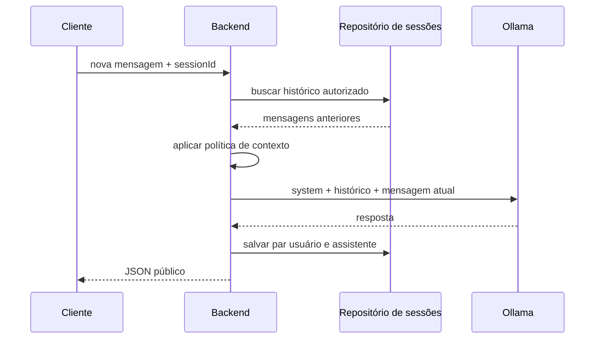
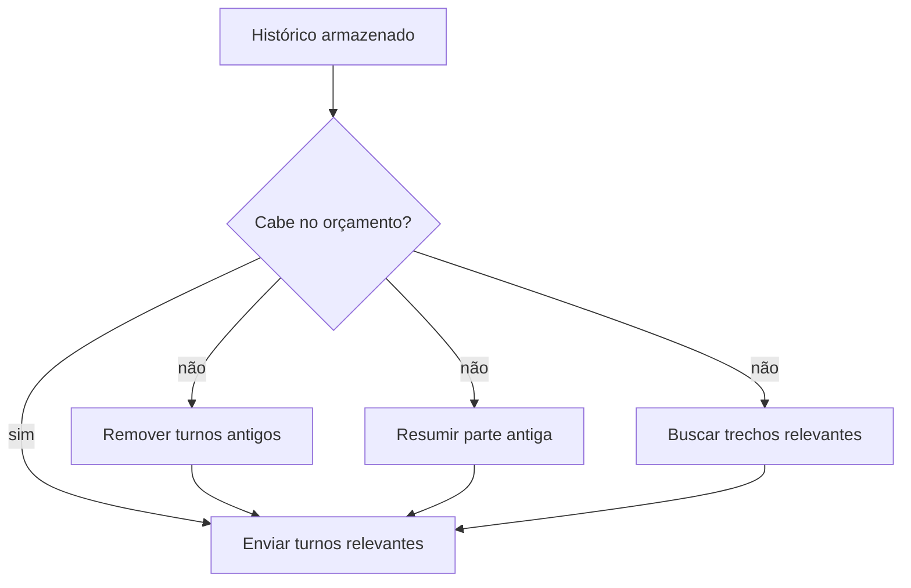

# Encontro 09 — Contexto, histórico, sessão e limites

## Tema

Modelagem de conversas com histórico explícito, sessões isoladas, orçamento de
contexto, retenção e controle de concorrência no backend.

## Objetivos

- Diferenciar contexto do modelo, histórico da aplicação e sessão do usuário.
- Demonstrar que a API do Ollama não mantém a conversa automaticamente.
- Armazenar mensagens por sessão sem confiar no cliente para reconstruí-las.
- Selecionar somente o histórico necessário para cada inferência.
- Aplicar limites de mensagens, caracteres, tempo e concorrência.
- Evitar salvar mensagens do assistente quando a geração falhar.
- Explicitar limitações de uma implementação em memória.

## Visão geral

Uma conversa aparente exige estado na aplicação. A cada requisição, o backend
seleciona mensagens anteriores e envia novamente o array `messages` ao modelo.



Ollama recebe contexto; a aplicação gerencia histórico e sessão.

## Conceitos que não devem ser confundidos

| Conceito | Definição |
|---|---|
| contexto | conteúdo enviado ao modelo em uma inferência |
| histórico | mensagens que a aplicação decidiu armazenar |
| sessão | identificador que agrupa mensagens de uma conversa |
| memória do modelo | parâmetros aprendidos durante treinamento, não a conversa atual |
| retenção | período durante o qual dados são mantidos |
| orçamento | limite reservado para instrução, histórico, entrada e resposta |

Nem tudo que foi armazenado precisa ser reenviado. Nem tudo que foi enviado
precisa ser armazenado.

## Por que não confiar no histórico enviado pelo frontend?

Se o cliente enviar todo o array de mensagens, poderá:

- alterar respostas anteriores do assistente;
- remover instruções relevantes;
- inserir mensagens com papel `system`;
- acessar ou misturar outra sessão;
- aumentar o contexto sem limite;
- manipular auditoria e regras de negócio.

O contrato público deve receber somente a nova mensagem e um identificador de
sessão. O backend reconstrói o restante.

## Política didática deste encontro

| Limite | Valor inicial | Finalidade |
|---|---:|---|
| tamanho da nova mensagem | 2.000 caracteres | limitar entrada individual |
| histórico enviado | 8 mensagens | manter quatro turnos recentes |
| caracteres do histórico | 6.000 | proteção aproximada do contexto |
| sessão inativa | 30 minutos | reduzir retenção indefinida |
| geração concorrente | 1 por sessão | preservar a ordem das mensagens |

Esses valores são decisões didáticas, não universais. Caracteres não equivalem
a tokens; o limite por caracteres é uma barreira operacional aproximada. A
contagem retornada pelo Ollama deve ser observada para calibrar a política.

## Contratos HTTP

### Criar sessão

```http
POST /conversas
```

```json
{
  "sessionId": "a1c0d2e3-0000-4000-8000-123456789abc",
  "expiraEmMinutos": 30
}
```

### Enviar mensagem

```http
POST /conversas/:sessionId/mensagens
Content-Type: application/json
```

```json
{
  "mensagem": "Meu nome é Ana e trabalho com desenvolvimento Web."
}
```

Resposta:

```json
{
  "sessionId": "a1c0d2e3-0000-4000-8000-123456789abc",
  "resposta": "Entendido.",
  "modelo": "llama3.2:latest",
  "historicoUtilizado": 0
}
```

### Consultar histórico

```http
GET /conversas/:sessionId/mensagens
```

### Excluir sessão

```http
DELETE /conversas/:sessionId
```

Um UUID difícil de adivinhar não substitui autenticação e autorização. A
atividade ainda não implementa usuários, mas a limitação deve ser registrada.

## Estrutura sugerida

```text
src/conversas/
├── dto/enviar-mensagem.dto.ts
├── conversa.types.ts
├── contexto.policy.ts
├── conversas.repository.ts
├── conversas.service.ts
├── conversas.controller.ts
└── conversas.module.ts
```

## Passo 1 — ampliar o contrato do modelo

Em `modelo.provider.ts`, acrescente:

```ts
export type ModeloRole = 'system' | 'user' | 'assistant';

export interface ModeloMensagem {
  role: ModeloRole;
  content: string;
}

export interface ConversarInput {
  messages: ModeloMensagem[];
}

export interface ModeloProvider {
  gerar(input: GerarRespostaInput): Promise<GerarRespostaOutput>;
  gerarStream(input: GerarStreamInput): AsyncIterable<string>;
  conversar(input: ConversarInput): Promise<GerarRespostaOutput>;
}
```

### Por que criar `conversar`?

`gerar` recebe uma única mensagem e atende ao caso simples. Uma conversa exige
papéis e histórico ordenado. O contrato continua independente do Ollama e não
permite que camadas superiores usem nomes externos como `prompt_eval_count`.

## Passo 2 — adaptar o `OllamaProvider`

```ts
async conversar(input: ConversarInput): Promise<GerarRespostaOutput> {
  const baseUrl = this.config.getOrThrow<string>('OLLAMA_BASE_URL');
  const model = this.config.getOrThrow<string>('OLLAMA_MODEL');
  const timeout = Number(
    this.config.get<string>('OLLAMA_TIMEOUT_MS') ?? '30000',
  );

  const response = await this.http.axiosRef.post<OllamaChatResponse>(
    `${baseUrl}/api/chat`,
    {
      model,
      messages: input.messages,
      stream: false,
    },
    { timeout },
  );

  const content = response.data.message?.content?.trim();
  if (!content) {
    throw new BadGatewayException('Resposta inválida do modelo');
  }

  return {
    resposta: content,
    modelo: response.data.model,
    tokensEntrada: response.data.prompt_eval_count,
    tokensSaida: response.data.eval_count,
  };
}
```

Na implementação final, reutilize o tratamento de timeout e indisponibilidade
do método `gerar`. Duplicar a política de erros em vários métodos aumenta o risco
de comportamentos diferentes para a mesma falha.

## Passo 3 — criar o DTO

```ts
import { IsString, MaxLength, MinLength } from 'class-validator';

export class EnviarMensagemDto {
  @IsString()
  @MinLength(1)
  @MaxLength(2000)
  mensagem!: string;
}
```

O DTO não possui `role`, histórico, modelo nem instrução de sistema. Essas
decisões pertencem ao backend.

## Passo 4 — representar sessão e mensagem

Em `conversa.types.ts`:

```ts
import type { ModeloMensagem } from '../ia/providers/modelo.provider';

export interface MensagemArmazenada extends ModeloMensagem {
  criadaEm: Date;
}

export interface Conversa {
  id: string;
  mensagens: MensagemArmazenada[];
  criadaEm: Date;
  ultimoAcessoEm: Date;
}
```

`criadaEm` registra a ordem e `ultimoAcessoEm` permite expirar sessões inativas.
Em uma aplicação autenticada, também seria necessário associar o proprietário.

## Passo 5 — implementar um repositório em memória

```ts
import { Injectable } from '@nestjs/common';
import { randomUUID } from 'node:crypto';
import type { Conversa, MensagemArmazenada } from './conversa.types';

@Injectable()
export class ConversasRepository {
  private readonly items = new Map<string, Conversa>();

  criar(): Conversa {
    const now = new Date();
    const conversa: Conversa = {
      id: randomUUID(),
      mensagens: [],
      criadaEm: now,
      ultimoAcessoEm: now,
    };

    this.items.set(conversa.id, conversa);
    return conversa;
  }

  buscar(id: string): Conversa | undefined {
    return this.items.get(id);
  }

  adicionarPar(
    id: string,
    user: MensagemArmazenada,
    assistant: MensagemArmazenada,
  ): void {
    const conversa = this.items.get(id);
    if (!conversa) return;

    conversa.mensagens.push(user, assistant);
    conversa.ultimoAcessoEm = new Date();
  }

  excluir(id: string): boolean {
    return this.items.delete(id);
  }
}
```

### Limitações do `Map`

- todas as sessões desaparecem ao reiniciar o processo;
- múltiplas instâncias do backend não compartilham estado;
- não existe consulta durável nem auditoria;
- o consumo de memória cresce se não houver expiração;
- dados não estão associados a uma identidade autenticada.

O repositório em memória torna a política visível. PostgreSQL será uma evolução
posterior, não uma mudança de responsabilidade do service.

## Passo 6 — implementar a política de contexto

Em `contexto.policy.ts`:

```ts
import type { ModeloMensagem } from '../ia/providers/modelo.provider';

const MAX_HISTORY_MESSAGES = 8;
const MAX_HISTORY_CHARS = 6000;

export function selecionarHistorico(
  history: ModeloMensagem[],
): ModeloMensagem[] {
  const selected = history.slice(-MAX_HISTORY_MESSAGES);

  const totalChars = () =>
    selected.reduce((total, message) => total + message.content.length, 0);

  while (selected.length >= 2 && totalChars() > MAX_HISTORY_CHARS) {
    selected.splice(0, 2);
  }

  return selected;
}
```

### Por que remover duas mensagens por vez?

O histórico é salvo em pares `user` e `assistant`. Remover apenas a primeira
mensagem poderia deixar uma resposta sem a pergunta correspondente. A política
preserva os turnos recentes e descarta os mais antigos.

### O que essa política ainda não resolve?

- contagem exata de tokens;
- seleção por relevância;
- resumo de trechos antigos;
- mensagens com anexos;
- limites diferentes por modelo;
- reserva garantida para a resposta.

## Passo 7 — montar o service

```ts
import {
  BadRequestException,
  ConflictException,
  GoneException,
  Inject,
  Injectable,
  NotFoundException,
} from '@nestjs/common';
import {
  MODELO_PROVIDER,
  type ModeloProvider,
  type ModeloMensagem,
} from '../ia/providers/modelo.provider';
import { selecionarHistorico } from './contexto.policy';
import { ConversasRepository } from './conversas.repository';

const SESSION_TTL_MS = 30 * 60 * 1000;

@Injectable()
export class ConversasService {
  private readonly processing = new Set<string>();

  constructor(
    private readonly repository: ConversasRepository,
    @Inject(MODELO_PROVIDER)
    private readonly model: ModeloProvider,
  ) {}

  criar() {
    return this.repository.criar();
  }

  async enviar(sessionId: string, rawMessage: string) {
    const conversation = this.repository.buscar(sessionId);
    if (!conversation) throw new NotFoundException('Sessão não encontrada');

    const inactiveFor = Date.now() - conversation.ultimoAcessoEm.getTime();
    if (inactiveFor > SESSION_TTL_MS) {
      this.repository.excluir(sessionId);
      throw new GoneException('Sessão expirada');
    }

    if (this.processing.has(sessionId)) {
      throw new ConflictException('Já existe uma geração nesta sessão');
    }

    const message = rawMessage.trim();
    if (!message) throw new BadRequestException('Mensagem vazia');

    const history = selecionarHistorico(conversation.mensagens);
    const messages: ModeloMensagem[] = [
      {
        role: 'system',
        content: 'Responda de forma objetiva e não invente informações.',
      },
      ...history,
      { role: 'user', content: message },
    ];

    this.processing.add(sessionId);

    try {
      const result = await this.model.conversar({ messages });
      const now = new Date();

      this.repository.adicionarPar(
        sessionId,
        { role: 'user', content: message, criadaEm: now },
        { role: 'assistant', content: result.resposta, criadaEm: now },
      );

      return {
        sessionId,
        resposta: result.resposta,
        modelo: result.modelo,
        historicoUtilizado: history.length,
      };
    } finally {
      this.processing.delete(sessionId);
    }
  }
}
```

### Decisões importantes

- a instrução de sistema é criada pelo backend e não armazenada como mensagem
  do usuário;
- a mensagem atual entra depois do histórico;
- a sessão é bloqueada enquanto uma geração está ativa;
- o par só é armazenado depois de uma resposta válida;
- `finally` sempre libera a sessão, inclusive quando ocorre erro;
- uma falha do modelo não cria uma resposta fictícia no histórico.

## Passo 8 — criar o controller

```ts
import {
  Body,
  Controller,
  Delete,
  Get,
  Param,
  Post,
} from '@nestjs/common';
import { EnviarMensagemDto } from './dto/enviar-mensagem.dto';
import { ConversasRepository } from './conversas.repository';
import { ConversasService } from './conversas.service';

@Controller('conversas')
export class ConversasController {
  constructor(
    private readonly service: ConversasService,
    private readonly repository: ConversasRepository,
  ) {}

  @Post()
  criar() {
    const conversation = this.service.criar();
    return { sessionId: conversation.id, expiraEmMinutos: 30 };
  }

  @Post(':sessionId/mensagens')
  enviar(
    @Param('sessionId') sessionId: string,
    @Body() dto: EnviarMensagemDto,
  ) {
    return this.service.enviar(sessionId, dto.mensagem);
  }

  @Get(':sessionId/mensagens')
  listar(@Param('sessionId') sessionId: string) {
    return this.repository.buscar(sessionId)?.mensagens ?? [];
  }

  @Delete(':sessionId')
  excluir(@Param('sessionId') sessionId: string) {
    return { removida: this.repository.excluir(sessionId) };
  }
}
```

Para um sistema real, o controller não deveria acessar o repository diretamente;
os métodos de consulta e exclusão passariam pelo service para aplicar
autorização. O acesso direto é mostrado como uma simplificação a ser discutida.

## Passo 9 — registrar o módulo

Primeiro, acrescente o token à lista de exportações de `IaModule`:

```ts
@Module({
  imports: [HttpModule],
  controllers: [IaController],
  providers: [
    IaService,
    {
      provide: MODELO_PROVIDER,
      useClass: OllamaProvider,
    },
  ],
  exports: [MODELO_PROVIDER],
})
export class IaModule {}
```

Depois, crie `src/conversas/conversas.module.ts`:

```ts
import { Module } from '@nestjs/common';
import { IaModule } from '../ia/ia.module';
import { ConversasController } from './conversas.controller';
import { ConversasRepository } from './conversas.repository';
import { ConversasService } from './conversas.service';

@Module({
  imports: [IaModule],
  controllers: [ConversasController],
  providers: [ConversasService, ConversasRepository],
})
export class ConversasModule {}
```

Por fim, importe `ConversasModule` no módulo raiz da aplicação. Exportar o token
em `IaModule` e importar esse módulo em `ConversasModule` torna a dependência
explícita e evita recriar o `OllamaProvider`.

## Passo 10 — testar a memória explícita

No Thunder Client:

1. execute `POST /conversas`;
2. copie `sessionId` para uma variável de ambiente;
3. envie: `Meu nome é Ana e minha linguagem principal é TypeScript.`;
4. envie: `Qual é meu nome e qual linguagem mencionei?`;
5. confirme que a resposta usa o histórico;
6. crie outra sessão;
7. repita somente a segunda pergunta na nova sessão;
8. confirme que a informação não atravessou sessões.

Use:

```http
POST http://localhost:3000/conversas/{{sessionId}}/mensagens
Content-Type: application/json
```

```json
{
  "mensagem": "Qual é meu nome e qual linguagem mencionei?"
}
```

## Passo 11 — observar o crescimento do contexto

Envie pelo menos seis turnos na mesma sessão e registre:

| Turno | Mensagens armazenadas | Histórico enviado | `prompt_eval_count` | Observação |
|---:|---:|---:|---:|---|
| 1 | | | | |
| 2 | | | | |
| 3 | | | | |
| 4 | | | | |
| 5 | | | | |
| 6 | | | | |

Para preencher `prompt_eval_count`, preserve a métrica internamente ou registre-a
em log técnico sem conteúdo sensível. Observe que o crescimento pode não ser
linear por causa da tokenização e da remoção de turnos antigos.

## Passo 12 — testar limites e isolamento

| Caso | Resultado esperado |
|---|---|
| sessão inexistente | 404 |
| sessão expirada | 410 |
| mensagem vazia | 400 |
| mensagem acima do limite | 400 |
| duas requisições simultâneas na mesma sessão | uma delas recebe 409 |
| mesma pergunta em duas sessões | históricos independentes |
| falha do Ollama | par não é salvo |
| exclusão seguida de consulta | sessão não está mais disponível |

## Privacidade e retenção

Histórico de conversa pode conter dados pessoais, código privado ou documentos.
Uma política real precisa definir:

- finalidade do armazenamento;
- base e autorização para tratamento;
- prazo de retenção;
- criptografia e controle de acesso;
- conteúdo permitido em logs;
- exclusão solicitada pelo usuário;
- uso ou não dos dados para avaliação e treinamento.

Executar o modelo localmente reduz envio a terceiros, mas não elimina riscos no
backend, banco, logs, backups ou interface.

## Estratégias quando o contexto cresce



- janela deslizante preserva somente mensagens recentes;
- resumo reduz tamanho, mas pode omitir ou distorcer fatos;
- recuperação seleciona trechos relevantes, mas depende de busca e avaliação;
- fatos estruturados podem ser armazenados separadamente do texto da conversa.

Nenhuma estratégia justifica enviar indefinidamente todo o histórico.

## Erros comuns

### Presumir memória automática do Ollama

Sem reenviar `messages`, uma nova requisição não possui o histórico anterior.

### Usar `sessionId` como autorização

Conhecer um identificador não deveria permitir acessar dados de outro usuário.

### Salvar antes de a geração terminar

Uma falha poderia deixar pares incompletos ou uma resposta inexistente.

### Limitar apenas a quantidade de mensagens

Uma única mensagem pode ser muito grande; limites precisam atuar em mais de uma
dimensão.

### Enviar o histórico fornecido pelo cliente

O cliente poderia alterar papéis e instruções anteriores.

## Atividade individual

Implemente uma conversa com pelo menos duas sessões independentes. Entregue:

1. contratos e módulo de conversas;
2. repository em memória;
3. política de seleção do histórico;
4. teste de isolamento entre sessões;
5. teste de limite e concorrência;
6. tabela de crescimento do contexto;
7. análise das limitações do armazenamento em memória;
8. proposta de evolução para persistência sem alterar o contrato público.

## Checklist de aprendizagem

- [ ] distinguir contexto, histórico e sessão;
- [ ] reconstruir `messages` no backend;
- [ ] impedir que o cliente defina papéis;
- [ ] aplicar limites de mensagem, histórico e inatividade;
- [ ] preservar pares recentes ao truncar;
- [ ] impedir gerações concorrentes na mesma sessão;
- [ ] salvar o par somente depois do sucesso;
- [ ] reconhecer que UUID não substitui autorização;
- [ ] documentar retenção e privacidade.

## Síntese

Memória conversacional não é uma propriedade automática do modelo. É uma
política da aplicação que decide o que armazenar, por quanto tempo, para quem e
o que reenviar em cada inferência. Limites e isolamento precisam ser tratados
como requisitos de arquitetura, não como detalhes posteriores.

## Fontes oficiais de apoio

- [Rota de chat do Ollama](https://docs.ollama.com/api/chat)
- [Requisições HTTP no Angular](https://angular.dev/guide/http/making-requests)
- [Controllers no NestJS](https://docs.nestjs.com/controllers)
- [Sessões no NestJS](https://docs.nestjs.com/techniques/session)
