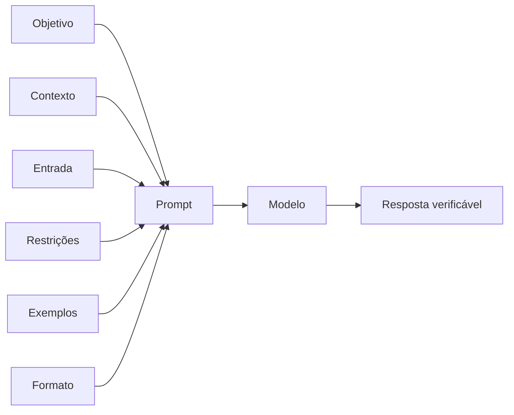

# Encontro 10 — Engenharia de prompts: escrita, estrutura e exemplos

## Tema

Escrita de prompts claros e verificáveis, com foco na organização das
instruções, fornecimento de contexto, definição de restrições, uso de exemplos e
especificação do formato da resposta.

## Objetivos

- Identificar por que um prompt é ambíguo, incompleto ou contraditório.
- Separar objetivo, contexto, dados de entrada, regras e formato da resposta.
- Escrever instruções específicas sem adicionar detalhes irrelevantes.
- Comparar prompts fracos e prompts bem estruturados.
- Utilizar zero-shot e few-shot de maneira consciente.
- Usar delimitadores para organizar dados e instruções.
- Definir como o modelo deve agir quando faltarem informações.
- Revisar prompts com um checklist objetivo.

## O que é um prompt?

Prompt é o conjunto de instruções e informações fornecidas ao modelo para
orientar uma resposta. Ele pode conter uma pergunta curta ou várias partes:
objetivo, contexto, entrada, restrições, exemplos e formato de saída.

Um prompt não é uma frase mágica. Ele funciona como uma especificação. Quanto
mais fácil for verificar se a resposta cumpriu a especificação, melhor será o
prompt.



## Um prompt bom não é necessariamente longo

Compare:

```text
Explique tudo sobre APIs de um jeito muito bom, completo e fácil.
```

O texto é curto, mas “tudo”, “muito bom”, “completo” e “fácil” não possuem
critérios claros.

```text
Explique o que é uma API REST para um estudante que conhece JavaScript, mas
nunca criou um backend. Use até 180 palavras, inclua um exemplo de requisição
GET e diferencie recurso, rota e método HTTP. Não aborde autenticação.
```

O segundo prompt continua curto, mas define público, escopo, tamanho, conteúdo
obrigatório e conteúdo fora do escopo.

## Sete partes úteis de um prompt

Nem todo prompt precisa conter as sete partes. Use somente as que reduzem uma
ambiguidade real.

| Parte | Pergunta respondida | Exemplo |
|---|---|---|
| objetivo | o que deve ser produzido? | resumir o texto |
| público | para quem é a resposta? | estudante iniciante |
| contexto | quais fatos ajudam a executar? | sistema usa NestJS |
| entrada | sobre qual dado trabalhar? | chamado enviado pelo usuário |
| restrições | o que deve ou não ocorrer? | até cinco itens |
| formato | como organizar a resposta? | tabela com três colunas |
| ausência de informação | o que fazer quando não for possível responder? | declarar que o dado não foi informado |

## Estrutura-base

Uma estrutura reutilizável é:

```text
# Objetivo
[Descreva uma ação principal e observável.]

# Contexto
[Forneça apenas informações necessárias para a tarefa.]

# Entrada
<entrada>
[Insira aqui os dados variáveis.]
</entrada>

# Regras
- [Declare limites e critérios obrigatórios.]
- [Explique o que fazer se faltar informação.]
- [Declare o que está fora do escopo quando necessário.]

# Formato da resposta
[Informe estrutura, tamanho, idioma e nível de detalhe.]
```

Essa estrutura não deve virar um formulário preenchido mecanicamente. Uma
pergunta factual simples pode precisar somente de objetivo e formato.

## Como escrever cada parte

### 1. Comece com um verbo de ação

Prefira verbos que indiquem uma operação observável:

- classifique;
- compare;
- resuma;
- extraia;
- revise;
- transforme;
- proponha;
- explique.

“Fale sobre” deixa o escopo aberto. “Compare X e Y usando os critérios A, B e C”
é verificável.

### 2. Defina o objeto da tarefa

“Analise isso” obriga o modelo a inferir o que é “isso” e qual análise deve ser
feita. Informe o dado e a dimensão analisada:

```text
Analise o trecho TypeScript abaixo procurando problemas de validação de entrada,
tratamento de erros e exposição de dados sensíveis.
```

### 3. Forneça contexto útil

Contexto altera a interpretação, mas contexto irrelevante aumenta ruído.

```text
A resposta será usada por uma equipe que conhece Angular, mas está iniciando em
NestJS. O sistema executa em contêineres Docker.
```

Não acrescente biografia, elogios ou detalhes que não mudam a resposta.

### 4. Especifique critérios e limites

Troque adjetivos vagos por critérios observáveis:

| Vago | Mais preciso |
|---|---|
| seja breve | use no máximo 120 palavras |
| explique bem | defina o conceito e apresente um exemplo |
| seja técnico | use terminologia de APIs REST e defina termos incomuns |
| faça uma lista curta | apresente de três a cinco itens |
| escreva para iniciantes | não pressuponha conhecimento de injeção de dependência |

### 5. Defina o formato

O formato facilita o uso e a avaliação da resposta:

```text
Responda em português usando:
1. uma definição de até duas frases;
2. uma lista com três vantagens;
3. um exemplo curto;
4. uma limitação.
```

Pedir formato não garante conformidade. Se a saída for consumida por software,
ela ainda precisará de validação; esse assunto será aprofundado no Encontro 12.

### 6. Declare como tratar incerteza

Sem essa orientação, o modelo pode completar lacunas de forma plausível:

```text
Use somente as informações presentes no texto. Quando um dado não estiver
disponível, escreva “não informado”. Não invente nomes, datas ou valores.
```

### 7. Revise conflitos

Um prompt não deve ordenar simultaneamente:

```text
Explique detalhadamente, mas responda em apenas uma frase.
```

Quando dois critérios concorrem, estabeleça prioridade ou remova um deles.

## Comparação 1 — resumo

Todos os prompts de exemplo deste encontro possuem menos de 2.000 caracteres.

### Prompt fraco

```text
Resuma este texto para mim de forma boa e completa.
```

### Problemas

- não identifica o público;
- não estabelece tamanho;
- “boa” e “completa” não são critérios;
- não informa o que deve ser preservado;
- não define o comportamento diante de informações ausentes.

### Prompt melhorado

```text
Resuma o texto entre <documento> e </documento> para uma pessoa gestora que não
possui formação técnica.

Regras:
- use entre 100 e 140 palavras;
- preserve objetivo, decisão principal e riscos mencionados;
- não acrescente fatos externos;
- se não houver decisão explícita, escreva “decisão não informada”;
- use linguagem direta e evite siglas não explicadas.

Formato:
1. Síntese;
2. Decisão;
3. Riscos.

<documento>
[COLE O TEXTO AQUI]
</documento>
```

### Por que é melhor?

O prompt define destinatário, extensão, informação prioritária, fonte permitida,
tratamento de ausência e estrutura de saída.

## Comparação 2 — explicação técnica

### Prompt fraco

```text
Explique Docker.
```

### Prompt melhorado

```text
Explique a diferença entre imagem, contêiner e volume Docker para um estudante
que já sabe executar comandos no terminal, mas nunca utilizou contêineres.

Use no máximo 220 palavras. Para cada conceito:
- apresente uma definição em uma frase;
- forneça uma analogia simples;
- dê um exemplo relacionado a uma aplicação NestJS.

Finalize explicando por que apagar um contêiner não deve apagar os dados mantidos
em um volume. Não aborde Kubernetes ou orquestração em produção.
```

### O que mudou?

- “Docker” foi reduzido a três conceitos;
- o conhecimento prévio foi declarado;
- cada conceito recebeu o mesmo padrão de explicação;
- o exemplo foi contextualizado;
- assuntos desnecessários foram excluídos.

## Comparação 3 — revisão de código

### Prompt fraco

```text
Veja se esse código está bom e corrija tudo.
```

### Prompt melhorado

```text
Revise o método TypeScript entre <codigo> e </codigo>.

Procure somente:
1. falhas de validação da entrada;
2. erros assíncronos não tratados;
3. exposição de informações sensíveis;
4. nomes que dificultem a compreensão.

Para cada problema encontrado, apresente:
- severidade: alta, média ou baixa;
- linha ou trecho afetado;
- explicação objetiva;
- correção sugerida.

Não reescreva o método inteiro. Se não encontrar problemas em um critério,
declare isso explicitamente. Não presuma arquivos que não foram fornecidos.

<codigo>
[COLE O MÉTODO AQUI]
</codigo>
```

### O que mudou?

“Bom” foi substituído por quatro dimensões de revisão. A resposta esperada possui
campos definidos, e o modelo não recebeu autorização para inventar o restante do
projeto ou reescrever código desnecessariamente.

## Comparação 4 — classificação

### Prompt fraco

```text
Qual é a categoria deste chamado?
```

### Prompt melhorado

```text
Classifique o chamado em exatamente uma categoria:

- ACESSO: login, senha, autenticação ou permissão;
- FINANCEIRO: pagamento, cobrança, boleto ou reembolso;
- INCIDENTE: erro, indisponibilidade ou degradação do sistema;
- OUTROS: nenhuma categoria anterior possui evidência suficiente.

Regras:
- considere somente o conteúdo entre <chamado> e </chamado>;
- não crie novas categorias;
- se houver mais de um assunto, escolha o que impede o usuário de continuar;
- responda somente com o nome da categoria.

<chamado>
Depois de trocar de celular, não recebo o código de autenticação.
</chamado>
```

### O que mudou?

As categorias foram definidas, a ambiguidade ganhou regra de precedência e o
formato permite verificar a resposta rapidamente.

## Comparação 5 — criação de conteúdo

### Prompt fraco

```text
Escreva um post interessante sobre inteligência artificial.
```

### Prompt melhorado

```text
Escreva um post para o LinkedIn de uma empresa de desenvolvimento de software.
O público é formado por lideranças técnicas que avaliam adotar IA generativa em
sistemas internos.

Objetivo: mostrar que uma prova de conceito precisa de critérios de avaliação
antes de ser levada à produção.

Regras:
- escreva entre 170 e 220 palavras;
- use tom profissional, sem exageros promocionais;
- apresente três critérios: qualidade, segurança e custo;
- inclua uma pergunta final que incentive discussão;
- não use emojis, hashtags ou estatísticas sem fonte;
- não afirme que IA substituirá equipes.

Entregue somente o texto final do post.
```

### O que mudou?

Tema amplo, público desconhecido e adjetivo subjetivo foram substituídos por
canal, audiência, propósito, extensão, conteúdo obrigatório e tom.

## Comparação 6 — planejamento

### Prompt fraco

```text
Crie um plano para melhorar nosso sistema.
```

### Prompt melhorado

```text
Proponha um plano inicial para reduzir o tempo de resposta de uma API NestJS.

Contexto conhecido:
- a API executa em Docker;
- PostgreSQL é o banco principal;
- não existem métricas de duração por endpoint;
- a equipe possui duas pessoas e uma semana para diagnóstico;
- nenhuma alteração de infraestrutura foi aprovada.

Regras:
- não declare uma causa sem evidência;
- priorize medição e diagnóstico antes de otimização;
- separe ações que podem ser realizadas agora das que dependem de aprovação;
- apresente no máximo seis ações.

Formato: tabela com as colunas Ordem, Ação, Evidência esperada e Dependência.
Depois da tabela, liste três perguntas que precisam ser respondidas.
```

### O que mudou?

O objetivo passou a ter uma métrica-alvo, o cenário informa recursos e limites,
e o prompt impede que uma hipótese seja apresentada como causa confirmada.

## Zero-shot: instruções sem exemplos

Zero-shot é adequado quando a tarefa e o formato podem ser descritos de forma
clara sem demonstrar respostas anteriores.

```text
Transforme o título abaixo para voz ativa. Preserve o significado e use no
máximo 12 palavras.

Título: A nova política de acesso foi aprovada pelo conselho.
```

Vantagens:

- prompt menor;
- menor consumo de contexto;
- manutenção mais simples.

Limitação: o modelo precisa inferir o padrão somente a partir da instrução.

## Few-shot: ensinar pelo padrão dos exemplos

Few-shot fornece alguns pares de entrada e saída antes da entrada real. Não é um
novo treinamento do modelo; os exemplos existem somente no contexto atual.

### Prompt few-shot bem estruturado

```text
Converta mensagens técnicas em atualizações curtas para clientes.

Regras:
- preserve o fato principal;
- não exponha nomes de serviços internos;
- não prometa prazo quando ele não estiver informado;
- use uma frase com até 25 palavras.

Exemplo 1
Entrada: O worker billing-sync falhou e o reprocessamento foi iniciado.
Saída: Identificamos uma falha no processamento de cobranças e iniciamos a
recuperação.

Exemplo 2
Entrada: O deploy foi revertido; a API voltou, mas ainda analisamos a causa.
Saída: O serviço foi restabelecido e a causa da instabilidade continua em
análise.

Nova entrada:
O pod auth-2 reiniciou três vezes; escalamos para a equipe de plataforma.

Responda somente com a atualização para o cliente.
```

### Cuidados com exemplos

- use o mesmo formato em todos os exemplos;
- cubra variações relevantes, não apenas casos fáceis;
- não inclua uma regra no texto e o comportamento oposto no exemplo;
- evite exemplos numerosos sem ganho observado;
- revise dados pessoais e informações sensíveis;
- não use a própria entrada avaliada como exemplo.

## Delimitadores

Delimitadores separam instruções de dados:

```text
<contexto>
...
</contexto>

<entrada>
...
</entrada>
```

Também podem ser usados títulos Markdown ou cercas de código. Escolha um padrão
e use-o de forma consistente.

Delimitadores melhoram a organização, mas não criam uma barreira de segurança.
Uma entrada pode conter instruções maliciosas ou até imitar a tag de fechamento.
Regras críticas, permissões e validação devem permanecer no software.

## Papel ou persona: quando ajuda?

Uma função específica pode orientar vocabulário e critérios:

```text
Atue como revisor técnico de documentação de APIs REST. Verifique clareza dos
contratos, exemplos de requisição e descrição dos erros.
```

Personas genéricas acrescentam pouco:

```text
Você é o maior especialista do mundo, extremamente inteligente e perfeito.
```

Evite elogios, dramatização e biografias longas. Defina competências relevantes
para a tarefa e, principalmente, critérios de saída.

## Instruções negativas

“Não faça” pode ser útil para riscos específicos:

```text
Não invente datas e não utilize fontes externas.
```

Mas uma lista extensa de proibições costuma ser difícil de seguir. Sempre que
possível, declare o comportamento desejado:

```text
Use apenas as datas presentes no documento. Para datas ausentes, escreva “não
informada”.
```

## Decompor tarefas complexas

Um único prompt pode acumular objetivos incompatíveis:

```text
Leia o documento, encontre requisitos, proponha arquitetura, escreva o código,
crie os testes e faça a documentação.
```

Prefira etapas com saídas verificáveis:

1. extrair requisitos;
2. confirmar ambiguidades;
3. propor arquitetura baseada nos requisitos confirmados;
4. implementar uma parte definida;
5. revisar com critérios próprios.

Dividir a tarefa não significa pedir ao modelo que revele raciocínio interno.
Solicite resultados intermediários úteis, decisões, premissas e justificativas
curtas que possam ser verificadas.

## Método de revisão em cinco perguntas

Antes de executar, verifique:

1. A ação principal está clara?
2. O modelo recebeu os fatos necessários e somente eles?
3. Termos subjetivos foram transformados em critérios?
4. O formato e o limite da resposta estão definidos?
5. Está claro o que fazer quando faltar informação?

Depois da resposta, verifique:

1. O resultado cumpriu cada regra?
2. Há afirmações não sustentadas pela entrada?
3. O formato facilita o uso pretendido?
4. O erro veio do prompt, da falta de contexto ou da limitação do modelo?
5. Qual é a menor alteração capaz de testar essa hipótese?

Altere uma dimensão por vez. Se objetivo, exemplos, modelo e formato mudarem
simultaneamente, não será possível explicar a diferença observada.

## Atividade prática individual — oficina de reescrita

### Objetivo

Transformar um pedido ambíguo em um prompt estruturado com no máximo 2.000
caracteres e demonstrar quais decisões de escrita melhoraram a resposta.

Não será criada uma aplicação. O estudante poderá usar o chatbot autorizado pela
instituição ou o Ollama já executado em Docker nos encontros anteriores. Para o
ambiente local:

```bash
docker compose up -d ollama
docker compose exec ollama ollama list
```

As chamadas podem ser realizadas pelo Thunder Client usando a rota já estudada
no Encontro 05.

### Passo 1 — escolher um prompt fraco

Escolha um dos pedidos:

```text
Explique banco de dados.
```

```text
Faça uma documentação boa deste código.
```

```text
Analise este chamado e diga o que fazer.
```

```text
Crie um plano de estudos sobre IA.
```

### Passo 2 — registrar o resultado original

Execute o prompt sem alterações. Não corrija a resposta manualmente. Registre:

- modelo utilizado;
- texto integral do prompt;
- resposta recebida;
- ambiguidades percebidas;
- partes úteis e problemas da resposta.

### Passo 3 — preencher o planejamento

| Elemento | Decisão |
|---|---|
| objetivo |  |
| público |  |
| contexto necessário |  |
| entrada delimitada |  |
| conteúdo obrigatório |  |
| conteúdo fora do escopo |  |
| formato |  |
| limite de tamanho |  |
| tratamento de ausência |  |

### Passo 4 — escrever a versão melhorada

A nova versão deve:

- ter no máximo 2.000 caracteres, contando espaços;
- possuir uma ação principal;
- usar pelo menos quatro partes da estrutura-base;
- substituir adjetivos vagos por critérios;
- definir o formato da resposta;
- informar como tratar dados ausentes;
- não solicitar informações pessoais ou sigilosas.

### Passo 5 — executar sem mudar outras variáveis

Use o mesmo modelo e, quando a interface permitir, os mesmos parâmetros. Mude
somente o prompt. Isso torna a comparação mais útil.

### Passo 6 — comparar

| Critério | Prompt original | Prompt reescrito |
|---|---|---|
| objetivo ficou evidente? |  |  |
| escopo foi respeitado? |  |  |
| formato foi obedecido? |  |  |
| surgiram fatos não fornecidos? |  |  |
| resposta serve ao público escolhido? |  |  |
| revisão manual necessária |  |  |

### Passo 7 — fazer uma única revisão

Escolha o problema mais importante da segunda resposta e faça apenas uma mudança
no prompt. Registre a hipótese:

```text
Se eu alterar ____________________, espero que a resposta ____________________.
```

Execute novamente e informe se a hipótese foi confirmada.

## Entrega

A atividade é individual e deverá conter:

1. prompt original e primeira resposta;
2. planejamento preenchido;
3. prompt reescrito com até 2.000 caracteres;
4. segunda resposta;
5. tabela comparativa;
6. alteração final e hipótese testada;
7. conclusão de até 150 palavras sobre o que mais influenciou o resultado.

## Erros comuns

### Aumentar o prompt sem reduzir ambiguidade

Mais texto pode apenas acrescentar ruído. Cada trecho deve mudar uma decisão do
modelo ou tornar o resultado verificável.

### Usar adjetivos como critérios

“Profissional”, “ótimo” e “completo” dependem de interpretação. Informe público,
conteúdo, extensão e formato.

### Acrescentar uma persona exagerada

Uma persona não substitui objetivo, dados e critérios.

### Pedir fatos que não foram fornecidos

Se a tarefa depende de informações atuais ou privadas, forneça uma fonte
adequada ou permita que o modelo declare ausência.

### Confiar somente em “não invente”

Restrinja a fonte permitida e defina uma resposta explícita para ausência de
informação.

### Usar poucos exemplos contraditórios

O modelo pode seguir o padrão demonstrado e ignorar uma regra escrita em sentido
oposto.

### Alterar tudo ao mesmo tempo

Sem controle das mudanças, não é possível aprender com a comparação.

## Checklist de aprendizagem

- [ ] iniciar o prompt com uma ação clara;
- [ ] fornecer contexto relevante sem excesso;
- [ ] separar dados por delimitadores;
- [ ] transformar termos vagos em critérios verificáveis;
- [ ] definir público, escopo, extensão e formato quando necessários;
- [ ] explicar como tratar informações ausentes;
- [ ] reconhecer quando zero-shot é suficiente;
- [ ] escrever exemplos few-shot consistentes;
- [ ] revisar conflitos entre instruções;
- [ ] manter cada prompt da atividade em até 2.000 caracteres;
- [ ] comparar versões alterando uma variável por vez.

## Síntese

Um bom prompt reduz decisões implícitas. Ele informa o que fazer, sobre quais
dados, para qual finalidade, dentro de quais limites e em qual formato. Não
precisa ser longo: precisa ser específico, coerente e verificável. Exemplos e
delimitadores ajudam, mas não substituem validação nem corrigem uma tarefa mal
definida.

## Fontes oficiais de apoio

- [Estratégias de design de prompts — Google](https://ai.google.dev/gemini-api/docs/prompting-strategies)
- [Templates e variáveis de prompt — Anthropic](https://docs.anthropic.com/en/docs/build-with-claude/prompt-engineering/prompt-templates-and-variables)
- [Rota de chat do Ollama](https://docs.ollama.com/api/chat)
