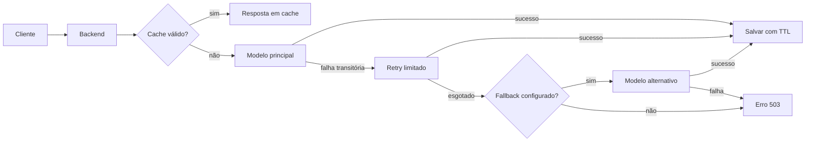

# Encontro 10 — Timeout, retry, fallback e cache

## Tema

Resiliência na integração NestJS–Ollama por meio de limites de tempo, repetição
controlada, fallback explícito e cache com expiração.

## Objetivos

- Diferenciar lentidão, indisponibilidade e resposta inválida.
- Encerrar requisições que ultrapassem o tempo aceitável.
- Repetir somente falhas transitórias e com quantidade limitada.
- Aplicar espera progressiva entre tentativas.
- Usar fallback sem esconder indisponibilidade nem inventar respostas.
- Evitar inferências repetidas com cache e chave determinística.
- Testar o comportamento degradado usando serviços Docker.

## Visão geral

Uma chamada ao modelo depende de rede, contêiner, memória, modelo carregado e
tempo de geração. Tratar toda falha da mesma forma cria sistemas lentos e
imprevisíveis.



Resiliência não significa insistir indefinidamente. Cada mecanismo possui custo
e deve obedecer a uma política observável.

## Conceitos e responsabilidades

| Mecanismo | Pergunta respondida | Risco se mal aplicado |
|---|---|---|
| timeout | por quanto tempo esperar? | cancelar uma geração legítima ou esperar indefinidamente |
| retry | vale tentar novamente? | multiplicar carga e latência |
| backoff | quanto aguardar entre tentativas? | provocar novas tentativas simultâneas |
| fallback | há alternativa segura? | esconder defeitos ou reduzir qualidade silenciosamente |
| cache | o resultado pode ser reutilizado? | devolver conteúdo incorreto, antigo ou de outro usuário |

## Política didática

| Item | Valor inicial | Justificativa |
|---|---:|---|
| timeout por tentativa | 30 segundos | permite observar modelos locais mais lentos |
| tentativas totais | 2 | uma original e uma repetição |
| backoff base | 500 ms | reduz repetição imediata |
| jitter | até 250 ms | evita sincronização entre clientes |
| TTL do cache | 5 minutos | facilita observar expiração em aula |
| fallback | opcional e identificado | não disfarça troca de modelo |

Esses valores são ponto de partida. A política real deve ser calibrada com
métricas de latência, capacidade do hardware e objetivo do endpoint.

## O que pode ser repetido?

| Situação | Retry? | Motivo |
|---|:---:|---|
| conexão recusada | sim | serviço pode estar reiniciando |
| timeout | sim, com cautela | falha pode ser transitória, mas a geração anterior deve ser cancelada |
| HTTP 429 | sim, respeitando espera do provedor | limite pode ser temporário |
| HTTP 500, 502, 503 ou 504 | sim | erro temporário do serviço |
| HTTP 400 | não | repetir a mesma entrada não corrige o contrato |
| HTTP 401 ou 403 | não | credencial ou permissão precisa ser corrigida |
| resposta inválida | normalmente não | o mesmo modelo pode repetir o erro |

Neste exercício, inferência é tratada como operação sem efeito persistente. Não
generalize retry de `POST`: pagamentos, gravações e comandos exigem idempotência.

## Estrutura que será adicionada

```text
backend/src/ia/
├── resiliencia/
│   ├── retry.policy.ts
│   └── cache-key.ts
├── providers/modelo.provider.ts
├── providers/ollama.provider.ts
├── ia.service.ts
├── ia.controller.ts
└── ia.module.ts
```

## Passo 1 — confirmar a stack Docker

Todos os comandos do projeto serão executados em contêineres. Use os nomes reais
dos serviços caso seu `compose.yaml` não utilize `backend` e `ollama`:

```bash
docker compose ps
docker compose exec ollama ollama list
docker compose logs --tail=30 backend
```

Antes de implementar resiliência, confirme que backend e Ollama se comunicam pela
rede do Compose. Dentro do backend, a URL deve usar o nome do serviço:

```dotenv
OLLAMA_BASE_URL=http://ollama:11434
OLLAMA_MODEL=llama3.2:latest
OLLAMA_TIMEOUT_MS=30000
OLLAMA_MAX_ATTEMPTS=2
CACHE_TTL_MS=300000
```

Se o backend criado no Encontro 06 ainda não estiver no Docker, crie
`backend/Dockerfile` antes de continuar:

```dockerfile
FROM node:22-alpine

WORKDIR /app

COPY package*.json ./
RUN npm ci

COPY . .

EXPOSE 3000

CMD ["npm", "run", "start:dev"]
```

Crie também `backend/.dockerignore`:

```text
node_modules
dist
.git
```

Preserve `ollama`, `frontend` e os volumes já existentes no `compose.yaml` e
acrescente o serviço e o volume abaixo:

```yaml
services:
  backend:
    build:
      context: ./backend
    user: "${LOCAL_UID:-1000}:${LOCAL_GID:-1000}"
    environment:
      HOME: /tmp
      OLLAMA_BASE_URL: http://ollama:11434
      OLLAMA_MODEL: llama3.2:latest
      OLLAMA_TIMEOUT_MS: 30000
      OLLAMA_MAX_ATTEMPTS: 2
      CACHE_TTL_MS: 300000
    ports:
      - "3000:3000"
    volumes:
      - ./backend:/app
      - backend_node_modules:/app/node_modules
    depends_on:
      - ollama

volumes:
  backend_node_modules:
```

O volume nomeado preserva as dependências instaladas na imagem, enquanto o bind
mount permite atualização do código. `depends_on` organiza a ordem de início,
mas não garante que o Ollama já esteja pronto; a aplicação ainda precisa tratar
indisponibilidade. Use `LOCAL_UID` e `LOCAL_GID` no `.env` quando o usuário do
laboratório não utilizar os valores padrão, conforme explicado no Encontro 08.

`localhost` dentro do contêiner aponta para o próprio contêiner, não para o
Ollama. Após alterar variáveis, recrie o backend:

```bash
docker compose up --build -d backend
```

## Passo 2 — instalar o cache pelo contêiner

```bash
docker compose exec backend \
  npm install @nestjs/cache-manager cache-manager
```

O cache usado inicialmente ficará na memória do processo. Isso é adequado para
aprender a política, mas não é compartilhado entre réplicas. Redis poderá
substituí-lo posteriormente sem alterar a responsabilidade do service.

## Passo 3 — ampliar o contrato do provider

Em `modelo.provider.ts`, acrescente metadados operacionais ao resultado e opções
de execução à entrada:

```ts
export interface GerarRespostaInput {
  mensagem: string;
  model?: string;
}

export interface GerarRespostaOutput {
  resposta: string;
  modelo: string;
  tentativas?: number;
  fallback?: boolean;
}
```

Os campos opcionais preservam os consumidores anteriores. O service poderá
informar qual modelo respondeu sem expor detalhes internos do Axios.

## Passo 4 — criar a política de retry

Crie `src/ia/resiliencia/retry.policy.ts`:

```ts
import axios from 'axios';

const RETRYABLE_STATUS = new Set([408, 429, 500, 502, 503, 504]);

export function isRetryable(error: unknown): boolean {
  if (!axios.isAxiosError(error)) return false;

  if (!error.response) {
    return ['ECONNABORTED', 'ECONNREFUSED', 'ECONNRESET', 'ETIMEDOUT']
      .includes(error.code ?? '');
  }

  return RETRYABLE_STATUS.has(error.response.status);
}

export function retryDelay(attempt: number): number {
  const exponential = 500 * 2 ** (attempt - 1);
  const jitter = Math.floor(Math.random() * 251);
  return exponential + jitter;
}

export async function wait(milliseconds: number): Promise<void> {
  await new Promise((resolve) => setTimeout(resolve, milliseconds));
}
```

O backoff cresce a cada falha. O jitter adiciona uma pequena variação para que
vários clientes não repitam exatamente no mesmo instante.

## Passo 5 — aplicar timeout e retry no `OllamaProvider`

No provider, extraia uma tentativa isolada e faça o laço no método público:

```ts
private async requestModel(
  mensagem: string,
  model: string,
): Promise<GerarRespostaOutput> {
  const baseUrl = this.config.getOrThrow<string>('OLLAMA_BASE_URL');
  const timeout = Number(
    this.config.get<string>('OLLAMA_TIMEOUT_MS') ?? '30000',
  );

  const { data } = await this.http.axiosRef.post<OllamaChatResponse>(
    `${baseUrl}/api/chat`,
    {
      model,
      messages: [{ role: 'user', content: mensagem }],
      stream: false,
    },
    { timeout },
  );

  if (!data.message?.content?.trim()) {
    throw new BadGatewayException('O modelo retornou uma resposta vazia');
  }

  return {
    resposta: data.message.content,
    modelo: data.model ?? model,
  };
}

async gerar(input: GerarRespostaInput): Promise<GerarRespostaOutput> {
  const primaryModel = input.model
    ?? this.config.getOrThrow<string>('OLLAMA_MODEL');
  const maxAttempts = Number(
    this.config.get<string>('OLLAMA_MAX_ATTEMPTS') ?? '2',
  );
  let lastError: unknown;
  let attemptsUsed = 0;

  for (let attempt = 1; attempt <= maxAttempts; attempt += 1) {
    attemptsUsed = attempt;
    try {
      const result = await this.requestModel(input.mensagem, primaryModel);
      return { ...result, tentativas: attempt, fallback: false };
    } catch (error) {
      lastError = error;

      if (!isRetryable(error) || attempt === maxAttempts) break;
      await wait(retryDelay(attempt));
    }
  }

  return this.tryFallback(
    input.mensagem,
    primaryModel,
    lastError,
    attemptsUsed,
  );
}
```

O timeout vale para cada tentativa. O limite total percebido pelo usuário também
inclui backoff e fallback. Em produção, defina um orçamento total para impedir
que a soma ultrapasse o prazo da requisição externa.

## Passo 6 — implementar fallback explícito

O fallback só será usado quando `OLLAMA_FALLBACK_MODEL` estiver configurado:

```ts
private async tryFallback(
  mensagem: string,
  primaryModel: string,
  originalError: unknown,
  attempts: number,
): Promise<GerarRespostaOutput> {
  const fallbackModel = this.config.get<string>('OLLAMA_FALLBACK_MODEL');

  if (!fallbackModel || fallbackModel === primaryModel) {
    throw this.mapProviderError(originalError);
  }

  try {
    const result = await this.requestModel(mensagem, fallbackModel);
    return {
      ...result,
      tentativas: attempts + 1,
      fallback: true,
    };
  } catch (fallbackError) {
    throw this.mapProviderError(fallbackError);
  }
}
```

O método `mapProviderError()` deve reutilizar o mapeamento criado no Encontro 06
para devolver `503`, `504` ou `502`. Uma implementação possível é:

```ts
private mapProviderError(error: unknown): Error {
  if (error instanceof BadGatewayException) return error;

  if (axios.isAxiosError(error)) {
    if (['ECONNABORTED', 'ETIMEDOUT'].includes(error.code ?? '')) {
      return new GatewayTimeoutException('Tempo limite da inferência excedido');
    }

    if (
      error.code === 'ECONNREFUSED'
      || [502, 503, 504].includes(error.response?.status ?? 0)
    ) {
      return new ServiceUnavailableException('Servidor de IA indisponível');
    }
  }

  return new BadGatewayException('Falha ao consultar o modelo');
}
```

Importe as três exceções do NestJS e `axios`, já utilizado pela política. Nunca
devolva uma frase inventada como se
fosse resposta do modelo. Se não houver alternativa segura, falhar explicitamente
é o fallback correto.

Para experimentar um segundo modelo já autorizado pelo professor:

```bash
docker compose exec ollama ollama list
docker compose exec ollama ollama pull gemma3:1b
```

Depois configure `OLLAMA_FALLBACK_MODEL=gemma3:1b` e recrie o backend. O download
é opcional e depende do espaço e da rede do laboratório.

## Passo 7 — construir uma chave de cache segura

Crie `src/ia/resiliencia/cache-key.ts`:

```ts
import { createHash } from 'node:crypto';

export function createInferenceCacheKey(input: {
  model: string;
  promptVersion: string;
  message: string;
}): string {
  const normalized = input.message.trim().replace(/\s+/g, ' ').toLowerCase();
  const material = JSON.stringify({
    model: input.model,
    promptVersion: input.promptVersion,
    message: normalized,
  });

  return `inference:${createHash('sha256').update(material).digest('hex')}`;
}
```

A chave não contém o texto em claro nos logs do cache. Modelo e versão do prompt
fazem parte da chave porque podem produzir resultados diferentes para a mesma
entrada. Não inclua segredos e não registre o conteúdo original.

## Passo 8 — registrar o cache no módulo

Em `ia.module.ts`:

```ts
import { CacheModule } from '@nestjs/cache-manager';

@Module({
  imports: [
    HttpModule,
    CacheModule.register({ ttl: 300_000 }),
  ],
  controllers: [IaController],
  providers: [
    IaService,
    {
      provide: MODELO_PROVIDER,
      useClass: OllamaProvider,
    },
  ],
  exports: [MODELO_PROVIDER],
})
export class IaModule {}
```

Na versão atual do cache manager, o TTL é informado em milissegundos. Um cache
em memória desaparece quando o backend é reiniciado.

## Passo 9 — aplicar cache apenas ao caso adequado

No `IaService`, injete o gerenciador e crie uma operação sem histórico:

```ts
import { CACHE_MANAGER } from '@nestjs/cache-manager';
import { BadRequestException, Inject, Injectable } from '@nestjs/common';
import { ConfigService } from '@nestjs/config';
import type { Cache } from 'cache-manager';

@Injectable()
export class IaService {
  constructor(
    @Inject(MODELO_PROVIDER)
    private readonly model: ModeloProvider,
    @Inject(CACHE_MANAGER)
    private readonly cache: Cache,
    private readonly config: ConfigService,
  ) {}

  async gerarResiliente(mensagemOriginal: string) {
    const mensagem = mensagemOriginal.trim();
    if (!mensagem) throw new BadRequestException('Mensagem vazia');

    const model = this.config.get<string>('OLLAMA_MODEL', 'llama3.2:latest');
    const key = createInferenceCacheKey({
      model,
      promptVersion: 'resposta-simples-v1',
      message: mensagem,
    });

    const cached = await this.cache.get<GerarRespostaOutput>(key);
    if (cached) return { ...cached, cache: 'hit' as const };

    const result = await this.model.gerar({ mensagem, model });
    const ttl = Number(
      this.config.get<string>('CACHE_TTL_MS') ?? '300000',
    );
    await this.cache.set(key, result, ttl);

    return { ...result, cache: 'miss' as const };
  }
}
```

Importe também `MODELO_PROVIDER`, `ModeloProvider`, `GerarRespostaOutput` e
`createInferenceCacheKey` nos caminhos do projeto. Não aplique esse cache ao
endpoint de conversa do Encontro 09: sessão, histórico, usuário e política de
contexto mudam o significado da resposta.

## Passo 10 — publicar o endpoint de teste

No controller:

```ts
@Post('responder-resiliente')
responderResiliente(@Body() dto: ResponderDto) {
  return this.iaService.gerarResiliente(dto.mensagem);
}
```

Exemplo de resposta:

```json
{
  "resposta": "Timeout é um limite de espera...",
  "modelo": "llama3.2:latest",
  "tentativas": 1,
  "fallback": false,
  "cache": "miss"
}
```

## Passo 11 — reconstruir e observar

```bash
docker compose up --build -d backend
docker compose logs -f backend
```

Use o Thunder Client para executar duas vezes a mesma chamada:

```http
POST http://localhost:3000/ia/responder-resiliente
Content-Type: application/json
```

```json
{
  "mensagem": "Explique timeout em uma frase."
}
```

Na primeira resposta, espere `cache: "miss"`. Na segunda, espere
`cache: "hit"` e menor latência.

## Passo 12 — testar as falhas de maneira controlada

Registre horário, configuração, resultado e tempo observado.

| Cenário | Como provocar | Resultado esperado |
|---|---|---|
| sucesso | stack normal | uma tentativa e `miss` |
| cache | repetir entrada | `hit`, sem nova inferência |
| expiração | aguardar o TTL | novo `miss` |
| timeout | reduzir temporariamente `OLLAMA_TIMEOUT_MS` | duas tentativas e `504` ou fallback |
| indisponibilidade | parar somente o Ollama local | retry limitado e `503` |
| erro de entrada | mensagem vazia | `400`, sem retry |
| fallback | modelo principal inválido e alternativo válido | `fallback: true` |

Para simular indisponibilidade no ambiente individual:

```bash
docker compose stop ollama
docker compose logs --tail=100 backend
docker compose start ollama
```

Nunca interrompa uma infraestrutura compartilhada. Depois do teste, confirme a
recuperação com `docker compose ps`.

## Passo 13 — interpretar os resultados

Uma resposta em cache não demonstra que o modelo está saudável. Um fallback com
sucesso também não apaga a falha principal. Para cada requisição, seria útil
registrar futuramente:

- identificador da requisição;
- duração total e por tentativa;
- quantidade de tentativas;
- modelo efetivamente usado;
- ocorrência de timeout ou fallback;
- `hit` ou `miss`, sem registrar o prompt sensível.

Observabilidade detalhada será retomada em encontro posterior.

## Erros comuns

### Repetir qualquer erro

Erros de contrato e autenticação exigem correção, não repetição.

### Usar retry sem limite

O backend acumula trabalho e agrava a indisponibilidade.

### Confundir timeout com cancelamento completo

Verifique se a biblioteca encerra a requisição subjacente; caso contrário, o
cliente desiste enquanto o servidor continua consumindo recursos.

### Armazenar toda resposta em cache

Respostas conversacionais e dados por usuário exigem chaves, isolamento e
políticas diferentes. Algumas respostas não devem ser armazenadas.

### Ocultar fallback

Trocar de modelo pode alterar qualidade, custo e capacidade. O retorno e os logs
devem indicar o modelo realmente utilizado.

### Fazer cache de erro

Uma falha transitória não deve virar resposta reutilizada durante todo o TTL.

## Atividade individual

Implemente e entregue pelo repositório da disciplina:

1. política documentada de timeout, retry, backoff, fallback e cache;
2. execução integral pelo Docker Compose;
3. retry restrito às falhas transitórias;
4. fallback opcional e identificado;
5. chave de cache com modelo, versão do prompt e entrada normalizada;
6. evidências dos sete cenários de teste;
7. tabela com latência, tentativas, modelo e estado do cache;
8. análise de um caso em que cache ou retry não deveria ser usado.

## Checklist de aprendizagem

- [ ] distinguir falha transitória de erro permanente;
- [ ] definir timeout por tentativa;
- [ ] limitar retry e aplicar backoff com jitter;
- [ ] não repetir operações inseguras indiscriminadamente;
- [ ] identificar o fallback no retorno;
- [ ] construir chave de cache sem texto sensível em claro;
- [ ] usar TTL e reconhecer limitações do cache em memória;
- [ ] testar indisponibilidade sem afetar ambiente compartilhado;
- [ ] executar comandos somente nos contêineres do projeto.

## Síntese

Resiliência é uma política explícita de tempo, repetição, degradação e
reutilização. Timeout limita espera; retry trata algumas falhas transitórias;
fallback oferece uma alternativa conhecida; cache evita trabalho repetido. A
combinação só é segura quando possui limites, critérios e observabilidade.

## Fontes oficiais de apoio

- [Caching no NestJS](https://docs.nestjs.com/techniques/caching)
- [Módulo HTTP do NestJS](https://docs.nestjs.com/techniques/http-module)
- [Configuração no NestJS](https://docs.nestjs.com/techniques/configuration)
- [Configuração de requisições no Axios](https://axios-http.com/docs/req_config)
- [Tratamento de erros no Axios](https://axios-http.com/docs/handling_errors)
- [Rota de chat do Ollama](https://docs.ollama.com/api/chat)
