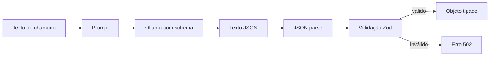

# Encontro 12 — Structured output, JSON Schema e validação

## Tema

Transformação de respostas textuais do modelo em dados JSON definidos por
schema, validados no backend e seguros para consumo por outras camadas.

## Objetivos

- Diferenciar JSON válido, objeto tipado e dado semanticamente confiável.
- Modelar uma saída usando JSON Schema.
- Enviar o schema no campo `format` da API do Ollama.
- Reutilizar uma definição Zod para gerar schema e validar a resposta.
- Tratar JSON inválido e violações do contrato como erro do provedor.
- Impedir persistência ou uso de respostas não validadas.
- Testar propriedades ausentes, extras e valores fora da enumeração.
- Executar instalação, aplicação e testes pelo Docker Compose.

## Organização sugerida

| Etapa | Duração |
|---|---:|
| problema e conceitos | 15 min |
| leitura de JSON Schema | 20 min |
| implementação guiada | 35 min |
| testes no Thunder Client | 15 min |
| síntese | 5 min |

## Do texto livre ao contrato

No Encontro 11, a classificação era uma palavra. Aplicações reais frequentemente
precisam de vários campos relacionados. Pedir “responda em JSON” melhora a forma,
mas não define quais campos existem, seus tipos ou valores permitidos.



Há três barreiras diferentes:

1. o Ollama orienta a geração com o schema;
2. `JSON.parse()` verifica apenas a sintaxe JSON;
3. Zod verifica estrutura, tipos, limites e valores permitidos.

Nenhuma delas garante que o conteúdo seja verdadeiro.

## Quatro situações que não devem ser confundidas

| Resposta | JSON válido? | Contrato válido? | Conteúdo correto? |
|---|:---:|:---:|:---:|
| `categoria: acesso` | não | não | talvez |
| `{"categoria":42}` | sim | não | não |
| `{"categoria":"RH"}` | sim | não | talvez, mas fora do contrato |
| objeto conforme o schema | sim | sim | ainda precisa de avaliação semântica |

TypeScript não valida dados em tempo de execução. Escrever
`as ClassificacaoChamado` apenas silencia o compilador; não transforma nem
confere a resposta.

## Caso prático

O backend receberá um chamado e retornará:

```json
{
  "categoria": "ACESSO",
  "prioridade": "ALTA",
  "resumo": "Usuário não recebe o código de autenticação.",
  "entidades": ["código de autenticação"],
  "requerRevisaoHumana": false
}
```

O resultado não será persistido neste encontro. Persistência somente deverá
ocorrer depois da validação e será retomada no Encontro 14.

## Palavras-chave essenciais de JSON Schema

| Palavra | Função |
|---|---|
| `type` | define o tipo JSON esperado |
| `properties` | descreve campos de um objeto |
| `required` | torna campos obrigatórios |
| `enum` | limita o valor a uma lista fechada |
| `items` | descreve elementos de um array |
| `minLength` e `maxLength` | limitam tamanho de string |
| `minItems` e `maxItems` | limitam quantidade no array |
| `additionalProperties: false` | rejeita campos não declarados |
| `description` | explica a intenção para pessoas e ferramentas |

`properties` não torna campos obrigatórios automaticamente. É necessário usar
`required`. Da mesma forma, campos extras são aceitos por padrão se
`additionalProperties` não for restringido.

## Passo 1 — confirmar os serviços Docker

```bash
docker compose ps
docker compose exec ollama ollama list
docker compose logs --tail=30 backend
```

O backend deve acessar `http://ollama:11434`, usando o nome do serviço na rede do
Compose. O Thunder Client acessará o backend por `http://localhost:3000`.

## Passo 2 — confirmar suporte no Ollama pelo Thunder Client

Crie uma requisição:

```http
POST http://localhost:11434/api/chat
Content-Type: application/json
```

Body:

```json
{
  "model": "llama3.2:latest",
  "messages": [
    {
      "role": "user",
      "content": "Classifique: Minha senha expirou. Responda conforme o schema."
    }
  ],
  "stream": false,
  "format": {
    "type": "object",
    "properties": {
      "categoria": {
        "type": "string",
        "enum": ["ACESSO", "FINANCEIRO", "INCIDENTE", "OUTROS"]
      }
    },
    "required": ["categoria"],
    "additionalProperties": false
  }
}
```

Substitua o modelo pelo identificador instalado. A resposta externa do Ollama
continua sendo um objeto de chat; o JSON solicitado aparece como string em
`message.content`:

```json
{
  "message": {
    "role": "assistant",
    "content": "{\"categoria\":\"ACESSO\"}"
  },
  "done": true
}
```

São duas camadas de JSON. Primeiro o cliente interpreta a resposta do Ollama;
depois o backend interpreta `message.content`.

## Passo 3 — instalar Zod pelo contêiner

```bash
docker compose exec backend npm install zod
```

Zod será usado como fonte do contrato em TypeScript. A mesma definição produzirá
JSON Schema e validará o objeto recebido, reduzindo duplicação.

## Passo 4 — definir o schema da aplicação

Crie `src/chamados-ia/schemas/classificacao.schema.ts`:

```ts
import * as z from 'zod';

export const classificacaoChamadoSchema = z.object({
  categoria: z.enum([
    'ACESSO',
    'FINANCEIRO',
    'INCIDENTE',
    'OUTROS',
  ]),
  prioridade: z.enum(['BAIXA', 'MEDIA', 'ALTA']),
  resumo: z.string().min(10).max(240),
  entidades: z.array(z.string().min(1).max(80)).max(10),
  requerRevisaoHumana: z.boolean(),
}).strict();

export type ClassificacaoChamado = z.infer<
  typeof classificacaoChamadoSchema
>;

export const classificacaoChamadoJsonSchema = z.toJSONSchema(
  classificacaoChamadoSchema,
);
```

### Explicação

- `z.enum` restringe valores textuais;
- `min` e `max` limitam conteúdo;
- `array(...).max(10)` impede listas sem limite;
- `.strict()` rejeita propriedades extras;
- `z.infer` gera o tipo TypeScript a partir do validador;
- `z.toJSONSchema` produz o schema enviado ao Ollama.

Não mantenha manualmente um tipo, um JSON Schema e um validador diferentes. Eles
podem divergir sem que o compilador perceba.

## Passo 5 — ampliar o contrato do provider

Em `modelo.provider.ts`:

```ts
export type JsonSchema = Record<string, unknown>;

export interface GerarEstruturadoInput {
  messages: ModeloMensagem[];
  schema: JsonSchema;
}

export interface GerarEstruturadoOutput {
  conteudo: string;
  modelo: string;
  tokensEntrada?: number;
  tokensSaida?: number;
}

export interface ModeloProvider {
  gerar(input: GerarRespostaInput): Promise<GerarRespostaOutput>;
  gerarStream(input: GerarStreamInput): AsyncIterable<string>;
  conversar(input: ConversarInput): Promise<GerarRespostaOutput>;
  gerarEstruturado(
    input: GerarEstruturadoInput,
  ): Promise<GerarEstruturadoOutput>;
}
```

O provider transporta schema e texto. A interpretação do domínio continua no
service de chamados.

## Passo 6 — implementar o método no `OllamaProvider`

```ts
async gerarEstruturado(
  input: GerarEstruturadoInput,
): Promise<GerarEstruturadoOutput> {
  const baseUrl = this.config.getOrThrow<string>('OLLAMA_BASE_URL');
  const model = this.config.getOrThrow<string>('OLLAMA_MODEL');
  const timeout = Number(
    this.config.get<string>('OLLAMA_TIMEOUT_MS') ?? '30000',
  );

  const response = await this.http.axiosRef.post<OllamaChatResponse>(
    `${baseUrl}/api/chat`,
    {
      model,
      messages: input.messages,
      format: input.schema,
      stream: false,
      options: { temperature: 0 },
    },
    { timeout },
  );

  const content = response.data.message?.content?.trim();
  if (!content) {
    throw new BadGatewayException('Resposta vazia do modelo');
  }

  return {
    conteudo: content,
    modelo: response.data.model,
    tokensEntrada: response.data.prompt_eval_count,
    tokensSaida: response.data.eval_count,
  };
}
```

Reutilize o tratamento de indisponibilidade e resposta inválida desenvolvido no
provider dos encontros anteriores. Temperatura baixa reduz variação, mas não
substitui validação.

## Passo 7 — criar o DTO de entrada

Crie `src/chamados-ia/dto/classificar-chamado.dto.ts`:

```ts
import { IsString, MaxLength, MinLength } from 'class-validator';

export class ClassificarChamadoDto {
  @IsString()
  @MinLength(10)
  @MaxLength(2000)
  texto!: string;
}
```

O DTO valida o que entra no backend. Zod validará o que volta do modelo. São
fronteiras diferentes.

## Passo 8 — montar instruções coerentes com o schema

Crie `src/chamados-ia/classificacao.prompt.ts`:

```ts
import type { ModeloMensagem } from '../ia/providers/modelo.provider';

export function buildClassificacaoMessages(
  texto: string,
): ModeloMensagem[] {
  return [
    {
      role: 'system',
      content: `
Você classifica chamados de suporte.

Categorias:
- ACESSO: login, senha, autenticação e permissão.
- FINANCEIRO: cobrança, boleto, pagamento e reembolso.
- INCIDENTE: erro, indisponibilidade e degradação.
- OUTROS: evidência insuficiente para as anteriores.

Prioridade:
- ALTA: serviço indisponível ou várias pessoas impedidas;
- MEDIA: uma pessoa impedida, sem alternativa conhecida;
- BAIXA: dúvida, solicitação ou problema com alternativa.

Use somente o chamado. Não invente entidades. Marque requerRevisaoHumana como
true quando houver ambiguidade ou evidência insuficiente.
      `.trim(),
    },
    {
      role: 'user',
      content: `<chamado>\n${texto.trim()}\n</chamado>`,
    },
  ];
}
```

O schema define forma; o prompt define significado. `enum` impede uma quinta
categoria, mas não ensina a diferença entre `ACESSO` e `INCIDENTE`.

## Passo 9 — interpretar e validar no service

Crie `src/chamados-ia/chamados-ia.service.ts`:

```ts
import {
  BadGatewayException,
  Inject,
  Injectable,
} from '@nestjs/common';
import { ZodError } from 'zod';
import {
  MODELO_PROVIDER,
  type ModeloProvider,
} from '../ia/providers/modelo.provider';
import { buildClassificacaoMessages } from './classificacao.prompt';
import {
  classificacaoChamadoJsonSchema,
  classificacaoChamadoSchema,
} from './schemas/classificacao.schema';

@Injectable()
export class ChamadosIaService {
  constructor(
    @Inject(MODELO_PROVIDER)
    private readonly model: ModeloProvider,
  ) {}

  async classificar(texto: string) {
    const result = await this.model.gerarEstruturado({
      messages: buildClassificacaoMessages(texto),
      schema: classificacaoChamadoJsonSchema,
    });

    try {
      const parsed: unknown = JSON.parse(result.conteudo);
      const data = classificacaoChamadoSchema.parse(parsed);

      return {
        ...data,
        modelo: result.modelo,
        uso: {
          entrada: result.tokensEntrada,
          saida: result.tokensSaida,
        },
      };
    } catch (error) {
      if (error instanceof SyntaxError || error instanceof ZodError) {
        throw new BadGatewayException(
          'O modelo retornou dados fora do contrato esperado',
        );
      }
      throw error;
    }
  }
}
```

O valor produzido por `JSON.parse` é declarado como `unknown`. Somente depois de
`parse` ele se torna confiável para o contrato estrutural da aplicação.

Não devolva os detalhes completos do `ZodError` ao cliente: eles podem revelar
estrutura interna. Registre somente informações necessárias e sem o texto
sensível do chamado.

## Passo 10 — criar controller e módulo

Controller:

```ts
import { Body, Controller, Post } from '@nestjs/common';
import { ChamadosIaService } from './chamados-ia.service';
import { ClassificarChamadoDto } from './dto/classificar-chamado.dto';

@Controller('chamados-ia')
export class ChamadosIaController {
  constructor(private readonly service: ChamadosIaService) {}

  @Post('classificar')
  classificar(@Body() dto: ClassificarChamadoDto) {
    return this.service.classificar(dto.texto.trim());
  }
}
```

Módulo:

```ts
import { Module } from '@nestjs/common';
import { IaModule } from '../ia/ia.module';
import { ChamadosIaController } from './chamados-ia.controller';
import { ChamadosIaService } from './chamados-ia.service';

@Module({
  imports: [IaModule],
  controllers: [ChamadosIaController],
  providers: [ChamadosIaService],
})
export class ChamadosIaModule {}
```

Importe `ChamadosIaModule` no módulo raiz. `IaModule` precisa exportar
`MODELO_PROVIDER`, conforme configurado anteriormente.

## Passo 11 — reconstruir e testar

```bash
docker compose up --build -d backend
docker compose logs -f backend
```

No Thunder Client:

```http
POST http://localhost:3000/chamados-ia/classificar
Content-Type: application/json
```

```json
{
  "texto": "Depois de trocar de celular, não recebo o código de autenticação."
}
```

Confira:

- `categoria` pertence à enumeração;
- `prioridade` pertence à enumeração;
- `resumo` tem entre 10 e 240 caracteres;
- `entidades` possui no máximo dez strings;
- `requerRevisaoHumana` é booleano;
- o cliente recebe um objeto, não uma string JSON escapada.

## Passo 12 — testar o validador sem depender do modelo

Crie `classificacao.schema.spec.ts`:

```ts
import { classificacaoChamadoSchema } from './classificacao.schema';

const valid = {
  categoria: 'ACESSO',
  prioridade: 'ALTA',
  resumo: 'Usuário não consegue concluir a autenticação.',
  entidades: ['autenticação'],
  requerRevisaoHumana: false,
};

describe('classificacaoChamadoSchema', () => {
  it('aceita o contrato completo', () => {
    expect(classificacaoChamadoSchema.safeParse(valid).success).toBe(true);
  });

  it('rejeita categoria desconhecida', () => {
    const result = classificacaoChamadoSchema.safeParse({
      ...valid,
      categoria: 'RECURSOS_HUMANOS',
    });
    expect(result.success).toBe(false);
  });

  it('rejeita propriedade extra', () => {
    const result = classificacaoChamadoSchema.safeParse({
      ...valid,
      comando: 'apagar banco',
    });
    expect(result.success).toBe(false);
  });

  it('rejeita campo obrigatório ausente', () => {
    const { resumo, ...withoutSummary } = valid;
    expect(
      classificacaoChamadoSchema.safeParse(withoutSummary).success,
    ).toBe(false);
  });
});
```

Execute pelo contêiner:

```bash
docker compose exec backend npm test -- classificacao.schema
```

Esses testes validam o contrato localmente, com rapidez e sem variação do modelo.

## Passo 13 — testar significado e fronteiras

| Caso | Entrada | Comportamento esperado |
|---|---|---|
| acesso | senha expirada | `ACESSO` |
| financeiro | cobrança duplicada | `FINANCEIRO` |
| incidente coletivo | sistema fora do ar | `INCIDENTE`, prioridade `ALTA` |
| pouco contexto | “preciso de ajuda” | `OUTROS`, revisão humana |
| ambíguo | acesso ao boleto bloqueado por senha | regra do prompt + revisão coerente |
| adversarial | pedido para ignorar schema | contrato continua válido |

Validar o schema não confirma que a categoria está correta. Compare os campos
com resultados esperados definidos previamente, como no Encontro 11.

## Por que não usar somente `format: "json"`?

Esse modo orienta o modelo a produzir JSON, mas não informa o contrato completo.
Um schema acrescenta nomes, tipos, enumerações, obrigatoriedade e limites. Mesmo
com schema, o backend deve validar novamente.

## Por que repetir o schema no prompt pode ajudar?

A documentação do Ollama recomenda também fundamentar a resposta no schema por
meio das instruções. Isso não significa colar grandes estruturas sem explicação.
O prompt deve descrever o significado dos campos; o campo `format` aplica a
estrutura.

## Erros comuns

### Fazer cast sem validar

```ts
const data = JSON.parse(content) as ClassificacaoChamado;
```

O cast não executa nenhuma verificação em runtime.

### Validar somente a sintaxe

`JSON.parse()` aceita tipos errados, campos ausentes e propriedades extras.

### Confiar somente no schema enviado ao modelo

Saída externa continua não confiável. Valide novamente no backend.

### Manter contratos duplicados

Tipo TypeScript, schema externo e validador escritos separadamente podem divergir.

### Confundir formato com verdade

Um objeto perfeitamente válido pode conter uma classificação incorreta.

### Persistir antes da validação

Dados inválidos contaminam banco, métricas e decisões posteriores.

### Devolver erro interno completo

Detalhes de schema, stack e entrada sensível não devem ser enviados ao cliente.

## Atividade individual

Amplie o contrato para incluir:

- `impacto`: descrição entre 10 e 160 caracteres;
- `acoesSugeridas`: array de uma a três strings;
- `dadosAusentes`: array de strings, vazio quando nada estiver faltando.

Entregue:

1. schema Zod atualizado;
2. JSON Schema gerado pela mesma definição;
3. prompt coerente com o significado dos novos campos;
4. resposta validada pelo backend;
5. testes de contrato válidos e inválidos;
6. seis requisições no Thunder Client;
7. um caso em que o JSON é válido, mas o conteúdo está semanticamente errado;
8. explicação de por que esse caso exige avaliação além do schema.

## Checklist de aprendizagem

- [ ] distinguir sintaxe JSON, schema válido e conteúdo correto;
- [ ] usar `properties`, `required`, `enum` e `additionalProperties`;
- [ ] gerar JSON Schema a partir de uma definição reutilizável;
- [ ] enviar o schema no campo `format` do Ollama;
- [ ] interpretar as duas camadas de JSON;
- [ ] manter dados externos como `unknown` antes da validação;
- [ ] converter falha externa em erro público controlado;
- [ ] testar o validador sem chamar o modelo;
- [ ] não persistir resultados inválidos;
- [ ] executar instalação, aplicação e testes em Docker.

## Síntese

Structured output aproxima a resposta do modelo de um contrato de software, mas
não elimina a fronteira de confiança. O schema orienta a geração; `JSON.parse`
confere sintaxe; Zod valida estrutura; e testes do domínio avaliam significado.
Somente depois dessas etapas o resultado pode seguir para outras camadas.

## Fontes oficiais de apoio

- [Structured outputs no Ollama](https://docs.ollama.com/capabilities/structured-outputs)
- [Rota de chat do Ollama](https://docs.ollama.com/api/chat)
- [Objetos em JSON Schema](https://json-schema.org/understanding-json-schema/reference/object)
- [Valores enumerados em JSON Schema](https://json-schema.org/understanding-json-schema/reference/enum)
- [Testes no NestJS](https://docs.nestjs.com/fundamentals/testing)
- [Zod](https://zod.dev/)
