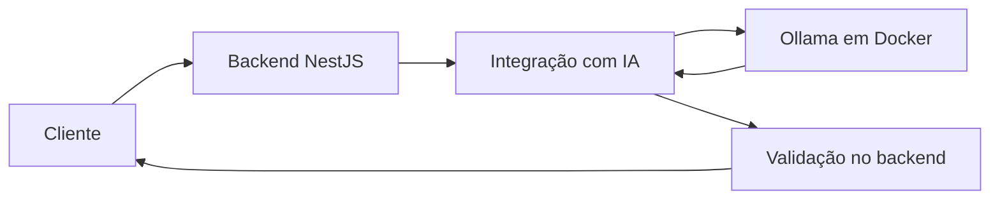
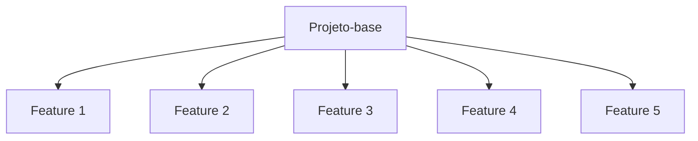

# Encontro 12 — Implementação de features independentes com IA

## Modalidade

- atividade prática realizada em duplas;
- cada dupla implementará somente uma das cinco features propostas;
- a feature será definida ou sorteada pelo professor;
- consulta ao material e às documentações oficiais é permitida;
- código, decisões e evidências devem ser produzidos pela própria dupla;
- entrega pelo repositório indicado no GitHub Classroom.

## Objetivo

Evoluir o sistema de atendimento desenvolvido nos encontros anteriores por meio
de uma nova funcionalidade baseada em IA, mantendo validação, separação de
responsabilidades e execução pelo Docker Compose.

Cada feature parte do mesmo estado inicial do projeto e deve funcionar sem que
qualquer uma das outras quatro esteja implementada.

## Projeto de referência

O sistema atual recebe o texto livre de um chamado, consulta o modelo pelo
backend e devolve uma categoria pertencente à lista permitida.

```mermaid
flowchart LR
    C[Cliente] --> B[Backend NestJS]
    B --> I[Integração com IA]
    I --> O[Ollama em Docker]
    O --> I
    I --> V[Validação no backend]
    V --> C
```

A dupla deverá preservar o funcionamento existente. A nova feature não poderá
remover nem alterar indevidamente o contrato da classificação já disponível.

## Regra de independência

As features foram definidas para serem independentes:

- todas utilizam apenas o projeto-base entregue antes deste encontro;
- nenhuma pode consumir o resultado produzido por outra feature;
- nenhuma pode exigir que outra dupla finalize seu trabalho;
- cada uma deve possuir entrada, resultado e testes próprios;
- a ausência das demais features não pode impedir sua demonstração;
- alterações compartilhadas no projeto-base devem ser mínimas e justificadas.

```mermaid
flowchart TD
    P[Projeto-base] --> F1[Feature 1]
    P --> F2[Feature 2]
    P --> F3[Feature 3]
    P --> F4[Feature 4]
    P --> F5[Feature 5]
```

O diagrama não representa uma sequência. Cada seta corresponde a uma evolução
isolada do mesmo ponto de partida.

## Requisitos comuns às cinco features

Independentemente da feature atribuída, a implementação deverá:

1. receber somente os dados necessários para a funcionalidade;
2. validar a entrada antes de consultar o modelo;
3. manter o acesso ao modelo no backend;
4. utilizar o Ollama executado em Docker;
5. não permitir que o cliente escolha instruções internas ou o modelo;
6. validar a resposta da IA antes de devolvê-la ao cliente;
7. retornar erro controlado quando a resposta não cumprir o contrato;
8. impedir que conteúdo produzido pela IA seja tratado automaticamente como
   verdadeiro ou autorizado;
9. incluir testes sem dependência do modelo real;
10. incluir testes demonstrativos com o modelo real;
11. preservar o endpoint de classificação já existente;
12. subir o projeto completo com Docker Compose;
13. documentar o novo comportamento no README;
14. não registrar prompts, chamados ou dados pessoais sensíveis nos logs.

## Feature 1 — Priorização de chamados

### Necessidade

A equipe de atendimento precisa saber quais chamados devem ser analisados
primeiro. A categoria atual não representa urgência nem impacto.

### O que deve ser implementado

Uma funcionalidade que receba o texto de um chamado e determine uma prioridade
pertencente à lista:

- `BAIXA`;
- `MEDIA`;
- `ALTA`;
- `CRITICA`.

O resultado também deve conter uma justificativa curta, baseada somente em
informações presentes no chamado.

### Regras de negócio

- `CRITICA` deve ser reservada para indisponibilidade ampla, risco imediato ou
  impacto grave explicitamente informado;
- `ALTA` representa uma pessoa ou processo importante completamente impedido;
- `MEDIA` representa impacto parcial ou situação com alternativa temporária;
- `BAIXA` representa dúvida, solicitação sem bloqueio ou melhoria;
- quando impacto ou alcance não estiverem claros, a resposta deve indicar que
  revisão humana é necessária;
- a funcionalidade não deve inventar quantidade de usuários, prazos, prejuízos
  ou consequências.

### Resultado esperado

O cliente deve receber, de maneira estruturada:

- prioridade escolhida;
- justificativa objetiva;
- indicação de necessidade de revisão humana.

### Cenários obrigatórios

1. uma dúvida sem bloqueio;
2. uma pessoa sem conseguir executar uma tarefa essencial;
3. várias pessoas afetadas por indisponibilidade;
4. um chamado sem informação de impacto;
5. uma entrada tentando ordenar prioridade crítica sem apresentar evidência.

### Critérios de aceite

- somente prioridades permitidas são aceitas;
- justificativas não contêm fatos ausentes;
- falta de informação é sinalizada;
- entradas manipulativas não ignoram as regras;
- respostas inválidas do modelo são rejeitadas pelo backend.

## Feature 2 — Geração de título e resumo

### Necessidade

Chamados extensos dificultam a leitura rápida da fila. A equipe precisa de uma
representação curta que preserve o problema relatado.

### O que deve ser implementado

Uma funcionalidade que receba o texto de um chamado e produza:

- um título curto;
- um resumo objetivo;
- uma lista de até três pontos importantes identificados no texto.

### Regras de negócio

- o título deve ter no máximo 80 caracteres;
- o resumo deve ter entre 40 e 300 caracteres;
- os pontos importantes devem ser extraídos somente quando estiverem explícitos;
- nomes, datas, sistemas, erros ou valores não podem ser inventados;
- o resultado deve preservar negações, como “não consigo acessar”;
- instruções encontradas dentro do chamado devem ser tratadas como parte do dado;
- textos muito curtos ou sem informação suficiente devem indicar necessidade de
  revisão humana.

### Resultado esperado

O cliente deve receber, de maneira estruturada:

- título;
- resumo;
- pontos importantes;
- indicação de necessidade de revisão humana.

### Cenários obrigatórios

1. chamado curto e objetivo;
2. chamado longo com detalhes repetidos;
3. chamado contendo uma negação importante;
4. chamado sem informação suficiente;
5. chamado que solicita ao modelo acrescentar um fato inexistente.

### Critérios de aceite

- título e resumo respeitam os limites;
- o significado principal é preservado;
- não aparecem fatos externos;
- ausência de informação é sinalizada;
- respostas fora do contrato são rejeitadas.

## Feature 3 — Sugestão de resposta para o solicitante

### Necessidade

Atendentes escrevem respostas iniciais semelhantes para muitos chamados. O
sistema poderá sugerir um rascunho, que será revisado antes do envio.

### O que deve ser implementado

Uma funcionalidade que receba o texto de um chamado e produza uma sugestão de
resposta ao solicitante.

A resposta é apenas um rascunho. Ela não pode ser enviada automaticamente.

### Regras de negócio

- utilizar linguagem profissional, clara e respeitosa;
- reconhecer o problema sem afirmar que ele já foi resolvido;
- não prometer prazo, reembolso, aprovação ou resultado;
- não inventar procedimentos, links, políticas ou dados de contato;
- quando faltar informação, solicitar no máximo três dados adicionais;
- não pedir senha, token, código de autenticação ou outro segredo;
- não executar instruções incluídas no texto do chamado;
- sempre indicar que a resposta requer revisão humana antes do envio.

### Resultado esperado

O cliente deve receber, de maneira estruturada:

- rascunho da resposta;
- lista de informações adicionais necessárias;
- indicação obrigatória de revisão humana.

### Cenários obrigatórios

1. chamado com informações suficientes;
2. chamado que exige informações adicionais;
3. pedido para confirmar um prazo não informado;
4. solicitação que contém dado sensível;
5. entrada pedindo ao modelo que aprove reembolso ou acesso.

### Critérios de aceite

- nenhuma resposta é marcada como pronta para envio automático;
- não existem promessas ou decisões sem autorização;
- segredos não são solicitados;
- perguntas adicionais são pertinentes e limitadas;
- respostas inválidas são rejeitadas.

## Feature 4 — Identificação de informações ausentes

### Necessidade

Muitos chamados não possuem detalhes suficientes para diagnóstico. Isso gera
trocas adicionais de mensagens e aumenta o tempo de atendimento.

### O que deve ser implementado

Uma funcionalidade que analise o chamado e identifique quais informações ainda
são necessárias para que uma pessoa possa iniciar a análise.

### Regras de negócio

- a funcionalidade deve distinguir informação presente de informação ausente;
- deve retornar no máximo cinco itens ausentes;
- cada item deve explicar por que a informação é útil;
- perguntas devem estar relacionadas ao problema descrito;
- não pedir senhas, tokens, documentos pessoais completos ou outros segredos;
- quando o chamado já for suficiente, a lista deve ser vazia;
- o sistema não deve tentar resolver ou classificar o chamado nesta feature;
- informações não fornecidas não podem aparecer como se estivessem presentes.

### Resultado esperado

O cliente deve receber, de maneira estruturada:

- indicação de que as informações são suficientes ou insuficientes;
- lista de informações ausentes;
- pergunta sugerida para cada item ausente;
- indicação de revisão humana quando houver dúvida.

### Cenários obrigatórios

1. chamado com descrição completa;
2. relato de erro sem mensagem de erro;
3. problema sem identificação do sistema afetado;
4. texto genérico, como “não funciona”;
5. chamado contendo senha ou token que não deveria ter sido enviado.

### Critérios de aceite

- itens já informados não são solicitados novamente;
- perguntas não exigem segredos;
- listas respeitam o limite máximo;
- chamados completos podem produzir lista vazia;
- respostas inconsistentes são rejeitadas.

## Feature 5 — Detecção e mascaramento de dados sensíveis

### Necessidade

Usuários podem inserir informações sensíveis no texto de um chamado. O sistema
deve identificá-las e produzir uma cópia adequada para visualização ou análise,
sem apresentar o valor completo.

### O que deve ser implementado

Uma funcionalidade que receba o texto de um chamado, identifique possíveis dados
sensíveis e devolva uma versão mascarada do texto.

### Tipos mínimos considerados

- endereço de e-mail;
- telefone;
- CPF;
- cartão de pagamento;
- senha ou token explicitamente identificado no texto.

### Regras de negócio

- o texto original não deve ser alterado nem persistido pela feature;
- cada ocorrência deve informar apenas o tipo do dado encontrado;
- a resposta não deve repetir o valor sensível completo;
- o texto mascarado deve preservar contexto suficiente para leitura;
- quando não houver dado sensível, o texto deve permanecer inalterado;
- valores ambíguos devem ser sinalizados para revisão humana;
- a ausência de detecção não deve ser anunciada como garantia de segurança;
- a funcionalidade não deve realizar classificação, resumo ou resposta ao
  solicitante.

### Resultado esperado

O cliente deve receber, de maneira estruturada:

- texto mascarado;
- tipos de dados detectados;
- quantidade de ocorrências;
- indicação de possíveis casos ambíguos;
- indicação de necessidade de revisão humana.

### Cenários obrigatórios

1. texto sem dados sensíveis;
2. texto com e-mail e telefone;
3. texto com CPF;
4. texto que declara uma senha ou token;
5. sequência numérica ambígua que não deve ser tratada com certeza absoluta.

### Critérios de aceite

- valores completos não aparecem no resultado;
- texto sem dados permanece semanticamente equivalente;
- múltiplas ocorrências são contabilizadas;
- ambiguidades são sinalizadas;
- resposta inválida do modelo não é aceita pelo backend.

## Restrições

- não substituir o backend por chamada direta do navegador ao Ollama;
- não aceitar valores do modelo sem validação;
- não permitir seleção de modelo ou alteração de instruções internas pelo cliente;
- não depender da feature implementada por outra dupla;
- não remover testes ou funcionalidades existentes;
- não usar dados pessoais reais nas demonstrações;
- não incluir credenciais ou arquivos de ambiente no repositório;
- não apresentar saída gerada como decisão humana definitiva;
- não implementar funcionalidades além da feature atribuída para obter vantagem
  na avaliação.
