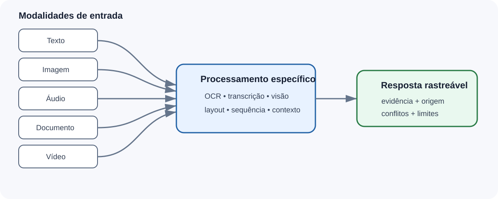
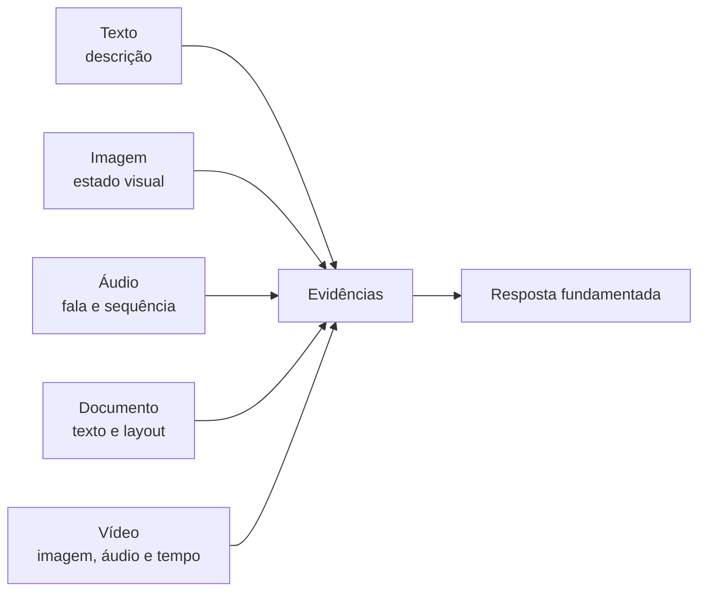
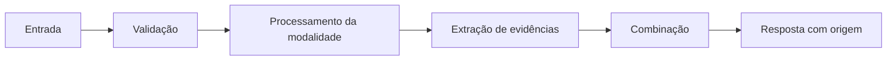
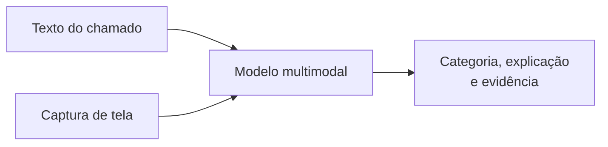
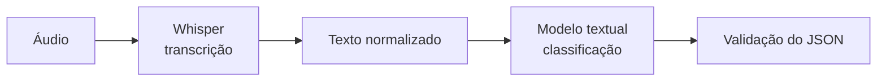
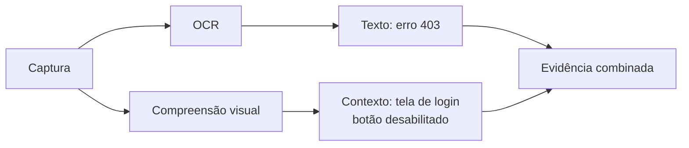
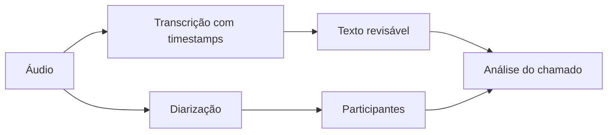
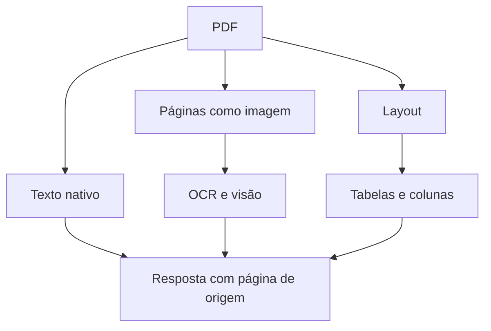
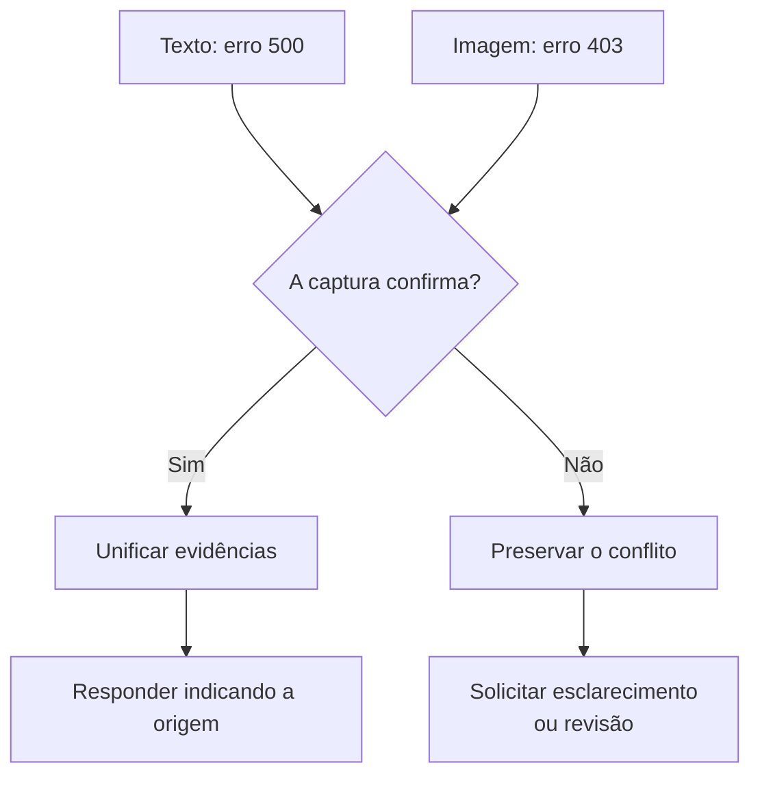

# Encontro 13 — Arquiteturas multimodais para aplicações com IA

## Tema

Projeto conceitual de aplicações que combinam texto, imagem, áudio e documentos, considerando fluxo de dados, contratos, modelos, validação, privacidade, acessibilidade e experiência do usuário.

## Objetivos

- Diferenciar aplicação textual de aplicação multimodal.
- Reconhecer capacidades e limitações específicas de cada modalidade.
- Comparar modelo multimodal nativo e pipeline com componentes especializados.
- Projetar contratos para imagem, áudio e documentos.
- Identificar riscos de privacidade e segurança presentes em arquivos.
- Analisar custo, latência, armazenamento e limites de contexto.
- Definir critérios de avaliação próprios para cada modalidade.
- Propor uma evolução multimodal para o sistema de chamados.

## Por que multimodalidade é relevante?

Problemas reais raramente chegam apenas como texto estruturado. Em um sistema de atendimento, o usuário pode enviar:

- captura de tela com uma mensagem de erro;
- fotografia de um equipamento;
- gravação de voz descrevendo o problema;
- PDF com boleto, declaração ou comprovante;
- imagem de um documento;
- vídeo curto demonstrando uma falha;
- texto combinado com um ou mais anexos.

Aceitar um arquivo não torna a aplicação multimodal. O sistema precisa definir como cada modalidade será interpretada, combinada, validada e apresentada.

## Conceitos fundamentais

| Conceito | Significado |
|---|---|
| modalidade | tipo de sinal, como texto, imagem ou áudio |
| multimodal | utiliza duas ou mais modalidades no mesmo fluxo |
| transcrição | transforma fala em texto |
| OCR | extrai caracteres visíveis de uma imagem |
| compreensão visual | interpreta objetos, relações, layout e contexto |
| diarização | identifica diferentes participantes em um áudio |
| fusão | combina evidências vindas de modalidades diferentes |
| grounding | relaciona a resposta ao conteúdo fornecido |
| proveniência | registra de onde uma informação foi obtida |
| alinhamento temporal | relaciona eventos a instantes de áudio ou vídeo |

OCR, transcrição e compreensão não são equivalentes. Extrair o texto “Erro 403” de uma captura é diferente de compreender onde ele aparece e o que representa.

## Fluxo multimodal

Cada seta representa uma fronteira de confiança. Um arquivo válido pode conter informação incorreta, instrução maliciosa ou dado sensível.

## Compreender não é o mesmo que gerar

| Operação | Entrada | Saída | Exemplo |
|---|---|---|---|
| compreensão visual | imagem + pergunta | texto | localizar uma mensagem de erro |
| OCR | imagem ou página | texto extraído | copiar um protocolo |
| geração de imagem | texto ou imagem | imagem | criar uma ilustração |
| transcrição | áudio | texto | registrar uma fala |
| síntese de voz | texto | áudio | ler uma resposta |
| compreensão de vídeo | vídeo + pergunta | texto | localizar uma falha |
| geração de vídeo | texto ou imagem | vídeo | produzir uma animação |

Um modelo que aceita imagens não necessariamente gera imagens. Um modelo que transcreve áudio também não necessariamente interpreta toda a conversa.

## Modelos reais por modalidade

Os nomes são exemplos concretos, não recomendações automáticas. Identificadores, variantes, licenças e disponibilidade podem mudar.

| Informação recebida | Modelos reais | Aplicações típicas |
|---|---|---|
| texto | `qwen3`, `llama3.1:8b`, `gemma3:1b` | classificação, extração, resumo e geração |
| texto e imagem | `llama3.2-vision:11b`, `gemma3:4b`, `qwen3-vl` | telas, gráficos, OCR contextual e perguntas visuais |
| áudio para texto | `openai/whisper-large-v3-turbo`, `gpt-4o-transcribe`, `gpt-4o-mini-transcribe` | transcrição e reconhecimento de fala |
| áudio conversacional | `gemini-2.5-flash-native-audio`, `gpt-realtime` | conversação com entrada e saída de voz |
| PDF e documento visual | `gemini-3.8-flash`, `granite3.2-vision`, Claude Opus 4.6 | páginas, tabelas, gráficos e layout |
| vídeo | `gemini-2.5-flash`, `gemini-2.5-pro` | resumo, perguntas e localização de eventos |

### Modelos que podem ser avaliados localmente

- `llama3.2-vision:11b`: texto e imagem;
- `gemma3:4b`, `gemma3:12b` e `gemma3:27b`: variantes com visão;
- `qwen3-vl`: família voltada à compreensão visual;
- `granite3.2-vision`: documentos, tabelas, gráficos e diagramas;
- Whisper: transcrição executada normalmente como serviço especializado.

O nome da família não garante capacidades idênticas. No Gemma 3 do Ollama, por exemplo, as variantes 270M e 1B são textuais, enquanto 4B, 12B e 27B aceitam imagens.

### Exemplos por formato gerado

| Saída | Modelos reais |
|---|---|
| texto | famílias Gemini, Claude, GPT, Qwen, Llama e Gemma |
| imagem | `gpt-image-2`, modelos Gemini Image e Imagen |
| fala | `gpt-4o-mini-tts`, `gemini-2.5-flash-preview-tts` |
| vídeo | Sora 2 e Veo |

Um sistema pode combinar modelos: Whisper transcreve o áudio e um modelo textual classifica a transcrição.

### Fontes oficiais e catálogos

- [Modelos Gemini](https://ai.google.dev/gemini-api/docs/models)
- [Documentos no Gemini](https://ai.google.dev/gemini-api/docs/document-processing)
- [Modelos da OpenAI](https://platform.openai.com/docs/models)
- [Whisper Large V3 Turbo](https://huggingface.co/openai/whisper-large-v3-turbo)
- [Llama 3.2 Vision no Ollama](https://ollama.com/library/llama3.2-vision)
- [Gemma 3 no Ollama](https://ollama.com/library/gemma3)
- [Qwen3-VL no Ollama](https://ollama.com/blog/qwen3-vl)
- [Catálogo de visão do Ollama](https://ollama.com/library?q=vision)

## Duas arquiteturas principais

### Modelo multimodal nativo

O mesmo modelo recebe texto e outros tipos de entrada.

Vantagens possíveis:

- compreensão conjunta das modalidades;
- fluxo conceitualmente mais simples;
- perguntas sobre relações entre texto e imagem;
- menor quantidade de transformações intermediárias.

Limitações possíveis:

- custo e latência maiores;
- formatos e tamanhos restritos;
- comportamento menos observável;
- dependência das capacidades de um único modelo;
- dificuldade para validar etapas intermediárias.

### Pipeline com componentes especializados

Cada modalidade é processada por uma ferramenta adequada antes da combinação.

Vantagens possíveis:

- etapas observáveis;
- substituição de componentes;
- métricas específicas;
- uso de regras determinísticas entre etapas;
- possibilidade de revisão intermediária.

Limitações possíveis:

- erros se acumulam;
- informação visual ou sonora pode ser perdida;
- arquitetura e operação mais complexas;
- formatos intermediários precisam de contratos.

Nenhuma abordagem é sempre superior. A decisão depende da tarefa e da evidência que precisa ser preservada.

## Imagem

### O que uma imagem pode trazer?

- texto visível;
- posição e destaque de elementos;
- ícones e estados da interface;
- gráficos e diagramas;
- objetos e ambiente;
- informações pessoais;
- metadados do arquivo.

### Limitações importantes

- resolução insuficiente;
- texto pequeno ou cortado;
- rotação e distorção;
- cores semelhantes;
- idioma não reconhecido;
- ícones ambíguos;
- conteúdo fora do enquadramento;
- interpretação incorreta de gráficos;
- incapacidade de confirmar autenticidade.

Uma imagem de erro não prova quando o erro ocorreu nem se corresponde ao sistema informado.

### Perguntas arquiteturais

- o sistema precisa do texto ou da disposição visual?
- OCR é suficiente?
- a imagem original será armazenada?
- metadados serão removidos?
- rostos, documentos ou dados pessoais podem aparecer?
- a resposta indicará qual região sustentou a conclusão?
- qual resolução e tamanho serão aceitos?

## Áudio

### Informações presentes

- palavras;
- pausas;
- ruído;
- entonação;
- múltiplas vozes;
- ordem temporal;
- idioma e sotaque.

### Riscos de interpretação

- transcrição incorreta;
- nomes próprios trocados;
- números confundidos;
- falas sobrepostas;
- perda de negação;
- ruído tratado como fala;
- atribuição ao participante errado;
- inferência inadequada de emoção.

A aplicação não deve tomar decisões sensíveis com base em emoção inferida da voz sem justificativa, validação e análise ética específica.

### Perguntas arquiteturais

- é necessário armazenar o áudio depois da transcrição?
- timestamps precisam ser preservados?
- há mais de uma pessoa?
- o usuário poderá corrigir a transcrição?
- qual duração máxima será aceita?
- como informar baixa qualidade?
- a voz constitui dado biométrico no contexto tratado?

## Documentos

Documentos combinam texto, layout, imagens, tabelas, cabeçalhos, rodapés e páginas.

### Problemas frequentes

- PDF que contém apenas imagens;
- ordem de leitura incorreta;
- tabelas desmontadas;
- rodapés misturados ao conteúdo;
- páginas ausentes;
- assinatura interpretada como texto;
- versões diferentes do mesmo documento;
- instruções maliciosas dentro do arquivo;
- dados pessoais em anexos aparentemente simples.

### Perguntas arquiteturais

- a página de origem será preservada?
- tabelas precisam manter linhas e colunas?
- qual versão do documento é válida?
- o documento pode ser usado por aquele usuário?
- trechos serão citados?
- anexos serão descartados ou retidos?
- como lidar com documento protegido ou corrompido?

## Vídeo

Vídeo combina imagem, áudio e tempo. Sua análise pode exigir amostragem de quadros, transcrição e alinhamento de eventos.

Decisões relevantes:

- é necessário analisar todos os quadros?
- qual evento o usuário quer demonstrar?
- o áudio faz parte da evidência?
- cortes removem contexto?
- qual duração é aceitável?
- a pessoa filmada consentiu?
- o custo justifica o valor produzido?

Vídeo não deve ser adotado apenas porque um modelo aceita esse formato.

## Combinação de modalidades

Modalidades podem:

- confirmar a mesma informação;
- complementar informações diferentes;
- contradizer uma à outra;
- possuir níveis diferentes de qualidade;
- pertencer a momentos diferentes;
- referir-se a entidades diferentes.

Exemplo: o texto afirma “erro 500”, enquanto a captura mostra “403”. A aplicação não deve escolher silenciosamente. O conflito precisa ser preservado ou encaminhado.

## Estratégias de combinação

### Texto como orientação

O usuário descreve o que deseja que seja observado no anexo.

Risco: a descrição pode induzir interpretação e ocultar elementos relevantes.

### Anexo como fonte

A resposta deve se limitar ao conteúdo visível ou audível.

Risco: a fonte pode estar incompleta ou adulterada.

### Evidências independentes

Cada modalidade é analisada separadamente antes da combinação.

Benefício: conflitos e falhas ficam mais visíveis.

### Fusão conjunta

O modelo interpreta as modalidades em conjunto.

Benefício: relações entre elementos podem ser compreendidas.

Risco: torna-se mais difícil localizar a origem exata de uma afirmação.

## Aplicação ao sistema de chamados

Possíveis extensões conceituais:

1. captura de tela para localizar mensagem de erro;
2. áudio convertido em descrição revisável;
3. PDF usado para extrair dados necessários;
4. fotografia de equipamento para apoiar triagem;
5. combinação de texto e anexo para identificar conflito.

## Atividade em dupla

Cada dupla deverá propor uma extensão multimodal para sua feature do Encontro 12.

A proposta deve conter:

1. problema e usuário;
2. modalidades recebidas;
3. valor que a nova modalidade acrescenta;
4. alternativa sem multimodalidade;
5. fluxo conceitual;
6. contrato de entrada;
7. contrato de saída;
8. dados que devem ser removidos ou protegidos;
9. falhas específicas da modalidade;
10. situação de conflito entre modalidades;
11. critérios de revisão humana;
