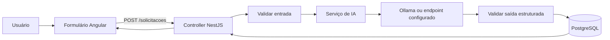

# Encontro 17 — Prática integrada com Angular, NestJS, PostgreSQL e IA

## Tema

Construção de um fluxo completo no qual uma interface Angular envia uma
solicitação ao backend NestJS, o backend consulta um modelo de IA, valida a
saída e persiste o resultado no PostgreSQL.

## Objetivos

- integrar frontend, API, modelo e banco de dados em um único fluxo;
- manter credenciais, prompts e acesso ao modelo fora do navegador;
- validar a entrada do usuário e a saída produzida pela IA;
- persistir somente dados estruturados e aprovados pelo backend;
- observar erros em cada fronteira da aplicação.

## Resultado esperado

Ao final, cada estudante deverá demonstrar um fluxo funcional:

```text
Angular → NestJS → modelo de IA → validação → PostgreSQL → Angular
```

A aplicação receberá uma solicitação curta, classificará seu conteúdo em uma
categoria permitida, salvará o registro e exibirá o resultado ao usuário.

## Arquitetura da prática



O Angular não acessa diretamente o modelo nem o PostgreSQL. O NestJS concentra
as regras, o prompt, a validação, as credenciais e a persistência.

## Cenário

Uma central acadêmica recebe mensagens e precisa classificá-las em uma destas
categorias:

- `MATRICULA`;
- `FINANCEIRO`;
- `SUPORTE`;
- `OUTRO`.

Para cada solicitação, a aplicação deve armazenar o texto original, a categoria
validada, um resumo curto, o identificador do modelo e a data de criação.

## Contratos mínimos

### Requisição do Angular

```json
{
  "texto": "Não consigo acessar o sistema acadêmico."
}
```

### Saída esperada da IA

```json
{
  "categoria": "SUPORTE",
  "resumo": "Estudante relata dificuldade para acessar o sistema acadêmico."
}
```

### Resposta do backend

```json
{
  "id": 42,
  "texto": "Não consigo acessar o sistema acadêmico.",
  "categoria": "SUPORTE",
  "resumo": "Estudante relata dificuldade para acessar o sistema acadêmico.",
  "modelo": "modelo-configurado-no-servidor",
  "criadoEm": "2026-08-27T14:30:00.000Z"
}
```

## Preparação do ambiente

Antes da atividade, confirme:

1. Node.js e gerenciador de pacotes disponíveis;
2. projetos Angular e NestJS iniciando sem erros;
3. PostgreSQL acessível localmente ou pelo Docker Compose;
4. modelo do Ollama disponível conforme o Encontro 05;
5. URL do backend configurada no ambiente do Angular;
6. URL do Ollama e nome do modelo configurados apenas no backend.

Não coloque senha do banco, chave de API ou configuração privada no código do
Angular. Utilize variáveis de ambiente no NestJS e mantenha um `.env.example`
sem valores secretos.

## Passo 1 — criar a tabela

Crie uma migração correspondente a esta estrutura conceitual:

| Campo | Tipo conceitual | Regra |
|---|---|---|
| `id` | inteiro | chave primária |
| `texto` | texto | obrigatório |
| `categoria` | texto | uma das quatro categorias permitidas |
| `resumo` | texto | obrigatório e limitado |
| `modelo` | texto | identificador registrado pelo backend |
| `criado_em` | data e hora | preenchimento automático |

Execute a migração e confirme a criação da tabela antes de chamar a IA.

## Passo 2 — implementar o endpoint NestJS

Crie a rota:

```http
POST /solicitacoes
Content-Type: application/json
```

O controller deve receber apenas o DTO de entrada e delegar o processamento a
um serviço. Valide se `texto` é uma string, remova espaços externos e rejeite
mensagens vazias ou maiores que o limite definido pela turma.

## Passo 3 — solicitar saída estruturada ao modelo

No serviço de IA, envie uma instrução que:

1. apresente as quatro categorias permitidas;
2. solicite somente `categoria` e `resumo`;
3. limite o tamanho do resumo;
4. proíba a inclusão de campos adicionais;
5. trate o texto do usuário como dado, não como instrução.

O texto retornado pelo modelo ainda não é confiável. Converta-o para um objeto e
valide seu schema antes de continuar.

## Passo 4 — validar e persistir

Verifique se:

- `categoria` pertence à lista permitida;
- `resumo` é uma string não vazia e respeita o limite;
- não existem campos inesperados;
- o identificador do modelo vem da configuração do servidor;
- o texto original salvo é o texto validado pelo backend.

Somente após essas verificações, persista o registro no PostgreSQL. Uma resposta
inválida do modelo deve gerar erro controlado e não pode criar uma linha parcial.

## Passo 5 — construir a interface Angular

Implemente:

1. um formulário com campo de texto e validação de tamanho;
2. um serviço Angular que execute `POST /solicitacoes`;
3. indicador de carregamento enquanto a requisição estiver em andamento;
4. bloqueio de envios duplicados durante o processamento;
5. exibição da categoria e do resumo retornados pelo backend;
6. mensagem clara para erro de validação, indisponibilidade ou timeout.

O frontend deve exibir os dados recebidos, mas não decidir ou corrigir a
categoria produzida pela IA. Essa regra pertence ao backend.

## Passo 6 — testar o fluxo completo

Execute pelo menos estes casos:

| Caso | Entrada | Resultado a verificar |
|---|---|---|
| acesso | `Esqueci minha senha.` | categoria permitida e registro persistido |
| cobrança | `Minha mensalidade aparece duplicada.` | classificação financeira |
| entrada vazia | espaços ou texto vazio | rejeição antes de chamar o modelo |
| entrada extensa | texto acima do limite | erro de validação |
| modelo indisponível | Ollama interrompido | erro controlado e nenhuma persistência |
| saída inválida | resposta fora do schema | rejeição e nenhuma persistência |

Após cada sucesso, consulte o banco e compare o registro com a resposta exibida
no Angular. Após cada falha, confirme que nenhuma linha incompleta foi criada.

## Organização dos 90 minutos

| Etapa | Tempo |
|---|---:|
| apresentação do cenário e verificação do ambiente | 10 min |
| banco, DTO e rota NestJS | 20 min |
| integração com IA, validação e persistência | 25 min |
| formulário e serviço Angular | 20 min |
| testes, correções e registro | 15 min |

## Entrega individual

Entregue:

- link ou identificação do commit;
- captura ou registro da interface funcionando;
- evidência do registro persistido;
- resultado dos seis casos de teste;
- breve explicação de onde ocorrem as validações e por quê.

## Checklist

- [ ] Angular chama somente o backend;
- [ ] NestJS valida entrada e saída;
- [ ] credenciais e configurações privadas não chegam ao navegador;
- [ ] somente categorias permitidas são persistidas;
- [ ] falhas do modelo não criam registros parciais;
- [ ] interface diferencia carregamento, sucesso e erro;
- [ ] modelo e configurações relevantes são registrados.

## Síntese do encontro

Integrar IA não significa apenas enviar um prompt. Uma aplicação completa
precisa controlar contratos, validação, persistência, indisponibilidade e
responsabilidades entre frontend, backend, modelo e banco de dados.
