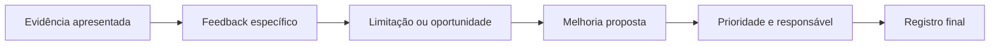

# Encontro 39 — Devolutivas e consolidação dos projetos

## Tema

Análise das apresentações finais, devolutiva formativa e consolidação das
evidências técnicas dos projetos.

## Objetivos

- analisar as evidências apresentadas pelas equipes;
- distinguir problema funcional, limitação conhecida e melhoria futura;
- transformar feedback em ações priorizadas e verificáveis;
- consolidar a documentação final do projeto.

## Organização dos 90 minutos

| Etapa | Tempo | Atividade |
|---|---:|---|
| retomada das apresentações | 10 min | identificação das principais decisões observadas |
| devolutiva cruzada | 25 min | análise de decisões, evidências e limitações |
| revisão por critérios | 20 min | qualidade, segurança, operação e documentação |
| priorização | 20 min | organização das melhorias por impacto e esforço |
| consolidação | 15 min | atualização do registro final de cada projeto |

## Roteiro da devolutiva

Para cada observação, registre:

1. qual evidência do projeto motivou o comentário;
2. qual requisito, risco ou qualidade está envolvido;
3. o que já funciona e deve ser mantido;
4. qual mudança é recomendada;
5. como verificar se a mudança produziu o resultado esperado.

Comentários genéricos como “melhorar a IA” ou “aumentar a segurança” devem ser
reescritos como ações observáveis.

## Produto do encontro

Cada equipe registra uma página contendo: principal decisão arquitetural,
evidência de que funcionou, limitações conhecidas, risco prioritário e backlog
com até três ações ordenadas por prioridade. O documento complementa, sem
substituir, as entregas e avaliações previstas no projeto final.

## Síntese do encontro

Uma devolutiva útil liga evidência, critério e ação. O projeto é consolidado
quando a equipe consegue explicar o que funciona, reconhecer limites e propor
melhorias que possam ser verificadas.
