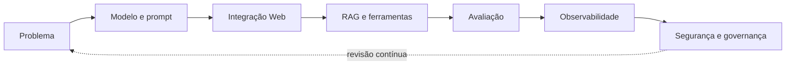

# Encontro 40 — Síntese integradora e encerramento

## Tema

Integração dos conteúdos da disciplina, retrospectiva da trajetória e
planejamento de continuidade técnica e profissional.

## Objetivos

- relacionar os componentes estudados em uma arquitetura completa;
- reconhecer dependências entre qualidade, segurança e operação;
- sintetizar aprendizados e mudanças de perspectiva;
- elaborar próximos passos verificáveis após a disciplina.

## Organização dos 90 minutos

| Etapa | Tempo | Atividade |
|---|---:|---|
| mapa de conceitos | 20 min | reconstrução coletiva da arquitetura da disciplina |
| análise de decisões | 20 min | relação entre escolhas técnicas, riscos e evidências |
| retrospectiva individual | 15 min | aprendizados, dificuldades e mudanças de perspectiva |
| plano de continuidade | 25 min | definição de próximos passos verificáveis |
| encerramento | 10 min | compartilhamento das sínteses e avaliação da trajetória |

## Mapa integrador

O diagrama não representa uma sequência executada apenas uma vez. Avaliação,
observabilidade e segurança produzem evidências que podem exigir mudanças no
problema, nos dados, no modelo, nos prompts ou na arquitetura.

## Retrospectiva individual

Cada estudante responde:

1. qual conceito passou a compreender de maneira diferente;
2. qual decisão técnica agora consegue justificar com evidências;
3. qual risco de aplicações com IA considera mais relevante;
4. qual competência ainda precisa desenvolver;
5. qual prática pretende incorporar aos próximos projetos.

## Plano de continuidade

Registre três próximos passos. Cada passo deve conter:

| Campo | Descrição |
|---|---|
| objetivo | resultado que se pretende alcançar |
| ação | atividade concreta que será executada |
| evidência | artefato ou medida que demonstrará o avanço |
| prazo | período realista para conclusão |

## Produto do encontro

Uma síntese individual de até uma página contendo os principais aprendizados,
uma decisão arquitetural considerada importante, uma limitação reconhecida e o
plano de continuidade com três ações verificáveis.

## Síntese final

Uma funcionalidade de IA só está pronta quando sua utilidade, limites,
qualidade, segurança e operação podem ser explicados por evidências. Encerrar a
disciplina não encerra o processo: essas evidências orientam revisão,
manutenção e aprendizagem contínuas.
