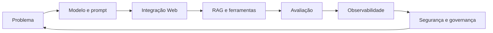

# Encontro 40 — Síntese integradora, devolutivas e encerramento

## Tema

Consolidação das aprendizagens, devolutiva dos projetos e planejamento de
evolução técnica após a disciplina.

## Objetivos

- relacionar os componentes estudados em uma arquitetura completa;
- analisar evidências de qualidade, segurança e operação dos projetos;
- registrar aprendizados, limitações e próximos passos;
- realizar a devolutiva final de forma formativa.

## Organização dos 90 minutos

| Etapa | Tempo | Atividade |
|---|---:|---|
| mapa de conceitos | 15 min | reconstrução coletiva da arquitetura da disciplina |
| devolutiva cruzada | 25 min | análise de decisões e evidências dos projetos |
| retrospectiva | 20 min | manter, melhorar, interromper e experimentar |
| plano de evolução | 20 min | definição de três próximos passos verificáveis |
| encerramento | 10 min | síntese individual e avaliação da trajetória |

## Produto final

Cada equipe registra uma página contendo: principal decisão arquitetural,
evidência de que funcionou, limitação conhecida, risco prioritário e três ações
para uma próxima versão. O documento complementa, sem substituir, as entregas e
avaliações previstas no projeto final.

## Síntese do encontro

Uma funcionalidade de IA só está pronta quando sua utilidade, limites,
qualidade, segurança e operação podem ser explicados por evidências. O
encerramento transforma a apresentação final em um plano concreto de evolução.
